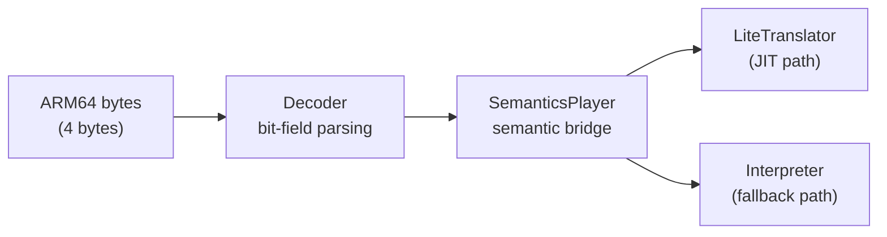
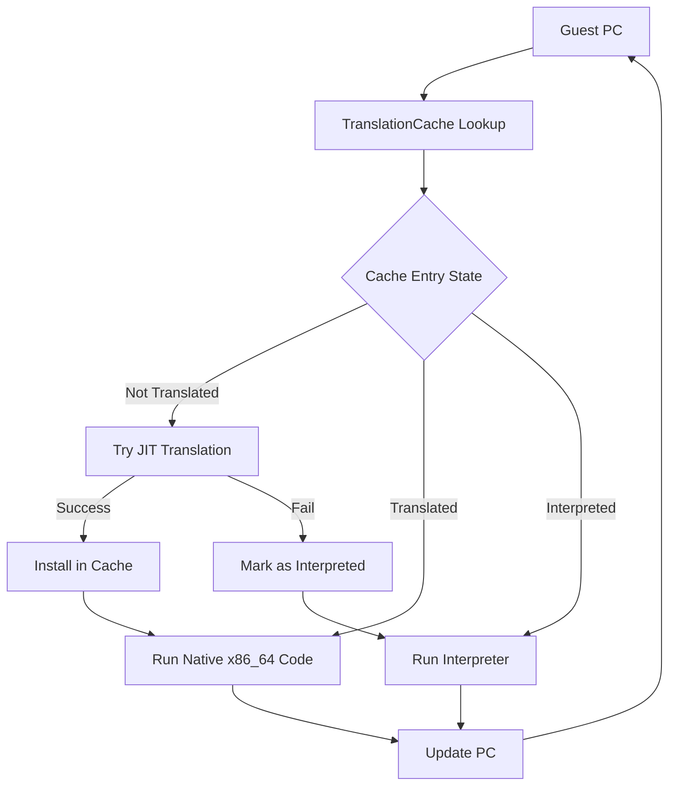

# How Digitalis Works

A guide to the ARM64-to-x86_64 binary translator — from first principles to implementation details.

## Table of Contents

1. [Why Digitalis Exists](#1-why-digitalis-exists)
2. [What Binary Translation Is](#2-what-binary-translation-is)
3. [ARM64 and x86_64 — Two Different Worlds](#3-arm64-and-x86_64--two-different-worlds)
4. [The Big Picture](#4-the-big-picture)
5. [How an ARM64 App Starts](#5-how-an-arm64-app-starts)
6. [Decoding ARM64 Instructions](#6-decoding-arm64-instructions)
7. [Two Execution Paths: JIT and Interpreter](#7-two-execution-paths-jit-and-interpreter)
8. [Register Allocation](#8-register-allocation)
9. [Talking to the Host: Proxy Libraries](#9-talking-to-the-host-proxy-libraries)
10. [Syscall Emulation](#10-syscall-emulation)
11. [Translation Cache and Dispatch Loop](#11-translation-cache-and-dispatch-loop)
12. [System Libraries](#12-system-libraries)
13. [Debugging](#13-debugging)
14. [What Digitalis Adds to Berberis](#14-what-digitalis-adds-to-berberis)

---

## 1. Why Digitalis Exists

Android emulators run on x86_64. Most Android apps ship Java/Kotlin bytecode that runs everywhere, but many apps — especially games, camera apps, and anything using Vulkan graphics — include native libraries compiled specifically for ARM64. These ARM64-only apps cannot run on an x86_64 emulator. They either crash at startup or refuse to install entirely.

This is a real problem for developers. If you're building an x86_64 emulator and want to support the full Android app ecosystem, you need a way to run ARM64 code on x86_64 hardware. CI pipelines that test ARM64 APKs on cloud-hosted x86_64 emulators hit the same wall.

Digitalis solves this by translating ARM64 machine code to x86_64 machine code at runtime. When an ARM64 app launches on an x86_64 emulator, Digitalis intercepts the native code, translates it on the fly, and runs the translated x86_64 code on the host CPU. The app doesn't know the difference.

Digitalis is built on top of [Berberis](https://android.googlesource.com/platform/frameworks/libs/binary_translation/), Google's open-source binary translator in the Android Open Source Project (AOSP). Berberis was originally designed for RISC-V-to-x86_64 translation and is already integrated with Android's NativeBridge system — the framework that Android uses to run apps built for a different CPU architecture. Digitalis adds the entire ARM64 backend: an ARM64 instruction decoder, a JIT compiler that generates x86_64 machine code, an interpreter for instructions the JIT can't handle, syscall translation, and proxy libraries that bridge ARM64 API calls to host libraries.

The proof of concept is `hello-digitalis` — an ARM64-only Vulkan app that renders a triangle, running on an x86_64 emulator through Digitalis translation. The project now includes 22 ARM64-only sample apps that all run successfully.

---

## 2. What Binary Translation Is

Think of binary translation as a simultaneous interpreter — not for spoken languages, but for CPU instruction sets. ARM64 and x86_64 are two different "languages" that processors speak. Both can do the same things (arithmetic, memory access, branching, function calls), but they encode these operations completely differently. Binary translation reads instructions in one language and produces equivalent instructions in the other.

### Two Strategies

There are two main approaches to binary translation:

**Ahead-of-time (AOT)** translation converts an entire program before it runs — like translating a book from one language to another. You do the work once and get a fully translated binary. The downside is that you need the complete program upfront, and the translation step can be slow.

**Just-in-time (JIT)** translation converts code as the program runs — like a live interpreter at a conference. When the program reaches a new block of code, the translator converts it on the spot, caches the result, and runs it. The first execution of each block is slower (you pay the translation cost), but every subsequent execution runs the cached native code at near-native speed.

Digitalis uses JIT translation with an interpreter fallback.

### What an Interpreter Does

An interpreter is the simplest way to run foreign code. It works in a loop:

1. **Fetch** the next ARM64 instruction from memory
2. **Decode** it — figure out what operation it represents
3. **Execute** it — simulate the effect on a virtual set of ARM64 registers and memory
4. **Advance** to the next instruction

This is straightforward to implement and can handle any instruction, but it's slow. Every single ARM64 instruction requires many x86_64 instructions of overhead just for the fetch-decode-execute loop itself. Typical overhead is 10-50x compared to native execution.

### What a JIT Compiler Does

A JIT compiler takes a different approach. Instead of simulating each instruction, it *generates* equivalent x86_64 machine code and runs that directly on the host CPU. For example, an ARM64 `ADD X1, X2, X3` instruction gets translated into x86_64 `mov` + `add` instructions. The generated code is stored in a cache so that the next time the program reaches the same address, the pre-translated x86_64 code runs immediately — no translation overhead.

The first time a code block is encountered, the JIT is slower than the interpreter (it has to analyze and translate the instructions). But every subsequent execution is dramatically faster — close to native speed.

### Hot Code Detection

Many JIT compilers use execution counters to identify "hot" code — functions or loops that execute frequently — and only invest the compilation cost for code that's worth optimizing. Code that runs once isn't worth JIT-compiling.

Digitalis takes a simpler approach: it eagerly translates every code region on first encounter, with a translation threshold of zero. The bet is that the JIT compilation cost is low enough to always pay off, and avoiding the profiling overhead is worth it. This is a deliberate design choice (see `translator_x86_64.cc`).

### Digitalis's Approach: JIT + Interpreter

Digitalis combines both strategies. The JIT compiler (called the "Lite Translator") handles the vast majority of instructions — roughly 98% of what a typical app executes. This includes arithmetic, logic, branches, memory loads and stores, and basic SIMD operations.

The interpreter handles the rest: system calls (which need special emulation), complex SIMD instructions (pairwise operations, widening, cross-lane reductions), and any instruction the JIT hasn't implemented yet. When the JIT encounters an instruction it can't translate, it marks that location for interpreter handling, and the dispatch loop routes future executions of that address to the interpreter.

This dual approach gives Digitalis near-native performance for the common case while maintaining correctness for the full ARM64 instruction set.

---

## 3. ARM64 and x86_64 — Two Different Worlds

To understand what Digitalis translates, you need to know what ARM64 and x86_64 binaries look like and why they're so different.

### What's Inside a Native Library

Both ARM64 and x86_64 native libraries on Android use the **ELF** (Executable and Linkable Format) container. An ELF file has a header describing the target architecture, followed by sections: `.text` (executable code), `.data` (initialized data), `.bss` (uninitialized data), and symbol tables that map function names to addresses. The container format is the same on both architectures — what differs is the machine code inside `.text`.

### How Android Packages Them

Android APKs include native libraries under architecture-specific directories: `lib/arm64-v8a/` for ARM64 and `lib/x86_64/` for x86_64. Most apps ship both, but some — particularly games and Vulkan-based apps — ship only `lib/arm64-v8a/`. When an x86_64 emulator encounters an APK with only ARM64 libraries, it has no native code it can run. This is where Digitalis steps in.

### ARM64 Instruction Encoding

ARM64 (also called AArch64) uses **fixed-length instructions**: every instruction is exactly 4 bytes (32 bits). Different bit positions within those 32 bits encode the operation type, register numbers, and immediate values. Because every instruction is the same size, you always know where the next instruction starts — just add 4 bytes. This makes decoding straightforward.

### x86_64 Instruction Encoding

x86_64 uses **variable-length instructions**: anywhere from 1 to 15 bytes per instruction. An instruction can have optional prefix bytes, one or more opcode bytes, a ModR/M byte (specifying register/memory operands), a SIB byte (for complex addressing), displacement bytes, and immediate bytes. You can't find the start of the next instruction without fully decoding the current one.

### Why This Matters for Digitalis

Digitalis reads ARM64 instructions (input) and generates x86_64 instructions (output). Decoding the ARM64 input is easy thanks to fixed-width encoding. But *generating* x86_64 output is more complex — each instruction must be assembled from variable-length components with the correct prefix, opcode, and operand encoding bytes. A single ARM64 instruction often becomes 1 to 5 x86_64 instructions.

### Going Deeper

#### ARM64 Encoding Anatomy

Consider `ADD X1, X2, X3` — a 64-bit register add. As a 32-bit word, the bits break down as:

| Bits | Field | Value | Meaning |
|------|-------|-------|---------|
| [31] | sf | 1 | 64-bit operation |
| [30] | op | 0 | ADD (not SUB) |
| [29] | S | 0 | Don't set flags |
| [28:24] | — | 01011 | Add/subtract shifted register group |
| [23:22] | shift | 00 | No shift |
| [20:16] | Rm | 00011 | Source register X3 |
| [15:10] | imm6 | 000000 | Shift amount 0 |
| [9:5] | Rn | 00010 | Source register X2 |
| [4:0] | Rd | 00001 | Destination register X1 |

There is no single contiguous "opcode" field. ARM64 uses **hierarchical bit-field dispatch**: the top-level encoding group is determined by bits[28:25] (called `op0`), and sub-groups are identified by further bit checks within each group. In Digitalis's decoder (`decoder.h`), this maps directly to a switch on `GetBits<25, 4>()`:

- `100x` → Data Processing (Immediate)
- `101x` → Branches, Exceptions, System
- `x1x0` → Loads and Stores
- `x101` → Data Processing (Register) — where our ADD lives
- `x111` → SIMD and Floating Point

#### x86_64 Encoding Anatomy

The same `ADD X1, X2, X3` in x86_64 requires:

- **REX.W prefix** (0x48): indicates 64-bit operand size
- **Opcode** (0x01): ADD r/m64, r64
- **ModR/M byte**: encodes that the source is one register and the destination is another

The JIT's Assembler class handles this encoding via methods like `as_.Addq()`, which assembles the correct byte sequence automatically.

#### Register Naming

ARM64 and x86_64 use different register naming conventions:

| ARM64 | Size | x86_64 Equivalent | Size |
|-------|------|--------------------|------|
| X0-X30 | 64-bit GP | RAX, RBX, RCX, ... | 64-bit GP |
| W0-W30 | 32-bit (lower half of X) | EAX, EBX, ECX, ... | 32-bit (lower half) |
| V0-V31 | 128-bit SIMD | XMM0-XMM15 | 128-bit SIMD |

ARM64 has 31 general-purpose registers plus SP; x86_64 has only 16. This mismatch is one of the central challenges in translation (covered in [Section 8](#8-register-allocation)).

#### Endianness and Alignment

Both architectures use little-endian byte ordering on Android. However, ARM64 requires aligned memory access for certain instructions (e.g., `LDP`/`STP` require 8-byte alignment), while x86_64 handles unaligned access transparently (with a performance penalty). The translator must account for this when generating memory access code.

---

## 4. The Big Picture

This diagram shows the complete path from an ARM64 app launching to code executing on the host CPU. Each box is a subsystem covered in detail later in this document.

```mermaid
graph TD
    subgraph Launch["App Launch"]
        APK["ARM64 APK<br/><i>lib/arm64-v8a/*.so</i>"]
        PM["Android PackageManager"]
        ZYG["Zygote forks process"]
        ART["ART detects arm64-v8a"]
        NB["Loads NativeBridge<br/><i>libberberis_arm64.so</i>"]
        INIT["NdktNativeBridge::Initialize()"]
        APK --> PM --> ZYG --> ART --> NB --> INIT
    end

    subgraph Setup["Guest Setup"]
        GL["GuestLoader spawns guest thread"]
        TL["TinyLoader loads ARM64 ELFs<br/><i>linker64, libc.so, app .so</i>"]
        GMS["Guest address space mapped<br/><i>GuestMapShadow</i>"]
        PROXY_REG["Proxy libraries registered<br/><i>/system/lib64/arm64/</i>"]
        GL --> TL --> GMS --> PROXY_REG
    end

    subgraph JNI["JNI Entry"]
        JAVA["Java calls native method"]
        TRAMP["GetTrampolineWithJNICallType()"]
        WRAP["WrapGuestJNIFunction()<br/><i>x86_64 ABI &#8594; ARM64 ABI</i>"]
        GCALL["GuestCall::RunResInt64()"]
        JAVA --> TRAMP --> WRAP --> GCALL
    end

    subgraph Dispatch["Dispatch Loop — ExecuteGuest()"]
        RPC["Read PC from ThreadState"]
        SIG["Check pending signals"]
        CACHE["TranslationCache lookup<br/><i>atomic load</i>"]
        RUN["berberis_RunGeneratedCode()<br/><i>indirect call to code pointer</i>"]
        STOP{"kEntryStop?"}
        RPC --> SIG --> CACHE --> RUN
        RUN --> STOP
        STOP -->|No| RPC
        STOP -->|Yes| EXIT["Exit loop"]
    end

    subgraph JIT["JIT Path — Lite Translator"]
        DECODE_J["Decoder reads 4-byte instruction"]
        BITFIELD["Bit-field dispatch<br/><i>op0 = bits 28:25</i>"]
        SEM_J["SemanticsPlayer bridges to LiteTranslator"]
        ALLOC["Allocator maps guest regs &#8594; host regs<br/><i>13 GP register pool</i>"]
        EMIT["Emit x86_64 machine code"]
        REGION{"Region end?<br/><i>branch / SVC / reg pressure</i>"}
        INSTALL["InstallTranslated() into cache"]
        DECODE_J --> BITFIELD --> SEM_J --> ALLOC --> EMIT --> REGION
        REGION -->|No| DECODE_J
        REGION -->|Yes| INSTALL
    end

    subgraph Interp["Interpreter Path"]
        DECODE_I["Decoder reads 4-byte instruction"]
        SEM_I["SemanticsPlayer bridges to Interpreter"]
        UPDATE["Update ThreadState directly"]
        FAULT["FaultyLoad / FaultyStore<br/><i>safe memory access</i>"]
        SVC_CHECK{"SVC instruction?"}
        DECODE_I --> SEM_I --> UPDATE --> FAULT --> SVC_CHECK
        SVC_CHECK -->|No| DECODE_I
    end

    subgraph Syscall["Syscall Emulation"]
        RSYS["RunGuestSyscall()"]
        XLATE_NUM["Translate syscall number<br/><i>ARM64 &#8594; x86_64</i>"]
        XLATE_ARGS["Convert args and structs"]
        HOST_KERN["Host kernel syscall"]
        RSYS --> XLATE_NUM --> XLATE_ARGS --> HOST_KERN
    end

    subgraph ProxyLib["Proxy Libraries — API Calls"]
        GUEST_API["Guest calls API<br/><i>e.g. vkCreateInstance()</i>"]
        PROXY["Proxy library<br/><i>libberberis_proxy_libvulkan.so</i>"]
        MARSHAL["Marshal ARM64 args &#8594; x86_64"]
        HOST_LIB["Host library"]
        GPU["GFXStream VkDecoder &#8594; Host GPU"]
        GUEST_API --> PROXY --> MARSHAL --> HOST_LIB --> GPU
    end

    subgraph Signals["Signal Handling"]
        PEND["pending_signals_status set"]
        DELIVER["Deliver to guest signal handler"]
        MODIFY["Handler may modify PC"]
        PEND --> DELIVER --> MODIFY
    end

    INIT --> GL
    PROXY_REG --> JAVA
    GCALL --> RPC
    RUN -->|"Not translated"| DECODE_J
    RUN -->|"Interpreted"| DECODE_I
    INSTALL --> RUN
    SVC_CHECK -->|Yes| RSYS
    HOST_KERN --> UPDATE
    EMIT -->|"API call"| GUEST_API
    GPU --> EMIT
    MODIFY --> RPC
```

### The Execution Path in Words

When an ARM64 app launches on an x86_64 emulator, Android's runtime (ART) detects that the app's native libraries are ARM64-only. It loads Digitalis through the NativeBridge interface (`libberberis_arm64.so`). Digitalis's guest loader creates an ARM64 environment inside the x86_64 process: it loads the ARM64 dynamic linker, libc, and the app's shared libraries into a guest address space using a minimal ELF loader called TinyLoader.

When Java code calls a native method, the NativeBridge creates a trampoline that converts the call from x86_64 to ARM64 calling conventions and enters the guest execution loop. The dispatch loop (`ExecuteGuest()`) reads the current program counter from the guest CPU state, looks up the address in the translation cache, and jumps to whatever code pointer it finds there — translated native code, an interpreter trampoline, or a not-yet-translated handler.

For untranslated code, the JIT compiler (Lite Translator) kicks in: it decodes ARM64 instructions, maps guest registers to host registers, and emits x86_64 machine code. The translated code is installed in the cache for reuse. For instructions the JIT can't handle (syscalls, complex SIMD), the interpreter takes over, simulating each instruction by directly updating the guest CPU state.

When guest code calls Android APIs (Vulkan, libc, etc.), proxy libraries intercept the call, convert arguments between ARM64 and x86_64 ABIs, and forward to the host library. For Vulkan specifically, calls pass through GFXStream's VkDecoder to reach the host GPU.

### Going Deeper

Three key data structures appear throughout the system:

**`ThreadState`** holds the complete guest CPU state: 32 general-purpose registers (X0-X30 plus SP), 32 SIMD registers (V0-V31), condition flags (NZCV), the program counter, thread-local storage, and a pending signal status flag. Every instruction — whether JIT-compiled or interpreted — reads from and writes to this structure.

**`GuestAddr` / `ToHostAddr()` / `ToGuestAddr()`** convert between the guest address space (where ARM64 code thinks it's running) and the host address space (where the data actually lives in the x86_64 process). Guest code uses ARM64 addresses; the translator and proxy libraries use these functions to access the corresponding host memory.

**`TranslationCache`** is the central lookup table mapping guest program counter addresses to host code pointers. It's the routing table for the entire system — every dispatch cycle starts with a cache lookup. It supports lock-free reads (via atomic pointer loads) and mutex-protected writes for thread safety.

---

## 5. How an ARM64 App Starts

When an ARM64 APK launches on an x86_64 emulator, the Android framework detects that the app's native libraries are in `lib/arm64-v8a/` — an architecture the host can't run natively. Android checks if a NativeBridge is configured. On a Digitalis-enabled emulator, the system property `ro.dalvik.vm.native.bridge` is set to `libberberis_arm64.so`, telling Android to load Digitalis as the translation layer.

Once loaded, Digitalis's guest loader creates an ARM64 execution environment inside the x86_64 process. It uses **TinyLoader**, a minimal ELF loader, to load the ARM64 versions of critical system files: `linker64` (the ARM64 dynamic linker), `libc.so`, and eventually the app's own native libraries. These ARM64 binaries are loaded into a **guest address space** tracked by `GuestMapShadow`, which maps guest addresses to host memory.

The guest ARM64 linker takes over symbol resolution within the guest world. When it needs to load a library, Digitalis intercedes: it first tries loading from the ARM64 guest paths, and if the library isn't there (because it's a system library that only exists as an x86_64 host version), it loads the corresponding proxy library instead. These proxy libraries live at `/system/lib64/arm64/` and bridge guest API calls to host implementations.

Once the guest environment is ready, the app's native code can execute — either through JNI calls from Java or through direct native activity entry points.

### Going Deeper

The NativeBridge integration is implemented in the `NdktNativeBridge` class, which provides Android's NativeBridge v8 callback interface. Key callbacks include:

- **`Initialize()`**: one-time setup that launches the guest loader thread and registers the translation infrastructure
- **`LoadLibrary()` / `LoadLibraryExt()`**: loads ARM64 .so files into the guest address space, falling back to host libraries when needed
- **`GetTrampolineWithJNICallType()`**: creates x86_64 wrapper functions for guest JNI methods. The wrapper uses `WrapGuestJNIFunction()` to generate code that marshals arguments from the x86_64 ABI (RDI, RSI, RDX...) into the ARM64 ABI (X0-X7), calls `GuestCall::RunResInt64()` to enter guest execution, and converts the return value back.

Digitalis adds several ARM64-specific enhancements to the NativeBridge integration:

- **ARM64 namespace paths**: appends `/system/lib64/arm64/bootstrap:/system/lib64/arm64` to the guest linker's search paths so proxy libraries are discoverable
- **vDSO whitelist**: adds `linux-vdso.so.1` to shared library whitelist for namespace linking, so the TinyLoader-loaded vDSO is visible across namespace boundaries
- **libc mapping protection**: uses `GuestMapShadow::AddProtectedMapping()` to prevent guest code from tampering with libc.so memory mappings

The `GuestLoader` class manages the guest runtime. Its `LinkerCallbacks` struct holds function pointers to the guest linker's exported symbols (`dlsym`, `dlopen`, `create_namespace`, etc.), allowing Digitalis to drive the guest linker programmatically from host code.

---

## 6. Decoding ARM64 Instructions

Before Digitalis can translate or interpret an ARM64 instruction, it needs to figure out what that instruction *is*. This is the decoder's job.

ARM64 instructions are always 4 bytes. The decoder reads these 32 bits and extracts the operation type, register operands, immediate values, and other fields. It then passes this structured information to either the JIT compiler or the interpreter through a bridge layer called the **SemanticsPlayer**.

The architecture uses C++ templates to avoid runtime dispatch overhead. `Decoder<InsnConsumer>` is parameterized by its handler type. For JIT compilation, the chain is `Decoder<SemanticsPlayer<LiteTranslator>>`. For interpretation, it's `Decoder<SemanticsPlayer<Interpreter>>`. The SemanticsPlayer translates raw decoded fields into semantic operations (like "add these two registers" or "load from this address"), handling ARM64 quirks along the way.

### Going Deeper

#### Bit-Field Dispatch

The decoder routes instructions through a hierarchy of bit checks. The top-level dispatch uses bits[28:25] (`op0`), which divides all ARM64 instructions into five groups:

| op0 pattern | Group |
|-------------|-------|
| `100x` | Data Processing — Immediate |
| `101x` | Branches, Exceptions, System |
| `x1x0` | Loads and Stores |
| `x101` | Data Processing — Register |
| `x111` | SIMD and Floating Point |

Within each group, further bits narrow down the specific instruction. For example, bit 29 distinguishes different load/store types, and bit 24 distinguishes single-structure from multi-structure SIMD operations.

**Dispatch order matters.** Multiple instruction groups share encoding prefixes. Missing a distinguishing bit check routes instructions to the wrong handler *silently* — the decoder produces a valid-looking but semantically wrong result. No crash, just incorrect behavior that may not manifest until a memory boundary is hit. This has been a recurring source of bugs in Digitalis development.

#### The X31 Special Case

ARM64's register 31 is context-dependent: in some instructions it means **SP** (the stack pointer), and in others it means **ZR** (the zero register, which always reads as zero and discards writes). The SemanticsPlayer's `GetReg()` method handles this based on the instruction context, so the JIT and interpreter don't need to worry about it.

#### Instruction Categories

The decoder handles these ARM64 instruction categories:

- **Logical**: AND, ORR, EOR, BIC (with immediate and register forms)
- **Arithmetic**: ADD, SUB, ADC, SBC (with optional flag-setting variants)
- **Data processing**: UDIV, SDIV, variable shifts (LSLV, LSRV, ASRV, RORV)
- **Memory**: LDR, STR (with multiple addressing modes: immediate offset, register offset, pre/post-index)
- **Control flow**: B, BL, B.cond, RET, CBZ, CBNZ, TBZ, TBNZ
- **SIMD/FP**: vector arithmetic, permute, across-lanes, widening, narrowing
- **CRC32**: CRC32B, CRC32H, CRC32W, CRC32X and their "C" variants (Digitalis-specific addition)

---

## 7. Two Execution Paths: JIT and Interpreter

When Digitalis encounters ARM64 code, it has two ways to run it.

The **JIT compiler** (called the "Lite Translator") takes a block of ARM64 instructions and compiles them into native x86_64 machine code. This compiled code runs directly on the host CPU at near-native speed. About 98% of instructions in a typical app go through this path.

The **interpreter** reads ARM64 instructions one at a time and simulates their effects on the guest CPU state. It's slower — each guest instruction requires many host instructions of overhead — but it can handle any instruction, including ones the JIT doesn't support yet.

The choice happens automatically: the dispatch loop tries the JIT first. If the JIT can handle the code, the translated result is cached and runs natively from then on. If the JIT can't handle a particular instruction, that address is routed to the interpreter for all future executions.

### Going Deeper: The JIT (Lite Translator)

#### Regions

The JIT compiles code in **regions** — sequences of ARM64 instructions compiled together into a single block of x86_64 code. A region has one entry point (the starting PC) and continues until the compiler hits a reason to stop:

- **Forward branch or call**: the target may not be compiled yet, so the region ends and control returns to the dispatch loop
- **SVC instruction** (system call): requires special handling by the interpreter
- **Register pressure**: the register allocator is running low on available host registers (see `IsGpRegPoolLow()`)
- **End of basic block**: any other termination condition

The infrastructure for **backward branch inlining** exists — `RegisterGuestPcLabel` creates a label at each guest PC, and `TryLocalBackwardBranch` could jump to it — but this is currently disabled because it would trap the CPU in tight loops without checking for pending signals between iterations.

#### Trampolines

When JIT-compiled code reaches a branch to an address that hasn't been translated yet, it can't just jump there. Instead, it jumps to a small **trampoline** — a code stub that saves the current state and returns control to `ExecuteGuest()`, which then handles the new address (either by JIT-compiling it or sending it to the interpreter).

#### Condition Flags (NZCV)

ARM64 tracks four condition flags after arithmetic operations: **N**egative, **Z**ero, **C**arry, and **O**verflow (NZCV). x86_64 has similar flags but stores them in a different format. The JIT translates between them using a four-instruction sequence:

1. **LAHF**: loads x86_64 flags (Sign, Zero, Carry) into the AH register
2. **SETO**: captures the Overflow flag into a separate byte
3. **AND + MOVW**: combines and packs them into ARM64's NZCV layout

This is implemented in `EmitStoreArmNZCV()` in `lite_translator.h`.

#### Code Generation Example

Here's how the JIT translates `ADD X1, X2, #5` (add immediate 5 to X2, store in X1). The `AddSubImm` method in `lite_translator.h`:

1. `movq res, src` — copy the source register (mapped X2) into a temp
2. `addq res, 5` — add the immediate value

For 32-bit variants (W registers), it uses `movl` + `addl`, which automatically zero-extends the result to 64 bits. If the instruction sets flags (like `ADDS`), `EmitStoreArmNZCV()` is called after the arithmetic to capture the x86_64 flags into ARM64 NZCV format.

#### The `success_ = false` Pattern

When the JIT encounters an instruction it can't translate (e.g., a complex SIMD operation), it sets `success_ = false`. The region compilation detects this and marks that guest PC as `kInterpreted` in the translation cache. This is critical: without it, the dispatch loop would keep trying to JIT-compile the same unsupported instruction, creating an infinite re-entry loop.

#### Partial-Success Compilation

If the JIT fails partway through a region (say, instruction 8 of 12 is unsupported), it doesn't discard all the work. `TryLiteTranslateAndInstallRegion()` re-translates just the successful prefix (instructions 1-7) and installs that in the cache. The unsupported instruction at position 8 is marked for the interpreter. This maximizes the amount of code that runs as native x86_64.

#### Direct Dispatch (Region Chaining)

Normally, when a JIT-compiled region finishes, control returns to the `ExecuteGuest()` dispatch loop, which looks up the next PC in the cache and dispatches again. Digitalis enables an optimization called **direct dispatch** (`allow_dispatch = true` in `translator_x86_64.cc`): translated regions can jump directly to other translated regions through the translation cache, bypassing the return to `ExecuteGuest()`. This eliminates the dispatch overhead between consecutive translated regions — a significant performance improvement.

### Going Deeper: The Interpreter

The interpreter implements the `SemanticsListener` interface, just like the JIT, but instead of generating code, it directly updates the `ThreadState` registers and memory.

**`InterpretInsn()`** handles a single instruction: decode, execute, advance PC. **`InterpretBatch()`** is a Digitalis optimization that processes multiple instructions in a loop, reusing the Decoder and Interpreter objects instead of reconstructing them for each instruction. This reduces setup/teardown overhead by roughly 3x compared to per-instruction interpretation.

All memory accesses in the interpreter use **`FaultyLoad`** and **`FaultyStore`** instead of raw `memcpy`. This is essential: if an ARM64 instruction accesses invalid memory, the fault must be routed to the guest's signal handler, not the host's. Raw `memcpy` would cause a host SIGSEGV that bypasses the guest signal handling entirely. The Faulty variants let the runtime intercept the fault and deliver it as an ARM64 signal.

The interpreter handles the full ARM64 SIMD instruction set that the JIT hasn't implemented: pairwise operations, widening/narrowing conversions, across-lanes reductions, permute and table lookup, compare and select, CRC32 calculations, and scalar floating-point conversions.
