# How Digitalis Works

A guide to the ARM64-to-x86_64 binary translator — from first principles to implementation details.

## Table of Contents

1. [Why Digitalis Exists](#1-why-digitalis-exists)
2. [What Binary Translation Is](#2-what-binary-translation-is)
3. [ARM64 and x86_64 — Two Different Worlds](#3-arm64-and-x86_64--two-different-worlds)
4. [The Big Picture](#4-the-big-picture)
5. [How an ARM64 App Starts](#5-how-an-arm64-app-starts)
6. [Decoding ARM64 Instructions](#6-decoding-arm64-instructions)
7. [Two Execution Paths: JIT and Interpreter](#7-two-execution-paths-jit-and-interpreter)
8. [Register Allocation](#8-register-allocation)
9. [Talking to the Host: Proxy Libraries](#9-talking-to-the-host-proxy-libraries)
10. [Syscall Emulation](#10-syscall-emulation)
11. [Translation Cache and Dispatch Loop](#11-translation-cache-and-dispatch-loop)
12. [System Libraries](#12-system-libraries)
13. [Debugging](#13-debugging)
14. [What Digitalis Adds to Berberis](#14-what-digitalis-adds-to-berberis)

---

## 1. Why Digitalis Exists

Android emulators run on x86_64. Most Android apps ship Java/Kotlin bytecode that runs everywhere, but many apps — especially games, camera apps, and anything using Vulkan graphics — include native libraries compiled specifically for ARM64. These ARM64-only apps cannot run on an x86_64 emulator. They either crash at startup or refuse to install entirely.

This is a real problem for developers. If you're building an x86_64 emulator and want to support the full Android app ecosystem, you need a way to run ARM64 code on x86_64 hardware. CI pipelines that test ARM64 APKs on cloud-hosted x86_64 emulators hit the same wall.

Digitalis solves this by translating ARM64 machine code to x86_64 machine code at runtime. When an ARM64 app launches on an x86_64 emulator, Digitalis intercepts the native code, translates it on the fly, and runs the translated x86_64 code on the host CPU. The app doesn't know the difference.

Digitalis is built on top of [Berberis](https://android.googlesource.com/platform/frameworks/libs/binary_translation/), Google's open-source binary translator in the Android Open Source Project (AOSP). Berberis was originally designed for RISC-V-to-x86_64 translation and is already integrated with Android's NativeBridge system — the framework that Android uses to run apps built for a different CPU architecture. Digitalis adds the entire ARM64 backend: an ARM64 instruction decoder, a JIT compiler that generates x86_64 machine code, an interpreter for instructions the JIT can't handle, syscall translation, and proxy libraries that bridge ARM64 API calls to host libraries.

The project includes 22 ARM64-only sample app modules under `sample/hellodigitalis/` — ported from Google's [android/ndk-samples](https://github.com/android/ndk-samples) — covering Vulkan, OpenGL ES, JNI, audio, camera, MIDI, sensors, SIMD, and more. All 22 run successfully on an x86_64 emulator through Digitalis translation.

---

## 2. What Binary Translation Is

Think of binary translation as a simultaneous interpreter — not for spoken languages, but for CPU instruction sets. ARM64 and x86_64 are two different "languages" that processors speak. Both can do the same things (arithmetic, memory access, branching, function calls), but they encode these operations completely differently. Binary translation reads instructions in one language and produces equivalent instructions in the other.

### Two Strategies

There are two main approaches to binary translation:

**Ahead-of-time (AOT)** translation converts an entire program before it runs — like translating a book from one language to another. You do the work once and get a fully translated binary. The downside is that you need the complete program upfront, and the translation step can be slow.

**Just-in-time (JIT)** translation converts code as the program runs — like a live interpreter at a conference. When the program reaches a new block of code, the translator converts it on the spot, caches the result, and runs it. The first execution of each block is slower (you pay the translation cost), but every subsequent execution runs the cached native code at near-native speed.

Digitalis uses JIT translation with an interpreter fallback.

### What an Interpreter Does

An interpreter is the simplest way to run foreign code. It works in a loop:

1. **Fetch** the next ARM64 instruction from memory
2. **Decode** it — figure out what operation it represents
3. **Execute** it — simulate the effect on a virtual set of ARM64 registers and memory
4. **Advance** to the next instruction

This is straightforward to implement and can handle any instruction, but it's slow. Every single ARM64 instruction requires many x86_64 instructions of overhead just for the fetch-decode-execute loop itself. Typical overhead is 10-50x compared to native execution.

### What a JIT Compiler Does

A JIT compiler takes a different approach. Instead of simulating each instruction, it *generates* equivalent x86_64 machine code and runs that directly on the host CPU. For example, an ARM64 `ADD X1, X2, X3` instruction gets translated into x86_64 `mov` + `add` instructions. The generated code is stored in a cache so that the next time the program reaches the same address, the pre-translated x86_64 code runs immediately — no translation overhead.

The first time a code block is encountered, the JIT is slower than the interpreter (it has to analyze and translate the instructions). But every subsequent execution is dramatically faster — close to native speed.

### Hot Code Detection

Many JIT compilers use execution counters to identify "hot" code — functions or loops that execute frequently — and only invest the compilation cost for code that's worth optimizing. Code that runs once isn't worth JIT-compiling.

Digitalis takes a simpler approach: it eagerly translates every code region on first encounter, with a translation threshold of zero. The bet is that the JIT compilation cost is low enough to always pay off, and avoiding the profiling overhead is worth it. This is a deliberate design choice (see `translator_x86_64.cc`).

### Digitalis's Approach: JIT + Interpreter

Digitalis combines both strategies:

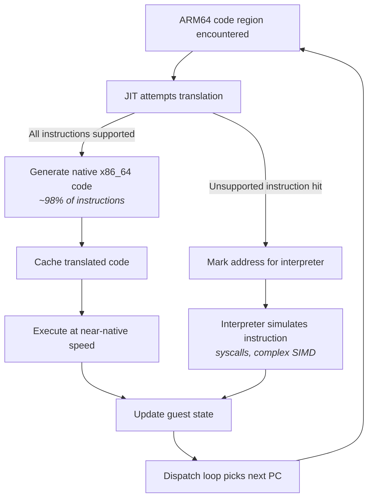

The JIT compiler (called the "Lite Translator") handles the vast majority of instructions — roughly 98% of what a typical app executes. This includes arithmetic, logic, branches, memory loads and stores, and basic SIMD operations.

The interpreter handles the rest: system calls (which need special emulation), complex SIMD instructions (pairwise operations, widening, cross-lane reductions), and any instruction the JIT hasn't implemented yet. When the JIT encounters an instruction it can't translate, it marks that location for interpreter handling, and the dispatch loop routes future executions of that address to the interpreter.

This dual approach gives Digitalis near-native performance for the common case while maintaining correctness for the full ARM64 instruction set.

---

## 3. ARM64 and x86_64 — Two Different Worlds

To understand what Digitalis translates, you need to know what ARM64 and x86_64 binaries look like and why they're so different.

### What's Inside a Native Library

Both ARM64 and x86_64 native libraries on Android use the **ELF** (Executable and Linkable Format) container. An ELF file has a header describing the target architecture, followed by sections: `.text` (executable code), `.data` (initialized data), `.bss` (uninitialized data), and symbol tables that map function names to addresses. The container format is the same on both architectures — what differs is the machine code inside `.text`.

### How Android Packages Them

Android APKs include native libraries under architecture-specific directories: `lib/arm64-v8a/` for ARM64 and `lib/x86_64/` for x86_64. Most apps ship both, but some — particularly games and Vulkan-based apps — ship only `lib/arm64-v8a/`. When an x86_64 emulator encounters an APK with only ARM64 libraries, it has no native code it can run. This is where Digitalis steps in.

### ARM64 Instruction Encoding

ARM64 (also called AArch64) uses **fixed-length instructions**: every instruction is exactly 4 bytes (32 bits). Different bit positions within those 32 bits encode the operation type, register numbers, and immediate values. Because every instruction is the same size, you always know where the next instruction starts — just add 4 bytes. This makes decoding straightforward.

### x86_64 Instruction Encoding

x86_64 uses **variable-length instructions**: anywhere from 1 to 15 bytes per instruction. An instruction can have optional prefix bytes, one or more opcode bytes, a ModR/M byte (specifying register/memory operands), a SIB byte (for complex addressing), displacement bytes, and immediate bytes. You can't find the start of the next instruction without fully decoding the current one.

### Why This Matters for Digitalis

Digitalis reads ARM64 instructions (input) and generates x86_64 instructions (output). Decoding the ARM64 input is easy thanks to fixed-width encoding. But *generating* x86_64 output is more complex — each instruction must be assembled from variable-length components with the correct prefix, opcode, and operand encoding bytes. A single ARM64 instruction often becomes 1 to 5 x86_64 instructions.

### Going Deeper

#### ARM64 Encoding Anatomy

Consider `ADD X1, X2, X3` — a 64-bit register add. As a 32-bit word, the bits break down as:

| Bits | Field | Value | Meaning |
|------|-------|-------|---------|
| [31] | sf | 1 | 64-bit operation |
| [30] | op | 0 | ADD (not SUB) |
| [29] | S | 0 | Don't set flags |
| [28:24] | — | 01011 | Add/subtract shifted register group |
| [23:22] | shift | 00 | No shift |
| [20:16] | Rm | 00011 | Source register X3 |
| [15:10] | imm6 | 000000 | Shift amount 0 |
| [9:5] | Rn | 00010 | Source register X2 |
| [4:0] | Rd | 00001 | Destination register X1 |

There is no single contiguous "opcode" field. ARM64 uses **hierarchical bit-field dispatch**: the top-level encoding group is determined by bits[28:25] (called `op0`), and sub-groups are identified by further bit checks within each group. In Digitalis's decoder (`decoder.h`), this maps directly to a switch on `GetBits<25, 4>()`:

- `100x` → Data Processing (Immediate)
- `101x` → Branches, Exceptions, System
- `x1x0` → Loads and Stores
- `x101` → Data Processing (Register) — where our ADD lives
- `x111` → SIMD and Floating Point

#### x86_64 Encoding Anatomy

The same `ADD X1, X2, X3` in x86_64 requires:

- **REX.W prefix** (0x48): indicates 64-bit operand size
- **Opcode** (0x01): ADD r/m64, r64
- **ModR/M byte**: encodes that the source is one register and the destination is another

The JIT's Assembler class handles this encoding via methods like `as_.Addq()`, which assembles the correct byte sequence automatically.

#### Register Naming

ARM64 and x86_64 use different register naming conventions:

| ARM64 | Size | x86_64 Equivalent | Size |
|-------|------|--------------------|------|
| X0-X30 | 64-bit GP | RAX, RBX, RCX, ... | 64-bit GP |
| W0-W30 | 32-bit (lower half of X) | EAX, EBX, ECX, ... | 32-bit (lower half) |
| V0-V31 | 128-bit SIMD | XMM0-XMM15 | 128-bit SIMD |

ARM64 has 31 general-purpose registers plus SP; x86_64 has only 16. This mismatch is one of the central challenges in translation (covered in [Section 8](#8-register-allocation)).

#### Endianness and Alignment

Both architectures use little-endian byte ordering on Android. However, ARM64 requires aligned memory access for certain instructions (e.g., `LDP`/`STP` require 8-byte alignment), while x86_64 handles unaligned access transparently (with a performance penalty). The translator must account for this when generating memory access code.

---

## 4. The Big Picture

This diagram shows the complete path from an ARM64 app launching to code executing on the host CPU. Each box is a subsystem covered in detail later in this document.

### The Execution Path in Words

When an ARM64 app launches on an x86_64 emulator, Android's runtime (ART) detects that the app's native libraries are ARM64-only. It loads Digitalis through the NativeBridge interface (`libberberis_arm64.so`). Digitalis's guest loader creates an ARM64 environment inside the x86_64 process: it loads the ARM64 dynamic linker, libc, and the app's shared libraries into a guest address space using a minimal ELF loader called TinyLoader.

When Java code calls a native method, the NativeBridge creates a trampoline that converts the call from x86_64 to ARM64 calling conventions and enters the guest execution loop. The dispatch loop (`ExecuteGuest()`) reads the current program counter from the guest CPU state, looks up the address in the translation cache, and jumps to whatever code pointer it finds there — translated native code, an interpreter trampoline, or a not-yet-translated handler.

For untranslated code, the JIT compiler (Lite Translator) kicks in: it decodes ARM64 instructions, maps guest registers to host registers, and emits x86_64 machine code. The translated code is installed in the cache for reuse. For instructions the JIT can't handle (syscalls, complex SIMD), the interpreter takes over, simulating each instruction by directly updating the guest CPU state.

When guest code calls Android APIs (Vulkan, libc, etc.), proxy libraries intercept the call, convert arguments between ARM64 and x86_64 ABIs, and forward to the host library. For Vulkan specifically, calls pass through GFXStream's VkDecoder to reach the host GPU.

### Going Deeper

Three key data structures appear throughout the system:

**`ThreadState`** holds the complete guest CPU state: 32 general-purpose registers (X0-X30 plus SP), 32 SIMD registers (V0-V31), condition flags (NZCV), the program counter, thread-local storage, and a pending signal status flag. Every instruction — whether JIT-compiled or interpreted — reads from and writes to this structure.

**`GuestAddr` / `ToHostAddr()` / `ToGuestAddr()`** convert between the guest address space (where ARM64 code thinks it's running) and the host address space (where the data actually lives in the x86_64 process). Guest code uses ARM64 addresses; the translator and proxy libraries use these functions to access the corresponding host memory.

**`TranslationCache`** is the central lookup table mapping guest program counter addresses to host code pointers. It's the routing table for the entire system — every dispatch cycle starts with a cache lookup. It supports lock-free reads (via atomic pointer loads) and mutex-protected writes for thread safety.

---

## 5. How an ARM64 App Starts

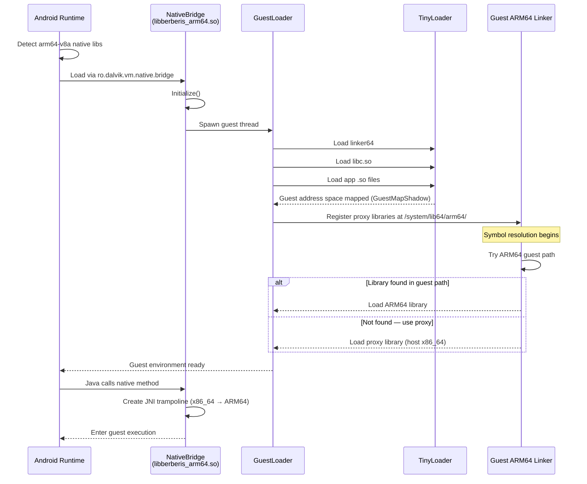

When an ARM64 APK launches on an x86_64 emulator, the Android framework detects that the app's native libraries are in `lib/arm64-v8a/` — an architecture the host can't run natively. Android checks if a NativeBridge is configured. On a Digitalis-enabled emulator, the system property `ro.dalvik.vm.native.bridge` is set to `libberberis_arm64.so`, telling Android to load Digitalis as the translation layer.

Once loaded, Digitalis's guest loader creates an ARM64 execution environment inside the x86_64 process. It uses **TinyLoader**, a minimal ELF loader, to load the ARM64 versions of critical system files: `linker64` (the ARM64 dynamic linker), `libc.so`, and eventually the app's own native libraries. These ARM64 binaries are loaded into a **guest address space** tracked by `GuestMapShadow`, which maps guest addresses to host memory.

The guest ARM64 linker takes over symbol resolution within the guest world. When it needs to load a library, Digitalis intercedes: it first tries loading from the ARM64 guest paths, and if the library isn't there (because it's a system library that only exists as an x86_64 host version), it loads the corresponding proxy library instead. These proxy libraries live at `/system/lib64/arm64/` and bridge guest API calls to host implementations.

Once the guest environment is ready, the app's native code can execute — either through JNI calls from Java or through direct native activity entry points.

### Going Deeper

The NativeBridge integration is implemented in the `NdktNativeBridge` class, which provides Android's NativeBridge v8 callback interface. Key callbacks include:

- **`Initialize()`**: one-time setup that launches the guest loader thread and registers the translation infrastructure
- **`LoadLibrary()` / `LoadLibraryExt()`**: loads ARM64 .so files into the guest address space, falling back to host libraries when needed
- **`native_bridge_getTrampolineWithJNICallType()`**: creates x86_64 wrapper functions for guest JNI methods. The wrapper uses `WrapGuestJNIFunction()` to generate code that marshals arguments from the x86_64 ABI (RDI, RSI, RDX...) into the ARM64 ABI (X0-X7), calls `GuestCall::RunResInt64()` to enter guest execution, and converts the return value back.

Digitalis adds several ARM64-specific enhancements to the NativeBridge integration:

- **ARM64 namespace paths**: appends `/system/lib64/arm64/bootstrap:/system/lib64/arm64` to the guest linker's search paths so proxy libraries are discoverable
- **vDSO whitelist**: adds `linux-vdso.so.1` to shared library whitelist for namespace linking, so the TinyLoader-loaded vDSO is visible across namespace boundaries
- **libc mapping protection**: uses `GuestMapShadow::AddProtectedMapping()` to prevent guest code from tampering with libc.so memory mappings

The `GuestLoader` class manages the guest runtime. Its `LinkerCallbacks` struct holds function pointers to the guest linker's exported symbols (`dlsym`, `dlopen`, `create_namespace`, etc.), allowing Digitalis to drive the guest linker programmatically from host code.

---

## 6. Decoding ARM64 Instructions

Before Digitalis can translate or interpret an ARM64 instruction, it needs to figure out what that instruction *is*. This is the decoder's job.

ARM64 instructions are always 4 bytes. The decoder reads these 32 bits and extracts the operation type, register operands, immediate values, and other fields. It then passes this structured information to either the JIT compiler or the interpreter through a bridge layer called the **SemanticsPlayer**.

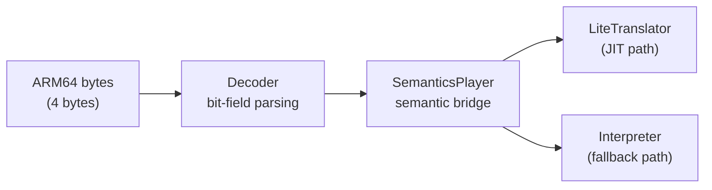

The architecture uses C++ templates to avoid runtime dispatch overhead. `Decoder<InsnConsumer>` is parameterized by its handler type. For JIT compilation, the chain is `Decoder<SemanticsPlayer<LiteTranslator>>`. For interpretation, it's `Decoder<SemanticsPlayer<Interpreter>>`. The SemanticsPlayer translates raw decoded fields into semantic operations (like "add these two registers" or "load from this address"), handling ARM64 quirks along the way.

### Going Deeper

#### Bit-Field Dispatch

The decoder routes instructions through a hierarchy of bit checks. The top-level dispatch uses bits[28:25] (`op0`), which divides all ARM64 instructions into five groups:

| op0 pattern | Group |
|-------------|-------|
| `100x` | Data Processing — Immediate |
| `101x` | Branches, Exceptions, System |
| `x1x0` | Loads and Stores |
| `x101` | Data Processing — Register |
| `x111` | SIMD and Floating Point |

Within each group, further bits narrow down the specific instruction. For example, bit 29 distinguishes different load/store types, and bit 24 distinguishes single-structure from multi-structure SIMD operations.

**Dispatch order matters.** Multiple instruction groups share encoding prefixes. Missing a distinguishing bit check routes instructions to the wrong handler *silently* — the decoder produces a valid-looking but semantically wrong result. No crash, just incorrect behavior that may not manifest until a memory boundary is hit. This has been a recurring source of bugs in Digitalis development.

#### The X31 Special Case

ARM64's register 31 is context-dependent: in some instructions it means **SP** (the stack pointer), and in others it means **ZR** (the zero register, which always reads as zero and discards writes). The SemanticsPlayer's `GetReg()` method handles this based on the instruction context, so the JIT and interpreter don't need to worry about it.

#### Instruction Categories

The decoder handles these ARM64 instruction categories:

- **Logical**: AND, ORR, EOR, BIC (with immediate and register forms)
- **Arithmetic**: ADD, SUB, ADC, SBC (with optional flag-setting variants)
- **Data processing**: UDIV, SDIV, variable shifts (LSLV, LSRV, ASRV, RORV)
- **Memory**: LDR, STR (with multiple addressing modes: immediate offset, register offset, pre/post-index)
- **Control flow**: B, BL, B.cond, RET, CBZ, CBNZ, TBZ, TBNZ
- **SIMD/FP**: vector arithmetic, permute, across-lanes, widening, narrowing
- **CRC32**: CRC32B, CRC32H, CRC32W, CRC32X and their "C" variants (Digitalis-specific addition)

---

## 7. Two Execution Paths: JIT and Interpreter

When Digitalis encounters ARM64 code, it has two ways to run it.

The **JIT compiler** (called the "Lite Translator") takes a block of ARM64 instructions and compiles them into native x86_64 machine code. This compiled code runs directly on the host CPU at near-native speed. About 98% of instructions in a typical app go through this path.

The **interpreter** reads ARM64 instructions one at a time and simulates their effects on the guest CPU state. It's slower — each guest instruction requires many host instructions of overhead — but it can handle any instruction, including ones the JIT doesn't support yet.

The choice happens automatically: the dispatch loop tries the JIT first. If the JIT can handle the code, the translated result is cached and runs natively from then on. If the JIT can't handle a particular instruction, that address is routed to the interpreter for all future executions.

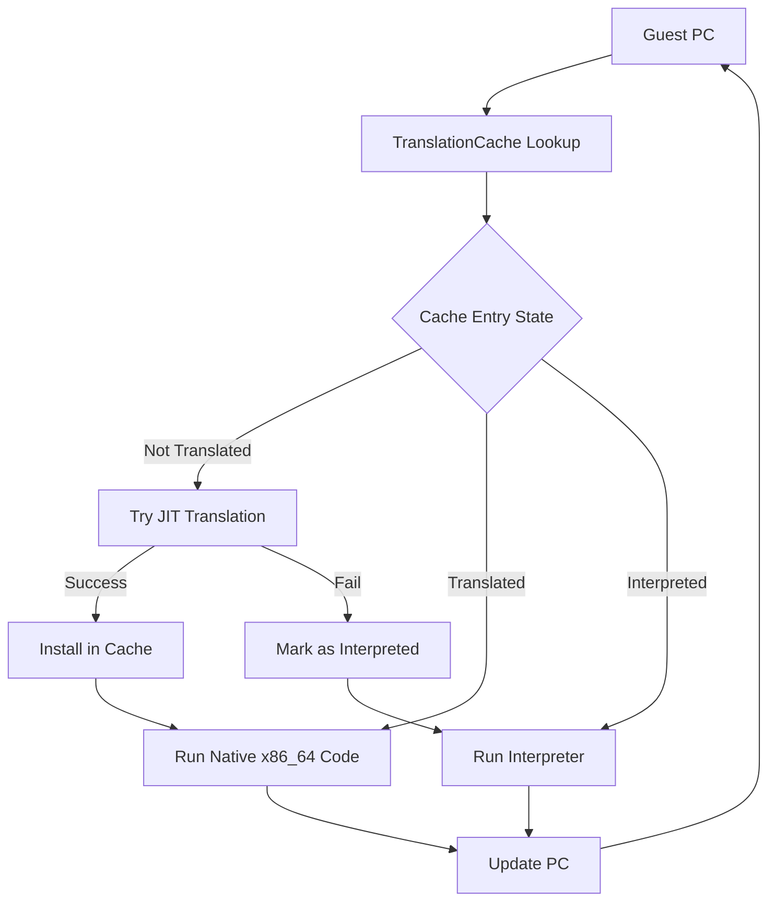

### Going Deeper: The JIT (Lite Translator)

#### Regions

The JIT compiles code in **regions** — sequences of ARM64 instructions compiled together into a single block of x86_64 code:

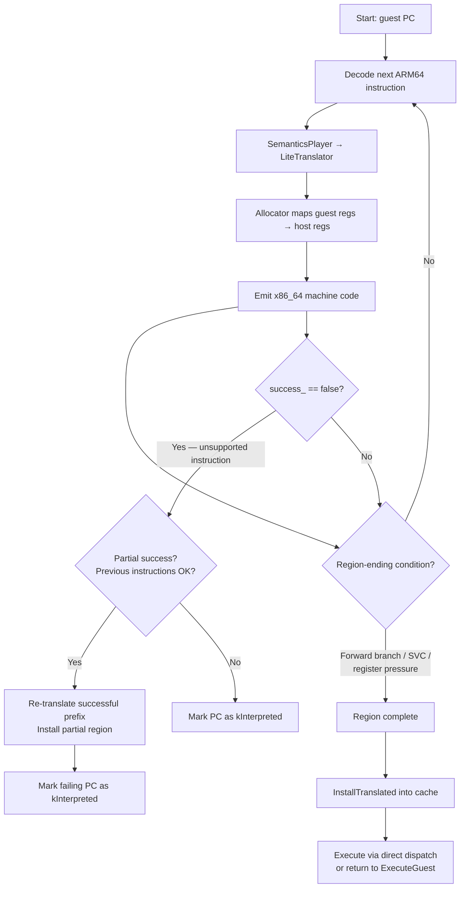

A region has one entry point (the starting PC) and continues until the compiler hits a reason to stop:

- **Forward branch or call**: the target may not be compiled yet, so the region ends and control returns to the dispatch loop
- **SVC instruction** (system call): requires special handling by the interpreter
- **Register pressure**: the register allocator is running low on available host registers (see `IsGpRegPoolLow()`)
- **End of basic block**: any other termination condition

The infrastructure for **backward branch inlining** exists — `RegisterGuestPcLabel` creates a label at each guest PC, and `TryLocalBackwardBranch` could jump to it — but this is currently disabled because it would trap the CPU in tight loops without checking for pending signals between iterations.

#### Trampolines

When JIT-compiled code reaches a branch to an address that hasn't been translated yet, it can't just jump there. Instead, it jumps to a small **trampoline** — a code stub that saves the current state and returns control to `ExecuteGuest()`, which then handles the new address (either by JIT-compiling it or sending it to the interpreter).

#### Condition Flags (NZCV)

ARM64 tracks four condition flags after arithmetic operations: **N**egative, **Z**ero, **C**arry, and **O**verflow (NZCV). x86_64 has similar flags but stores them in a different format. The JIT translates between them using a multi-instruction sequence:

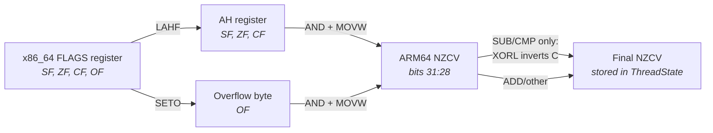

1. **LAHF**: loads x86_64 flags (Sign, Zero, Carry) into the AH register
2. **SETO**: captures the Overflow flag into a separate byte
3. **AND + MOVW**: combines and packs them into ARM64's NZCV layout
4. (For SUB/CMP: an additional **XORL** inverts the carry flag, since ARM64 uses an inverted borrow convention compared to x86_64)

This is implemented in `EmitStoreArmNZCV()` in `lite_translator.h`.

#### Code Generation Example

Here's how the JIT translates `ADD X1, X2, #5` (add immediate 5 to X2, store in X1). The `AddSubImm` method in `lite_translator.h`:

1. `movq res, src` — copy the source register (mapped X2) into a temp
2. `addq res, 5` — add the immediate value

For 32-bit variants (W registers), it uses `movl` + `addl`, which automatically zero-extends the result to 64 bits. If the instruction sets flags (like `ADDS`), `EmitStoreArmNZCV()` is called after the arithmetic to capture the x86_64 flags into ARM64 NZCV format.

#### The `success_ = false` Pattern

When the JIT encounters an instruction it can't translate (e.g., a complex SIMD operation), it sets `success_ = false`. The region compilation detects this and marks that guest PC as `kInterpreted` in the translation cache. This is critical: without it, the dispatch loop would keep trying to JIT-compile the same unsupported instruction, creating an infinite re-entry loop.

#### Partial-Success Compilation

If the JIT fails partway through a region (say, instruction 8 of 12 is unsupported), it doesn't discard all the work. `TryLiteTranslateAndInstallRegion()` re-translates just the successful prefix (instructions 1-7) and installs that in the cache. The unsupported instruction at position 8 is marked for the interpreter. This maximizes the amount of code that runs as native x86_64.

#### Direct Dispatch (Region Chaining)

Normally, when a JIT-compiled region finishes, control returns to the `ExecuteGuest()` dispatch loop, which looks up the next PC in the cache and dispatches again. Digitalis enables an optimization called **direct dispatch** (`allow_dispatch = true` in `translator_x86_64.cc`): translated regions can jump directly to other translated regions through the translation cache, bypassing the return to `ExecuteGuest()`. This eliminates the dispatch overhead between consecutive translated regions — a significant performance improvement.

### Going Deeper: The Interpreter

The interpreter implements the `SemanticsListener` interface, just like the JIT, but instead of generating code, it directly updates the `ThreadState` registers and memory.

**`InterpretInsn()`** handles a single instruction: decode, execute, advance PC. **`InterpretBatch()`** is a Digitalis optimization that processes multiple instructions in a loop, reusing the Decoder and Interpreter objects instead of reconstructing them for each instruction. Object construction accounts for roughly 60% of per-instruction cost, so batching yields around a 2.5x speedup.

All memory accesses in the interpreter use **`FaultyLoad`** and **`FaultyStore`** instead of raw `memcpy`. This is essential: if an ARM64 instruction accesses invalid memory, the fault must be routed to the guest's signal handler, not the host's. Raw `memcpy` would cause a host SIGSEGV that bypasses the guest signal handling entirely. The Faulty variants let the runtime intercept the fault and deliver it as an ARM64 signal.

The interpreter handles the full ARM64 SIMD instruction set that the JIT hasn't implemented: pairwise operations, widening/narrowing conversions, across-lanes reductions, permute and table lookup, compare and select, CRC32 calculations, and scalar floating-point conversions.

---

## 8. Register Allocation

Registers are the fastest storage in a CPU — accessing a register is roughly 100x faster than accessing main memory. When the JIT can keep a guest value in a real host register instead of loading and storing it from memory, the translated code runs dramatically faster. This makes register allocation one of the most performance-critical parts of the translator.

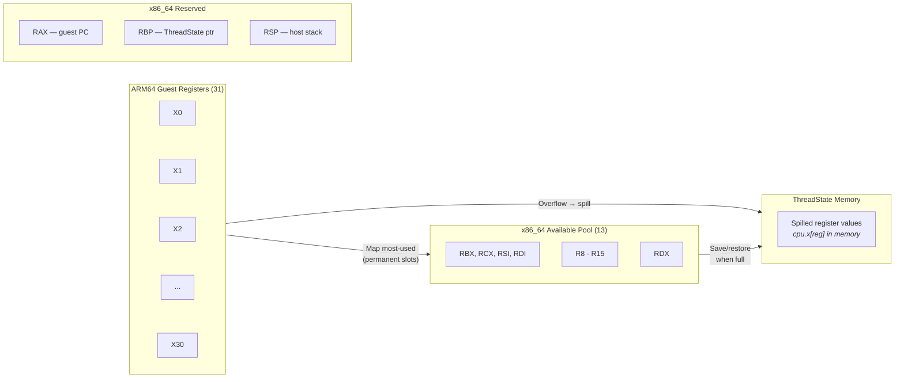

The problem: ARM64 has 31 general-purpose registers (X0-X30) plus SP. x86_64 has only 16, and several are reserved for Digitalis's own use:

| Register | Reserved For |
|----------|-------------|
| RAX | Guest program counter |
| RBP | Pointer to ThreadState struct |
| RSP | Host stack pointer |

That leaves **13 registers** available for mapping guest registers. The JIT must map the most-used ARM64 registers to these 13 host registers. When it needs more, it **spills** — saves a register's value to the `ThreadState` struct in memory, frees the slot, and reloads the value later when needed. Spilling is correct but slower.

The register pool, in allocation order: **RBX, RCX, RSI, RDI, R8-R15, RDX**. The order is intentional: RCX is placed early so it gets permanent mappings (it needs save/restore around variable-shift instructions since x86_64 requires the shift count in CL). RDX is placed last so it's typically used as a temporary (easier to save/restore around DIV/MUL, which use RDX:RAX).

### Going Deeper

The `Allocator<RegType>` class manages register mappings. `GetMappedRegisterOrMap()` returns an existing mapping for a guest register or creates a new one. When creating a new mapping, it loads the guest value from ThreadState memory: `[rbp + offset_of(cpu.x[reg])]`.

**Permanent vs temporary mappings.** Permanent mappings persist across all instructions in a region — they're used for guest registers that appear repeatedly. Temporary mappings are per-instruction scratch registers, allocated from the pool end in reverse order and released after each instruction.

**Early region termination.** When the register pool gets tight, `IsGpRegPoolLow()` returns true and the JIT ends the current region rather than risking cascading spills. This is a Digitalis-specific optimization that keeps JIT-compiled code quality high.

**PUSH/POP vs SUB/ADD.** When saving registers before reading condition flags (via LAHF), the JIT must use PUSH/POP or LEA for stack adjustment — never SUB RSP or ADD RSP. The reason: SUB and ADD clobber x86_64's FLAGS register, which would destroy the very flags that LAHF needs to read. PUSH/POP don't affect FLAGS.

**SIMD register allocation** uses a separate pool, mapping ARM64's V0-V31 (128-bit SIMD registers) to x86_64's XMM0-XMM15.

---

## 9. Talking to the Host: Proxy Libraries

When ARM64 guest code calls `vkCreateInstance()` (Vulkan) or `malloc()` (libc), that call can't go directly to the host library. The host library expects x86_64 calling conventions — arguments in RDI, RSI, RDX, RCX, R8, R9 — while the guest is using ARM64 conventions with arguments in X0 through X7.

A **calling convention** (or ABI — Application Binary Interface) is a contract between caller and callee: where arguments go, where the return value comes back, and which registers the callee may modify. ARM64 and x86_64 have completely different contracts, so every call that crosses the translation boundary needs argument conversion.

**Proxy libraries** bridge this gap. For each Android system library, Digitalis provides a proxy — a host-architecture library named `libberberis_proxy_libXXX.so` — that:

1. Receives the call from guest code (via the ARM64 ABI)
2. Converts arguments to the x86_64 ABI
3. Calls the real host library
4. Converts the return value back to ARM64 conventions

The guest ARM64 linker resolves symbols to these proxy libraries, which are installed at `/system/lib64/arm64/`. From the guest code's perspective, it's calling a normal ARM64 library; the proxy transparently handles the translation.

### Going Deeper

**Argument marshalling** uses `GuestCall` and `VirtualGuestCallFrame` to convert between ABIs. For host-to-guest callbacks (e.g., when a Vulkan debug callback needs to call back into ARM64 code), `GuestCall::RunResInt64()` enters guest execution with the converted arguments.

**JNI trampolines** are a special case. `WrapGuestJNIFunction()` creates bidirectional wrappers for Java native methods. It uses **"shorty" strings** — type abbreviation strings like `"VLI"` for `void(long, int)` — to know how many arguments to convert and what types they are. The wrapper converts JNIEnv pointers, jobject handles, and primitive arguments between host and guest representations.

**The Vulkan path** is the primary use case for Digitalis:

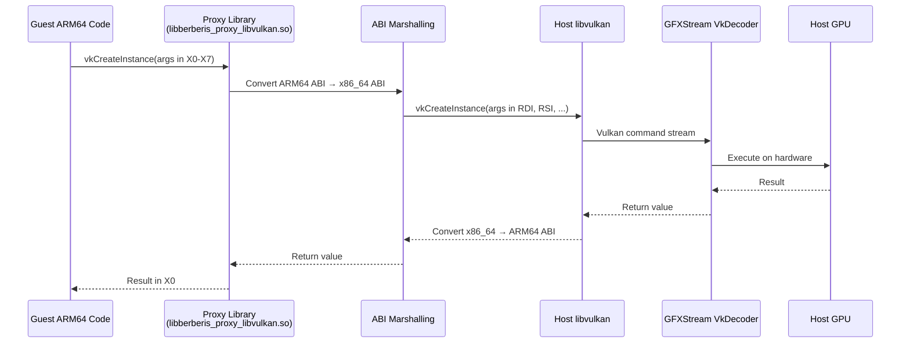

---

## 10. Syscall Emulation

When ARM64 code makes a system call (via the SVC instruction), it follows ARM64 Linux conventions: the syscall number goes in register X8, and arguments go in X0 through X5. The host Linux kernel, running on x86_64, expects something completely different: syscall number in RAX, arguments in RDI, RSI, RDX, R10, R8, R9.

It gets worse. ARM64 and x86_64 don't just use different registers — they use **different syscall numbers** for the same operations. `write()` might be syscall 64 on ARM64 and syscall 1 on x86_64. And some kernel data structures, like `stat` (file information), have different field sizes and memory layouts between the two architectures.

Digitalis intercepts all guest system calls:

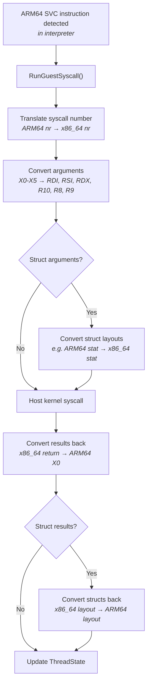

The JIT doesn't handle SVC directly — it sets `success_ = false` so the instruction falls back to the interpreter.

### Going Deeper

The syscall mapping is defined in an autogenerated header, `gen_syscall_emulation_arm64_to_x86_64-inl.h`, which maps each ARM64 syscall number to an implementation function. Struct conversion is handled case-by-case: the guest `stat` struct is unpacked from ARM64 layout and repacked into x86_64 layout before passing to the host kernel, and the reverse on return.

Digitalis includes several hard-won fixes for subtle syscall issues:

**Futex BSS workaround.** Android's Bionic libc uses 16-bit atomics in `.bss` sections for pthread mutexes. When a `.bss` partial page isn't properly zeroed after a file-backed mmap, the upper bytes of the futex word contain garbage. During `FUTEX_WAIT`, the kernel compares the *entire* word, not just the 16-bit atomic. Digitalis fixes this: if the lower 16 bits match the expected value but the upper bits differ, it substitutes the actual memory value for the kernel comparison.

**BSS partial-page zeroing.** In `sys_mman_emulation.cc`, when a file-backed mmap ends in the middle of a page, Digitalis explicitly zeroes the remainder of that page. This ensures `.bss` data (which follows `.data` in the same page) starts clean.

**pthread_once / call_once deadlock fixups.** When guest and host threading primitives interact (guest code calling host libc, which uses its own mutexes), deadlocks can occur. Digitalis includes targeted fixes to break these cycles.

---

## 11. Translation Cache and Dispatch Loop

The translation cache and dispatch loop are the central coordination mechanism that ties everything together.

Every time Digitalis finishes running a block of code — whether JIT-compiled or interpreted — it needs to figure out what to do next. The **translation cache** is a lookup table mapping guest PC addresses to host code pointers. The **dispatch loop** (`ExecuteGuest()`) runs forever: read the current PC, look it up in the cache, jump to the code pointer there, repeat.

This is an **indirect-call dispatch**, not a switch statement. The cache stores raw code pointers, and `berberis_RunGeneratedCode()` jumps to whatever address is stored there:

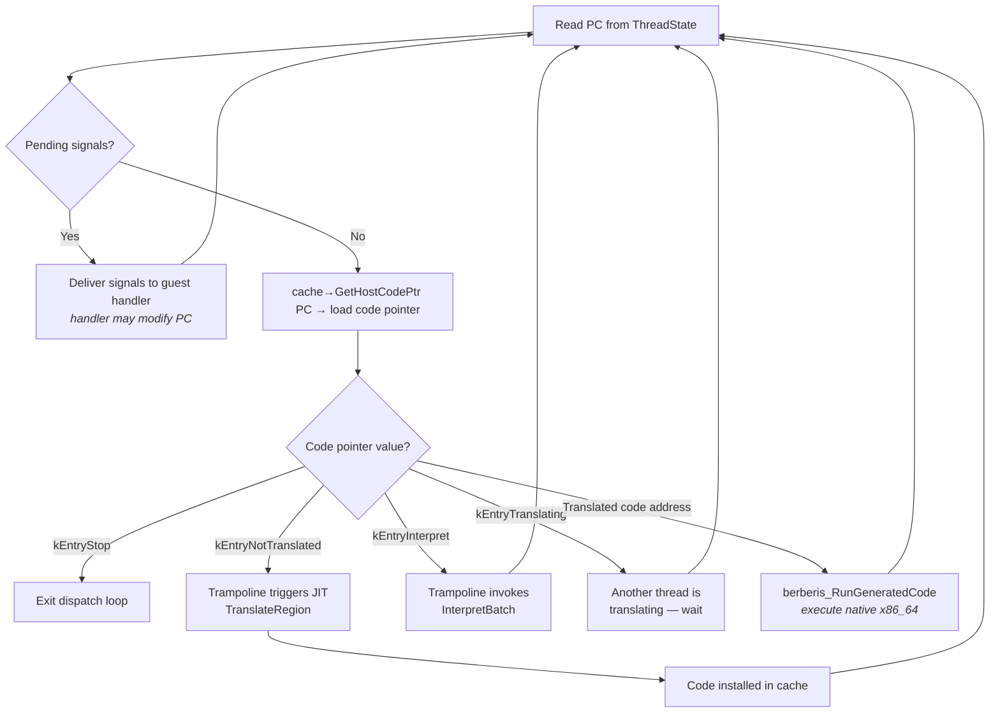

The only explicit check in the loop is for `kEntryStop`, which breaks the loop when the guest thread exits. All other routing happens through the indirect call to the code pointer.

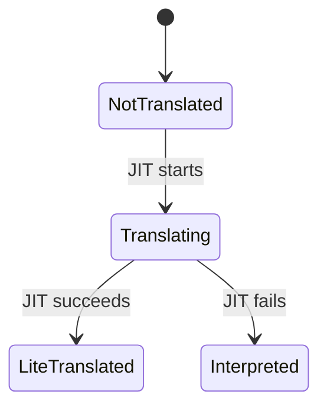

(Upstream Berberis also supports a `LiteTranslated → HeavyOptimized` gear-up transition via `kGearSwitchThreshold`, but this is not used in the ARM64 backend.)

When translated code is cached, it runs repeatedly without any translation overhead. This is why JIT compilation pays off even though it's expensive the first time: hot loops execute the cached native code thousands of times.

### Going Deeper

The `TranslationCache` class uses **lock-free reads** (atomic pointer loads) for the fast path and **mutex-protected writes** for installing new translations. This means the dispatch loop can read code pointers without any locking overhead.

**Dispatch loop detail.** The actual `ExecuteGuest()` loop (in `execute_guest.cc`) is remarkably simple:

1. Read `pc` from `ThreadState`
2. Check `ArePendingSignalsPresent()` — if signals are pending, deliver them (signal handlers may modify PC)
3. Load the code pointer: `cache->GetHostCodePtr(pc)->load()`
4. If the code pointer equals `kEntryStop`, break
5. Call `berberis_RunGeneratedCode(state, AsHostCode(code))`
6. Go to step 1

**Host-code entry point addresses** are trampolines that handle special dispatch cases:

| Entry Point | Purpose |
|-------------|---------|
| `kEntryInterpret` | Route to interpreter |
| `kEntryNotTranslated` | Trigger JIT translation attempt |
| `kEntryTranslating` | Another thread is translating this address |
| `kEntryStop` | Exit the dispatch loop |
| `kEntryNoExec` | Non-executable address |
| `kEntryExitGeneratedCode` | Return from generated code |
| `kEntryInvalidating` | Entry being invalidated |
| `kEntryWrapping` | Entry being wrapped |

**`GuestCodeEntry::Kind`** is a separate classification for cache entries (not to be confused with the trampoline addresses above): `kInterpreted`, `kLiteTranslated`, `kHeavyOptimized`, `kGuestWrapped`, `kHostWrapped`, `kUnderProcessing`, `kSpecialHandler`.

**Thread safety.** When multiple threads hit the same untranslated address simultaneously, the cache's state machine prevents duplicate work: only one thread transitions the entry from `NotTranslated` to `Translating`, and the others wait.

**Eager translation.** Both ARM64 and RISC-V paths pass a threshold of 0 to `AddAndLockForTranslation`, meaning every code region is translated on first encounter. The `kGearSwitchThreshold = 1000` in upstream Berberis governs **gear-up** — re-optimizing a lite-translated region with heavier optimization — not the initial translation decision.

---

## 12. System Libraries

An ARM64 Android app doesn't just run its own code — it calls dozens of system libraries for graphics, audio, memory allocation, threading, and more. Each of these calls crosses the ARM64-to-x86_64 boundary and needs a proxy library (as described in [Section 9](#9-talking-to-the-host-proxy-libraries)). Digitalis currently ships **21 proxy libraries**:

| Category | Libraries |
|----------|-----------|
| **Graphics** | libvulkan, libEGL, libGLESv1_CM, libGLESv2, libGLESv3 |
| **Audio** | libaaudio, libOpenSLES, libOpenMAXAL, libamidi |
| **Camera** | libcamera2ndk |
| **Media** | libmediandk |
| **Core** | libc, libm |
| **Android Framework** | libandroid, libandroid_runtime, libnativewindow, libnativehelper, libjnigraphics |
| **IPC** | libbinder_ndk |
| **ML** | libneuralnetworks |
| **Web** | libwebviewchromium_plat_support |

**Vulkan is the primary use case.** ARM64-only games and graphics apps almost always use Vulkan for rendering. The Vulkan proxy path — guest call to `libberberis_proxy_libvulkan.so` to GFXStream's VkDecoder to the host GPU — is the most exercised and most important translation path.

**Proxy coverage determines app compatibility.** If an app calls a system library that doesn't have a proxy, the guest linker can't resolve the symbol and the app crashes. The set of proxy libraries defines the universe of apps that can run under Digitalis. The current 21 proxies cover the most commonly used Android NDK APIs.

### Going Deeper

Proxy libraries are registered in the build system via `berberis_config.mk`, which defines `BERBERIS_PRODUCT_PACKAGES_ARM64_TO_X86_64` — the complete list of packages installed on a Digitalis-enabled emulator. The guest namespace is configured so the ARM64 linker searches `/system/lib64/arm64/` for these proxies.

**Adding a new proxy** involves: creating the ABI wrapper (converting calling conventions), handling any struct layout differences between ARM64 and x86_64, registering the proxy in `berberis_config.mk`, and testing with sample apps that exercise the new API.

**Limitations.** Some libraries are harder to proxy than others. Complex callback patterns — where host code calls back into guest code, which calls host code again — require careful re-entrant handling. Shared-memory interfaces (where guest and host code access the same memory region concurrently) need additional synchronization.

---

## 13. Debugging

When an ARM64 app crashes under Digitalis, the bug is almost always in the translator — not the app. The app runs correctly on real ARM64 hardware; something in the translation pipeline is producing incorrect behavior. This section explains how to find and fix these bugs.

### Reading the Crash

Crashes show up in Android's logcat as signal names:

| Signal | Meaning | Common Translation Cause |
|--------|---------|------------------------|
| `SIGSEGV` | Memory access violation | Wrong address calculation, missing mmap emulation |
| `SIGABRT` | Assertion or abort | Incorrect API behavior from proxy library |
| `SIGILL` | Illegal instruction | Guest code jumped to non-executable memory |
| `Fatal signal` | Generic fatal | Various translation errors |

### Common Crash Categories

- **Wrong instruction decoded**: the decoder dispatched an instruction to the wrong handler because of a shared encoding prefix or missing distinguishing bit. Produces incorrect results, not immediate crashes — the crash comes later when corrupted data hits a memory boundary.
- **Missing instruction**: neither the JIT nor the interpreter implements this instruction. The app hits an undefined instruction handler.
- **Wrong register mapping or spill**: the JIT corrupted guest state by mismanaging register allocation. Manifests as wrong values in seemingly unrelated code.
- **Missing proxy library or function**: the app calls an API that Digitalis hasn't proxied. Guest linker can't resolve the symbol.
- **Syscall emulation bug**: wrong syscall number translation, wrong struct layout conversion, or missing emulation for an edge case.
- **Memory mapping issue**: BSS data not zeroed, file-backed mmap not handled correctly, or guest signal handler bypassed by raw memory access in the interpreter.

### Going Deeper: Debugging Workflow

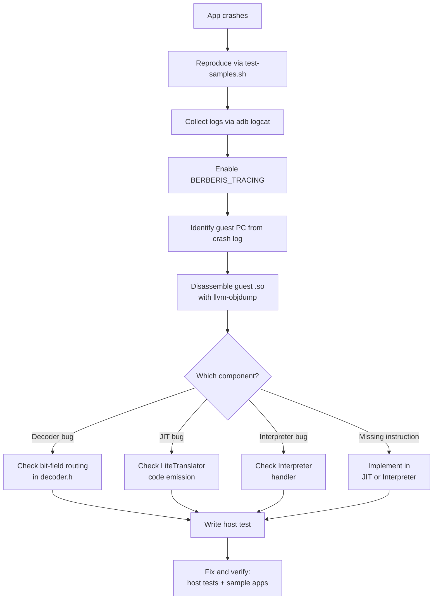

**Step by step:**

1. **Reproduce**: run `test-samples.sh <module>` to confirm the app crashes (reports `CRASH` status)
2. **Collect logs**: `adb logcat | grep -E "berberis|SIGSEGV|Fatal"` — look for the crash address and signal type
3. **Enable tracing**: set the `BERBERIS_TRACING` environment variable to a file path to capture detailed translation logs
4. **Identify the guest PC**: the crash or trace log shows which ARM64 address was being executed when things went wrong
5. **Disassemble**: use `llvm-objdump -d <guest.so>` to find the ARM64 instruction at that address
6. **Diagnose**: check whether the decoder is routing the instruction correctly, whether the JIT is generating the right x86_64 code, or whether the interpreter is executing it correctly
7. **Write a host test**: add a test to `lite_translate_region_exec_tests.cc` that exercises the specific instruction
8. **Fix and verify**: fix the translator, run host tests (`berberis_arm64_host_tests`), then run sample app tests

### Going Deeper: Tracing Infrastructure

Digitalis provides several tracing and logging mechanisms:

- **`TRACE(...)` macro**: conditional tracing controlled by the `BERBERIS_TRACING` environment variable (or the `berberis.tracing` Android system property). Output includes PID and TID for multi-threaded debugging. Written via atomic `write()` calls for thread safety.
- **`DIGITALIS_LOG(...)` macro**: Digitalis-specific debug-level Android log with tag "berberis". Defined in `native_bridge.cc` and used for NativeBridge operations (namespace creation, library loading, etc.).
- **`TRACE_AND_ALOGD()` macro**: combined trace file output + Android logcat output in a single call.
- **Inline profiling**: `g_translation_stats` tracks JIT compilation statistics, JIT break logging records when regions end early, and the dispatch watchdog detects potential infinite loops.

Tracing modes supported by `BERBERIS_TRACING`:
- **File output**: set to a path (e.g., `/data/local/tmp/trace.log`), or `1`/`2` for stdout/stderr
- **TCP socket**: set to `:<port>` (e.g., `:9999`) for real-time tracing over network
- **Package-specific**: set to `com.example.app=/path/to/trace` to trace only a specific app

### Going Deeper: Common Bug Patterns

**Silent mis-routing.** Instruction A is decoded as instruction B because they share encoding bits and the decoder doesn't check the right distinguishing bit. Example: CMGT decoded as SMAX, or SWP decoded as LDADD. The program runs with wrong values until a memory boundary causes a visible crash. Fix: verify opcode bits against the ARM Architecture Reference Manual.

**Infinite re-entry loops.** The JIT marks a guest PC as translated but the code at that PC needs interpreter handling. The dispatch loop keeps jumping to the JIT code, which keeps failing and retrying. Fix: use `success_ = false` to install `kInterpreted` at that PC, routing future dispatches to the interpreter.

**FLAGS clobbering.** The JIT uses SUB or ADD to adjust the stack pointer before calling LAHF to read condition flags. But SUB/ADD modify x86_64's FLAGS register — destroying the flags LAHF needs to capture. Fix: use PUSH/POP or LEA for stack adjustment, which don't affect FLAGS.

**Raw memcpy in interpreter.** The interpreter uses raw `memcpy` for a memory access instead of `FaultyLoad`/`FaultyStore`. When the guest accesses invalid memory, the host process gets a SIGSEGV that bypasses the guest signal handler entirely. Fix: always use `FaultyLoad`/`FaultyStore` for guest memory access.

---

## 14. What Digitalis Adds to Berberis

Berberis is Google's binary translator in AOSP, originally built for RISC-V-to-x86_64 translation. Digitalis adds the entire ARM64-to-x86_64 backend. Here's what's Digitalis-specific versus upstream infrastructure:

**Decoder.** The complete ARM64 instruction decoder: bit-field parsing for all instruction groups (data processing, branches, loads/stores, SIMD/FP), including CRC32 instructions not present in the original Berberis decoder.

**JIT (Lite Translator).** The ARM64-to-x86_64 code generator: all translation methods in `lite_translator.h`, register allocation tuning for ARM64's 31-register architecture, register pressure monitoring (`IsGpRegPoolLow()`) for early region termination, direct dispatch / region chaining (`allow_dispatch = true`), and partial-success compilation that salvages work when translation fails mid-region.

**Interpreter.** ARM64 instruction semantics for the full instruction set, the `InterpretBatch()` optimization (reusing Decoder/Interpreter objects across multiple instructions for ~2.5x speedup), and CRC32 instruction support.

**Syscall Emulation.** ARM64-to-x86_64 syscall number mapping, the futex BSS workaround for Bionic's pthread_mutex implementation, pthread_once/call_once deadlock fixups for guest-host threading interaction, and BSS partial-page zeroing in `sys_mman_emulation.cc`.

**Guest Loader.** ARM64-specific namespace path configuration (`/system/lib64/arm64/`), vDSO whitelist for cross-namespace visibility, libc.so mapping protection via `GuestMapShadow`, and guest linker namespace fallback for incomplete ARM64 configs.

**Product Configuration.** `sdk_phone64_x86_64_digitalis.mk` — the emulator product definition that enables ARM64 translation, sets the NativeBridge system property, and includes all proxy libraries.

**Sample Apps.** 22 ARM64-only sample app modules (ported from [android/ndk-samples](https://github.com/android/ndk-samples)) that serve as the integration test suite, covering Vulkan rendering, OpenGL ES 2.0/3.0, JNI, C++ exceptions, audio (OpenSL ES), video codec, MIDI, camera (Camera2 NDK), sensors, SIMD vectorization, sanitizers, GoogleTest, and more. The original `hello-vulkan` module was written specifically for the Digitalis project.

**Code Markers.** All Digitalis-specific additions to upstream Berberis files are marked with `// region digitalis` / `// endregion` comments (or `# region digitalis` in makefiles). This makes it easy to find what Digitalis changed versus what was already in Berberis.
