# How Digitalis Works

A guide to the ARM64-to-x86_64 binary translator — from first principles to implementation details.

## Table of Contents

1. [Why Digitalis Exists](#1-why-digitalis-exists)
2. [What Binary Translation Is](#2-what-binary-translation-is)
3. [ARM64 and x86_64 — Two Different Worlds](#3-arm64-and-x86_64--two-different-worlds)
4. [The Big Picture](#4-the-big-picture)
5. [How an ARM64 App Starts](#5-how-an-arm64-app-starts)
6. [Decoding ARM64 Instructions](#6-decoding-arm64-instructions)
7. [Two Execution Paths: JIT and Interpreter](#7-two-execution-paths-jit-and-interpreter)
8. [Register Allocation](#8-register-allocation)
9. [Talking to the Host: Proxy Libraries](#9-talking-to-the-host-proxy-libraries)
10. [Syscall Emulation](#10-syscall-emulation)
11. [Translation Cache and Dispatch Loop](#11-translation-cache-and-dispatch-loop)
12. [System Libraries](#12-system-libraries)
13. [Debugging](#13-debugging)
14. [What Digitalis Adds to Berberis](#14-what-digitalis-adds-to-berberis)
15. [ELF Loading and the Guest Address Space](#15-elf-loading-and-the-guest-address-space)
16. [Machine Code Generation](#16-machine-code-generation)
17. [Signal Handling and Fault Recovery](#17-signal-handling-and-fault-recovery)
18. [Putting It All Together: The Vulkan Triangle](#18-putting-it-all-together-the-vulkan-triangle)
19. [Android's NativeBridge Framework](#19-androids-nativebridge-framework)

**Appendix**

- [A. How Berberis Translates RISC-V to x86_64](#appendix-a-how-berberis-translates-risc-v-to-x86_64)
- [B. ARM64 to x86_64 Instruction Mapping](#appendix-b-arm64-to-x86_64-instruction-mapping)
- [C. Source Directory Guide](#appendix-c-source-directory-guide)

---

## 1. Why Digitalis Exists

Android emulators run on x86_64. Most Android apps ship Java/Kotlin bytecode that runs everywhere, but many apps — especially games, camera apps, and anything using Vulkan graphics — include native libraries compiled specifically for ARM64. These ARM64-only apps cannot run on an x86_64 emulator. They either crash at startup or refuse to install entirely.

This is a real problem for developers. If you're building an x86_64 emulator and want to support the full Android app ecosystem, you need a way to run ARM64 code on x86_64 hardware. CI pipelines that test ARM64 APKs on cloud-hosted x86_64 emulators hit the same wall.

Digitalis solves this by translating ARM64 machine code to x86_64 machine code at runtime. When an ARM64 app launches on an x86_64 emulator, Digitalis intercepts the native code, translates it on the fly, and runs the translated x86_64 code on the host CPU. The app doesn't know the difference.

Digitalis is built on top of [Berberis](https://android.googlesource.com/platform/frameworks/libs/binary_translation/), Google's open-source binary translator in the Android Open Source Project (AOSP). Berberis was originally designed for RISC-V-to-x86_64 translation and is already integrated with Android's NativeBridge system — the framework that Android uses to run apps built for a different CPU architecture. Digitalis adds the entire ARM64 backend: an ARM64 instruction decoder, a JIT compiler that generates x86_64 machine code, an interpreter for instructions the JIT can't handle, syscall translation, and proxy libraries that bridge ARM64 API calls to host libraries.

The project includes 22 ARM64-only sample app modules under `sample/hellodigitalis/` — ported from Google's [android/ndk-samples](https://github.com/android/ndk-samples) — covering Vulkan, OpenGL ES, JNI, audio, camera, MIDI, sensors, SIMD, and more. All 22 run successfully on an x86_64 emulator through Digitalis translation.

---

## 2. What Binary Translation Is

Think of binary translation as a simultaneous interpreter — not for spoken languages, but for CPU instruction sets. ARM64 and x86_64 are two different "languages" that processors speak. Both can do the same things (arithmetic, memory access, branching, function calls), but they encode these operations completely differently. Binary translation reads instructions in one language and produces equivalent instructions in the other.

### Two Strategies

There are two main approaches to binary translation:

**Ahead-of-time (AOT)** translation converts an entire program before it runs — like translating a book from one language to another. You do the work once and get a fully translated binary. The downside is that you need the complete program upfront, and the translation step can be slow.

**Just-in-time (JIT)** translation converts code as the program runs — like a live interpreter at a conference. When the program reaches a new block of code, the translator converts it on the spot, caches the result, and runs it. The first execution of each block is slower (you pay the translation cost), but every subsequent execution runs the cached native code at near-native speed.

Digitalis uses JIT translation with an interpreter fallback.

### What an Interpreter Does

An interpreter is the simplest way to run foreign code. It works in a loop:

1. **Fetch** the next ARM64 instruction from memory
2. **Decode** it — figure out what operation it represents
3. **Execute** it — simulate the effect on a virtual set of ARM64 registers and memory
4. **Advance** to the next instruction

This is straightforward to implement and can handle any instruction, but it's slow. Every single ARM64 instruction requires many x86_64 instructions of overhead just for the fetch-decode-execute loop itself. Typical overhead is 10-50x compared to native execution.

### What a JIT Compiler Does

A JIT compiler takes a different approach. Instead of simulating each instruction, it *generates* equivalent x86_64 machine code and runs that directly on the host CPU. For example, an ARM64 `ADD X1, X2, X3` instruction gets translated into x86_64 `mov` + `add` instructions. The generated code is stored in a cache so that the next time the program reaches the same address, the pre-translated x86_64 code runs immediately — no translation overhead.

The first time a code block is encountered, the JIT is slower than the interpreter (it has to analyze and translate the instructions). But every subsequent execution is dramatically faster — close to native speed.

### Hot Code Detection

Many JIT compilers use execution counters to identify "hot" code — functions or loops that execute frequently — and only invest the compilation cost for code that's worth optimizing. Code that runs once isn't worth JIT-compiling.

Digitalis takes a simpler approach: it eagerly translates every code region on first encounter, with a translation threshold of zero. The bet is that the JIT compilation cost is low enough to always pay off, and avoiding the profiling overhead is worth it. This is a deliberate design choice (see `translator_x86_64.cc`).

### Digitalis's Approach: JIT + Interpreter

Digitalis combines both strategies:

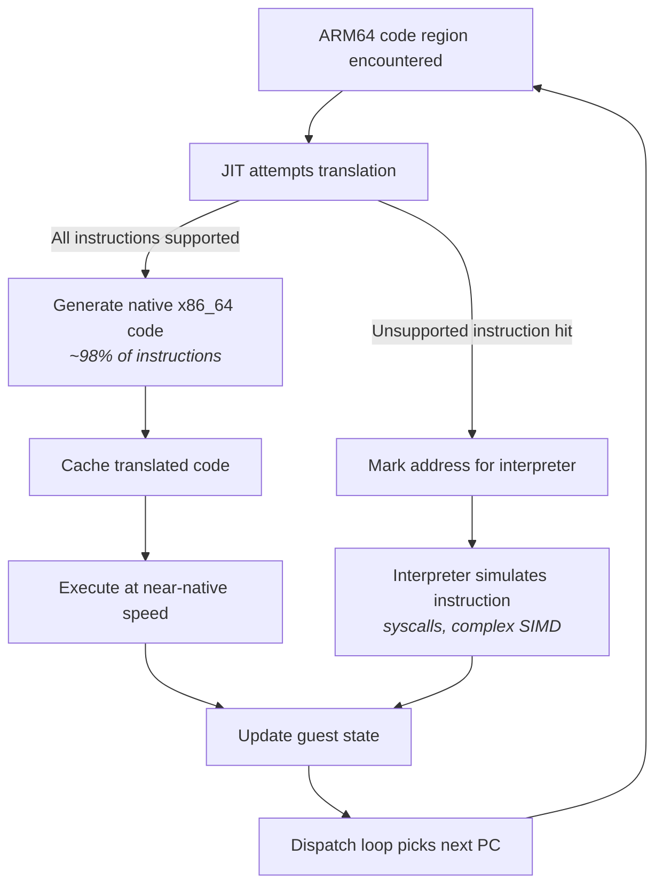

The JIT compiler (called the "Lite Translator") handles the vast majority of instructions — roughly 98% of what a typical app executes. This includes arithmetic, logic, branches, memory loads and stores, and basic SIMD operations.

The interpreter handles the rest: system calls (which need special emulation), complex SIMD instructions (pairwise operations, widening, cross-lane reductions), and any instruction the JIT hasn't implemented yet. When the JIT encounters an instruction it can't translate, it marks that location for interpreter handling, and the dispatch loop routes future executions of that address to the interpreter.

This dual approach gives Digitalis near-native performance for the common case while maintaining correctness for the full ARM64 instruction set.

---

## 3. ARM64 and x86_64 — Two Different Worlds

To understand what Digitalis translates, you need to know what ARM64 and x86_64 binaries look like and why they're so different.

### What's Inside a Native Library

When you write C/C++ code and compile it for Android, the compiler produces a **shared library** (a `.so` file). Both ARM64 and x86_64 libraries on Android use the **ELF** (Executable and Linkable Format) container — think of it as a ZIP file with a standardized layout:

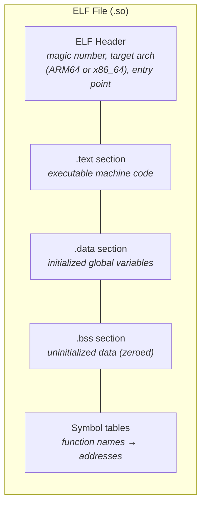

The container format is identical on both architectures. What differs is the machine code inside `.text` — the actual CPU instructions. An ARM64 `.so` has ARM64 instructions; an x86_64 `.so` has x86_64 instructions. They're both ELF files, but a CPU can only execute its own instruction set.

### How Android Packages Them

Android APKs include native libraries under architecture-specific directories:

```
my_app.apk
├── classes.dex          (Java/Kotlin bytecode — runs everywhere)
├── lib/
│   ├── arm64-v8a/       (ARM64 native libraries)
│   │   └── libgame.so
│   └── x86_64/          (x86_64 native libraries)
│       └── libgame.so
└── res/                 (resources)
```

Most apps ship both, but some — particularly games and Vulkan-based apps — ship only `lib/arm64-v8a/`. When an x86_64 emulator encounters an APK with only ARM64 libraries, it has no native code it can run. This is where Digitalis steps in.

### What a CPU Does

Before diving into instruction encoding, let's understand what instructions actually *are*. A CPU is a machine that executes a sequence of very simple operations:

- **Arithmetic**: add two numbers, subtract, multiply, divide
- **Logic**: AND, OR, XOR, shift bits left or right
- **Memory access**: load a value from RAM into a register, store a register value to RAM
- **Branching**: jump to a different location in the code (for loops, if/else, function calls)
- **Comparison**: compare two values and set condition flags (used by branches)

Both ARM64 and x86_64 can do all of these things — they just encode the operations differently, use different register names, and have different rules for how instructions are structured.

### Registers: The CPU's Scratch Paper

Registers are tiny, ultra-fast storage slots built directly into the CPU. Think of them as labeled boxes that each hold one number. Instead of going to main memory (which takes ~100 nanoseconds), reading a register takes less than 1 nanosecond. Every arithmetic operation works on register values.

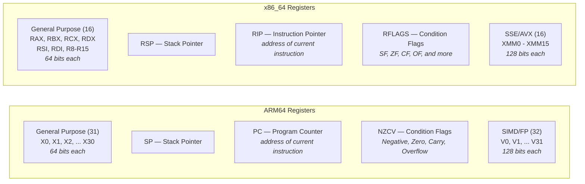

Key differences for Digitalis:

| Feature | ARM64 | x86_64 | Translation Challenge |
|---------|-------|--------|----------------------|
| GP register count | **31** (X0-X30) | **16** (RAX-R15) | Must map 31 into 16 (minus reserved = 13 usable) |
| Register width options | X0 (64-bit) / W0 (32-bit) | RAX / EAX / AX / AL | W-register ops zero-extend; must replicate this |
| SIMD register count | **32** (V0-V31) | **16** (XMM0-XMM15) | Must map 32 into 16 |
| Condition flags | NZCV (4 flags) | RFLAGS (many flags) | Different layout, different semantics for Carry |
| Zero register | X31 = ZR (reads as 0) | No equivalent | Must handle ZR specially in code gen |

The register count mismatch (31 vs 16 for GP, 32 vs 16 for SIMD) is one of the biggest challenges in translation — this is covered in detail in [Section 8](#8-register-allocation).

### Common Operations: Same Intent, Different Encoding

Here are some common operations and how each architecture expresses them. This shows what the translator must convert:

| Operation | ARM64 Assembly | x86_64 Assembly | Notes |
|-----------|---------------|-----------------|-------|
| Add two registers | `ADD X1, X2, X3` | `mov rcx, rdx` then `add rcx, rsi` | x86_64 needs a copy first (destructive ops) |
| Add immediate | `ADD X1, X2, #42` | `lea rcx, [rdx+42]` or `add` | x86_64 has multiple options |
| Load from memory | `LDR X1, [X2]` | `mov rcx, [rdx]` | Similar concept, different encoding |
| Store to memory | `STR X1, [X2]` | `mov [rdx], rcx` | x86_64 reverses operand order |
| Compare | `CMP X1, X2` | `cmp rcx, rdx` | Both set flags, but flag layouts differ |
| Branch if equal | `B.EQ label` | `je label` | Different condition flag checking |
| Function call | `BL function` | `call function` | ARM64 saves return addr in X30; x86_64 pushes to stack |
| Return | `RET` | `ret` | ARM64 jumps to X30; x86_64 pops from stack |
| System call | `SVC #0` (nr in X8) | `syscall` (nr in RAX) | Different registers, different numbers |

A critical difference: ARM64 uses **three-operand instructions** (`ADD dest, src1, src2` — three registers specified), while x86_64 typically uses **two-operand instructions** (`ADD dest, src` — destination is both source and result). This means the translator often needs an extra `mov` instruction to copy a value before a destructive x86_64 operation.

### ARM64 Instruction Encoding

ARM64 (also called AArch64) uses **fixed-length instructions**: every instruction is exactly 4 bytes (32 bits). Different bit positions within those 32 bits encode the operation type, register numbers, and immediate values.

```
ARM64 instruction stream (every instruction = 4 bytes):
┌──────────┬──────────┬──────────┬──────────┬──────────┐
│ insn @ 0 │ insn @ 4 │ insn @ 8 │ insn @ C │ insn @ 10│
│ 4 bytes  │ 4 bytes  │ 4 bytes  │ 4 bytes  │ 4 bytes  │
└──────────┴──────────┴──────────┴──────────┴──────────┘
Finding the next instruction: always current address + 4
```

Because every instruction is the same size, you always know where the next instruction starts — just add 4 bytes. This makes decoding straightforward.

### x86_64 Instruction Encoding

x86_64 uses **variable-length instructions**: anywhere from 1 to 15 bytes per instruction.

```
x86_64 instruction stream (variable lengths):
┌───────┬──────────────┬────┬──────────┬─────────────────┐
│ 2 B   │ 5 bytes      │ 1B │ 3 bytes  │ 7 bytes         │
│ push  │ mov reg,imm  │nop │ add r,r  │ mov [rdi+8],rax │
└───────┴──────────────┴────┴──────────┴─────────────────┘
Finding the next instruction: must fully decode the current one first
```

An instruction can have optional prefix bytes, one or more opcode bytes, a ModR/M byte (specifying register/memory operands), a SIB byte (for complex addressing), displacement bytes, and immediate bytes:

```
x86_64 instruction format (all parts optional except opcode):
┌──────────┬────────┬────────┬─────┬──────────────┬───────────┐
│ Prefixes │ REX    │ Opcode │ Mod │ Displacement │ Immediate │
│ 0-4 B    │ 0-1 B  │ 1-3 B  │R/M  │ 0/1/2/4 B    │ 0/1/2/4 B │
│          │        │        │+SIB │              │           │
└──────────┴────────┴────────┴─────┴──────────────┴───────────┘
```

You can't find the start of the next instruction without fully decoding the current one. This is one reason why x86_64 decoders are complex — but Digitalis only *generates* x86_64 (it doesn't decode it), so the JIT's Assembler class handles the encoding complexity.

### Why This Matters for Digitalis

Digitalis reads ARM64 instructions (input) and generates x86_64 instructions (output). Decoding the ARM64 input is easy thanks to fixed-width encoding. But *generating* x86_64 output is more complex — each instruction must be assembled from variable-length components with the correct prefix, opcode, and operand encoding bytes. A single ARM64 instruction often becomes 1 to 5 x86_64 instructions.

Here's a concrete example of what translation looks like:

```
ARM64 (1 instruction, 4 bytes):
    ADD X1, X2, X3        ; X1 = X2 + X3

x86_64 (2 instructions, 6 bytes):
    mov rcx, rdx          ; copy X2's mapped register to X1's mapped register
    add rcx, rsi          ; add X3's mapped register
```

The ARM64 three-operand `ADD` becomes two x86_64 instructions because x86_64's `add` is destructive (it overwrites the destination). The JIT must insert a `mov` to preserve the source value.

### Going Deeper

#### ARM64 Encoding Anatomy

Consider `ADD X1, X2, X3` — a 64-bit register add. As a 32-bit word, the bits break down as:

| Bits | Field | Value | Meaning |
|------|-------|-------|---------|
| [31] | sf | 1 | 64-bit operation |
| [30] | op | 0 | ADD (not SUB) |
| [29] | S | 0 | Don't set flags |
| [28:24] | — | 01011 | Add/subtract shifted register group |
| [23:22] | shift | 00 | No shift |
| [20:16] | Rm | 00011 | Source register X3 |
| [15:10] | imm6 | 000000 | Shift amount 0 |
| [9:5] | Rn | 00010 | Source register X2 |
| [4:0] | Rd | 00001 | Destination register X1 |

There is no single contiguous "opcode" field. ARM64 uses **hierarchical bit-field dispatch**: the top-level encoding group is determined by bits[28:25] (called `op0`), and sub-groups are identified by further bit checks within each group. In Digitalis's decoder (`decoder.h`), this maps directly to a switch on `GetBits<25, 4>()`:

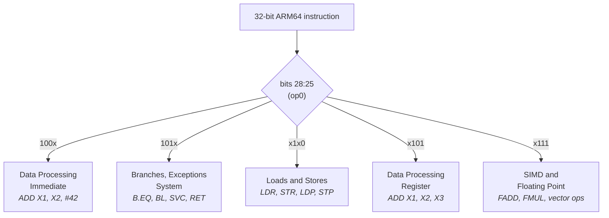

Within each group, further bit checks narrow down to the specific instruction.

#### x86_64 Encoding Anatomy

The same `ADD X1, X2, X3` in x86_64 requires:

- **REX.W prefix** (0x48): indicates 64-bit operand size
- **Opcode** (0x01): ADD r/m64, r64
- **ModR/M byte**: encodes that the source is one register and the destination is another

```
Byte layout:  48  01  D1
              │   │   └── ModR/M: mod=11 (register), reg=010 (rdx), r/m=001 (rcx)
              │   └────── Opcode: ADD r/m64, r64
              └────────── REX.W: 64-bit operand size
```

The JIT's Assembler class handles this encoding via methods like `as_.Addq()`, which assembles the correct byte sequence automatically.

#### Register Naming in Detail

Both architectures allow accessing different portions of the same register:

**ARM64 registers:**
```
X0  [████████████████████████████████████████████████████████████████]  64 bits
W0  [                                ████████████████████████████████]  lower 32 bits
    (writing W0 zero-extends to X0 — upper 32 bits become zero)
```

**x86_64 registers:**
```
RAX [████████████████████████████████████████████████████████████████]  64 bits
EAX [                                ████████████████████████████████]  lower 32 bits
AX  [                                                ████████████████]  lower 16 bits
AL  [                                                        ████████]  lower 8 bits
    (writing EAX zero-extends to RAX; writing AX/AL does NOT zero-extend)
```

The full register comparison:

| ARM64 | Count | x86_64 | Count | Role |
|-------|-------|--------|-------|------|
| X0-X30 / W0-W30 | 31 | RAX-R15 / EAX-R15D | 16 | General purpose |
| SP | 1 | RSP | 1 | Stack pointer |
| PC | 1 | RIP | 1 | Program counter |
| XZR/WZR | 1 | *(none)* | 0 | Zero register (reads as 0, writes discarded) |
| V0-V31 | 32 | XMM0-XMM15 | 16 | SIMD / floating point |
| NZCV | 4 flags | RFLAGS | 6+ flags | Condition flags after arithmetic |

ARM64 has 31 general-purpose registers plus SP; x86_64 has only 16. This mismatch is one of the central challenges in translation (covered in [Section 8](#8-register-allocation)).

#### Endianness and Alignment

Both architectures use **little-endian** byte ordering on Android. This means the least significant byte is stored at the lowest address:

```
Value: 0x0123456789ABCDEF stored at address 0x1000

Address: 0x1000 0x1001 0x1002 0x1003 0x1004 0x1005 0x1006 0x1007
Byte:      EF     CD     AB     89     67     45     23     01
           ↑ least significant                       most significant ↑
```

Both architectures use the same byte order, so data in memory doesn't need conversion — a significant simplification for the translator.

However, ARM64 requires **aligned memory access** for certain instructions (e.g., `LDP`/`STP` pair loads/stores require 8-byte alignment), while x86_64 handles unaligned access transparently (with a performance penalty). The translator must account for this when generating memory access code.

---

## 4. The Big Picture

This diagram shows the complete path from an ARM64 app launching to code executing on the host CPU. Each box is a subsystem covered in detail later in this document.


### The Execution Path in Words

When an ARM64 app launches on an x86_64 emulator, Android's runtime (ART) detects that the app's native libraries are ARM64-only. It loads Digitalis through the NativeBridge interface (`libberberis_arm64.so`). Digitalis's guest loader creates an ARM64 environment inside the x86_64 process: it loads the ARM64 dynamic linker, libc, and the app's shared libraries into a guest address space using a minimal ELF loader called TinyLoader.

When Java code calls a native method, the NativeBridge creates a trampoline that converts the call from x86_64 to ARM64 calling conventions and enters the guest execution loop. The dispatch loop (`ExecuteGuest()`) reads the current program counter from the guest CPU state, looks up the address in the translation cache, and jumps to whatever code pointer it finds there — translated native code, an interpreter trampoline, or a not-yet-translated handler.

For untranslated code, the JIT compiler (Lite Translator) kicks in: it decodes ARM64 instructions, maps guest registers to host registers, and emits x86_64 machine code. The translated code is installed in the cache for reuse. For instructions the JIT can't handle (syscalls, complex SIMD), the interpreter takes over, simulating each instruction by directly updating the guest CPU state.

When guest code calls Android APIs (Vulkan, libc, etc.), proxy libraries intercept the call, convert arguments between ARM64 and x86_64 ABIs, and forward to the host library. For Vulkan specifically, calls pass through GFXStream's VkDecoder to reach the host GPU.

### Going Deeper

Three key data structures appear throughout the system:

**`ThreadState`** holds the complete guest CPU state: 32 general-purpose registers (X0-X30 plus SP), 32 SIMD registers (V0-V31), condition flags (NZCV), the program counter, thread-local storage, and a pending signal status flag. Every instruction — whether JIT-compiled or interpreted — reads from and writes to this structure.

**`GuestAddr` / `ToHostAddr()` / `ToGuestAddr()`** convert between the guest address space (where ARM64 code thinks it's running) and the host address space (where the data actually lives in the x86_64 process). Guest code uses ARM64 addresses; the translator and proxy libraries use these functions to access the corresponding host memory.

**`TranslationCache`** is the central lookup table mapping guest program counter addresses to host code pointers. It's the routing table for the entire system — every dispatch cycle starts with a cache lookup. It supports lock-free reads (via atomic pointer loads) and mutex-protected writes for thread safety.

---

## 5. How an ARM64 App Starts

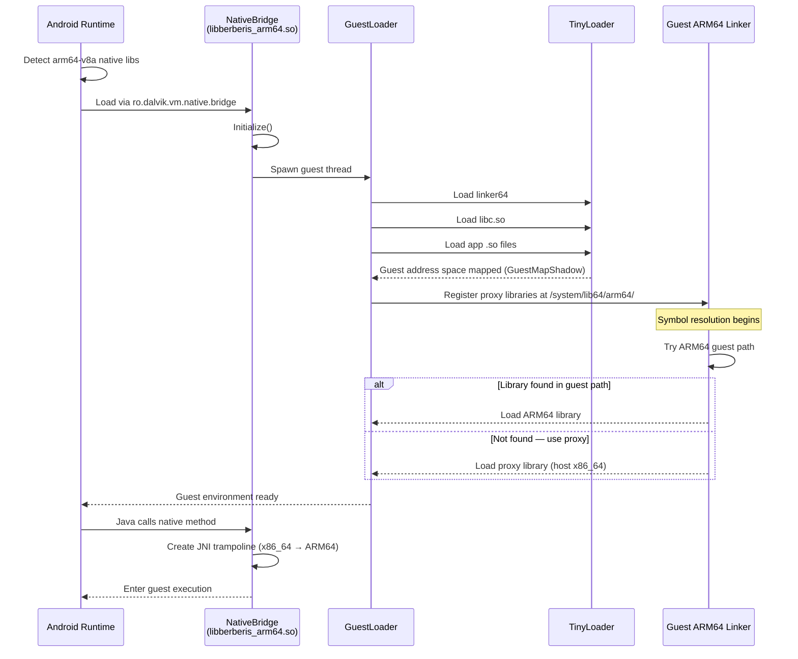

When an ARM64 APK launches on an x86_64 emulator, the Android framework detects that the app's native libraries are in `lib/arm64-v8a/` — an architecture the host can't run natively. Android checks if a NativeBridge is configured. On a Digitalis-enabled emulator, the system property `ro.dalvik.vm.native.bridge` is set to `libberberis_arm64.so`, telling Android to load Digitalis as the translation layer.

Once loaded, Digitalis's guest loader creates an ARM64 execution environment inside the x86_64 process. It uses **TinyLoader**, a minimal ELF loader, to load the ARM64 versions of critical system files: `linker64` (the ARM64 dynamic linker), `libc.so`, and eventually the app's own native libraries. These ARM64 binaries are loaded into a **guest address space** tracked by `GuestMapShadow`, which maps guest addresses to host memory.

The guest ARM64 linker takes over symbol resolution within the guest world. When it needs to load a library, Digitalis intercedes: it first tries loading from the ARM64 guest paths, and if the library isn't there (because it's a system library that only exists as an x86_64 host version), it loads the corresponding proxy library instead. These proxy libraries live at `/system/lib64/arm64/` and bridge guest API calls to host implementations.

Once the guest environment is ready, the app's native code can execute — either through JNI calls from Java or through direct native activity entry points.

### Going Deeper

The NativeBridge integration is implemented in the `NdktNativeBridge` class, which provides Android's NativeBridge v8 callback interface. Key callbacks include:

- **`Initialize()`**: one-time setup that launches the guest loader thread and registers the translation infrastructure
- **`LoadLibrary()` / `LoadLibraryExt()`**: loads ARM64 .so files into the guest address space, falling back to host libraries when needed
- **`native_bridge_getTrampolineWithJNICallType()`**: creates x86_64 wrapper functions for guest JNI methods. The wrapper uses `WrapGuestJNIFunction()` to generate code that marshals arguments from the x86_64 ABI (RDI, RSI, RDX...) into the ARM64 ABI (X0-X7), calls `GuestCall::RunResInt64()` to enter guest execution, and converts the return value back.

Digitalis adds several ARM64-specific enhancements to the NativeBridge integration:

- **ARM64 namespace paths**: appends `/system/lib64/arm64/bootstrap:/system/lib64/arm64` to the guest linker's search paths so proxy libraries are discoverable
- **vDSO whitelist**: adds `linux-vdso.so.1` to shared library whitelist for namespace linking, so the TinyLoader-loaded vDSO is visible across namespace boundaries
- **libc mapping protection**: uses `GuestMapShadow::AddProtectedMapping()` to prevent guest code from tampering with libc.so memory mappings

The `GuestLoader` class manages the guest runtime. Its `LinkerCallbacks` struct holds function pointers to the guest linker's exported symbols (`dlsym`, `dlopen`, `create_namespace`, etc.), allowing Digitalis to drive the guest linker programmatically from host code.

---

## 6. Decoding ARM64 Instructions

Before Digitalis can translate or interpret an ARM64 instruction, it needs to figure out what that instruction *is*. This is the decoder's job.

ARM64 instructions are always 4 bytes. The decoder reads these 32 bits and extracts the operation type, register operands, immediate values, and other fields. It then passes this structured information to either the JIT compiler or the interpreter through a bridge layer called the **SemanticsPlayer**.

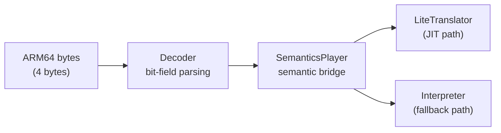

The architecture uses C++ templates to avoid runtime dispatch overhead. `Decoder<InsnConsumer>` is parameterized by its handler type. For JIT compilation, the chain is `Decoder<SemanticsPlayer<LiteTranslator>>`. For interpretation, it's `Decoder<SemanticsPlayer<Interpreter>>`. The SemanticsPlayer translates raw decoded fields into semantic operations (like "add these two registers" or "load from this address"), handling ARM64 quirks along the way.

### Going Deeper

#### Bit-Field Dispatch

The decoder routes instructions through a hierarchy of bit checks. The top-level dispatch uses bits[28:25] (`op0`), which divides all ARM64 instructions into five groups:

| op0 pattern | Group |
|-------------|-------|
| `100x` | Data Processing — Immediate |
| `101x` | Branches, Exceptions, System |
| `x1x0` | Loads and Stores |
| `x101` | Data Processing — Register |
| `x111` | SIMD and Floating Point |

Within each group, further bits narrow down the specific instruction. For example, bit 29 distinguishes different load/store types, and bit 24 distinguishes single-structure from multi-structure SIMD operations.

**Dispatch order matters.** Multiple instruction groups share encoding prefixes. Missing a distinguishing bit check routes instructions to the wrong handler *silently* — the decoder produces a valid-looking but semantically wrong result. No crash, just incorrect behavior that may not manifest until a memory boundary is hit. This has been a recurring source of bugs in Digitalis development.

#### The X31 Special Case

ARM64's register 31 is context-dependent: in some instructions it means **SP** (the stack pointer), and in others it means **ZR** (the zero register, which always reads as zero and discards writes). The SemanticsPlayer's `GetReg()` method handles this based on the instruction context, so the JIT and interpreter don't need to worry about it.

#### Instruction Categories

The decoder handles these ARM64 instruction categories:

- **Logical**: AND, ORR, EOR, BIC (with immediate and register forms)
- **Arithmetic**: ADD, SUB, ADC, SBC (with optional flag-setting variants)
- **Data processing**: UDIV, SDIV, variable shifts (LSLV, LSRV, ASRV, RORV)
- **Memory**: LDR, STR (with multiple addressing modes: immediate offset, register offset, pre/post-index)
- **Control flow**: B, BL, B.cond, RET, CBZ, CBNZ, TBZ, TBNZ
- **SIMD/FP**: vector arithmetic, permute, across-lanes, widening, narrowing
- **CRC32**: CRC32B, CRC32H, CRC32W, CRC32X and their "C" variants (Digitalis-specific addition)

---

## 7. Two Execution Paths: JIT and Interpreter

When Digitalis encounters ARM64 code, it has two ways to run it.

The **JIT compiler** (called the "Lite Translator") takes a block of ARM64 instructions and compiles them into native x86_64 machine code. This compiled code runs directly on the host CPU at near-native speed. About 98% of instructions in a typical app go through this path.

The **interpreter** reads ARM64 instructions one at a time and simulates their effects on the guest CPU state. It's slower — each guest instruction requires many host instructions of overhead — but it can handle any instruction, including ones the JIT doesn't support yet.

The choice happens automatically: the dispatch loop tries the JIT first. If the JIT can handle the code, the translated result is cached and runs natively from then on. If the JIT can't handle a particular instruction, that address is routed to the interpreter for all future executions.

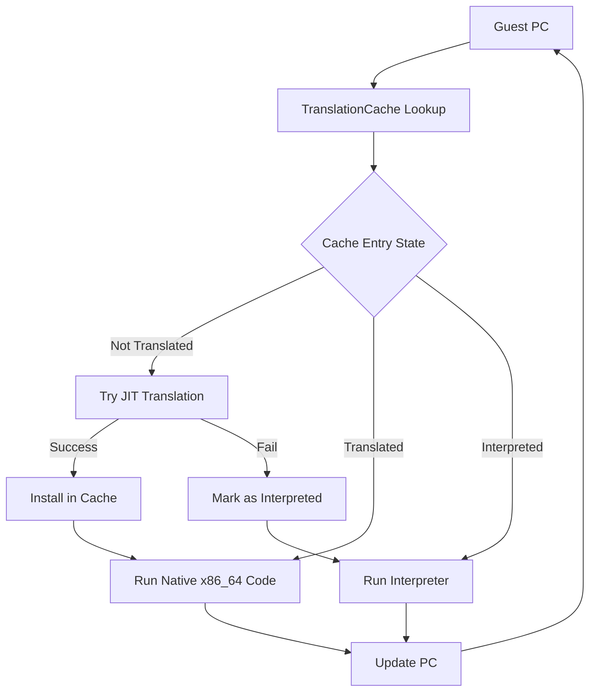

### Going Deeper: The JIT (Lite Translator)

#### Regions

The JIT compiles code in **regions** — sequences of ARM64 instructions compiled together into a single block of x86_64 code:

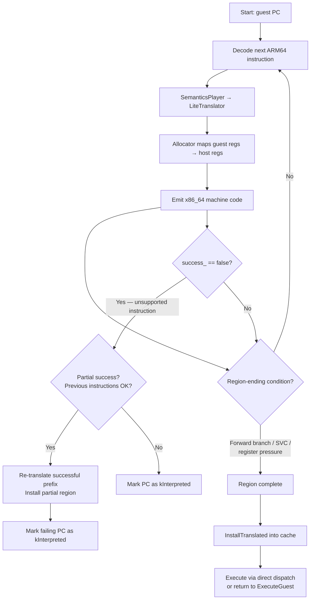

A region has one entry point (the starting PC) and continues until the compiler hits a reason to stop:

- **Forward branch or call**: the target may not be compiled yet, so the region ends and control returns to the dispatch loop
- **SVC instruction** (system call): requires special handling by the interpreter
- **Register pressure**: the register allocator is running low on available host registers (see `IsGpRegPoolLow()`)
- **End of basic block**: any other termination condition

The infrastructure for **backward branch inlining** exists — `RegisterGuestPcLabel` creates a label at each guest PC, and `TryLocalBackwardBranch` could jump to it — but this is currently disabled because it would trap the CPU in tight loops without checking for pending signals between iterations.

#### Trampolines

When JIT-compiled code reaches a branch to an address that hasn't been translated yet, it can't just jump there. Instead, it jumps to a small **trampoline** — a code stub that saves the current state and returns control to `ExecuteGuest()`, which then handles the new address (either by JIT-compiling it or sending it to the interpreter).

#### Condition Flags (NZCV)

ARM64 tracks four condition flags after arithmetic operations: **N**egative, **Z**ero, **C**arry, and **O**verflow (NZCV). x86_64 has similar flags but stores them in a different format. The JIT translates between them using a multi-instruction sequence:

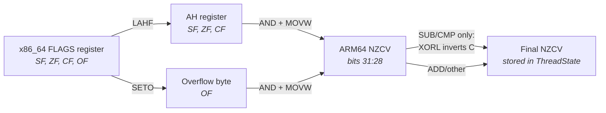

1. **LAHF**: loads x86_64 flags (Sign, Zero, Carry) into the AH register
2. **SETO**: captures the Overflow flag into a separate byte
3. **AND + MOVW**: combines and packs them into ARM64's NZCV layout
4. (For SUB/CMP: an additional **XORL** inverts the carry flag, since ARM64 uses an inverted borrow convention compared to x86_64)

This is implemented in `EmitStoreArmNZCV()` in `lite_translator.h`.

#### Code Generation Example

Here's how the JIT translates `ADD X1, X2, #5` (add immediate 5 to X2, store in X1). The `AddSubImm` method in `lite_translator.h`:

1. `movq res, src` — copy the source register (mapped X2) into a temp
2. `addq res, 5` — add the immediate value

For 32-bit variants (W registers), it uses `movl` + `addl`, which automatically zero-extends the result to 64 bits. If the instruction sets flags (like `ADDS`), `EmitStoreArmNZCV()` is called after the arithmetic to capture the x86_64 flags into ARM64 NZCV format.

#### The `success_ = false` Pattern

When the JIT encounters an instruction it can't translate (e.g., a complex SIMD operation), it sets `success_ = false`. The region compilation detects this and marks that guest PC as `kInterpreted` in the translation cache. This is critical: without it, the dispatch loop would keep trying to JIT-compile the same unsupported instruction, creating an infinite re-entry loop.

#### Partial-Success Compilation

If the JIT fails partway through a region (say, instruction 8 of 12 is unsupported), it doesn't discard all the work. `TryLiteTranslateAndInstallRegion()` re-translates just the successful prefix (instructions 1-7) and installs that in the cache. The unsupported instruction at position 8 is marked for the interpreter. This maximizes the amount of code that runs as native x86_64.

#### Direct Dispatch (Region Chaining)

Normally, when a JIT-compiled region finishes, control returns to the `ExecuteGuest()` dispatch loop, which looks up the next PC in the cache and dispatches again. Digitalis enables an optimization called **direct dispatch** (`allow_dispatch = true` in `translator_x86_64.cc`): translated regions can jump directly to other translated regions through the translation cache, bypassing the return to `ExecuteGuest()`. This eliminates the dispatch overhead between consecutive translated regions — a significant performance improvement.

### Going Deeper: The Interpreter

The interpreter implements the `SemanticsListener` interface, just like the JIT, but instead of generating code, it directly updates the `ThreadState` registers and memory.

**`InterpretInsn()`** handles a single instruction: decode, execute, advance PC. **`InterpretBatch()`** is a Digitalis optimization that processes multiple instructions in a loop, reusing the Decoder and Interpreter objects instead of reconstructing them for each instruction. Object construction accounts for roughly 60% of per-instruction cost, so batching yields around a 2.5x speedup.

All memory accesses in the interpreter use **`FaultyLoad`** and **`FaultyStore`** instead of raw `memcpy`. This is essential: if an ARM64 instruction accesses invalid memory, the fault must be routed to the guest's signal handler, not the host's. Raw `memcpy` would cause a host SIGSEGV that bypasses the guest signal handling entirely. The Faulty variants let the runtime intercept the fault and deliver it as an ARM64 signal.

The interpreter handles the full ARM64 SIMD instruction set that the JIT hasn't implemented: pairwise operations, widening/narrowing conversions, across-lanes reductions, permute and table lookup, compare and select, CRC32 calculations, and scalar floating-point conversions.

---

## 8. Register Allocation

Registers are the fastest storage in a CPU — accessing a register is roughly 100x faster than accessing main memory. When the JIT can keep a guest value in a real host register instead of loading and storing it from memory, the translated code runs dramatically faster. This makes register allocation one of the most performance-critical parts of the translator.

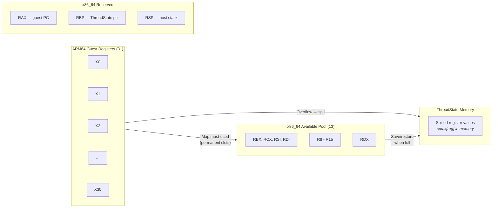

The problem: ARM64 has 31 general-purpose registers (X0-X30) plus SP. x86_64 has only 16, and several are reserved for Digitalis's own use:

| Register | Reserved For |
|----------|-------------|
| RAX | Guest program counter |
| RBP | Pointer to ThreadState struct |
| RSP | Host stack pointer |

That leaves **13 registers** available for mapping guest registers. The JIT must map the most-used ARM64 registers to these 13 host registers. When it needs more, it **spills** — saves a register's value to the `ThreadState` struct in memory, frees the slot, and reloads the value later when needed. Spilling is correct but slower.

The register pool, in allocation order: **RBX, RCX, RSI, RDI, R8-R15, RDX**. The order is intentional: RCX is placed early so it gets permanent mappings (it needs save/restore around variable-shift instructions since x86_64 requires the shift count in CL). RDX is placed last so it's typically used as a temporary (easier to save/restore around DIV/MUL, which use RDX:RAX).

### Going Deeper

The `Allocator<RegType>` class manages register mappings. `GetMappedRegisterOrMap()` returns an existing mapping for a guest register or creates a new one. When creating a new mapping, it loads the guest value from ThreadState memory: `[rbp + offset_of(cpu.x[reg])]`.

**Permanent vs temporary mappings.** Permanent mappings persist across all instructions in a region — they're used for guest registers that appear repeatedly. Temporary mappings are per-instruction scratch registers, allocated from the pool end in reverse order and released after each instruction.

**Early region termination.** When the register pool gets tight, `IsGpRegPoolLow()` returns true and the JIT ends the current region rather than risking cascading spills. This is a Digitalis-specific optimization that keeps JIT-compiled code quality high.

**PUSH/POP vs SUB/ADD.** When saving registers before reading condition flags (via LAHF), the JIT must use PUSH/POP or LEA for stack adjustment — never SUB RSP or ADD RSP. The reason: SUB and ADD clobber x86_64's FLAGS register, which would destroy the very flags that LAHF needs to read. PUSH/POP don't affect FLAGS.

**SIMD register allocation** uses a separate pool, mapping ARM64's V0-V31 (128-bit SIMD registers) to x86_64's XMM0-XMM15.

---

## 9. Talking to the Host: Proxy Libraries

When ARM64 guest code calls `vkCreateInstance()` (Vulkan) or `malloc()` (libc), that call can't go directly to the host library. The host library expects x86_64 calling conventions — arguments in RDI, RSI, RDX, RCX, R8, R9 — while the guest is using ARM64 conventions with arguments in X0 through X7.

A **calling convention** (or ABI — Application Binary Interface) is a contract between caller and callee: where arguments go, where the return value comes back, and which registers the callee may modify. ARM64 and x86_64 have completely different contracts, so every call that crosses the translation boundary needs argument conversion.

**Proxy libraries** bridge this gap. The word "proxy" here means the same thing as in everyday language: something that acts on behalf of something else. A proxy library **stands in for** a real system library. When ARM64 guest code calls `malloc()`, it doesn't call the real host `libc.so` (which is x86_64 and expects x86_64 arguments). Instead, it calls Digitalis's proxy `libberberis_proxy_libc.so`, which translates the call and forwards it to the real library.

For each Android system library, Digitalis provides a proxy — a host-architecture `.so` file named `libberberis_proxy_libXXX.so`. Here's how a single function call flows through the proxy:

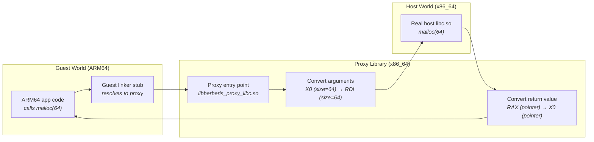

The proxy does four things:

1. **Receives the call** from guest code — arguments arrive in ARM64 registers (X0-X7)
2. **Converts arguments** to the x86_64 ABI — moves them to the right x86_64 registers (RDI, RSI, RDX...) and converts any struct layouts
3. **Calls the real host library** — the actual `malloc()`, `vkCreateInstance()`, etc.
4. **Converts the return value** back — moves it from x86_64's RAX to ARM64's X0

#### Why Not Just Call the Host Library Directly?

You might wonder: if both ARM64 and x86_64 use the same data formats (little-endian, same sizes for int/long/pointer), why can't the translated code just call host functions directly?

Three reasons:

1. **Different argument registers.** ARM64 puts the first argument in X0; x86_64 puts it in RDI. If translated code just `call`'d into host `malloc`, the size parameter would be in the wrong register.

2. **Different stack conventions.** ARM64's stack is 16-byte aligned with different rules for what gets pushed. x86_64 expects the stack to be 16-byte aligned before `call`, with a return address pushed by `call` itself.

3. **Struct layouts may differ.** While most primitive types are the same size, some structs (like `stat`, used by file system calls) have different field ordering or padding between architectures.

The proxy handles all three, making the boundary crossing invisible to both sides.

#### How the Guest Linker Finds Proxies

When the ARM64 guest linker needs to resolve a symbol like `malloc`, Digitalis has configured the linker namespace to search `/system/lib64/arm64/` first. This directory contains the proxy libraries. So `malloc` resolves to `libberberis_proxy_libc.so`'s implementation, not a real ARM64 libc (which doesn't exist on the x86_64 host).

From the guest code's perspective, it's calling a normal ARM64 library. The proxy transparently handles the translation.

### Going Deeper

**Argument marshalling** uses `GuestCall` and `VirtualGuestCallFrame` to convert between ABIs. For host-to-guest callbacks (e.g., when a Vulkan debug callback needs to call back into ARM64 code), `GuestCall::RunResInt64()` enters guest execution with the converted arguments.

**JNI trampolines** are a special case. `WrapGuestJNIFunction()` creates bidirectional wrappers for Java native methods. It uses **"shorty" strings** — type abbreviation strings like `"VLI"` for `void(long, int)` — to know how many arguments to convert and what types they are. The wrapper converts JNIEnv pointers, jobject handles, and primitive arguments between host and guest representations.

**The Vulkan path** is the primary use case for Digitalis:

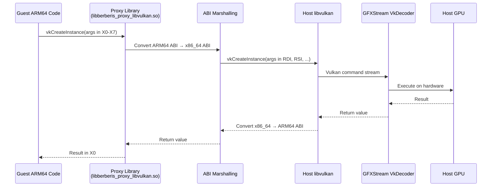

---

## 10. Syscall Emulation

When ARM64 code makes a system call (via the SVC instruction), it follows ARM64 Linux conventions: the syscall number goes in register X8, and arguments go in X0 through X5. The host Linux kernel, running on x86_64, expects something completely different: syscall number in RAX, arguments in RDI, RSI, RDX, R10, R8, R9.

It gets worse. ARM64 and x86_64 don't just use different registers — they use **different syscall numbers** for the same operations. `write()` might be syscall 64 on ARM64 and syscall 1 on x86_64. And some kernel data structures, like `stat` (file information), have different field sizes and memory layouts between the two architectures.

Digitalis intercepts all guest system calls:

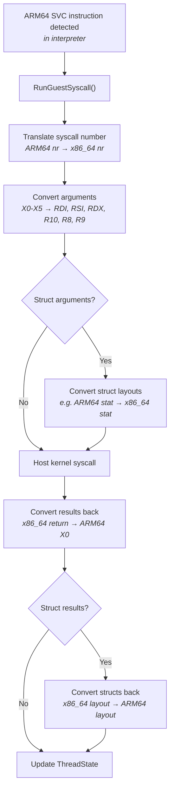

The JIT doesn't handle SVC directly — it sets `success_ = false` so the instruction falls back to the interpreter.

### Going Deeper

The syscall mapping is defined in an autogenerated header, `gen_syscall_emulation_arm64_to_x86_64-inl.h`, which maps each ARM64 syscall number to an implementation function. Struct conversion is handled case-by-case: the guest `stat` struct is unpacked from ARM64 layout and repacked into x86_64 layout before passing to the host kernel, and the reverse on return.

Digitalis includes several hard-won fixes for subtle syscall issues:

**Futex BSS workaround.** Android's Bionic libc uses 16-bit atomics in `.bss` sections for pthread mutexes. When a `.bss` partial page isn't properly zeroed after a file-backed mmap, the upper bytes of the futex word contain garbage. During `FUTEX_WAIT`, the kernel compares the *entire* word, not just the 16-bit atomic. Digitalis fixes this: if the lower 16 bits match the expected value but the upper bits differ, it substitutes the actual memory value for the kernel comparison.

**BSS partial-page zeroing.** In `sys_mman_emulation.cc`, when a file-backed mmap ends in the middle of a page, Digitalis explicitly zeroes the remainder of that page. This ensures `.bss` data (which follows `.data` in the same page) starts clean.

**pthread_once / call_once deadlock fixups.** When guest and host threading primitives interact (guest code calling host libc, which uses its own mutexes), deadlocks can occur. Digitalis includes targeted fixes to break these cycles.

---

## 11. Translation Cache and Dispatch Loop

The translation cache and dispatch loop are the central coordination mechanism that ties everything together.

Every time Digitalis finishes running a block of code — whether JIT-compiled or interpreted — it needs to figure out what to do next. The **translation cache** is a lookup table mapping guest PC addresses to host code pointers. The **dispatch loop** (`ExecuteGuest()`) runs forever: read the current PC, look it up in the cache, jump to the code pointer there, repeat.

This is an **indirect-call dispatch**, not a switch statement. The cache stores raw code pointers, and `berberis_RunGeneratedCode()` jumps to whatever address is stored there:

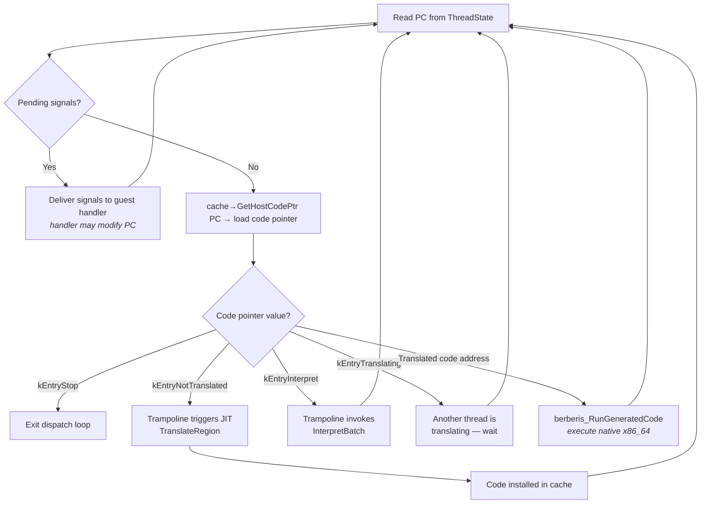

The only explicit check in the loop is for `kEntryStop`, which breaks the loop when the guest thread exits. All other routing happens through the indirect call to the code pointer.

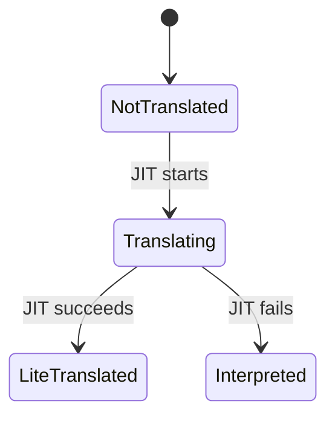

(Upstream Berberis also supports a `LiteTranslated → HeavyOptimized` gear-up transition via `kGearSwitchThreshold`, but this is not used in the ARM64 backend.)

When translated code is cached, it runs repeatedly without any translation overhead. This is why JIT compilation pays off even though it's expensive the first time: hot loops execute the cached native code thousands of times.

### Going Deeper

The `TranslationCache` class uses **lock-free reads** (atomic pointer loads) for the fast path and **mutex-protected writes** for installing new translations. This means the dispatch loop can read code pointers without any locking overhead.

**Dispatch loop detail.** The actual `ExecuteGuest()` loop (in `execute_guest.cc`) is remarkably simple:

1. Read `pc` from `ThreadState`
2. Check `ArePendingSignalsPresent()` — if signals are pending, deliver them (signal handlers may modify PC)
3. Load the code pointer: `cache->GetHostCodePtr(pc)->load()`
4. If the code pointer equals `kEntryStop`, break
5. Call `berberis_RunGeneratedCode(state, AsHostCode(code))`
6. Go to step 1

**Host-code entry point addresses** are trampolines that handle special dispatch cases:

| Entry Point | Purpose |
|-------------|---------|
| `kEntryInterpret` | Route to interpreter |
| `kEntryNotTranslated` | Trigger JIT translation attempt |
| `kEntryTranslating` | Another thread is translating this address |
| `kEntryStop` | Exit the dispatch loop |
| `kEntryNoExec` | Non-executable address |
| `kEntryExitGeneratedCode` | Return from generated code |
| `kEntryInvalidating` | Entry being invalidated |
| `kEntryWrapping` | Entry being wrapped |

**`GuestCodeEntry::Kind`** is a separate classification for cache entries (not to be confused with the trampoline addresses above): `kInterpreted`, `kLiteTranslated`, `kHeavyOptimized`, `kGuestWrapped`, `kHostWrapped`, `kUnderProcessing`, `kSpecialHandler`.

**Thread safety.** When multiple threads hit the same untranslated address simultaneously, the cache's state machine prevents duplicate work: only one thread transitions the entry from `NotTranslated` to `Translating`, and the others wait.

**Eager translation.** Both ARM64 and RISC-V paths pass a threshold of 0 to `AddAndLockForTranslation`, meaning every code region is translated on first encounter. The `kGearSwitchThreshold = 1000` in upstream Berberis governs **gear-up** — re-optimizing a lite-translated region with heavier optimization — not the initial translation decision.

---

## 12. System Libraries

An ARM64 Android app doesn't just run its own code — it calls dozens of system libraries for graphics, audio, memory allocation, threading, and more. Each of these calls crosses the ARM64-to-x86_64 boundary and needs a proxy library (as described in [Section 9](#9-talking-to-the-host-proxy-libraries)). Digitalis currently ships **21 proxy libraries**:

| Category | Libraries |
|----------|-----------|
| **Graphics** | libvulkan, libEGL, libGLESv1_CM, libGLESv2, libGLESv3 |
| **Audio** | libaaudio, libOpenSLES, libOpenMAXAL, libamidi |
| **Camera** | libcamera2ndk |
| **Media** | libmediandk |
| **Core** | libc, libm |
| **Android Framework** | libandroid, libandroid_runtime, libnativewindow, libnativehelper, libjnigraphics |
| **IPC** | libbinder_ndk |
| **ML** | libneuralnetworks |
| **Web** | libwebviewchromium_plat_support |

**Vulkan is the primary use case.** ARM64-only games and graphics apps almost always use Vulkan for rendering. The Vulkan proxy path — guest call to `libberberis_proxy_libvulkan.so` to GFXStream's VkDecoder to the host GPU — is the most exercised and most important translation path.

**Proxy coverage determines app compatibility.** If an app calls a system library that doesn't have a proxy, the guest linker can't resolve the symbol and the app crashes. The set of proxy libraries defines the universe of apps that can run under Digitalis. The current 21 proxies cover the most commonly used Android NDK APIs.

### Going Deeper

Proxy libraries are registered in the build system via `berberis_config.mk`, which defines `BERBERIS_PRODUCT_PACKAGES_ARM64_TO_X86_64` — the complete list of packages installed on a Digitalis-enabled emulator. The guest namespace is configured so the ARM64 linker searches `/system/lib64/arm64/` for these proxies.

**Adding a new proxy** involves: creating the ABI wrapper (converting calling conventions), handling any struct layout differences between ARM64 and x86_64, registering the proxy in `berberis_config.mk`, and testing with sample apps that exercise the new API.

**Limitations.** Some libraries are harder to proxy than others. Complex callback patterns — where host code calls back into guest code, which calls host code again — require careful re-entrant handling. Shared-memory interfaces (where guest and host code access the same memory region concurrently) need additional synchronization.

---

## 13. Debugging

When an ARM64 app crashes under Digitalis, the bug is almost always in the translator — not the app. The app runs correctly on real ARM64 hardware; something in the translation pipeline is producing incorrect behavior. This section explains how to find and fix these bugs.

### Reading the Crash

Crashes show up in Android's logcat as signal names:

| Signal | Meaning | Common Translation Cause |
|--------|---------|------------------------|
| `SIGSEGV` | Memory access violation | Wrong address calculation, missing mmap emulation |
| `SIGABRT` | Assertion or abort | Incorrect API behavior from proxy library |
| `SIGILL` | Illegal instruction | Guest code jumped to non-executable memory |
| `Fatal signal` | Generic fatal | Various translation errors |

### Common Crash Categories

- **Wrong instruction decoded**: the decoder dispatched an instruction to the wrong handler because of a shared encoding prefix or missing distinguishing bit. Produces incorrect results, not immediate crashes — the crash comes later when corrupted data hits a memory boundary.
- **Missing instruction**: neither the JIT nor the interpreter implements this instruction. The app hits an undefined instruction handler.
- **Wrong register mapping or spill**: the JIT corrupted guest state by mismanaging register allocation. Manifests as wrong values in seemingly unrelated code.
- **Missing proxy library or function**: the app calls an API that Digitalis hasn't proxied. Guest linker can't resolve the symbol.
- **Syscall emulation bug**: wrong syscall number translation, wrong struct layout conversion, or missing emulation for an edge case.
- **Memory mapping issue**: BSS data not zeroed, file-backed mmap not handled correctly, or guest signal handler bypassed by raw memory access in the interpreter.

### Going Deeper: Debugging Workflow

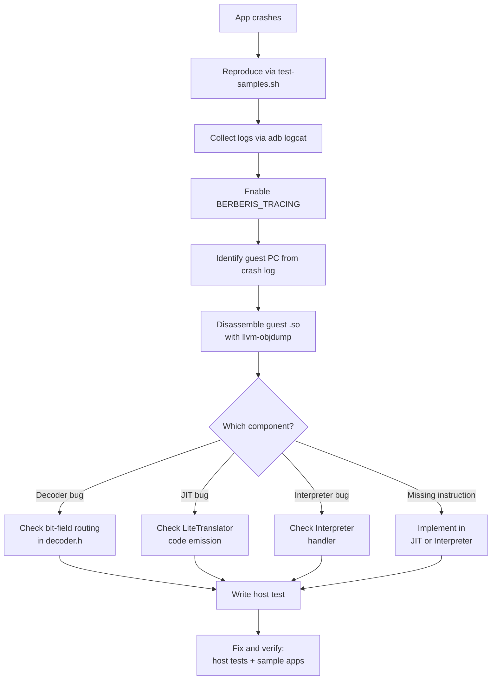

**Step by step:**

1. **Reproduce**: run `test-samples.sh <module>` to confirm the app crashes (reports `CRASH` status)
2. **Collect logs**: `adb logcat | grep -E "berberis|SIGSEGV|Fatal"` — look for the crash address and signal type
3. **Enable tracing**: set the `BERBERIS_TRACING` environment variable to a file path to capture detailed translation logs
4. **Identify the guest PC**: the crash or trace log shows which ARM64 address was being executed when things went wrong
5. **Disassemble**: use `llvm-objdump -d <guest.so>` to find the ARM64 instruction at that address
6. **Diagnose**: check whether the decoder is routing the instruction correctly, whether the JIT is generating the right x86_64 code, or whether the interpreter is executing it correctly
7. **Write a host test**: add a test to `lite_translate_region_exec_tests.cc` that exercises the specific instruction
8. **Fix and verify**: fix the translator, run host tests (`berberis_arm64_host_tests`), then run sample app tests

### Going Deeper: Tracing Infrastructure

Digitalis provides several tracing and logging mechanisms:

- **`TRACE(...)` macro**: conditional tracing controlled by the `BERBERIS_TRACING` environment variable (or the `berberis.tracing` Android system property). Output includes PID and TID for multi-threaded debugging. Written via atomic `write()` calls for thread safety.
- **`DIGITALIS_LOG(...)` macro**: Digitalis-specific debug-level Android log with tag "berberis". Defined in `native_bridge.cc` and used for NativeBridge operations (namespace creation, library loading, etc.).
- **`TRACE_AND_ALOGD()` macro**: combined trace file output + Android logcat output in a single call.
- **Inline profiling**: `g_translation_stats` tracks JIT compilation statistics, JIT break logging records when regions end early, and the dispatch watchdog detects potential infinite loops.

Tracing modes supported by `BERBERIS_TRACING`:
- **File output**: set to a path (e.g., `/data/local/tmp/trace.log`), or `1`/`2` for stdout/stderr
- **TCP socket**: set to `:<port>` (e.g., `:9999`) for real-time tracing over network
- **Package-specific**: set to `com.example.app=/path/to/trace` to trace only a specific app

### Going Deeper: Common Bug Patterns

**Silent mis-routing.** Instruction A is decoded as instruction B because they share encoding bits and the decoder doesn't check the right distinguishing bit. Example: CMGT decoded as SMAX, or SWP decoded as LDADD. The program runs with wrong values until a memory boundary causes a visible crash. Fix: verify opcode bits against the ARM Architecture Reference Manual.

**Infinite re-entry loops.** The JIT marks a guest PC as translated but the code at that PC needs interpreter handling. The dispatch loop keeps jumping to the JIT code, which keeps failing and retrying. Fix: use `success_ = false` to install `kInterpreted` at that PC, routing future dispatches to the interpreter.

**FLAGS clobbering.** The JIT uses SUB or ADD to adjust the stack pointer before calling LAHF to read condition flags. But SUB/ADD modify x86_64's FLAGS register — destroying the flags LAHF needs to capture. Fix: use PUSH/POP or LEA for stack adjustment, which don't affect FLAGS.

**Raw memcpy in interpreter.** The interpreter uses raw `memcpy` for a memory access instead of `FaultyLoad`/`FaultyStore`. When the guest accesses invalid memory, the host process gets a SIGSEGV that bypasses the guest signal handler entirely. Fix: always use `FaultyLoad`/`FaultyStore` for guest memory access.

---

## 14. What Digitalis Adds to Berberis

Berberis is Google's binary translator in AOSP, originally built for RISC-V-to-x86_64 translation. Digitalis adds the entire ARM64-to-x86_64 backend. Here's what's Digitalis-specific versus upstream infrastructure:

**Decoder.** The complete ARM64 instruction decoder: bit-field parsing for all instruction groups (data processing, branches, loads/stores, SIMD/FP), including CRC32 instructions not present in the original Berberis decoder.

**JIT (Lite Translator).** The ARM64-to-x86_64 code generator: all translation methods in `lite_translator.h`, register allocation tuning for ARM64's 31-register architecture, register pressure monitoring (`IsGpRegPoolLow()`) for early region termination, direct dispatch / region chaining (`allow_dispatch = true`), and partial-success compilation that salvages work when translation fails mid-region.

**Interpreter.** ARM64 instruction semantics for the full instruction set, the `InterpretBatch()` optimization (reusing Decoder/Interpreter objects across multiple instructions for ~2.5x speedup), and CRC32 instruction support.

**Syscall Emulation.** ARM64-to-x86_64 syscall number mapping, the futex BSS workaround for Bionic's pthread_mutex implementation, pthread_once/call_once deadlock fixups for guest-host threading interaction, and BSS partial-page zeroing in `sys_mman_emulation.cc`.

**Guest Loader.** ARM64-specific namespace path configuration (`/system/lib64/arm64/`), vDSO whitelist for cross-namespace visibility, libc.so mapping protection via `GuestMapShadow`, and guest linker namespace fallback for incomplete ARM64 configs.

**Product Configuration.** `sdk_phone64_x86_64_digitalis.mk` — the emulator product definition that enables ARM64 translation, sets the NativeBridge system property, and includes all proxy libraries.

**Sample Apps.** 22 ARM64-only sample app modules (ported from [android/ndk-samples](https://github.com/android/ndk-samples)) that serve as the integration test suite, covering Vulkan rendering, OpenGL ES 2.0/3.0, JNI, C++ exceptions, audio (OpenSL ES), video codec, MIDI, camera (Camera2 NDK), sensors, SIMD vectorization, sanitizers, GoogleTest, and more. The original `hello-vulkan` module was written specifically for the Digitalis project.

**Code Markers.** All Digitalis-specific additions to upstream Berberis files are marked with `// region digitalis` / `// endregion` comments (or `# region digitalis` in makefiles). This makes it easy to find what Digitalis changed versus what was already in Berberis.

---

## 15. ELF Loading and the Guest Address Space

When Digitalis needs to run an ARM64 binary on an x86_64 host, it can't just hand the binary to the operating system — the OS would reject it as the wrong architecture. Instead, Digitalis must load the binary itself, set up memory exactly as an ARM64 OS would, and manage a parallel "guest world" inside the host process.

### What ELF Loading Is

An ELF (Executable and Linkable Format) file isn't just a blob of instructions. It's a structured container that tells the OS how to set up a program in memory:

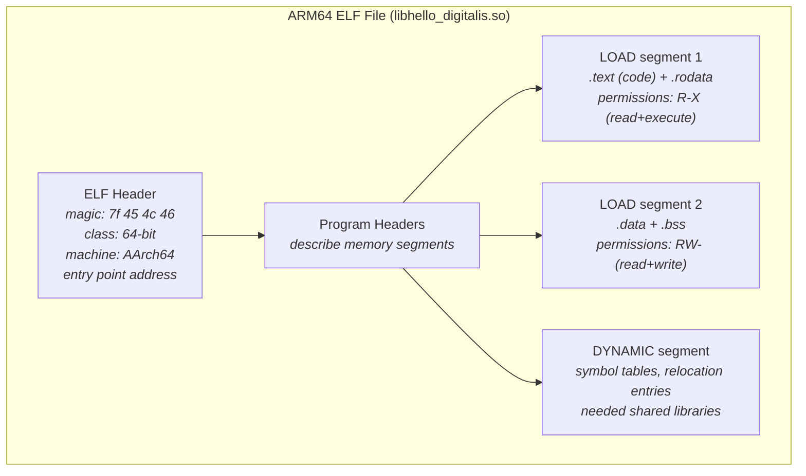

A normal OS loader reads the program headers, allocates memory at the specified addresses, copies each segment from the file into memory with the right permissions (read/write/execute), and resolves symbol references to shared libraries. The host Linux kernel does this for x86_64 binaries automatically — but it can't do it for ARM64 binaries.

### TinyLoader: A Minimal ELF Loader

Digitalis includes **TinyLoader** (`tiny_loader/`), a minimal ELF loader that does in userspace what the kernel normally does:

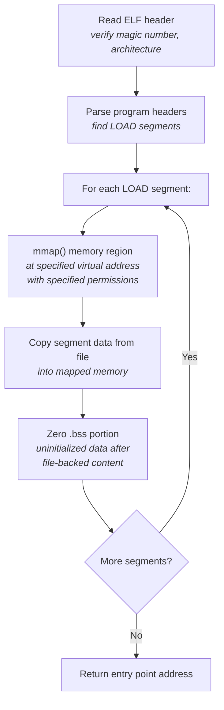

TinyLoader is deliberately simple — it loads ELF segments into memory but doesn't resolve symbols or handle relocations. That's the job of the guest dynamic linker (`linker64`), which TinyLoader loads first.

### The Guest Address Space

The host x86_64 process has one address space. Digitalis carves out a region within it for guest ARM64 code and data. This creates a **dual address space** where guest code thinks it's running at ARM64 addresses, but the actual memory is at different host addresses:

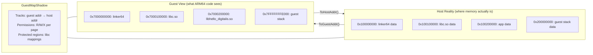

**`GuestMapShadow`** (`guest_os_primitives/`) is the bookkeeper for this dual address space. It tracks which guest addresses are valid, what permissions they have, and where they map in host memory. Every memory access from translated code goes through this mapping.

**`ToHostAddr<T>(guest_addr)`** converts a guest ARM64 address to a host pointer — this is used everywhere the translator or proxy libraries need to access guest memory.

**`ToGuestAddr(host_ptr)`** does the reverse — used when returning memory addresses to guest code (like the result of `malloc()`).

### Why Not Just Run at the Same Addresses?

You might wonder why we need address translation at all. Three reasons:

1. **Address space conflicts.** The host process already has code and data at many addresses. Guest ARM64 code expects to load at specific addresses that may overlap with host mappings.
2. **Permission tracking.** The translator needs to know which guest addresses are executable (to decide whether to JIT them) and which are writable (to detect self-modifying code). `GuestMapShadow` tracks this separately from the host's page permissions.
3. **Protection.** Guest code shouldn't be able to tamper with host data structures. `GuestMapShadow::AddProtectedMapping()` prevents guest writes to critical regions like libc.so mappings.

### The Guest Dynamic Linker

After TinyLoader loads the basic ELF files into memory, the **guest ARM64 `linker64`** takes over. This is Android's standard ARM64 dynamic linker, running under translation — it doesn't know it's being translated. It resolves symbols, processes relocations, and loads additional shared libraries.

Digitalis drives the guest linker programmatically through `LinkerCallbacks` — function pointers to the guest linker's exported symbols (`dlopen`, `dlsym`, `create_namespace`). When the guest linker needs to load a library, Digitalis intercedes via the NativeBridge callbacks, routing to either a real ARM64 library or a proxy.

---

## 16. Machine Code Generation

The JIT (Lite Translator) doesn't execute ARM64 instructions — it *generates x86_64 instructions*. Understanding how raw machine code bytes are produced and made executable is key to understanding the translator.

### The Assembler: Building x86_64 Bytes

The `assembler/` directory contains an x86_64 assembler — a class that knows how to encode every x86_64 instruction as a sequence of bytes. When the JIT calls `as_.Addq(rcx, rsi)`, the assembler produces the bytes `48 01 F1`:

```mermaid
graph LR
    subgraph JIT["JIT calls assembler methods"]
        J1["as_.Movq(rcx, rsi)"]
        J2["as_.Addq(rcx, 42)"]
        J3["as_.Movq(mem, rcx)"]
    end

    subgraph ASM["Assembler encodes to bytes"]
        A1["48 89 F1<br/><i>REX.W + MOV + ModR/M</i>"]
        A2["48 83 C1 2A<br/><i>REX.W + ADD imm8 + ModR/M + 42</i>"]
        A3["48 89 4E 18<br/><i>REX.W + MOV + ModR/M + disp8</i>"]
    end

    subgraph Pool["Code buffer"]
        B["48 89 F1 48 83 C1 2A 48 89 4E 18"]
    end

    J1 --> A1 --> Pool
    J2 --> A2 --> Pool
    J3 --> A3 --> Pool
```

The assembler handles all the complexity of x86_64 encoding: REX prefixes for 64-bit operations, ModR/M bytes for register/memory operands, SIB bytes for complex addressing, and choosing between 8-bit, 32-bit, and 64-bit immediates.

**`MacroAssembler`** (`code_gen_lib/`) sits on top of the raw assembler and provides higher-level patterns: function prologues/epilogues, label-based jumps (resolved to relative offsets when the code is finalized), and common multi-instruction sequences.

### Executable Memory: From Bytes to Runnable Code

Generated bytes aren't useful unless the CPU can execute them. Modern operating systems mark memory pages as either writable (for data) or executable (for code) — but not both simultaneously (a security feature called W^X or "write XOR execute").

The **`exec_region/`** directory manages executable memory:

```mermaid
graph TD
    A["JIT generates x86_64 bytes<br/>into a temporary buffer"] --> B["Request executable region<br/>from code pool"]
    B --> C["exec_region allocates pages<br/><i>mmap with PROT_READ | PROT_WRITE</i>"]
    C --> D["Copy generated code<br/>into the region"]
    D --> E["Change permissions<br/><i>mprotect to PROT_READ | PROT_EXEC</i>"]
    E --> F["Return HostCodePiece<br/><i>pointer to executable code</i>"]
    F --> G["TranslationCache stores pointer<br/>at guest PC address"]
    G --> H["berberis_RunGeneratedCode<br/>can now jump to this address"]
```

The **code pool** pre-allocates large chunks of executable memory and parcels them out to individual translated regions. This avoids the overhead of calling `mmap`/`mprotect` for every small translation. When a region is invalidated (rare), the code pool can reclaim the space.

### Labels and Backpatching

When the JIT generates a conditional branch (like `B.EQ label`), it doesn't know the target address yet — the code for the target hasn't been emitted. The assembler uses **labels** to handle this:

```mermaid
graph TD
    A["JIT emits: jz LABEL_SKIP<br/><i>offset unknown — emit placeholder</i>"] --> B["JIT continues emitting<br/>more instructions"]
    B --> C["JIT binds LABEL_SKIP<br/><i>now we know the address</i>"]
    C --> D["Assembler backpatches:<br/>fill in the real offset<br/>in the placeholder bytes"]
```

1. When a forward jump is emitted, the assembler writes a placeholder offset (e.g., `0x00000000`)
2. The assembler records this location and the label it refers to
3. When the target label is later bound to a specific position, the assembler goes back and overwrites the placeholder with the correct relative offset

This is called **backpatching** and is standard in assemblers and compilers.

### The Code Generation Pipeline

Putting it all together, here's the complete pipeline from ARM64 instruction to executable x86_64:

```mermaid
graph TD
    subgraph Decode["1. Decode"]
        D["ARM64 bytes<br/>4 bytes at guest PC"]
    end
    subgraph Translate["2. Translate"]
        T1["SemanticsPlayer maps to<br/>LiteTranslator method"]
        T2["LiteTranslator calls<br/>Assembler methods"]
    end
    subgraph Assemble["3. Assemble"]
        A1["Assembler encodes<br/>x86_64 bytes"]
        A2["Labels recorded<br/>for forward jumps"]
    end
    subgraph Finalize["4. Finalize"]
        F1["Region complete:<br/>backpatch all labels"]
        F2["Copy to executable memory<br/>(exec_region)"]
        F3["Set permissions R+X"]
    end
    subgraph Cache["5. Cache"]
        C1["InstallTranslated<br/>stores HostCodePiece in<br/>TranslationCache"]
    end
    subgraph Run["6. Execute"]
        R["berberis_RunGeneratedCode<br/>jumps to code address"]
    end

    D --> T1 --> T2 --> A1 --> A2 --> F1 --> F2 --> F3 --> C1 --> R
```

### Intrinsics: When Host Instructions Map Directly

Some ARM64 operations have direct x86_64 equivalents — no complex translation needed. The **`intrinsics/`** directory provides these mappings:

- **CRC32**: ARM64's `CRC32B/H/W/X` instructions map to x86_64's `CRC32` instruction (with the SSE4.2 extension)
- **Bit manipulation**: ARM64's `REV` (byte reverse) maps to x86_64's `BSWAP`
- **Count leading zeros**: ARM64's `CLZ` maps to x86_64's `BSR` + XOR
- **Population count**: ARM64's `CNT` can use x86_64's `POPCNT`

When a direct mapping exists, the JIT emits a single x86_64 instruction instead of emulating the operation with multiple instructions. The `intrinsics/` directory organizes these by source architecture (`arm64_to_all/`, `riscv64_to_all/`).

---

## 17. Signal Handling and Fault Recovery

When translated code crashes — accesses invalid memory, divides by zero, or hits an illegal instruction — the host OS delivers a signal (SIGSEGV, SIGFPE, SIGILL). But the crash happened in *guest* code, so the signal must be delivered to the *guest's* signal handler, not the host's. This is one of the trickiest parts of binary translation.

### The Problem

Consider this scenario:

```mermaid
sequenceDiagram
    participant Guest as ARM64 App
    participant JIT as JIT-compiled Code<br/>(running on host CPU)
    participant Host as Host Linux Kernel
    participant GSH as Guest Signal Handler

    Guest->>JIT: LDR X1, [X0] (load from address in X0)
    Note over JIT: X0 contains invalid address 0xDEAD
    JIT->>Host: mov rcx, [mapped_addr] triggers fault
    Host->>Host: SIGSEGV!
    Note over Host: Who should handle this?<br/>The HOST's signal handler?<br/>Or the GUEST's?
    Host-->>GSH: Must route to guest handler
    GSH->>GSH: Guest app handles the fault<br/>(maybe recovers, maybe crashes)
```

If Digitalis didn't intercept the signal, the host process would crash with a SIGSEGV, and the guest app would never get a chance to handle it. Many apps install signal handlers for legitimate reasons (crash reporting, memory-mapped I/O, custom allocators).

### How Fault Recovery Works

The **`instrument/`** directory provides crash hooks, and **`guest_os_primitives/`** manages signal delivery. Here's the flow:

```mermaid
graph TD
    A["Host CPU executes translated code"] --> B["Memory fault occurs<br/><i>e.g., load from unmapped address</i>"]
    B --> C["Host kernel delivers SIGSEGV<br/>to Digitalis signal handler"]
    C --> D{"Fault in translated code?"}
    D -->|"Yes"| E["Look up guest PC from<br/>recovery code table"]
    E --> F["Set ThreadState.pc<br/>to faulting guest instruction"]
    F --> G["Set pending_signals_status"]
    G --> H["Return to ExecuteGuest loop"]
    H --> I["Loop checks pending signals"]
    I --> J["Deliver signal to guest handler<br/><i>with ARM64 siginfo_t</i>"]
    J --> K{"Guest handler action?"}
    K -->|"Recovers"| L["Modified PC in ThreadState<br/>execution continues"]
    K -->|"Doesn't handle"| M["Guest app crashes<br/>(SIGABRT, core dump)"]
    D -->|"No — host code fault"| N["Real host crash<br/>something is seriously wrong"]
```

### FaultyLoad / FaultyStore

In the **interpreter**, every memory access uses `FaultyLoad` and `FaultyStore` instead of raw `memcpy`. These special accessors:

1. **Register a recovery point** before the access — a saved state that can be restored if a fault occurs
2. **Perform the memory access** — this might trigger a host SIGSEGV
3. **If the access succeeds**, the recovery point is discarded
4. **If a fault occurs**, the signal handler uses the recovery point to know which guest instruction was executing and how to unwind

Without these, a raw `memcpy` in the interpreter would cause a host SIGSEGV with no way to identify which guest instruction triggered it or deliver the signal to the guest handler.

### Recovery Code in JIT-compiled Regions

JIT-compiled code is trickier — there's no per-instruction interpreter state to recover from. Instead, every JIT-generated load/store instruction is paired with **recovery metadata**:

```mermaid
graph LR
    subgraph JIT_Code["JIT-Generated Code"]
        I1["mov rcx, [rsi+24]<br/><i>@ host address 0x4000100</i>"]
        I2["add rcx, 42<br/><i>@ host address 0x4000104</i>"]
    end

    subgraph Recovery["Recovery Table"]
        R1["0x4000100 → guest PC 0x7000200C<br/><i>if fault here, guest was at LDR</i>"]
    end

    subgraph Handler["On SIGSEGV at 0x4000100"]
        H1["Look up 0x4000100 in recovery table"]
        H2["Found: guest PC = 0x7000200C"]
        H3["Set ThreadState.pc = 0x7000200C"]
        H4["Jump to ExitGeneratedCode"]
    end

    I1 -.->|"fault!"| Handler
    Recovery -.-> H1
```

When the JIT emits a load or store, it also records a recovery entry: "if a fault happens at this host address, the corresponding guest PC is X." The signal handler uses this table to map from the faulting host instruction back to the guest instruction that caused it.

### The Signal Delivery Chain

After the fault is caught and the guest PC is identified, the signal must be delivered to the guest app in ARM64 format:

1. **Convert signal info**: the host `siginfo_t` is converted to an ARM64-compatible `siginfo_t` (different struct layout)
2. **Build signal frame**: an ARM64 signal frame is pushed onto the guest stack (register save area, return address pointing to `sigreturn`)
3. **Set guest PC to handler**: the guest signal handler address replaces the current PC
4. **Resume execution**: the dispatch loop runs the guest signal handler as normal ARM64 code (JIT-translated)
5. **Signal return**: when the handler finishes, `sigreturn` restores the saved registers and resumes execution at the original fault point (or wherever the handler directed)

### Pending Signals

The dispatch loop checks for pending signals on every iteration:

```c
// In ExecuteGuest() — simplified:
for (;;) {
    if (ArePendingSignalsPresent(*state)) {
        thread->ProcessPendingSignals();  // deliver to guest handler
    }
    auto code = cache->GetHostCodePtr(pc)->load();
    berberis_RunGeneratedCode(state, code);
}
```

This means signals are only delivered at region boundaries — not in the middle of a translated region. This is safe because ARM64 guarantees that signals are delivered between instructions, not during them. The dispatch loop naturally provides this boundary.

---

## 18. Putting It All Together: The Vulkan Triangle

This section traces a real app — `hello-vulkan`, the original Digitalis proof of concept — through every layer of the translation system. It's an ARM64-only app that renders a colored triangle using Vulkan, running on an x86_64 emulator via Digitalis.

### What the App Does

The app is a pure C++ NativeActivity with ~400 lines of code. It initializes Vulkan, creates a graphics pipeline with embedded SPIR-V shaders, and renders a triangle with red/green/blue vertices in a loop. The triangle's vertex positions and colors are hardcoded in the vertex shader — there's no vertex buffer, no uniform buffers, no textures. This makes it the simplest possible Vulkan app while still exercising the full translation pipeline.

### Phase 1: App Launch and NativeBridge Interception

When the user taps the app icon, Android starts a new process:

```mermaid
sequenceDiagram
    participant User
    participant ART as Android Runtime
    participant NB as NativeBridge<br/>(libberberis_arm64.so)
    participant GL as GuestLoader
    participant TL as TinyLoader

    User->>ART: Tap app icon
    ART->>ART: Read APK: only lib/arm64-v8a/ found
    ART->>ART: Check ro.dalvik.vm.native.bridge
    ART->>NB: Load libberberis_arm64.so
    NB->>NB: Initialize()
    NB->>GL: Spawn guest thread
    GL->>TL: Load ARM64 linker64
    GL->>TL: Load ARM64 libc.so
    GL->>TL: Load ARM64 libhello_digitalis.so
    TL-->>GL: Guest address space ready
    GL->>GL: Register proxy libraries at /system/lib64/arm64/
    GL-->>NB: Guest environment ready
    ART->>NB: Call ANativeActivity_onCreate
    NB->>NB: Create JNI trampoline<br/>(x86_64 ABI → ARM64 ABI)
    NB-->>ART: Enter guest android_main()
```

The APK contains only `lib/arm64-v8a/libhello_digitalis.so` — no x86_64 library. ART detects this, loads Digitalis through NativeBridge, and Digitalis creates the ARM64 guest environment. The ARM64 dynamic linker resolves the app's Vulkan imports (like `vkCreateInstance`) to proxy libraries at `/system/lib64/arm64/`.

### Phase 2: The Main Loop Under Translation

Once `android_main()` starts executing, every ARM64 instruction runs through the Digitalis dispatch loop:

```c
// This ARM64 code runs on an x86_64 CPU via translation:
void android_main(struct android_app* app) {
    app->onAppCmd = handle_cmd;
    
    while (true) {
        // Poll for events (triggers syscall emulation)
        while (ALooper_pollOnce(...) >= 0) {
            if (source) source->process(app, source);
            if (app->destroyRequested) return;
        }
        // Render a frame (triggers proxy library calls)
        vulkan_render_frame(&g_vulkan_state);
    }
}
```

Here's what happens to this code inside Digitalis:

```mermaid
graph TD
    subgraph Dispatch["ExecuteGuest() Dispatch Loop"]
        PC["Read PC from ThreadState"]
        CACHE["TranslationCache lookup"]
        RUN["Execute code"]
        PC --> CACHE --> RUN --> PC
    end

    subgraph JIT_Work["JIT Translates android_main()"]
        J1["ADD, SUB, MOV → movq, addq, subq"]
        J2["LDR, STR → mov with memory operands"]
        J3["CMP, B.EQ → testq + jcc"]
        J4["BL handle_cmd → ExitRegion"]
    end

    subgraph Syscall_Work["Event Polling"]
        S1["ALooper_pollOnce calls epoll_wait"]
        S2["ARM64 SVC #0 instruction"]
        S3["Interpreter catches SVC"]
        S4["RunGuestSyscall: translate<br/>epoll_wait nr + args"]
        S5["Host kernel: epoll_wait()"]
        S1 --> S2 --> S3 --> S4 --> S5
    end

    subgraph Vulkan_Work["Vulkan Rendering"]
        V1["vkWaitForFences → proxy → host Vulkan"]
        V2["vkBeginCommandBuffer → proxy → host"]
        V3["vkCmdDraw 3 vertices → proxy → host"]
        V4["vkQueueSubmit → proxy → GFXStream"]
        V5["GFXStream → Host GPU → triangle on screen"]
        V1 --> V2 --> V3 --> V4 --> V5
    end

    RUN -->|"Arithmetic/branches"| JIT_Work
    RUN -->|"System call"| Syscall_Work
    RUN -->|"Vulkan API call"| Vulkan_Work
```

The main loop involves all three execution paths:
- **JIT path**: The loop control flow (comparisons, branches, pointer loads) is translated to native x86_64 and cached — this runs at near-native speed
- **Syscall path**: `ALooper_pollOnce()` eventually calls `epoll_wait`, which triggers an ARM64 SVC instruction caught by the interpreter
- **Proxy path**: Every `vk*` call goes through the Vulkan proxy library

### Phase 3: Vulkan Initialization — Proxy Libraries in Action

When the app window becomes available, `vulkan_init()` runs. Here's the sequence of Vulkan calls and how each crosses the translation boundary:

```mermaid
sequenceDiagram
    participant App as ARM64 App Code<br/>(JIT-translated)
    participant Proxy as libberberis_proxy_<br/>libvulkan.so
    participant Host as Host Vulkan
    participant GFX as GFXStream<br/>VkDecoder
    participant GPU as Host GPU

    Note over App,GPU: Vulkan Initialization

    App->>Proxy: vkCreateInstance(appInfo, extensions)
    Proxy->>Proxy: Marshal VkInstanceCreateInfo<br/>from guest memory
    Proxy->>Host: vkCreateInstance(...)
    Host-->>Proxy: VkInstance handle
    Proxy-->>App: handle in X0

    App->>Proxy: vkEnumeratePhysicalDevices(instance, ...)
    Proxy->>Host: vkEnumeratePhysicalDevices(...)
    Host-->>App: device list

    App->>Proxy: vkCreateDevice(physicalDevice, queueInfo, ...)
    Proxy->>Proxy: Marshal VkDeviceCreateInfo<br/>(includes stack pointer to priority float)
    Proxy->>Host: vkCreateDevice(...)
    Host-->>App: VkDevice handle

    App->>Proxy: vkCreateAndroidSurfaceKHR(instance, window, ...)
    Note over Proxy: ANativeWindow* is a host pointer<br/>passed through without conversion
    Proxy->>Host: vkCreateAndroidSurfaceKHR(...)
    Host-->>App: VkSurfaceKHR handle

    App->>Proxy: vkCreateSwapchainKHR(device, swapchainInfo, ...)
    Proxy->>Host: vkCreateSwapchainKHR(...)
    Host-->>App: VkSwapchainKHR handle

    App->>Proxy: vkCreateShaderModule(device, spvCode, spvSize, ...)
    Proxy->>Proxy: Copy SPIR-V bytecode<br/>from guest memory to host
    Proxy->>Host: vkCreateShaderModule(...)
    Host->>GFX: Compile shaders
    GFX->>GPU: Upload shader programs
    Host-->>App: VkShaderModule handles

    App->>Proxy: vkCreateGraphicsPipelines(device, pipelineInfo, ...)
    Proxy->>Host: vkCreateGraphicsPipelines(...)
    Host-->>App: VkPipeline handle
```

Notice the proxy's marshalling work:
- **Struct pointers** (like `VkInstanceCreateInfo*`): the proxy must read the struct from guest memory using `ToHostAddr()` and copy or translate it for the host
- **Stack pointers** (like `&priority` in queue creation): these point into the guest ARM64 stack, which exists in the guest address space — the proxy converts the address
- **Opaque handles** (like `ANativeWindow*`): these are host-side pointers passed through without conversion
- **Bulk data** (like SPIR-V bytecode): copied from guest memory to host memory before passing to the host Vulkan driver

### Phase 4: The Render Loop — Every Frame

Each frame, the app records Vulkan commands and submits them to the GPU:

```mermaid
sequenceDiagram
    participant App as ARM64 App
    participant JIT as JIT-translated code
    participant Proxy as Vulkan Proxy
    participant GFX as GFXStream
    participant GPU as Host GPU

    Note over App,GPU: Every frame (~16ms at 60fps)

    App->>Proxy: vkWaitForFences(fence, timeout=MAX)
    Proxy->>GFX: Wait for GPU completion
    GFX-->>Proxy: Fence signaled
    Proxy-->>App: VK_SUCCESS

    App->>Proxy: vkAcquireNextImageKHR(swapchain, ...)
    Proxy-->>App: image_index

    App->>JIT: Struct initialization (clear color, render pass begin)<br/>ADD, STR, MOV instructions → translated to x86_64
    
    App->>Proxy: vkBeginCommandBuffer(cmdBuffer)
    App->>Proxy: vkCmdBeginRenderPass(cmdBuffer, renderPassInfo)
    App->>Proxy: vkCmdBindPipeline(cmdBuffer, pipeline)
    App->>Proxy: vkCmdDraw(cmdBuffer, 3, 1, 0, 0)
    Note over Proxy: 3 vertices, 1 instance<br/>No vertex buffer needed —<br/>positions hardcoded in shader
    App->>Proxy: vkCmdEndRenderPass(cmdBuffer)
    App->>Proxy: vkEndCommandBuffer(cmdBuffer)

    App->>Proxy: vkQueueSubmit(queue, submitInfo, fence)
    Proxy->>GFX: Submit command buffer
    GFX->>GPU: Execute render pass
    GPU->>GPU: Run vertex shader (3 vertices)<br/>Run fragment shader (per pixel)<br/>Write to swapchain image
    GFX-->>Proxy: Submitted

    App->>Proxy: vkQueuePresentKHR(queue, presentInfo)
    Proxy->>GFX: Present swapchain image
    GFX->>GPU: Display frame
    Note over GPU: Triangle appears on screen
```

The key `vkCmdDraw(cmdBuffer, 3, 1, 0, 0)` call draws 3 vertices with 1 instance. The GPU runs the vertex shader three times (with `gl_VertexIndex` = 0, 1, 2), which indexes into the hardcoded position and color arrays in the shader to produce the triangle's three corners.

### Phase 5: What Gets Translated vs What Gets Proxied

Not all code in the app takes the same path through Digitalis. Here's a breakdown:

| Code Type | Example | Digitalis Path | Speed |
|-----------|---------|---------------|-------|
| Arithmetic & logic | `if (state->initialized)` | **JIT** — translated to native x86_64 | Near-native |
| Memory access | `state->instance = instance` | **JIT** — `movq` with memory operand | Near-native |
| Control flow | `while (true)`, `if/else` | **JIT** — `testq` + `jcc` | Near-native |
| Struct initialization | `VkSubmitInfo info = {}` | **JIT** — series of `movq`/`movl` stores | Near-native |
| Vulkan API calls | `vkCmdDraw(...)` | **Proxy** — marshal args, call host | Small overhead |
| libc calls | `malloc()`, `memcpy()` | **Proxy** — forward to host libc | Small overhead |
| Logging | `__android_log_print()` | **Proxy** — forward to host logging | Small overhead |
| System calls | `epoll_wait()` (via ALooper) | **Interpreter** — syscall emulation | Moderate overhead |
| Memory barriers | `DMB ISH` | **Interpreter** — often no-op on x86 TSO | Negligible |

The vast majority of instructions in the render loop are struct field writes and Vulkan API calls — both fast paths. System calls only happen during event polling, not during rendering.

### Tracing a Single Instruction Through the System

To make this concrete, let's trace one ARM64 instruction from the app's initialization code:

```
ARM64 source:  state->device = device;    // Store VkDevice handle
ARM64 asm:     STR X1, [X0, #24]          // Store X1 at address X0+24
```

**Step 1 — Decoder** reads 4 bytes at the current PC. Bits[28:25] = `x1x0` → Loads and Stores group. Further bits identify this as `STR` (store register) with immediate offset.

**Step 2 — SemanticsPlayer** calls `LiteTranslator::Store()` with: source=X1, base=X0, offset=24, size=64-bit.

**Step 3 — Allocator** maps guest registers to host registers:
- X0 is already mapped to (say) RSI
- X1 is already mapped to (say) RDI

**Step 4 — Code emitter** generates:
```
x86_64:  mov [rsi + 24], rdi       ; 48 89 7E 18
```

With fault recovery code in case the address is invalid (jumps to `ExitGeneratedCode`).

**Step 5 — InstallTranslated()** stores this (along with the rest of the region) in the TranslationCache at the guest PC address.

**Step 6 — Next time** this address is reached, the cached x86_64 code runs directly — no decoding, no allocation, no emission. Just `mov [rsi + 24], rdi`.

### The Complete Journey: From Tap to Triangle

```mermaid
graph TD
    TAP["User taps app icon"] --> ART["ART detects arm64-v8a"]
    ART --> NB["NativeBridge loads Digitalis"]
    NB --> GUEST["Guest environment created<br/><i>linker64, libc, app .so loaded</i>"]
    GUEST --> MAIN["android_main() enters dispatch loop"]

    MAIN --> POLL["ALooper_pollOnce()"]
    POLL -->|"syscall path"| EPOLL["epoll_wait via syscall emulation"]
    EPOLL --> WINDOW["APP_CMD_INIT_WINDOW received"]
    WINDOW --> VINIT["vulkan_init()"]

    VINIT --> VK1["vkCreateInstance<br/><i>proxy → host Vulkan</i>"]
    VK1 --> VK2["vkCreateDevice<br/><i>proxy → host Vulkan</i>"]
    VK2 --> VK3["vkCreateSwapchain<br/><i>proxy → host Vulkan</i>"]
    VK3 --> VK4["Load shaders<br/><i>SPIR-V copied guest → host</i>"]
    VK4 --> VK5["vkCreateGraphicsPipelines<br/><i>proxy → host → GPU</i>"]

    VK5 --> LOOP["Render loop begins"]
    LOOP --> FENCE["vkWaitForFences<br/><i>proxy → wait for GPU</i>"]
    FENCE --> ACQ["vkAcquireNextImageKHR"]
    ACQ --> RECORD["Record command buffer<br/><i>struct init via JIT</i>"]
    RECORD --> DRAW["vkCmdDraw 3 vertices<br/><i>proxy → host command buffer</i>"]
    DRAW --> SUBMIT["vkQueueSubmit<br/><i>proxy → GFXStream → GPU</i>"]
    SUBMIT --> PRESENT["vkQueuePresentKHR"]
    PRESENT --> TRIANGLE["Triangle on screen"]
    TRIANGLE --> LOOP
```

This is the complete path: a tap on the screen triggers process creation, NativeBridge interception, guest environment setup, JIT compilation of the main loop, syscall emulation for event polling, proxy library calls for Vulkan initialization and rendering, and finally GFXStream forwards the draw commands to the host GPU — which renders a colored triangle on screen at 60fps.

---

## 19. Android's NativeBridge Framework

Digitalis doesn't exist in isolation — it plugs into **NativeBridge**, an Android framework specifically designed to let apps compiled for one CPU architecture run on a device with a different architecture. Understanding NativeBridge is essential because it's the interface between Android and any binary translator.

### What NativeBridge Is

NativeBridge is a plugin system built into Android's runtime (ART). When ART encounters an app with native libraries for a foreign architecture (e.g., ARM64 libraries on an x86_64 device), it loads a NativeBridge implementation that can translate and run those libraries.

The framework is split across three locations in the AOSP source tree:

```mermaid
graph TD
    subgraph ART_Layer["art/libnativebridge/<br/><i>The Framework (ART side)</i>"]
        ART_SM["State machine<br/><i>kNotSetup → kOpened →<br/>kPreInitialized → kInitialized</i>"]
        ART_API["Public API<br/><i>NativeBridgeLoadLibrary()<br/>NativeBridgeGetTrampoline()<br/>NativeBridgeCreateNamespace()</i>"]
        ART_LOAD["Discovery & Loading<br/><i>dlopen the bridge library<br/>dlsym NativeBridgeItf</i>"]
    end

    subgraph Support_Layer["frameworks/libs/native_bridge_support/<br/><i>Shared Support Libraries</i>"]
        SUP_GS["guest_state/<br/><i>CPUState struct definitions<br/>per architecture</i>"]
        SUP_GSA["guest_state_accessor/<br/><i>Debug/crash reporting<br/>reads guest registers</i>"]
        SUP_VDSO["vdso/<br/><i>Guest-side runtime support<br/>native_bridge_trace()<br/>native_bridge_intercept_symbol()</i>"]
        SUP_API["android_api/<br/><i>26 proxy library stubs<br/>with trampolines</i>"]
    end

    subgraph Impl_Layer["frameworks/libs/binary_translation/native_bridge/<br/><i>Berberis/Digitalis Implementation</i>"]
        IMPL_CB["Exports NativeBridgeItf symbol<br/><i>v8 callback struct</i>"]
        IMPL_NB["NdktNativeBridge class<br/><i>library loading, namespaces,<br/>trampoline generation</i>"]
        IMPL_ARCH["Architecture config<br/><i>arm64/native_bridge.cc<br/>riscv64/native_bridge.cc</i>"]
    end

    ART_Layer -->|"dlopen + dlsym<br/>NativeBridgeItf"| Impl_Layer
    Impl_Layer -->|"uses headers &<br/>support libraries"| Support_Layer
    ART_Layer -->|"guest_state_accessor<br/>for debuggerd"| Support_Layer
```

### "Guest" and "Host": The Key Terminology

Throughout the NativeBridge and Digitalis codebase, two terms appear constantly:

- **Guest** = the foreign architecture being translated. In Digitalis, the guest is **ARM64** — the architecture the app was compiled for. Guest code, guest registers, guest address space, guest loader — all refer to the ARM64 side.
- **Host** = the native architecture the device actually runs. In Digitalis, the host is **x86_64** — the real CPU executing the translated code.

Think of it like a foreign guest staying in someone's home: the guest (ARM64 app) is visiting, and the host (x86_64 emulator) is providing the environment.

This terminology appears everywhere:
- `GuestAddr` / `ToHostAddr()` — address space conversion
- `guest_loader_` — loads ARM64 binaries
- `host_libraries_` — set of libraries loaded via host `dlopen()` (not translated)
- `guest_namespace` / `host_namespace` — linker namespaces for each side
- `kGuestIsa = "arm64"` — the architecture being emulated

### How Android Discovers and Loads NativeBridge

The following diagram (from `art/libnativebridge/nb-diagram.png` in the AOSP source) shows how NativeBridge integrates with Android's system boot, app installation, app launch, and app execution:


*Diagram source: `art/libnativebridge/nb-diagram.png` from AOSP*

The key flows are:

**System Boot:**
1. The `init` process starts Zygote
2. Zygote starts the VM and calls `load native bridge` using the library name from `ro.dalvik.vm.native.bridge`
3. ART uses `dlopen()` to load the library (e.g., `libberberis_arm64.so`) and `dlsym("NativeBridgeItf")` to find the callback struct
4. If the bridge is available (NB:Available), the runtime continues; otherwise it runs without translation

**App Install:**
- Package Manager checks if the app has native libraries matching the device architecture
- If not, but NativeBridge is available, it selects the best compatible ABI via the bridge
- The app installs with translated ABI support

**App Launch:**
- Activity Manager starts the app, connects to Zygote, and forks a new process
- The forked process calls `PreInitialize Native Bridge` (with elevated privileges, before dropping to app permissions)
- Then `Initialize Native Bridge` — this is when Digitalis sets up the guest environment

**App Execution:**
- When Java code calls a native method, ART checks if the library was loaded via NativeBridge
- If yes, it calls `nb: get method trampoline` to get an x86_64 wrapper for the ARM64 function
- The trampoline handles ABI conversion and enters guest execution

### The NativeBridge State Machine

ART manages the NativeBridge lifecycle through a state machine:

```mermaid
stateDiagram-v2
    [*] --> kNotSetup
    kNotSetup --> kOpened : LoadNativeBridge()<br/>dlopen + dlsym NativeBridgeItf
    kOpened --> kPreInitialized : PreInitializeNativeBridge()<br/>create code cache dir<br/>(elevated privileges)
    kPreInitialized --> kInitialized : InitializeNativeBridge()<br/>calls bridge's initialize()<br/>(per-app process, after fork)
    kOpened --> kClosed : Error
    kPreInitialized --> kClosed : Error
    kInitialized --> kClosed : UnloadNativeBridge()
```

- **kNotSetup**: No bridge loaded yet (initial state)
- **kOpened**: Library loaded, symbol found, version verified
- **kPreInitialized**: Code cache directory created (done with elevated privileges before Zygote drops permissions)
- **kInitialized**: Bridge fully initialized for the current app process — guest environment is ready, translation can begin
- **kClosed**: Bridge closed or error occurred

### The NativeBridge Callback Interface (v8)

The NativeBridge implementation exports a single C symbol — `NativeBridgeItf` — which is a struct of function pointers. ART calls these functions to interact with the translator. The interface has evolved over 8 versions:

| Version | Key Additions |
|---------|--------------|
| **v1** | Base: `initialize`, `loadLibrary`, `getTrampoline`, `isSupported` |
| **v2** | Signal handling (`getSignalHandler` for SIGSEGV routing) |
| **v3** | Linker namespace support (`createNamespace`, `linkNamespaces`, `loadLibraryExt`) — critical for library isolation |
| **v4** | Vendor namespace (Treble "sphal" separation) |
| **v5** | Exported namespaces (`getExportedNamespace`) |
| **v6** | Pre-Zygote fork hook (`preZygoteFork`) for app-zygote support |
| **v7** | Enhanced JNI trampolines with call type info (`getTrampolineWithJNICallType`) |
| **v8** | Function pointer detection (`isNativeBridgeFunctionPointer`) — **current Digitalis version** |

Digitalis implements version 8 and supports back to version 2. The most important callbacks are:

| Callback | What It Does |
|----------|-------------|
| `initialize()` | Called once per app process. Digitalis creates the guest loader, spawns the guest thread, and loads ARM64 linker/libc/vDSO. |
| `loadLibraryExt()` | Called when the app loads a native library. Digitalis tries the guest loader first; falls back to host `dlopen()`. |
| `getTrampolineWithJNICallType()` | Called when Java calls a native method. Digitalis creates an x86_64 wrapper that marshals arguments and enters guest execution. |
| `createNamespace()` / `linkNamespaces()` | Manages linker namespaces. Digitalis creates paired guest+host namespaces and links them, adding vDSO to the shared whitelist. |
| `getSignalHandler()` | Returns Digitalis's signal handler so host SIGSEGV can be routed to the guest signal handler (see [Section 17](#17-signal-handling-and-fault-recovery)). |

### What Is vDSO?

**vDSO** (virtual Dynamic Shared Object) is a special mechanism in the Linux kernel. Normally, when a program calls the kernel (e.g., `gettimeofday()`), it must perform a full system call — switching from user mode to kernel mode and back, which is expensive (~100ns). The vDSO is a tiny shared library that the kernel **automatically maps** into every process's address space. It contains optimized versions of frequently-called functions that can run entirely in user mode, avoiding the syscall overhead.

```mermaid
graph LR
    subgraph Without_VDSO["Without vDSO"]
        A1["App calls gettimeofday()"] --> B1["Switch to kernel mode<br/><i>~100ns overhead</i>"]
        B1 --> C1["Kernel reads clock"]
        C1 --> D1["Switch back to user mode"]
    end

    subgraph With_VDSO["With vDSO"]
        A2["App calls gettimeofday()"] --> B2["vDSO code runs<br/>in user mode<br/><i>~5ns</i>"]
        B2 --> C2["Reads shared kernel page<br/><i>mapped into process</i>"]
    end
```

The vDSO appears as `linux-vdso.so.1` in a process's memory map. Apps don't load it explicitly — the kernel maps it automatically.

### Why Digitalis Must Handle vDSO

In a translation context, the vDSO situation is tricky:

1. The **host kernel** maps an **x86_64 vDSO** into the process automatically — but guest ARM64 code can't execute x86_64 instructions
2. The **guest ARM64 linker** expects an **ARM64 vDSO** — it's part of the standard Linux process setup that the guest code depends on
3. If the guest linker doesn't find an ARM64 vDSO, it may try to load one from the filesystem, creating a **duplicate** without Digitalis's trampolines registered — leading to null function pointer crashes

Digitalis solves this in three steps:

1. **TinyLoader loads a guest vDSO** (`libnative_bridge_vdso.so`) from `/system/lib64/arm64/` during guest environment setup. This is a Berberis-provided ARM64 vDSO with special bridge functions (`native_bridge_trace`, `native_bridge_intercept_symbol`, `native_bridge_post_init`).

2. **The vDSO address is passed to the guest linker** via the auxiliary vector (`AT_SYSINFO_EHDR`), just as the kernel would pass the real vDSO to a native process.

3. **`LinkNamespaces()` adds `linux-vdso.so.1` to the shared library whitelist** so the guest linker recognizes the pre-loaded vDSO across namespace boundaries and doesn't try to load a second copy.

### Source Code Structure

```
art/libnativebridge/                              # The ART framework side
├── native_bridge.cc                              # State machine, public API, dlopen/dlsym
├── include/nativebridge/native_bridge.h          # NativeBridgeCallbacks struct (v8)
├── nb-diagram.png                                # Integration flowchart (shown above)
├── tests/                                        # 30+ test files
└── README.md

frameworks/libs/native_bridge_support/            # Shared support libraries
├── guest_state/                                  # CPUState definitions per architecture
│   └── include/.../arm64/guest_state_cpu_state.h #   ARM64: x[31], v[32], flags, SP, etc.
│   └── include/.../riscv64/...                   #   RISC-V: x[32], f[32], v[32], CSRs
├── guest_state_accessor/                         # Debug/crash reporting interface
│   ├── accessor.h                                #   LoadGuestStateRegisters() — for debuggerd
│   └── accessor_proxy.cc                         #   Dynamically loads bridge to read state
├── android_api/                                  # 26 proxy library stubs with trampolines
│   ├── libEGL/, libGLESv1_CM/, libGLESv2/...     #   Per-library trampoline implementations
│   └── vdso/                                     #   Guest vDSO support functions
│       ├── vdso.h                                #     native_bridge_trace(), etc.
│       └── vdso_arm64.S                          #     ARM64 assembly implementation
└── tools/

frameworks/libs/binary_translation/native_bridge/ # Berberis/Digitalis implementation
├── native_bridge.cc                              # NdktNativeBridge class, exports NativeBridgeItf
├── native_bridge.h                               # Local callback struct definition
├── arm64/native_bridge.cc                        # Digitalis: kGuestIsa="arm64", ABI config
└── riscv64/native_bridge.cc                      # RISC-V: kGuestIsa="riscv64"
```

The **`guest_state_accessor`** deserves a special mention: when an app crashes under translation, Android's crash reporter (`debuggerd`) needs to display the guest CPU registers (ARM64 X0-X30), not the host registers (x86_64 RAX-R15). The accessor provides a `LoadGuestStateRegisters()` function that reads the guest state from a special TLS slot (`TLS_SLOT_NATIVE_BRIDGE_GUEST_STATE`) where Berberis stores it. The guest state data starts with a signature (`0x5349'5245'4252'4542` = "BERBERIS") followed by architecture-specific register data.

---

## Appendix A: How Berberis Translates RISC-V to x86_64

Digitalis adds ARM64 support to Berberis, but Berberis was originally built to translate **RISC-V to x86_64**. Understanding the upstream RISC-V backend helps you see what Digitalis reuses, what it replaces, and where the two approaches diverge.

### RISC-V: A Quick Primer

RISC-V is an open-source instruction set architecture (ISA). Like ARM64, it's a RISC (Reduced Instruction Set Computer) design — simple instructions, many registers, load/store architecture. But there are key differences:

```mermaid
graph LR
    subgraph RISCV["RISC-V"]
        direction TB
        R_ENC["Variable-length instructions<br/><i>16-bit (compressed) + 32-bit</i>"]
        R_REG["32 GP registers<br/><i>x0-x31 (x0 = hardwired zero)</i>"]
        R_VEC["V-extension vectors<br/><i>variable-length vector registers</i>"]
        R_FP["Separate FP registers<br/><i>f0-f31, NaN-boxed storage</i>"]
    end

    subgraph ARM64["ARM64"]
        direction TB
        A_ENC["Fixed-length instructions<br/><i>always 32-bit</i>"]
        A_REG["31 GP registers<br/><i>X0-X30 (X31 = SP or ZR)</i>"]
        A_VEC["NEON SIMD<br/><i>128-bit V0-V31</i>"]
        A_FP["Shared SIMD/FP registers<br/><i>V0-V31 double as FP</i>"]
    end
```

The most significant difference for translation is **instruction encoding**: RISC-V supports the "C" (compressed) extension, where common instructions have a 16-bit form alongside the standard 32-bit form. The decoder must check the lowest 2 bits of each instruction to determine its size:

```
RISC-V instruction stream (mixed 16-bit and 32-bit):
┌────────┬──────────┬────────┬──────────┬────────┐
│ 16-bit │ 32-bit   │ 16-bit │ 16-bit   │ 32-bit │
│ c.add  │ add      │ c.li   │ c.beqz   │ lw     │
│ 2 bytes│ 4 bytes  │ 2 bytes│ 2 bytes  │ 4 bytes│
└────────┴──────────┴────────┴──────────┴────────┘
Detection: if (insn & 0b11) != 0b11 → 16-bit, else → 32-bit
```

Compare this with ARM64's uniform 4-byte instructions — the RISC-V decoder has extra complexity from handling two instruction widths.

### Shared Infrastructure

Digitalis and the RISC-V backend share a large amount of code. Understanding what's shared vs what's architecture-specific is key to navigating the codebase:

```mermaid
graph TD
    subgraph Shared["Shared Infrastructure"]
        TC["TranslationCache<br/><i>lock-free lookup, state machine</i>"]
        EG["ExecuteGuest()<br/><i>dispatch loop</i>"]
        NB_FW["NativeBridge Framework<br/><i>callback interface</i>"]
        ASM["x86_64 Assembler<br/><i>code generation backend</i>"]
        PROXY["Proxy Libraries<br/><i>libc, libm, libvulkan, etc.</i>"]
        GMS["GuestMapShadow<br/><i>address space management</i>"]
        SIG["Signal Handling<br/><i>pending signals, recovery</i>"]
        POOL["Code Pool<br/><i>translated code storage</i>"]
    end

    subgraph RISCV_Specific["RISC-V Specific"]
        R_DEC["RISC-V Decoder<br/><i>16-bit + 32-bit instructions</i>"]
        R_INT["RISC-V Interpreter"]
        R_JIT["RISC-V Lite Translator"]
        R_HEAVY["Heavy Optimizer<br/><i>two-gear system</i>"]
        R_SYS["RISC-V Syscall Emulation"]
        R_STATE["RISC-V Guest State<br/><i>x0-x31, f0-f31, v0-v31, CSRs</i>"]
    end

    subgraph ARM64_Specific["ARM64 Specific (Digitalis)"]
        A_DEC["ARM64 Decoder<br/><i>fixed 32-bit instructions</i>"]
        A_INT["ARM64 Interpreter"]
        A_JIT["ARM64 Lite Translator"]
        A_SYS["ARM64 Syscall Emulation"]
        A_STATE["ARM64 Guest State<br/><i>X0-X30, V0-V31, NZCV</i>"]
    end

    Shared --- RISCV_Specific
    Shared --- ARM64_Specific
```

The shared layer is substantial: the translation cache, dispatch loop, x86_64 assembler, proxy libraries, memory management, and signal handling are all reused. Each architecture provides its own decoder, interpreter, JIT, syscall emulation, and guest state definition.

### The Two-Gear Translation Pipeline

The biggest architectural difference between the RISC-V and ARM64 backends is the **translation pipeline**. RISC-V uses a sophisticated two-gear system; ARM64 uses a simpler single-gear approach.

```mermaid
graph TD
    subgraph RISCV_Pipeline["RISC-V: Two-Gear Pipeline"]
        R_NEW["New code region"] --> R_LITE["Gear 1: Lite Translator<br/><i>quick translation</i>"]
        R_LITE --> R_CACHE["Install in cache<br/><i>kLiteTranslated</i>"]
        R_CACHE --> R_RUN["Execute translated code"]
        R_RUN --> R_COUNT["Invocation counter++"]
        R_COUNT --> R_THRESH{"Counter >= 1000?<br/><i>kGearSwitchThreshold</i>"}
        R_THRESH -->|"No"| R_RUN
        R_THRESH -->|"Yes"| R_HEAVY_OPT["Gear 2: Heavy Optimizer<br/><i>liveness analysis, deep optimization<br/>max 200 instructions per region</i>"]
        R_HEAVY_OPT --> R_UPGRADE["Replace in cache<br/><i>kHeavyOptimized</i>"]
        R_UPGRADE --> R_RUN_OPT["Execute optimized code<br/><i>faster than lite translation</i>"]
    end

    subgraph ARM64_Pipeline["ARM64 (Digitalis): Single-Gear Pipeline"]
        A_NEW["New code region"] --> A_LITE["Lite Translator<br/><i>translate on first encounter</i>"]
        A_LITE --> A_CACHE["Install in cache<br/><i>kLiteTranslated</i>"]
        A_CACHE --> A_RUN["Execute translated code"]
        A_RUN --> A_DIRECT["Direct dispatch to next region<br/><i>allow_dispatch = true</i>"]
        A_DIRECT --> A_RUN
    end
```

**RISC-V's two-gear approach:**

1. **Gear 1 — Lite Translation**: Quick translation on first encounter, same as ARM64. Produces working but not heavily optimized x86_64 code.
2. **Invocation counting**: Each translated region has a counter. Every time the region executes, the counter increments.
3. **Gear 2 — Heavy Optimization**: When the counter reaches `kGearSwitchThreshold` (1000 invocations), the heavy optimizer kicks in. It performs deep analysis — liveness analysis, register allocation optimization, and advanced code generation — to produce faster x86_64 code. The result replaces the lite-translated version in the cache.

The heavy optimizer caps regions at 200 instructions to control memory consumption of its analysis data structures (particularly the `LivenessAnalyzer`).

**ARM64's single-gear approach:**

Digitalis translates every region once with the Lite Translator and doesn't re-optimize. The JIT is stable enough (only 16 known region breaks during development, all from register pressure) that the lite-translated code is good enough. Instead of investing in heavy optimization, Digitalis uses **direct dispatch** — translated regions jump directly to each other through the translation cache, skipping the `ExecuteGuest()` loop overhead.

### RISC-V Translation Modes

The RISC-V backend supports six different translation modes, selectable at build time:

| Mode | Description |
|------|-------------|
| `kInterpretOnly` | No JIT — interpret everything |
| `kLiteTranslateOrFallbackToInterpret` | Single-gear lite translation |
| `kHeavyOptimizeOrFallbackToInterpret` | Skip lite, go straight to heavy optimizer |
| `kHeavyOptimizeOrFallbackToLiteTranslator` | Try heavy first, fall back to lite |
| `kLiteTranslateThenHeavyOptimize` | **Default (two-gear)** — lite first, then heavy |
| `kNumModes` | (mode count sentinel) |

ARM64 has no mode selection — it always does lite translation with interpreter fallback.

### Guest State Comparison

Both architectures maintain a `CPUState` struct representing the guest processor state, but the contents differ:

```mermaid
graph LR
    subgraph RISCV_State["RISC-V CPUState"]
        direction TB
        RX["x[32] — GP registers<br/><i>x0 hardwired to zero</i>"]
        RF["f[32] — FP registers<br/><i>NaN-boxed 64-bit storage</i>"]
        RV["v[32] — Vector registers<br/><i>128-bit each</i>"]
        R_EXTRA["vtype, vstart, vl, vcsr<br/><i>V-extension control state</i>"]
        R_RES["reservation_address/value<br/><i>for LR/SC atomics</i>"]
    end

    subgraph ARM64_State["ARM64 CPUState"]
        direction TB
        AX["x[31] — GP registers<br/><i>SP handled separately</i>"]
        AV["v[32] — SIMD/FP registers<br/><i>128-bit, shared SIMD and FP</i>"]
        AF["flags — NZCV<br/><i>16-bit packed condition flags</i>"]
        A_FPC["cached_fpcr / emulated_fpsr<br/><i>FP control and status</i>"]
    end
```

Key differences:
- RISC-V has **32 GP registers** (x0 hardwired to zero); ARM64 has **31** (X31 is either SP or ZR depending on context)
- RISC-V has **separate FP registers** (f0-f31) using NaN-boxing — a 32-bit float is stored in a 64-bit slot with the upper 32 bits set to all ones. ARM64 **shares** its SIMD registers (V0-V31) for both FP and NEON operations.
- RISC-V has **full V-extension state** (vtype, vl, vstart, vcsr) for its vector unit, which supports variable-length vectors. ARM64's NEON uses fixed 128-bit vectors with no extra control state.
- RISC-V uses **LR/SC** (Load-Reserved / Store-Conditional) for atomics with a 64-bit reservation value. ARM64 uses **LDXP/STXP** (Load/Store Exclusive Pair) supporting 128-bit reservations.

### Decoder Comparison

| Feature | RISC-V Decoder | ARM64 Decoder |
|---------|---------------|---------------|
| File size | ~2,400 lines | ~3,500 lines |
| Instruction sizes | 16-bit + 32-bit | 32-bit only |
| Size detection | Check lowest 2 bits | Always 4 bytes |
| Top-level dispatch | Opcode field (bits[6:0]) | op0 field (bits[28:25]) |
| Compressed support | Yes (C extension) | No |
| Extension support | M, A, F, D, C, V, Zb* | Base + SIMD/FP + CRC32 |

The RISC-V decoder is shorter in lines but more complex logically due to the dual-width instruction handling. The ARM64 decoder is longer because ARM64's encoding has more instruction groups and more complex bit-field patterns (especially for SIMD/FP), but each instruction is simpler to locate since the width is always 4 bytes.

### Calling Convention Comparison

Both architectures use a similar register-based calling convention, but with different register assignments:

| Role | RISC-V | ARM64 | x86_64 (target) |
|------|--------|-------|------------------|
| Integer args (1-8) | a0-a7 (x10-x17) | X0-X7 | RDI, RSI, RDX, RCX, R8, R9 (+stack) |
| Integer return | a0-a1 (x10-x11) | X0-X1 | RAX, RDX |
| FP args (1-8) | fa0-fa7 (f10-f17) | V0-V7 | XMM0-XMM7 |
| FP return | fa0-fa1 (f10-f11) | V0-V1 | XMM0-XMM1 |
| Syscall number | a7 (x17) | X8 | RAX |
| Link register | ra (x1) | X30 | *(pushed to stack)* |

Both source architectures pass up to 8 integer and 8 floating-point arguments in registers before spilling to the stack. The proxy libraries must convert from either source convention to x86_64's convention (which uses only 6 integer register arguments).

### What This Means for Digitalis

Digitalis benefits enormously from the shared infrastructure that was built for RISC-V translation. The translation cache, dispatch loop, proxy libraries, assembler, and NativeBridge integration all work unchanged. What Digitalis adds is:

1. **ARM64 decoder** — simpler than RISC-V's (no variable-length instructions) but with more encoding complexity (SIMD/FP)
2. **ARM64 lite translator** — larger code generator (~84KB vs ~22KB) due to ARM64's wider instruction set, especially SIMD
3. **ARM64 interpreter** — full instruction semantics including NEON SIMD that the JIT doesn't cover
4. **ARM64 syscall emulation** — different syscall numbers and ABI from both RISC-V and x86_64
5. **No heavy optimizer** — ARM64 skips the two-gear pipeline in favor of simpler, direct-dispatch lite translation

The single-gear decision reflects a pragmatic trade-off: the ARM64 lite translator produces good-enough code that the complexity of heavy optimization isn't yet justified. If performance-critical hot loops become a bottleneck in the future, the heavy optimizer infrastructure already exists in the shared codebase and could be adapted for ARM64.

---

## Appendix B: ARM64 to x86_64 Instruction Mapping

This appendix shows how ARM64 instructions map to x86_64 instructions in the Digitalis JIT. Instructions marked **JIT** are translated to native x86_64 code. Instructions marked **Interpreter** fall back to per-instruction simulation.

### Arithmetic

| ARM64 | x86_64 Translation | Path | Notes |
|-------|-------------------|------|-------|
| `ADD Xd, Xn, #imm` | `movq` + `addq` | JIT | `movl`+`addl` for 32-bit (W regs) |
| `SUB Xd, Xn, #imm` | `movq` + `subq` | JIT | |
| `ADDS/SUBS` (set flags) | same + `LAHF`+`SETO`+`AND`+`MOVW` | JIT | NZCV stored to ThreadState |
| `ADD Xd, Xn, Xm, LSL #s` | shift src2 via `shlq`, then `addq` | JIT | Supports LSL/LSR/ASR/ROR |
| `ADD Xd, Xn, Xm, UXTB #s` | `movzxbl` (extend) + shift + `addq` | JIT | 8 extension types supported |
| `ADC Xd, Xn, Xm` | — | Interpreter | Add with carry |
| `SBC Xd, Xn, Xm` | — | Interpreter | Subtract with carry |
| `NEG Xd, Xm` | alias for `SUB Xd, XZR, Xm` | JIT | |

### Logic

| ARM64 | x86_64 Translation | Path | Notes |
|-------|-------------------|------|-------|
| `AND Xd, Xn, #imm` | load imm to temp + `andq` | JIT | |
| `ORR Xd, Xn, #imm` | load imm to temp + `orq` | JIT | |
| `EOR Xd, Xn, #imm` | load imm to temp + `xorq` | JIT | |
| `ANDS` (set flags) | same + NZCV emission | JIT | TST is an alias for ANDS |
| `AND Xd, Xn, Xm, LSL #s` | shift src2, then `andq` | JIT | |
| `BIC Xd, Xn, Xm` | shift + `notq` + `andq` | JIT | Bit clear = AND NOT |
| `ORN Xd, Xn, Xm` | shift + `notq` + `orq` | JIT | OR NOT |
| `EON Xd, Xn, Xm` | shift + `notq` + `xorq` | JIT | XOR NOT |

### Move & Immediate

| ARM64 | x86_64 Translation | Path | Notes |
|-------|-------------------|------|-------|
| `MOVZ Xd, #imm16, LSL #s` | `movq dst, (imm16 << shift)` | JIT | Zero other bits |
| `MOVN Xd, #imm16, LSL #s` | `movq dst, ~(imm16 << shift)` | JIT | Inverted |
| `MOVK Xd, #imm16, LSL #s` | mask out 16-bit window + `orq` | JIT | Keep other bits |
| `ADR Xd, label` | `movq dst, (PC + offset)` | JIT | PC-relative |
| `ADRP Xd, label` | `movq dst, (PC_page + offset)` | JIT | Page-aligned |

### Bitfield

| ARM64 | x86_64 Translation | Path | Notes |
|-------|-------------------|------|-------|
| `LSR Xd, Xn, #imm` | `shrq` / `shrl` | JIT | UBFM alias |
| `LSL Xd, Xn, #imm` | `shlq` / `shll` | JIT | UBFM alias |
| `ASR Xd, Xn, #imm` | `sarq` / `sarl` | JIT | SBFM alias |
| `UXTB Xd, Wn` | `movzxbl` | JIT | Zero-extend byte |
| `UXTH Xd, Wn` | `movzxwl` | JIT | Zero-extend halfword |
| `SXTB Xd, Wn` | `movsxbq` / `movsxbl` | JIT | Sign-extend byte |
| `SXTH Xd, Wn` | `movsxwq` / `movsxwl` | JIT | Sign-extend halfword |
| `SXTW Xd, Wn` | `movsxlq` | JIT | Sign-extend word |
| `BFM` (general) | — | Interpreter | Complex bitfield insert/extract |
| `EXTR Xd, Xn, Xm, #lsb` | `shrdq` | JIT | Double-precision shift; ROR when Xn=Xm |

### Shifts (Register)

| ARM64 | x86_64 Translation | Path | Notes |
|-------|-------------------|------|-------|
| `LSLV Xd, Xn, Xm` | save RCX + `movq rcx, Xm` + `shlq Xn, cl` + restore RCX | JIT | x86_64 requires shift count in CL |
| `LSRV Xd, Xn, Xm` | same pattern with `shrq` | JIT | |
| `ASRV Xd, Xn, Xm` | same pattern with `sarq` | JIT | |
| `RORV Xd, Xn, Xm` | same pattern with `rorq` | JIT | |

### Multiply & Divide

| ARM64 | x86_64 Translation | Path | Notes |
|-------|-------------------|------|-------|
| `MUL Xd, Xn, Xm` | `imulq` | JIT | MADD alias with XZR accumulator |
| `MADD Xd, Xn, Xm, Xa` | `imulq` + `addq Xa` | JIT | Xd = Xa + Xn*Xm |
| `MSUB Xd, Xn, Xm, Xa` | `imulq` + `subq` from Xa | JIT | Xd = Xa - Xn*Xm |
| `SMADDL Xd, Wn, Wm, Xa` | sign-extend both + `imulq` + `addq` | JIT | 32x32→64 signed |
| `UMADDL Xd, Wn, Wm, Xa` | `movl` (zero-ext) + `imulq` + `addq` | JIT | 32x32→64 unsigned |
| `SMULH Xd, Xn, Xm` | `movq rax, Xn` + `imulq Xm` → RDX | JIT | High 64 bits of 128-bit product |
| `UMULH Xd, Xn, Xm` | `movq rax, Xn` + `mulq Xm` → RDX | JIT | Unsigned high multiply |
| `UDIV Xd, Xn, Xm` | test zero + `divq` | JIT | Xd=0 if Xm=0 (ARM64 doesn't fault) |
| `SDIV Xd, Xn, Xm` | test zero + overflow check + `cqo` + `idivq` | JIT | Handle INT_MIN/-1 (no fault on ARM64) |

### Branches

| ARM64 | x86_64 Translation | Path | Notes |
|-------|-------------------|------|-------|
| `B #offset` | `ExitRegion(target)` | JIT | Ends current region |
| `BL #offset` | store return addr in X30 + `ExitRegion` | JIT | |
| `BR Xn` | `ExitRegionIndirect(Xn)` | JIT | Indirect branch |
| `BLR Xn` | store X30 + `ExitRegionIndirect(Xn)` | JIT | Indirect call |
| `RET` | `ExitRegionIndirect(X30)` | JIT | Return to link register |
| `B.cond label` | load NZCV + `bt` + `jcc` + `ExitRegion` | JIT | 16 condition codes |
| `CBZ Xn, label` | `testq Xn, Xn` + `jz`/`jnz` | JIT | Terminates region on backward branch |
| `CBNZ Xn, label` | `testq Xn, Xn` + `jnz`/`jz` | JIT | |
| `TBZ Xn, #bit, label` | `bt Xn, bit` + `jnc`/`jc` | JIT | Test single bit |
| `TBNZ Xn, #bit, label` | `bt Xn, bit` + `jc`/`jnc` | JIT | |

### Conditional Operations

| ARM64 | x86_64 Translation | Path | Notes |
|-------|-------------------|------|-------|
| `CSEL Xd, Xn, Xm, cond` | load Xm + eval cond + `jcc` skip + load Xn | JIT | Branchless select |
| `CSINC Xd, Xn, Xm, cond` | load Xm + `incq` + eval cond + `jcc` | JIT | False path: Xm+1 |
| `CSINV Xd, Xn, Xm, cond` | load Xm + `notq` + eval cond + `jcc` | JIT | False path: ~Xm |
| `CSNEG Xd, Xn, Xm, cond` | load Xm + `negq` + eval cond + `jcc` | JIT | False path: -Xm |
| `CCMP Xn, Xm, #nzcv, cond` | eval cond + branch + `cmpq` / set imm flags | JIT | Conditional compare |
| `CCMN Xn, Xm, #nzcv, cond` | eval cond + branch + `addq` (sets flags) / set imm | JIT | Conditional compare negative |

### Memory Access

| ARM64 | x86_64 Translation | Path | Notes |
|-------|-------------------|------|-------|
| `LDR Xd, [Xn, #off]` | `movq dst, [base+off]` | JIT | With fault recovery |
| `LDR Wd, [Xn, #off]` | `movl dst, [base+off]` | JIT | Zero-extends to 64-bit |
| `LDRH Wd, [Xn, #off]` | `movzxwl dst, [base+off]` | JIT | 16-bit unsigned |
| `LDRB Wd, [Xn, #off]` | `movzxbl dst, [base+off]` | JIT | 8-bit unsigned |
| `LDRSW Xd, [Xn, #off]` | `movsxlq dst, [base+off]` | JIT | 32-bit sign-extend |
| `LDRSH Xd, [Xn, #off]` | `movsxwq dst, [base+off]` | JIT | 16-bit sign-extend |
| `LDRSB Xd, [Xn, #off]` | `movsxbq dst, [base+off]` | JIT | 8-bit sign-extend |
| `STR Xd, [Xn, #off]` | `movq [base+off], src` | JIT | |
| `STR Wd, [Xn, #off]` | `movl [base+off], src` | JIT | |
| `STRH Wd, [Xn, #off]` | `movw [base+off], src` | JIT | |
| `STRB Wd, [Xn, #off]` | `movb [base+off], src` | JIT | |
| `LDP Xd1, Xd2, [Xn, #off]` | two `movq` loads | JIT | Pair load |
| `STP Xd1, Xd2, [Xn, #off]` | two `movq` stores | JIT | Pair store |
| `LDR Xd, [Xn, Xm]` | compute addr + `movq` | JIT | Register index |
| `LDAR Xd, [Xn]` | plain `movq` | JIT | x86 TSO provides acquire for free |
| `STLR Xd, [Xn]` | plain `movq` | JIT | x86 TSO provides release for free |
| `CAS Xs, Xt, [Xn]` | `lock cmpxchg [mem], desired` | JIT | Compare-and-swap |
| `LDXR Xd, [Xn]` | load + store reservation in ThreadState | JIT | Exclusive load |
| `STXR Wd, Xs, [Xn]` | CAS loop using reservation | JIT | Exclusive store |
| Pre/post-index addressing | compute addr + load/store + writeback | JIT | `[Xn, #off]!` and `[Xn], #off` |

### Data Processing (Single Source)

| ARM64 | x86_64 Translation | Path | Notes |
|-------|-------------------|------|-------|
| `REV Xd, Xn` | `bswapq` | JIT | Byte-reverse 64-bit |
| `REV32 Wd, Wn` | `bswapl` | JIT | Byte-reverse 32-bit |
| `REV16 Xd, Xn` | — | Interpreter | Reverse 16-bit halfwords |
| `CLZ Xd, Xn` | test + `bsrq` + `xor 63` | JIT | Count leading zeros |
| `RBIT Xd, Xn` | — | Interpreter | Reverse bits |

### Floating Point

| ARM64 | x86_64 Translation | Path | Notes |
|-------|-------------------|------|-------|
| `FMOV Dd, Dn` | copy 8 bytes via ThreadState | JIT | FP register-to-register |
| `FMOV Sd, Sn` | copy 4 bytes via ThreadState | JIT | Single precision |
| `FADD Dd, Dn, Dm` | `addsd` | JIT | Double add |
| `FADD Sd, Sn, Sm` | `addss` | JIT | Single add |
| `FSUB Dd, Dn, Dm` | `subsd` | JIT | |
| `FMUL Dd, Dn, Dm` | `mulsd` | JIT | |
| `FDIV Dd, Dn, Dm` | `divsd` | JIT | |
| `FCMP Dn, Dm` | `ucomisd` + NZCV mapping | JIT | Unordered compare (NaN-aware) |
| `FCMP Dn, #0.0` | `xorpd` (zero) + `ucomisd` | JIT | Compare with zero |
| `FMOV Dd, #imm` | — | Interpreter | FP immediate load |
| `FCVT Sd, Dd` | — | Interpreter | Double → single conversion |
| `FCVTZS Xd, Dn` | — | Interpreter | Float → signed int |
| `FCVTZU Xd, Dn` | — | Interpreter | Float → unsigned int |
| `SCVTF Dd, Xn` | — | Interpreter | Signed int → float |
| `UCVTF Dd, Xn` | — | Interpreter | Unsigned int → float |
| `FMADD Dd, Dn, Dm, Da` | — | Interpreter | Fused multiply-add |
| `FABS Dd, Dn` | — | Interpreter | Absolute value |
| `FNEG Dd, Dn` | — | Interpreter | Negate |
| `FSQRT Dd, Dn` | — | Interpreter | Square root |
| `FCSEL Dd, Dn, Dm, cond` | — | Interpreter | FP conditional select |
| `FRINTX/FRINTI/FRINTZ/...` | — | Interpreter | FP rounding |

### System

| ARM64 | x86_64 Translation | Path | Notes |
|-------|-------------------|------|-------|
| `SVC #0` | *intentionally not JIT'd* | Interpreter | Sets `success_=false` → syscall emulation |
| `MRS Xd, TPIDR_EL0` | `movq dst, [ThreadState.tls]` | JIT | Thread-local storage pointer |
| `MRS Xd, NZCV` | load + shift from ThreadState flags | JIT | Read condition flags |
| `MRS Xd, CTR_EL0` | `movq dst, 0x8444c004` | JIT | Cache type (constant) |
| `MRS Xd, DCZID_EL0` | `movq dst, 0x10` | JIT | Data cache zero ID (constant) |
| `MSR NZCV, Xn` | remap bits + store to ThreadState | JIT | Write condition flags |
| `MSR TPIDR_EL0, Xn` | `movq [ThreadState.tls], src` | JIT | Write TLS pointer |
| `MRS/MSR` (other regs) | — | Interpreter | |
| `DMB / DSB / ISB` | — | Interpreter | Barriers (x86 TSO handles most cases) |
| `BRK #imm` | — | Interpreter | Breakpoint |

### SIMD / NEON

| ARM64 | x86_64 Translation | Path | Notes |
|-------|-------------------|------|-------|
| `MOVI Vd.2D, #0` | `pxor xmm, xmm` | JIT | Zero a 128-bit register (special case only) |
| `LDR Qd, [Xn, #off]` | `movdqu` | JIT | 128-bit SIMD load |
| `LDR Dd, [Xn, #off]` | `movq` + zero upper 64 bits | JIT | 64-bit SIMD load |
| `LDR Sd, [Xn, #off]` | load 4 bytes via temp GP reg | JIT | 32-bit SIMD load |
| `LDR Hd/Bd, [Xn, #off]` | `movzxwl`/`movzxbl` via temp | JIT | 16/8-bit SIMD load |
| `STR Qd, [Xn, #off]` | `movdqu` | JIT | 128-bit SIMD store |
| `STR Dd/Sd/Hd/Bd` | store via temp | JIT | Smaller SIMD stores |
| `LDP Qd1, Qd2, [Xn]` | two `movdqu` | JIT | 128-bit pair load only |
| `STP Qd1, Qd2, [Xn]` | two `movdqu` | JIT | 128-bit pair store only |
| `ADD Vd.4S, Vn.4S, Vm.4S` | — | Interpreter | Vector element-wise add |
| `SUB/MUL/AND/ORR/EOR` (vector) | — | Interpreter | Vector element-wise ops |
| `CMGT/CMEQ/CMLE` (vector) | — | Interpreter | Vector compare |
| `SMAX/SMIN/UMAX/UMIN` (vector) | — | Interpreter | Vector min/max |
| `DUP Vd.4S, Vn.S[i]` | — | Interpreter | Duplicate element |
| `INS Vd.S[i], Xn` | — | Interpreter | Insert element |
| `UMOV Xd, Vn.S[i]` | — | Interpreter | Extract unsigned |
| `EXT Vd.16B, Vn, Vm, #idx` | — | Interpreter | Extract/concatenate |
| `TRN1/TRN2` (vector) | — | Interpreter | Transpose |
| `ZIP1/ZIP2` (vector) | — | Interpreter | Interleave |
| `UZP1/UZP2` (vector) | — | Interpreter | De-interleave |
| `LD1/LD2/LD3/LD4` | — | Interpreter | Multi-structure load |
| `ST1/ST2/ST3/ST4` | — | Interpreter | Multi-structure store |
| `UADDL/SADDL/UMULL/SMULL` | — | Interpreter | Widening arithmetic |
| `SHL/SSHR/USHR` (vector) | — | Interpreter | Vector shift by immediate |
| `ABS/NEG/CNT/NOT/REV` (vector) | — | Interpreter | Vector single-source |
| `ADDV/SADDLV/UMAXV` (vector) | — | Interpreter | Across-lanes reduction |
| `FMLA/FMLS` (vector) | — | Interpreter | Vector FP multiply-accumulate |
| `CRC32B/H/W/X` | — | Interpreter | CRC32 (Digitalis-specific addition) |
| `CRC32CB/CH/CW/CX` | — | Interpreter | CRC32C variants |

### Summary

```mermaid
pie title Instruction Translation Coverage
    "JIT (native x86_64)" : 98
    "Interpreter (fallback)" : 2
```

The JIT covers all **arithmetic, logic, shifts, moves, branches, conditionals, loads/stores, atomics, basic FP, and SIMD load/store** — the instructions that make up ~98% of executed code in typical apps. The interpreter handles **syscalls, memory barriers, FP conversions, fused multiply-add, and the full NEON SIMD compute instruction set** (element-wise ops, permute, widening, reductions, etc.).

---

## Appendix C: Source Directory Guide

All Berberis source code lives under `frameworks/libs/binary_translation/`. This appendix explains what each directory contains and how they connect.

```mermaid
graph TD
    subgraph Core["Core Translation Pipeline"]
        DEC["decoder/"]
        INT["interpreter/"]
        LT["lite_translator/"]
        HO["heavy_optimizer/"]
        RT["runtime/"]
        RTP["runtime_primitives/"]
    end

    subgraph Frontend["Guest Frontend"]
        GS["guest_state/"]
        GA["guest_abi/"]
        GLO["guest_loader/"]
        GOP["guest_os_primitives/"]
        TLO["tiny_loader/"]
    end

    subgraph Backend["Host Backend"]
        ASM["assembler/"]
        BE["backend/"]
        CGL["code_gen_lib/"]
        CC["calling_conventions/"]
        ER["exec_region/"]
    end

    subgraph Bridge["Android Integration"]
        NB_DIR["native_bridge/"]
        AA["android_api/"]
        JNI_DIR["jni/"]
        NA["native_activity/"]
        PL["proxy_loader/"]
    end

    subgraph System["System Emulation"]
        KA["kernel_api/"]
        INR["intrinsics/"]
        INS["instrument/"]
    end

    subgraph Support["Support & Testing"]
        BASE["base/"]
        TU["test_utils/"]
        TESTS["tests/"]
        TOOLS["tools/"]
        DAI["device_arch_info/"]
        PR["program_runner/"]
        PB["prebuilt/"]
        DOCS["docs/"]
    end

    DEC --> INT
    DEC --> LT
    LT --> ASM
    HO --> ASM
    RT --> RTP
    GLO --> TLO
    NB_DIR --> GLO
    AA --> PL
```

### Core Translation Pipeline

| Directory | What It Does | Key Files |
|-----------|-------------|-----------|
| `decoder/` | Parses raw instruction bytes into structured operations. Contains architecture-specific decoders (`arm64/`, `riscv64/`) and the `SemanticsPlayer` bridge that connects the decoder to either the JIT or interpreter. | `decoder/include/berberis/decoder/arm64/decoder.h`, `semantics_player.h` |
| `interpreter/` | Per-instruction simulation fallback. Implements the full instruction set for each architecture by directly updating `ThreadState`. Used for instructions the JIT can't handle. | `interpreter/arm64/interpreter.h` |
| `lite_translator/` | The JIT compiler. Translates guest instruction regions into native x86_64 machine code. Contains the register allocator, code emitter, and region management for each architecture. | `lite_translator/arm64_to_x86_64/lite_translator.h`, `allocator.h`, `lite_translate_region.cc` |
| `heavy_optimizer/` | Second-gear JIT for RISC-V. Performs deeper analysis (liveness, register allocation optimization) on hot code regions. **Not used by the ARM64 backend.** | `heavy_optimizer/riscv64/frontend.h` |
| `runtime/` | Execution control for each architecture. Contains `ExecuteGuest()` (the dispatch loop), `TranslateRegion()` (JIT entry point), and architecture-specific translation configuration. | `runtime/execute_guest.cc`, `runtime/arm64/translator_x86_64.cc` |
| `runtime_primitives/` | Shared infrastructure used by the runtime: `TranslationCache` (the code lookup table), `HostCodePiece` (translated code representation), code pool management, and entry point constants. | `runtime_primitives/translation_cache.h`, `runtime_library.h` |

### Guest Frontend

These directories handle the guest (translated) architecture — loading its code, managing its state, and understanding its ABI.

| Directory | What It Does | Key Files |
|-----------|-------------|-----------|
| `guest_state/` | Defines `CPUState` and `ThreadState` for each guest architecture. `CPUState` holds registers, flags, and architecture-specific state. `ThreadState` adds thread metadata, signal status, and TLS. | `guest_state/arm64/include/.../guest_state_cpu_state.h` |
| `guest_abi/` | Guest calling convention implementation. `GuestCall` and `GuestArgumentBuffer` marshal arguments between guest and host ABIs for function calls in both directions. | `guest_abi/arm64/include/.../guest_call_arch.h` |
| `guest_loader/` | Loads ARM64 ELF files into the guest address space. `GuestLoader` manages the guest runtime, drives the guest linker, and holds `LinkerCallbacks` for programmatic linker control. | `guest_loader/guest_loader.cc` |
| `guest_os_primitives/` | Low-level guest OS emulation: memory mapping shadow (`GuestMapShadow`), signal delivery, guest thread management, and address space tracking. | `guest_os_primitives/guest_map_shadow.h` |
| `tiny_loader/` | A minimal ELF loader that reads ELF headers and loads segments into memory. Used by `GuestLoader` to load `linker64`, `libc.so`, and app libraries without relying on the host's dynamic linker. | `tiny_loader/tiny_loader.cc` |

### Host Backend

These directories handle the host (target) architecture — generating x86_64 machine code.

| Directory | What It Does | Key Files |
|-----------|-------------|-----------|
| `assembler/` | x86_64 machine code assembler. Provides `Assembler` class with methods like `Addq()`, `Movq()`, `Jcc()` that emit the correct variable-length x86_64 byte sequences. Used by both the lite translator and heavy optimizer. | `assembler/x86_64.h` |
| `backend/` | Abstraction layer between the optimizer's intermediate representation and the final x86_64 code emission. Used by the heavy optimizer (RISC-V). | `backend/x86_64/` |
| `code_gen_lib/` | Shared code generation utilities: `MacroAssembler` (higher-level assembler with common patterns), label management, and code patching. | `code_gen_lib/code_gen_lib.h` |
| `calling_conventions/` | Defines the host x86_64 calling convention: which registers are caller-saved vs callee-saved, argument passing rules, and stack frame layout. | `calling_conventions/calling_conventions_x86_64.h` |
| `exec_region/` | Manages executable memory regions. Allocates RWX pages for JIT-compiled code, handles code cache memory pressure, and provides the code pool that `InstallTranslated()` writes to. | `exec_region/exec_region.cc` |

### Android Integration

These directories connect Berberis to Android's frameworks.

| Directory | What It Does | Key Files |
|-----------|-------------|-----------|
| `native_bridge/` | Implements Android's NativeBridge callback interface (v8). The `NdktNativeBridge` class handles `Initialize()`, `LoadLibrary()`, JNI trampoline creation, and namespace management. This is the entry point where Android first calls into Digitalis. | `native_bridge/native_bridge.cc` |
| `android_api/` | **Proxy libraries** — one subdirectory per Android system library (21 total). Each proxy (`libberberis_proxy_libXXX.so`) wraps a host library, converting arguments between ARM64 and x86_64 ABIs. See [Section 9](#9-talking-to-the-host-proxy-libraries). | `android_api/libvulkan/`, `android_api/libc/`, etc. |
| `jni/` | JNI-specific bridging. `WrapGuestJNIFunction()` creates trampolines for ARM64 JNI methods that Java can call through x86_64 conventions. Handles "shorty" string parsing for argument type conversion. | `jni/jni_trampolines.cc` |
| `native_activity/` | Wraps Android's `NativeActivity` entry points for guest code. When an ARM64 NativeActivity app launches, this module creates the necessary wrappers so `ANativeActivity_onCreate()` is called with the correct ABI. | `native_activity/native_activity.cc` |
| `proxy_loader/` | Loads proxy libraries at runtime. Resolves symbols in proxy libraries and registers them in the guest linker's namespace so the guest ARM64 linker can find them. | `proxy_loader/proxy_loader.cc` |

### System Emulation

| Directory | What It Does | Key Files |
|-----------|-------------|-----------|
| `kernel_api/` | System call emulation. Translates guest syscall numbers and arguments to host equivalents. Contains architecture-specific emulation (`arm64/`, `riscv64/`) plus shared handlers for mmap, futex, and other complex syscalls. | `kernel_api/arm64/syscall_emulation.cc`, `kernel_api/sys_mman_emulation.cc` |
| `intrinsics/` | Instruction-level intrinsic functions — operations that map to specific host CPU instructions (like CRC32, AES, or SIMD operations) rather than being emulated in software. Organized by source→target architecture combination. | `intrinsics/arm64_to_all/` |
| `instrument/` | Instrumentation and crash handling hooks. Provides `OnCrash()` callback for signal handling (SIGSEGV, SIGABRT, SIGILL) and optional profiling entry points. | `instrument/instrument.cc` |

### Support & Testing

| Directory | What It Does |
|-----------|-------------|
| `base/` | Foundation utilities: logging (`ALOGE`, `ALOGD`), tracing (`TRACE` macro, `BERBERIS_TRACING`), configuration (`config_globals`), memory utilities, and bit manipulation helpers. |
| `test_utils/` | Shared test infrastructure for host unit tests and emulator integration tests. |
| `tests/` | Test suites — host tests, NDK program tests, inline assembly tests. ARM64 host tests: `berberis_arm64_host_tests`. |
| `tools/` | Build-time tools for code generation and analysis. |
| `device_arch_info/` | Architecture feature detection for the host CPU (AVX, SSE, etc.) — determines which host instructions the JIT can use. |
| `program_runner/` | Standalone execution of guest binaries (RISC-V only). Allows running guest ELF executables outside Android. |
| `prebuilt/` | Prebuilt configuration files, including `ld.config.arm64.txt` which defines the guest linker namespace search paths for proxy libraries. |
| `docs/` | Upstream Berberis documentation (separate from this Digitalis docs directory). |

### Where to Start for Common Tasks

| Task | Start Here |
|------|-----------|
| Fix a wrong-instruction bug | `decoder/include/berberis/decoder/arm64/decoder.h` — check bit-field dispatch |
| Add a new JIT-compiled instruction | `lite_translator/arm64_to_x86_64/lite_translator.h` — add translation method |
| Add an interpreter-only instruction | `interpreter/arm64/interpreter.h` — add execution handler |
| Fix a syscall emulation bug | `kernel_api/arm64/syscall_emulation.cc` |
| Add a new proxy library | `android_api/` — create new subdirectory with ABI wrappers |
| Debug a crash | `base/include/berberis/base/tracing.h` — enable `BERBERIS_TRACING` |
| Write a host test | `lite_translator/arm64_to_x86_64/lite_translate_region_exec_tests.cc` |
| Understand the dispatch loop | `runtime/execute_guest.cc` |
| Understand register allocation | `lite_translator/arm64_to_x86_64/allocator.h` |
