# How Digitalis Works

> *This document was generated by AI from the Digitalis source code and reviewed by a human.*

A guide to the ARM64-to-x86_64 binary translator — from first principles to implementation details.

**How to read this document:** if binary translation is new to you, read Parts I and II in order — they build the mental model everything else hangs off (start with the "Vocabulary you'll need" box in Section 2). Part III's deep dives and the appendices are reference material: dip into whichever subsystem you care about. Part V's worked example (a Vulkan triangle, end to end) is the best payoff chapter once Parts I–II have settled in.

## Table of Contents

**Part I — Orientation**

1. [Why Digitalis Exists](#1-why-digitalis-exists)
2. [What Binary Translation Is](#2-what-binary-translation-is)
3. [ARM64 and x86_64 — Two Different Worlds](#3-arm64-and-x86_64--two-different-worlds)

**Part II — Architecture Overview**

4. [The Big Picture](#4-the-big-picture)
5. [How an ARM64 App Starts](#5-how-an-arm64-app-starts)
6. [Three Execution Tiers: Lite JIT, Heavy Optimizer, and Interpreter](#6-three-execution-tiers-lite-jit-heavy-optimizer-and-interpreter)
7. [Register Allocation](#7-register-allocation)

**Part III — Subsystem Deep Dives**

8. [Decoding ARM64 Instructions](#8-decoding-arm64-instructions)
9. [Translation Cache and Dispatch Loop](#9-translation-cache-and-dispatch-loop)
10. [Signal Handling and Fault Recovery](#10-signal-handling-and-fault-recovery)
11. [Machine Code Generation](#11-machine-code-generation)
12. [ELF Loading and the Guest Address Space](#12-elf-loading-and-the-guest-address-space)
13. [Talking to the Host: Proxy Libraries](#13-talking-to-the-host-proxy-libraries)
14. [Syscall Emulation](#14-syscall-emulation)
15. [System Libraries](#15-system-libraries)

**Part IV — Cross-Cutting Topics**

16. [Android's NativeBridge Framework](#16-androids-nativebridge-framework)
17. [binfmt_misc: Running Guest Binaries Directly](#17-binfmt_misc-running-guest-binaries-directly)
18. [Debugging](#18-debugging)

**Part V — Worked Example**

19. [Putting It All Together: The Vulkan Triangle](#19-putting-it-all-together-the-vulkan-triangle)

**Part VI — Context and Background**

20. [What Digitalis Adds to Berberis](#20-what-digitalis-adds-to-berberis)

**Appendix**

- [A. How Berberis Translates RISC-V to x86_64](#appendix-a-how-berberis-translates-risc-v-to-x86_64)
- [B. ARM64 to x86_64 Instruction Mapping](#appendix-b-arm64-to-x86_64-instruction-mapping)
- [C. Source Directory Guide](#appendix-c-source-directory-guide)
- [D. Architecture Walkthrough (Diagrams + Worked Examples)](#appendix-d-architecture-walkthrough-diagrams--worked-examples)

---

**Part I — Orientation**

## 1. Why Digitalis Exists

Android emulators run on x86_64. Most Android apps ship Java/Kotlin bytecode that runs everywhere, but many apps — especially games, camera apps, and anything using Vulkan graphics — include native libraries compiled specifically for ARM64. These ARM64-only apps cannot run on an x86_64 emulator. They either crash at startup or refuse to install entirely.

This is a real problem for developers. If you're building an x86_64 emulator and want to support the full Android app ecosystem, you need a way to run ARM64 code on x86_64 hardware. CI pipelines that test ARM64 APKs on cloud-hosted x86_64 emulators hit the same wall.

Digitalis solves this by translating ARM64 machine code to x86_64 machine code at runtime. When an ARM64 app launches on an x86_64 emulator, Digitalis intercepts the native code, translates it on the fly, and runs the translated x86_64 code on the host CPU. The app doesn't know the difference.

Digitalis is built on top of [Berberis](https://android.googlesource.com/platform/frameworks/libs/binary_translation/), Google's open-source binary translator in the Android Open Source Project (AOSP). Berberis was originally designed for RISC-V-to-x86_64 translation and is already integrated with Android's NativeBridge system — the framework that Android uses to run apps built for a different CPU architecture. Digitalis adds the entire ARM64 backend — the architecture-specific machinery that reads ARM64 code and produces x86_64: an ARM64 instruction decoder, a JIT compiler (just-in-time, meaning it translates while the app runs) that generates x86_64 machine code, an interpreter for instructions the JIT can't handle, syscall translation, and proxy libraries that bridge ARM64 API calls to host libraries.

The project includes 131 ARM64-only sample app modules under `sample/hellodigitalis/` — ports from Google's [android/ndk-samples](https://github.com/android/ndk-samples), Digitalis-specific proxy-library smoke tests (`hello-gles1`, `hello-aaudio`, `hello-binder-ndk`, `hello-nnapi`, `hello-webview-functor`), ARM-extension probe modules (NEON, FP16, BFloat16, FCMA, dot-product, I8MM, JSCVT, PAC, LSE/LRCPC atomics, LDXP/STXP, CNTVCT, sigaction/signal delivery, CRC32/CRC32C, SHA/AES crypto, and more), UI-engine samples (Qt 6, React Native + Hermes, Lynx + PrimJS), and third-party native-library integration samples (ijkplayer, libVLC, FFmpegKit, Oboe, Fresco, GPUImage, libpag, gif-drawable, PDFium, RenderScript Toolkit, OpenCV, TensorFlow Lite, LiteRT-LM, PyTorch Mobile, ncnn, ZXing, Tesseract, SQLCipher, Conscrypt, libsignal, Realm, ObjectBox, MMKV, zstd, QuickJS, Cronet, and the AndroidX native libraries sqlite-bundled, graphics-path, camera-core, tracing-perfetto, AppSearch/Icing, and Ink) — covering Vulkan, OpenGL ES 1.x / 2 / 3, JNI, OpenSL ES + AAudio, camera, MIDI, sensors, SIMD, NDK binder, NNAPI, and WebView hardware-accel support. All 131 run successfully on an x86_64 emulator through Digitalis translation (130 via `test-samples.sh`; `hello-qt` and `hello-realm` build standalone with pinned toolchains and verify by launch).

---

## 2. What Binary Translation Is

### Vocabulary you'll need

This guide leans on a handful of terms from CPU and systems programming. If you build web or mobile apps but have never worked with assembly, skim these once — everything else builds on them.

- **Guest vs. host.** The *guest* is the world being emulated — here, ARM64: the app's code, its registers, its memory. The *host* is the real machine doing the work — here, x86_64. Think of a guest staying in someone's home: the guest (ARM64 app) is visiting; the host (x86_64 emulator) provides the environment.
- **Register.** A tiny, ultra-fast storage slot built into the CPU that holds one number. All arithmetic happens on registers (more in [Section 3](#3-arm64-and-x86_64--two-different-worlds)).
- **Program counter (PC).** A special register holding the address of the instruction the CPU is about to run. "Advancing the PC" means moving to the next instruction.
- **Instruction / encoding.** One CPU operation (add, load, jump). Its *encoding* is the exact pattern of bytes that represents it — different on ARM64 vs. x86_64 even for the same operation.
- **Immediate.** A constant value baked directly into an instruction, e.g. the `5` in "add 5 to this register."
- **SIMD (NEON).** "Single Instruction, Multiple Data" — one instruction that does the same math on a whole vector of numbers at once (used heavily in graphics, audio, and ML). ARM64's SIMD unit is called **NEON**.
- **Syscall (system call).** How a program asks the OS kernel to do something it can't do itself — open a file, allocate memory, start a thread.
- **ABI / calling convention.** The contract for how functions pass arguments and return values (which register holds argument #1, and so on). ARM64 and x86_64 use different contracts.
- **JIT.** "Just-in-time" translation: converting code to native machine code *as the program runs*, then caching the result — contrasted with AOT (ahead-of-time) below.

Think of binary translation as a simultaneous interpreter — not for spoken languages, but for CPU instruction sets. ARM64 and x86_64 are two different "languages" that processors speak. Both can do the same things (arithmetic, memory access, branching, function calls), but they encode these operations completely differently. Binary translation reads instructions in one language and produces equivalent instructions in the other.

### Two Strategies

There are two main approaches to binary translation:

**Ahead-of-time (AOT)** translation converts an entire program before it runs — like translating a book from one language to another. You do the work once and get a fully translated binary. The downside is that you need the complete program upfront, and the translation step can be slow.

**Just-in-time (JIT)** translation converts code as the program runs — like a live interpreter at a conference. When the program reaches a new block of code, the translator converts it on the spot, caches the result, and runs it. The translator works on one chunk of straight-line code at a time — Digitalis calls such a chunk a **region** (roughly, a run of instructions with no branch into the middle). It translates the whole region at once and caches the result.

The first execution of each region is slower (you pay the translation cost), but every subsequent execution runs the cached native code at near-native speed. The cache is like a phrasebook you build as you go: the first time you hear a sentence you work out the translation and write it down; every time after, you just read your note instead of translating again.

Digitalis uses JIT translation with an interpreter fallback.

### What an Interpreter Does

An interpreter is the simplest way to run foreign code. It works in a loop:

1. **Fetch** the next ARM64 instruction from memory
2. **Decode** it — figure out what operation it represents
3. **Execute** it — simulate the effect on a virtual set of ARM64 registers and memory
4. **Advance** to the next instruction

In everyday terms: the interpreter is like cooking from a foreign-language recipe by translating it one line at a time, in your head, as you go — correct, works for any recipe, but slow. The JIT is like translating the whole recipe onto a card once, then cooking straight from the card every time after.

This is straightforward to implement and can handle any instruction, but it's slow. Every single ARM64 instruction requires many x86_64 instructions of overhead just for the fetch-decode-execute loop itself. Typical overhead is 10-50x compared to native execution.

### What a JIT Compiler Does

A JIT compiler takes a different approach. Instead of simulating each instruction, it *generates* equivalent x86_64 machine code and runs that directly on the host CPU. For example, an ARM64 `ADD X1, X2, X3` instruction gets translated into x86_64 `mov` + `add` instructions. The generated code is stored in a cache so that the next time the program reaches the same address, the pre-translated x86_64 code runs immediately — no translation overhead.

The first time a code block is encountered, the JIT is slower than the interpreter (it has to analyze and translate the instructions). But every subsequent execution is dramatically faster — close to native speed.

### Hot Code Detection

Many JIT compilers use execution counters to identify "hot" code — functions or loops that execute frequently — and only invest the compilation cost for code that's worth optimizing. Code that runs once isn't worth JIT-compiling.

Digitalis takes a simpler approach: it eagerly translates every code region on first encounter, with a translation threshold of zero. The bet is that the JIT compilation cost is low enough to always pay off, and avoiding the profiling overhead is worth it. This is a deliberate design choice (see `translator_x86_64.cc`).

### Digitalis's Approach: JIT + Interpreter

Digitalis combines both strategies:

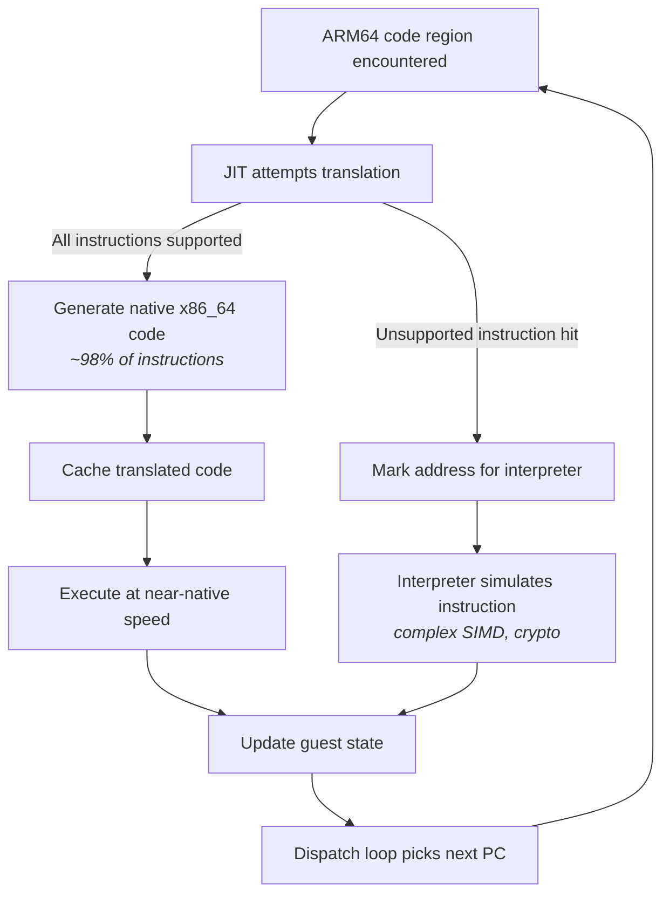

The JIT compiler (called the "Lite Translator") handles the vast majority of instructions — roughly 98% of what a typical app executes. This includes arithmetic, logic, branches, memory loads and stores, and basic SIMD operations.

The interpreter handles the rest: complex or rare SIMD (pairwise operations, widening/narrowing, cross-lane reductions), the crypto families (AES/SHA/SM3/SM4) and IEEE CRC32, and any instruction the JIT hasn't implemented yet. When the JIT encounters an instruction it can't translate, it marks that location for interpreter handling, and the dispatch loop routes future executions of that address to the interpreter. (System calls are *not* in this list — the JIT lowers `SVC` inline; see [§14](#14-syscall-emulation).) Hot regions also get a third, faster path — the heavy optimizer — described in [§6](#6-three-execution-tiers-lite-jit-heavy-optimizer-and-interpreter).

This dual approach gives Digitalis near-native performance for the common case while maintaining correctness for the full ARM64 instruction set.

---

## 3. ARM64 and x86_64 — Two Different Worlds

To understand what Digitalis translates, you need to know what ARM64 and x86_64 binaries look like and why they're so different.

### What's Inside a Native Library

When you write C/C++ code and compile it for Android, the compiler produces a **shared library** (a `.so` file). Both ARM64 and x86_64 libraries on Android use the **ELF** (Executable and Linkable Format) container — think of it as a ZIP file with a standardized layout:

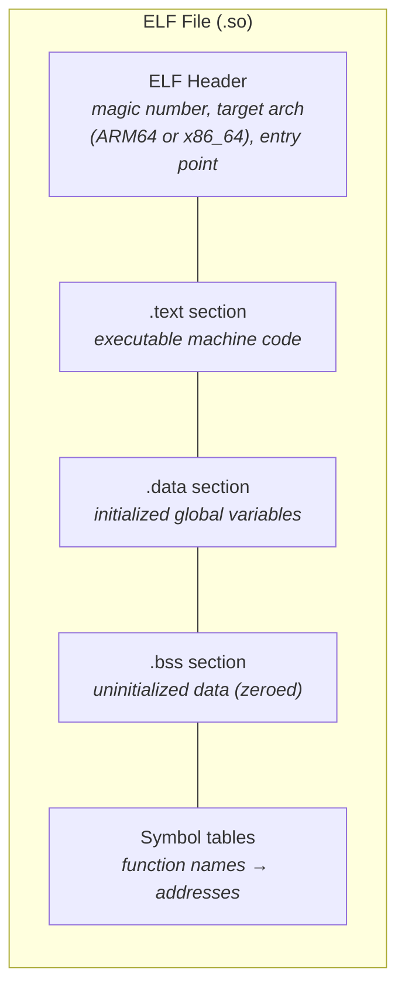

The container format is identical on both architectures. What differs is the machine code inside `.text` — the actual CPU instructions. An ARM64 `.so` has ARM64 instructions; an x86_64 `.so` has x86_64 instructions. They're both ELF files, but a CPU can only execute its own instruction set.

### How Android Packages Them

Android APKs include native libraries under architecture-specific directories:

```
my_app.apk
├── classes.dex          (Java/Kotlin bytecode — runs everywhere)
├── lib/
│   ├── arm64-v8a/       (ARM64 native libraries)
│   │   └── libgame.so
│   └── x86_64/          (x86_64 native libraries)
│       └── libgame.so
└── res/                 (resources)
```

Most apps ship both, but some — particularly games and Vulkan-based apps — ship only `lib/arm64-v8a/`. When an x86_64 emulator encounters an APK with only ARM64 libraries, it has no native code it can run. This is where Digitalis steps in.

### What a CPU Does

Before diving into instruction encoding, let's understand what instructions actually *are*. A CPU is a machine that executes a sequence of very simple operations:

- **Arithmetic**: add two numbers, subtract, multiply, divide
- **Logic**: AND, OR, XOR, shift bits left or right
- **Memory access**: load a value from RAM into a register, store a register value to RAM
- **Branching**: jump to a different location in the code (for loops, if/else, function calls)
- **Comparison**: compare two values and set condition flags (used by branches)

Both ARM64 and x86_64 can do all of these things — they just encode the operations differently, use different register names, and have different rules for how instructions are structured.

### Registers: The CPU's Scratch Paper

Registers are tiny, ultra-fast storage slots built directly into the CPU. Think of them as labeled boxes that each hold one number. Instead of going to main memory (which takes ~100 nanoseconds), reading a register takes less than 1 nanosecond. Every arithmetic operation works on register values.

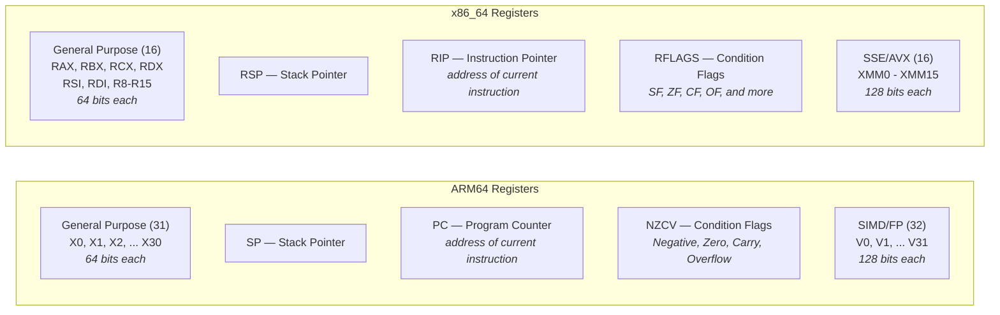

Key differences for Digitalis:

| Feature | ARM64 | x86_64 | Translation Challenge |
|---------|-------|--------|----------------------|
| GP register count | **31** (X0-X30) | **16** (RAX-R15) | Must map 31 into 16 (minus reserved = 13 usable) |
| Register width options | X0 (64-bit) / W0 (32-bit) | RAX / EAX / AX / AL | W-register ops zero-extend; must replicate this |
| SIMD register count | **32** (V0-V31) | **16** (XMM0-XMM15) | Must map 32 into 16 |
| Condition flags | NZCV (4 flags) | RFLAGS (many flags) | Different layout, different semantics for Carry |
| Zero register | X31 = ZR (reads as 0) | No equivalent | Must handle ZR specially in code gen |

The **condition flags** in that table are a small set of bits the CPU sets as a side effect of arithmetic — for example, whether the result was zero or negative — that a following conditional branch then tests. ARM64 groups four of them as **NZCV** (Negative, Zero, Carry, oVerflow); x86_64 keeps its own set in RFLAGS with a different layout, which the translator must reconcile.

The register count mismatch (31 vs 16 for GP, 32 vs 16 for SIMD) is one of the biggest challenges in translation — this is covered in detail in [Section 7](#7-register-allocation).

### Common Operations: Same Intent, Different Encoding

Here are some common operations and how each architecture expresses them. (Reminder: an **immediate** is a constant value written directly into the instruction — the `#42` below — as opposed to a value read from a register.) This shows what the translator must convert:

| Operation | ARM64 Assembly | x86_64 Assembly | Notes |
|-----------|---------------|-----------------|-------|
| Add two registers | `ADD X1, X2, X3` | `mov rcx, rdx` then `add rcx, rsi` | x86_64 needs a copy first (destructive ops) |
| Add immediate | `ADD X1, X2, #42` | `lea rcx, [rdx+42]` or `add` | x86_64 has multiple options |
| Load from memory | `LDR X1, [X2]` | `mov rcx, [rdx]` | Similar concept, different encoding |
| Store to memory | `STR X1, [X2]` | `mov [rdx], rcx` | x86_64 reverses operand order |
| Compare | `CMP X1, X2` | `cmp rcx, rdx` | Both set flags, but flag layouts differ |
| Branch if equal | `B.EQ label` | `je label` | Different condition flag checking |
| Function call | `BL function` | `call function` | ARM64 saves return addr in X30; x86_64 pushes to stack |
| Return | `RET` | `ret` | ARM64 jumps to X30; x86_64 pops from stack |
| System call | `SVC #0` (nr in X8) | `syscall` (nr in RAX) | Different registers, different numbers |

A critical difference: ARM64 uses **three-operand instructions** (`ADD dest, src1, src2` — three registers specified), while x86_64 typically uses **two-operand instructions** (`ADD dest, src` — destination is both source and result). This means the translator often needs an extra `mov` instruction to copy a value before a destructive x86_64 operation.

### ARM64 Instruction Encoding

ARM64 (also called AArch64) uses **fixed-length instructions**: every instruction is exactly 4 bytes (32 bits). Different bit positions within those 32 bits encode the operation type, register numbers, and immediate values.

```
ARM64 instruction stream (every instruction = 4 bytes):
┌──────────┬──────────┬──────────┬──────────┬──────────┐
│ insn @ 0 │ insn @ 4 │ insn @ 8 │ insn @ C │ insn @ 10│
│ 4 bytes  │ 4 bytes  │ 4 bytes  │ 4 bytes  │ 4 bytes  │
└──────────┴──────────┴──────────┴──────────┴──────────┘
Finding the next instruction: always current address + 4
```

Because every instruction is the same size, you always know where the next instruction starts — just add 4 bytes. This makes decoding straightforward.

### x86_64 Instruction Encoding

x86_64 uses **variable-length instructions**: anywhere from 1 to 15 bytes per instruction.

```
x86_64 instruction stream (variable lengths):
┌───────┬──────────────┬────┬──────────┬─────────────────┐
│ 2 B   │ 5 bytes      │ 1B │ 3 bytes  │ 7 bytes         │
│ push  │ mov reg,imm  │nop │ add r,r  │ mov [rdi+8],rax │
└───────┴──────────────┴────┴──────────┴─────────────────┘
Finding the next instruction: must fully decode the current one first
```

An instruction can have optional prefix bytes, one or more opcode bytes (the bytes that name the operation), a ModR/M byte (specifying register/memory operands), a SIB byte (for complex addressing), displacement bytes, and immediate bytes:

```
x86_64 instruction format (all parts optional except opcode):
┌──────────┬────────┬────────┬─────┬──────────────┬───────────┐
│ Prefixes │ REX    │ Opcode │ Mod │ Displacement │ Immediate │
│ 0-4 B    │ 0-1 B  │ 1-3 B  │R/M  │ 0/1/2/4 B    │ 0/1/2/4 B │
│          │        │        │+SIB │              │           │
└──────────┴────────┴────────┴─────┴──────────────┴───────────┘
```

You can't find the start of the next instruction without fully decoding the current one. This is one reason why x86_64 decoders are complex — but Digitalis only *generates* x86_64 (it doesn't decode it), so the JIT's Assembler class handles the encoding complexity.

### Why This Matters for Digitalis

Digitalis reads ARM64 instructions (input) and generates x86_64 instructions (output). Decoding the ARM64 input is easy thanks to fixed-width encoding. But *generating* x86_64 output is more complex — each instruction must be assembled from variable-length components with the correct prefix, opcode, and operand encoding bytes. A single ARM64 instruction often becomes 1 to 5 x86_64 instructions.

Here's a concrete example of what translation looks like:

```
ARM64 (1 instruction, 4 bytes):
    ADD X1, X2, X3        ; X1 = X2 + X3

x86_64 (2 instructions, 6 bytes):
    mov rcx, rdx          ; copy X2's mapped register to X1's mapped register
    add rcx, rsi          ; add X3's mapped register
```

The ARM64 three-operand `ADD` becomes two x86_64 instructions because x86_64's `add` is destructive (it overwrites the destination). The JIT must insert a `mov` to preserve the source value.

### Going Deeper

*This subsection is bit-level reference; skip it on a first read — the mental model above is all you need for the rest of the document.*

#### ARM64 Encoding Anatomy

Consider `ADD X1, X2, X3` — a 64-bit register add. It assembles to the single 32-bit word **`0x8B030041`** (stored little-endian in the `.text` section as the bytes `41 00 03 8B`). Laid out most-significant-bit first, with the decoder's fields underneath:

```
 bit: 31 30 29 │28 27 26 25 24│23 22│21│20 19 18 17 16│15 14 13 12 11 10│ 9  8  7  6  5│ 4  3  2  1  0
 val:  1  0  0 │ 0  1  0  1  1│ 0  0│ 0│ 0  0  0  1  1│ 0  0  0  0  0  0│ 0  0  0  1  0│ 0  0  0  0  1
       sf op S       01011      shift        Rm=00011(X3)      imm6=0         Rn=00010(X2)   Rd=00001(X1)
```

- `sf=1`  : 64-bit operation (0 → 32-bit W-register form)
- `op=0`  : ADD (op=1 would be SUB)
- `S=0`   : don't set flags (this is ADD, not ADDS)

The top-level dispatch reads **bits[28:25] = `0101`** → the Data-Processing-Register group, then narrows within that group to the add/subtract-shifted-register handler. Notice there is no single contiguous "opcode" field; the operation is spread across `sf`, `op`, `S`, and the `01011` class bits.

As a field table, the same word breaks down as:

| Bits | Field | Value | Meaning |
|------|-------|-------|---------|
| [31] | sf | 1 | 64-bit operation |
| [30] | op | 0 | ADD (not SUB) |
| [29] | S | 0 | Don't set flags |
| [28:24] | — | 01011 | Add/subtract shifted register group |
| [23:22] | shift | 00 | No shift |
| [20:16] | Rm | 00011 | Source register X3 |
| [15:10] | imm6 | 000000 | Shift amount 0 |
| [9:5] | Rn | 00010 | Source register X2 |
| [4:0] | Rd | 00001 | Destination register X1 |

There is no single contiguous "opcode" field. ARM64 uses **hierarchical bit-field dispatch**: the top-level encoding group is determined by bits[28:25] (called `op0`), and sub-groups are identified by further bit checks within each group. In Digitalis's decoder (`decoder.h`), this maps directly to a switch on `GetBits<25, 4>()`:

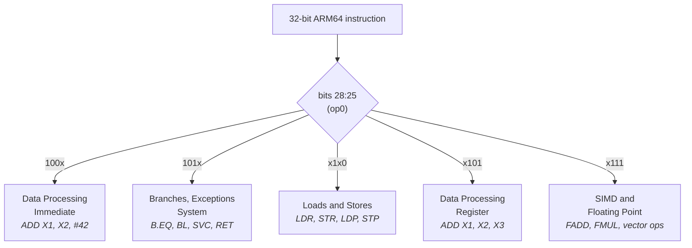

Within each group, further bit checks narrow down to the specific instruction.

#### x86_64 Encoding Anatomy

The same `ADD X1, X2, X3` in x86_64 requires:

- **REX.W prefix** (0x48): indicates 64-bit operand size
- **Opcode** (0x01): ADD r/m64, r64
- **ModR/M byte**: encodes that the source is one register and the destination is another

```
Byte layout:  48  01  F1
              │   │   └── ModR/M: mod=11 (register), reg=110 (rsi), r/m=001 (rcx)
              │   └────── Opcode: ADD r/m64, r64
              └────────── REX.W: 64-bit operand size
```

The JIT's Assembler class handles this encoding via methods like `as_.Addq()`, which assembles the correct byte sequence automatically.

#### Register Naming in Detail

Both architectures allow accessing different portions of the same register:

**ARM64 registers:**
```
X0  [████████████████████████████████████████████████████████████████]  64 bits
W0  [                                ████████████████████████████████]  lower 32 bits
    (writing W0 zero-extends to X0 — upper 32 bits become zero;
     that is: writing the lower 32-bit half automatically fills the
     upper 32 bits with zeros — a rule the translator must reproduce
     exactly, or later 64-bit math would see leftover garbage on top)
```

**x86_64 registers:**
```
RAX [████████████████████████████████████████████████████████████████]  64 bits
EAX [                                ████████████████████████████████]  lower 32 bits
AX  [                                                ████████████████]  lower 16 bits
AL  [                                                        ████████]  lower 8 bits
    (writing EAX zero-extends to RAX; writing AX/AL does NOT zero-extend)
```

The full register comparison:

| ARM64 | Count | x86_64 | Count | Role |
|-------|-------|--------|-------|------|
| X0-X30 / W0-W30 | 31 | RAX-R15 / EAX-R15D (excl. RSP) | 15 | General purpose |
| SP | 1 | RSP (one of 16 total GP) | 1 | Stack pointer |
| PC | 1 | RIP | 1 | Program counter |
| XZR/WZR | 1 | *(none)* | 0 | Zero register (reads as 0, writes discarded) |
| V0-V31 | 32 | XMM0-XMM15 | 16 | SIMD / floating point |
| NZCV | 4 flags | RFLAGS | 6+ flags | Condition flags after arithmetic |

ARM64 has 31 general-purpose registers plus SP; x86_64 has only 16. This mismatch is one of the central challenges in translation (covered in [Section 7](#7-register-allocation)).

#### Endianness and Alignment

Both architectures use **little-endian** byte ordering on Android — meaning a multi-byte number is stored with its least significant byte at the lowest address:

```
Value: 0x0123456789ABCDEF stored at address 0x1000

Address: 0x1000 0x1001 0x1002 0x1003 0x1004 0x1005 0x1006 0x1007
Byte:      EF     CD     AB     89     67     45     23     01
           ↑ least significant                       most significant ↑
```

Both architectures use the same byte order, so data in memory doesn't need conversion — a significant simplification for the translator.

However, ARM64 requires **aligned memory access** for certain instructions (e.g., `LDP`/`STP` pair loads/stores require 8-byte alignment — the address must be a multiple of 8), while x86_64 handles unaligned access transparently (with a performance penalty). The translator must account for this when generating memory access code.

---

**Part II — Architecture Overview**

## 4. The Big Picture

This diagram shows the complete path from an ARM64 app launching to code executing on the host CPU. Each box is a subsystem covered in detail later in this document.

**How to read this diagram:** don't try to absorb every box. Each grey group is one subsystem (App Launch, Dispatch Loop, JIT Path, and so on), and each gets its own section later. Follow the arrows top-to-bottom: an app launches, Android hands it to Digitalis, and the *dispatch loop* becomes the heartbeat that decides — for each chunk of code — whether to run translated x86_64, interpret it, make a system call, or call a host library. Read the plain-English walkthrough just below first; come back to the diagram once the pieces have names.

```mermaid
graph TD
    subgraph Launch["App Launch"]
        APK["ARM64 APK<br/><i>lib/arm64-v8a/*.so</i>"]
        PM["Android PackageManager"]
        ZYG["Zygote forks process"]
        ART["ART detects arm64-v8a"]
        NB["Loads NativeBridge<br/><i>libberberis_arm64.so</i>"]
        INIT["NdktNativeBridge::Initialize()"]
        APK --> PM --> ZYG --> ART --> NB --> INIT
    end

    subgraph Setup["Guest Setup"]
        GL["GuestLoader spawns guest thread"]
        TL["TinyLoader loads ARM64 ELFs<br/><i>linker64, libc.so, app .so</i>"]
        GMS["Guest address space mapped<br/><i>GuestMapShadow</i>"]
        PROXY_REG["Proxy libraries registered<br/><i>/system/lib64/arm64/</i>"]
        GL --> TL --> GMS --> PROXY_REG
    end

    subgraph JNI["JNI Entry"]
        JAVA["Java calls native method"]
        TRAMP["getTrampolineWithJNICallType()"]
        WRAP["WrapGuestJNIFunction()<br/><i>x86_64 ABI → ARM64 ABI</i>"]
        GCALL["GuestCall::RunResInt64()"]
        JAVA --> TRAMP --> WRAP --> GCALL
    end

    subgraph Dispatch["Dispatch Loop — ExecuteGuest()"]
        RPC["Read PC from ThreadState"]
        SIG["Check pending signals"]
        CACHE["TranslationCache lookup<br/><i>atomic load</i>"]
        RUN["berberis_RunGeneratedCode()<br/><i>indirect call to code pointer</i>"]
        STOP{"kEntryStop?"}
        RPC --> SIG --> CACHE --> RUN
        RUN --> STOP
        STOP -->|No| RPC
        STOP -->|Yes| EXIT["Exit loop"]
    end

    subgraph JIT["JIT Path — Lite Translator"]
        DECODE_J["Decoder reads 4-byte instruction"]
        BITFIELD["Bit-field dispatch<br/><i>op0 = bits 28:25</i>"]
        SEM_J["SemanticsPlayer bridges to LiteTranslator"]
        ALLOC["Allocator maps guest regs → host regs<br/><i>13 GP register pool</i>"]
        EMIT["Emit x86_64 machine code"]
        REGION{"Region end?<br/><i>branch / SVC / reg pressure</i>"}
        INSTALL["InstallTranslated() into cache"]
        EXEC_J["Execute translated x86_64 code"]
        DECODE_J --> BITFIELD --> SEM_J --> ALLOC --> EMIT --> REGION
        REGION -->|No| DECODE_J
        REGION -->|Yes| INSTALL
        INSTALL --> EXEC_J
    end

    subgraph Interp["Interpreter Path"]
        DECODE_I["Decoder reads 4-byte instruction"]
        SEM_I["SemanticsPlayer bridges to Interpreter"]
        UPDATE["Update ThreadState directly<br/><i>FaultyLoad/FaultyStore for memory ops</i>"]
        SVC_CHECK{"SVC instruction?"}
        DECODE_I --> SEM_I --> UPDATE --> SVC_CHECK
        SVC_CHECK -->|No| DECODE_I
    end

    subgraph Syscall["Syscall Emulation"]
        RSYS["RunGuestSyscall()"]
        XLATE_NUM["Translate syscall number<br/><i>ARM64 → x86_64</i>"]
        XLATE_ARGS["Convert args and structs"]
        HOST_KERN["Host kernel syscall"]
        RSYS --> XLATE_NUM --> XLATE_ARGS --> HOST_KERN
    end

    subgraph ProxyLib["Proxy Libraries — API Calls"]
        GUEST_API["Guest calls API<br/><i>e.g. vkCreateInstance()</i>"]
        PROXY["Proxy library<br/><i>libberberis_proxy_libvulkan.so</i>"]
        MARSHAL["Convert ARM64 args → x86_64"]
        HOST_LIB["Host library"]
        GPU["GFXStream VkDecoder → Host GPU"]
        GUEST_API --> PROXY --> MARSHAL --> HOST_LIB --> GPU
    end

    subgraph Signals["Signal Handling"]
        PEND["pending_signals_status set"]
        DELIVER["Deliver to guest signal handler"]
        MODIFY["Handler may modify PC"]
        PEND --> DELIVER --> MODIFY
    end

    INIT --> GL
    PROXY_REG --> JAVA
    GCALL --> RPC
    RUN -->|"Not translated"| DECODE_J
    RUN -->|"Interpreted"| DECODE_I
    EXEC_J --> RUN
    SVC_CHECK -->|Yes| RSYS
    HOST_KERN --> UPDATE
    EXEC_J -->|"API call"| GUEST_API
    GPU --> EXEC_J
    MODIFY --> RPC
```

### The Execution Path in Words

When an ARM64 app launches on an x86_64 emulator, Android's runtime (ART) detects that the app's native libraries are ARM64-only. It loads Digitalis through the NativeBridge interface (`libberberis_arm64.so`). Digitalis's guest loader creates an ARM64 environment inside the x86_64 process: it loads the ARM64 dynamic linker, libc, and the app's shared libraries into a guest address space using a minimal ELF loader called TinyLoader.

When Java code calls a native method, the NativeBridge creates a *trampoline* — a small piece of generated glue code that catches a call on one side of the guest/host boundary and re-launches it on the other, converting the calling convention in between. The trampoline converts the call from x86_64 to ARM64 calling conventions and enters the guest execution loop. The dispatch loop (`ExecuteGuest()`) reads the current program counter from the guest CPU state, looks up the address in the translation cache, and jumps to whatever code pointer it finds there — translated native code, an interpreter trampoline, or a not-yet-translated handler.

For untranslated code, the JIT compiler (Lite Translator) kicks in: it decodes ARM64 instructions, maps guest registers to host registers, and emits x86_64 machine code. The translated code is installed in the cache for reuse. For instructions the JIT can't handle (syscalls, complex SIMD), the interpreter takes over, simulating each instruction by directly updating the guest CPU state.

When guest code calls Android APIs (Vulkan, libc, etc.), proxy libraries intercept the call, convert arguments between ARM64 and x86_64 ABIs, and forward to the host library. For Vulkan specifically, calls pass through GFXStream's VkDecoder to reach the host GPU.

### Going Deeper

Three key data structures appear throughout the system:

**`ThreadState`** holds the complete guest CPU state: 32 general-purpose registers (X0-X30 plus SP), 32 SIMD registers (V0-V31), condition flags (NZCV), the program counter, thread-local storage (per-thread private data — the ARM64 `TPIDR_EL0` register points to it), and a pending signal status flag. Every instruction — whether JIT-compiled or interpreted — reads from and writes to this structure.

**`GuestAddr` / `ToHostAddr()` / `ToGuestAddr()`** are type-safety wrappers for address handling. `GuestAddr` is a `typedef` for `uintptr_t`, and the conversion functions are identity `reinterpret_cast`s — guest and host addresses are numerically the same. They exist to prevent accidentally mixing address types in C++ code, not to perform address translation.

**`TranslationCache`** is the central lookup table mapping guest program counter addresses to host code pointers. It's the routing table for the entire system — every dispatch cycle starts with a cache lookup. It supports lock-free reads (via atomic pointer loads) and mutex-protected writes for thread safety.

---

## 5. How an ARM64 App Starts

Before any translation can happen, the ARM64 app has to be *loaded and started* inside an x86_64 process that was never designed to run it. This section walks through exactly how that bootstrap happens.

This is **Path A** — the NativeBridge-driven launch flow used when an ARM64 APK is started by the Android framework. ARM64 guest code can also enter Digitalis a second way (kernel-level `binfmt_misc` dispatch of an ARM64 ELF invoked via `execve()`); see [§17](#17-binfmt_misc-running-guest-binaries-directly) for that path.

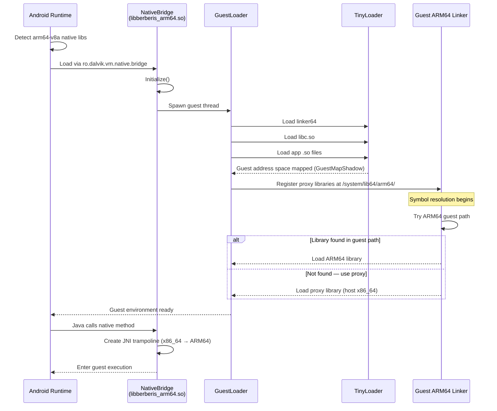

When an ARM64 APK launches on an x86_64 emulator, the Android framework detects that the app's native libraries are in `lib/arm64-v8a/` — an architecture the host can't run natively. Android checks if a NativeBridge is configured. On a Digitalis-enabled emulator, the system property `ro.dalvik.vm.native.bridge` is set to `libberberis_arm64.so`, telling Android to load Digitalis as the translation layer.

Once loaded, Digitalis's guest loader creates an ARM64 execution environment inside the x86_64 process. It uses **TinyLoader**, a minimal ELF loader, to bootstrap three files: `app_process` (the Android process entry point), the guest vDSO (a small shared library the kernel maps into every process to speed up a few common syscalls), and `linker64` (the ARM64 dynamic linker — the component that loads shared libraries and resolves symbols between them). Once `linker64` is running (under translation), it loads `libc.so`, the app's native libraries, and everything else through normal dynamic linking. These ARM64 binaries are loaded into a **guest address space** tracked by `GuestMapShadow`, which maps guest addresses to host memory.

The guest ARM64 linker takes over symbol resolution within the guest world. When it needs to load a library, Digitalis intercedes: it first tries loading from the ARM64 guest paths, and if the library isn't there (because it's a system library that only exists as an x86_64 host version), it loads the corresponding proxy library instead. These proxy libraries live at `/system/lib64/arm64/` and bridge guest API calls to host implementations.

Once the guest environment is ready, the app's native code can execute — either through JNI calls from Java (JNI, the Java Native Interface, is the standard bridge Java uses to call into native C/C++ code) or through direct native activity entry points.

### Going Deeper

The NativeBridge integration is implemented in the `NdktNativeBridge` class, which provides Android's NativeBridge v8 callback interface. Key callbacks include:

- **`Initialize()`**: one-time setup that launches the guest loader thread and registers the translation infrastructure
- **`LoadLibrary()` / `LoadLibraryExt()`**: loads ARM64 .so files into the guest address space, falling back to host libraries when needed
- **`native_bridge_getTrampolineWithJNICallType()`**: creates x86_64 wrapper functions for guest JNI methods. The wrapper uses `WrapGuestJNIFunction()` to generate code that marshals arguments — copies them from where the caller's ABI put them to where the callee's ABI expects them — from the x86_64 ABI (RDI, RSI, RDX...) into the ARM64 ABI (X0-X7), calls `GuestCall::RunResInt64()` to enter guest execution, and converts the return value back.

Digitalis adds several ARM64-specific enhancements to the NativeBridge integration:

- **ARM64 namespace paths**: appends `/system/lib64/arm64/bootstrap:/system/lib64/arm64` to the guest linker's search paths so proxy libraries are discoverable
- **vDSO whitelist**: adds `linux-vdso.so.1` to shared library whitelist for namespace linking, so the TinyLoader-loaded vDSO is visible across namespace boundaries
- **libc mapping protection**: uses `GuestMapShadow::AddProtectedMapping()` to prevent guest code from tampering with libc.so memory mappings

The `GuestLoader` class manages the guest runtime. Its `LinkerCallbacks` struct holds function pointers to the guest linker's exported symbols (`dlsym`, `dlopen`, `create_namespace`, etc.), allowing Digitalis to drive the guest linker programmatically from host code.

---

## 6. Three Execution Tiers: Lite JIT, Heavy Optimizer, and Interpreter

Digitalis has three ways to run ARM64 code, but they come in two families. The first family **runs the code by compiling it** — turning ARM64 into native x86_64 machine code (this is the JIT, and it has two gears: "lite" and "heavy"). The second family **runs the code by simulating it** one instruction at a time (this is the interpreter). This section introduces the two families first, because that split is the core idea; the heavy optimizer — the JIT's faster second gear — is covered at the end of the section once the basics are in place.

The **JIT compiler** (called the "Lite Translator") takes a block of ARM64 instructions and compiles them into native x86_64 machine code. This compiled code runs directly on the host CPU at near-native speed. About 98% of instructions in a typical app go through this path.

The **interpreter** reads ARM64 instructions one at a time and simulates their effects on the guest CPU state. It's slower — each guest instruction requires many host instructions of overhead — but it can handle any instruction, including ones the JIT doesn't support yet.

The choice happens automatically: the dispatch loop tries the JIT first. If the JIT can handle the code, the translated result is cached and runs natively from then on. If the JIT can't handle a particular instruction, that address is routed to the interpreter for all future executions.

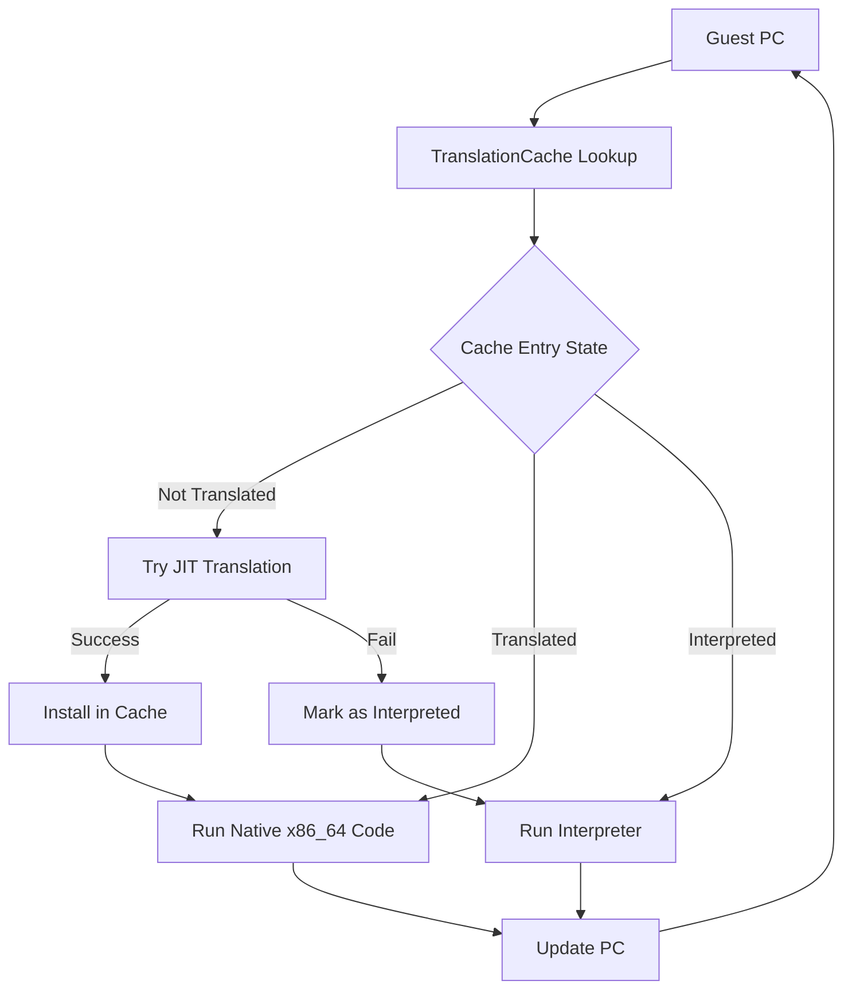

### Going Deeper: The JIT (Lite Translator)

#### Regions

The JIT compiles code in **regions** — sequences of ARM64 instructions compiled together into a single block of x86_64 code:

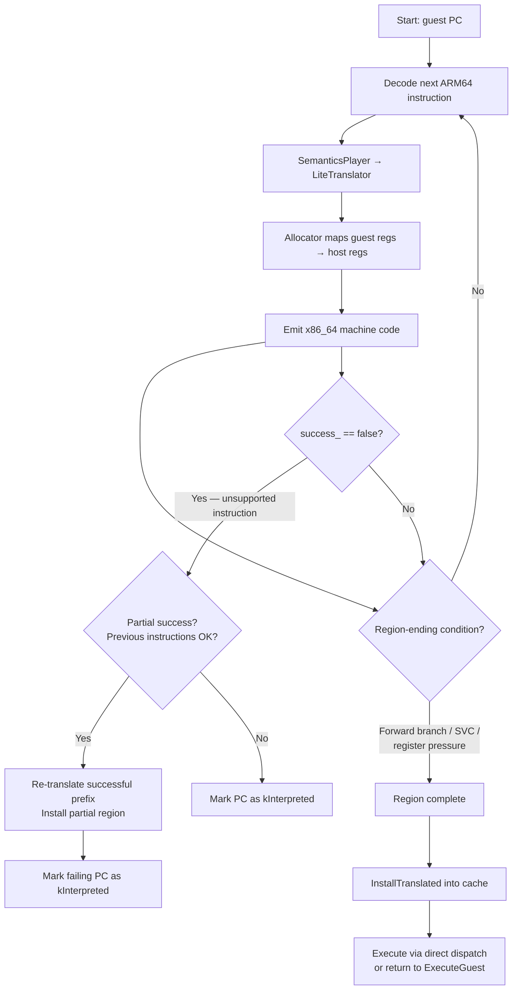

A region has one entry point (the starting PC) and continues until the compiler hits a reason to stop:

- **Unconditional branch or call**: the region ends because the target may not be compiled yet. (Conditional forward branches do *not* end the region — the JIT emits the taken-path exit and continues compiling the fall-through path.)
- **Backward conditional branch**: ends the region to prevent infinite loops without signal checks
- **Register pressure**: the register allocator is running low on available host registers (see `IsGpRegPoolLow()`)
- **Any other stopping point**: any remaining condition that ends a straight-line run of instructions

Note: **SVC (system call)** ends the region but is *not* a bail. The lite translator lowers it inline (`LiteTranslator::Svc()` in `lite_translator.cc`): it flushes mapped guest registers back to `ThreadState`, mirrors the host MXCSR into the guest FPSR, emits a direct call to `RunGuestSyscall`, and direct-dispatches to `pc+4`. A syscall therefore stays inside JIT-compiled code and never round-trips through the interpreter. (Earlier versions *did* bail SVC via `success_ = false`; that marked the SVC's own PC `kInterpreted` so every syscall bounced through the interpreter — see [§14](#14-syscall-emulation).)

The infrastructure for **backward branch inlining** exists — `RegisterGuestPcLabel` creates a label at each guest PC, and `TryLocalBackwardBranch` could jump to it — but this is currently disabled because it would trap the CPU in tight loops without checking for pending signals between iterations.

#### Trampolines

When JIT-compiled code reaches a branch to an address that hasn't been translated yet, it can't just jump there directly. With **direct dispatch** enabled (the default), the JIT emits code that looks up the target address in the translation cache and jumps to whatever code pointer is stored there — this might be already-translated code, a `kEntryNotTranslated` handler that triggers JIT compilation, or a `kEntryInterpret` handler. Control only returns to `ExecuteGuest()` when signals are pending or execution stops.

#### Condition Flags (NZCV)

ARM64 tracks four condition flags after arithmetic operations: **N**egative, **Z**ero, **C**arry, and **O**verflow (NZCV). x86_64 has similar flags but stores them in a different format. The JIT translates between them using a multi-instruction sequence:

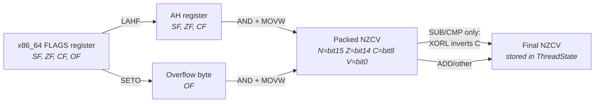

1. **LAHF**: loads x86_64 flags (Sign, Zero, Carry) into the AH register
2. **SETO**: captures the Overflow flag into a separate byte
3. **AND + MOVW**: combines and packs them into ARM64's NZCV layout
4. (For SUB/CMP: an additional **XORL** inverts the carry flag, since ARM64 uses an inverted borrow convention compared to x86_64)

This is implemented in `EmitStoreArmNZCV()` in `lite_translator.h`.

*(The trace below is bit-level reference — skip it on a first read; the summary above is all later sections rely on.)*

**A concrete trace.** Take `SUBS X0, X5, X6` with `X5 = 10`, `X6 = 10` (mapped
to `X5→RSI`, `X6→RDI`, `X0→RBX`). ARM64 defines the result flags as N=0, Z=1
(the result is 0), **C=1** (a subtract sets Carry when there is *no* borrow),
V=0. Here is how the JIT reproduces that:

```
  movq  rbx, rsi        ; copy X5 (=10) into X0's slot
  subq  rbx, rdi        ; rbx = 10 - 10 = 0
                        ;   x86 FLAGS now: ZF=1  SF=0  CF=0  OF=0
                        ;   (x86 CF=1 means borrow; 10-10 has none -> CF=0)

  lahf                  ; AH <- SF ZF  0 AF  0 PF  1 CF   (bit7..bit0)
                        ;   AH = 0  1   0  0  0  0  1  0   = 0x42
  seto  al              ; AL <- OF = 0

  ; AH is the high byte of AX, so its bits land at AX bit15..bit8:
  ;      SF(AH.7) -> bit15 = N
  ;      ZF(AH.6) -> bit14 = Z
  ;      CF(AH.0) -> bit8  = C
  ;      OF(AL.0) -> bit0  = V   (via SETO)
  andl  eax, 0xC101     ; keep only the N,Z,C,V bit positions
                        ;   packed word so far = 0x4000  (only bit14=Z set)
                        ;   -> N=0  Z=1  C=0  V=0
  xorl  eax, 0x100      ; SUB/CMP only: invert bit8 (C), because ARM Carry is
                        ;   the *inverse* of x86 borrow. bit8: 0 -> 1
                        ;   final packed word = 0x4100
                        ;   -> N=0  Z=1  C=1  V=0   -- matches ARM64
  movw  [rbp+flags_off], ax    ; store into ThreadState.cpu.flags
```

The final packed value `0x4100` is exactly ARM64's NZCV for `10 - 10`: Zero
set, Carry set (no borrow). The `xorl` step is the whole reason SUB/CMP need
special handling — without it the translator would report C=0 and any later
`B.CS`/`B.CC` (branch on carry) would take the wrong path.

#### Code Generation Example

Here's how the JIT translates `ADD X1, X2, #5` (add immediate 5 to X2, store in X1). The `AddSubImm` method in `lite_translator.h`:

1. `movq res, src` — copy the source register (mapped X2) into a temp
2. `addq res, 5` — add the immediate value

For 32-bit variants (W registers), it uses `movl` + `addl`, which automatically zero-extends the result to 64 bits. If the instruction sets flags (like `ADDS`), `EmitStoreArmNZCV()` is called after the arithmetic to capture the x86_64 flags into ARM64 NZCV format.

#### The `success_ = false` Pattern

When the JIT encounters an instruction it can't translate (e.g., a complex SIMD operation), it sets `success_ = false`. The region compilation detects this and marks that guest PC as `kInterpreted` in the translation cache. This is critical: without it, the dispatch loop would keep trying to JIT-compile the same unsupported instruction, creating an infinite re-entry loop.

#### Partial-Success Compilation

If the JIT fails partway through a region (say, instruction 8 of 12 is unsupported), it doesn't discard all the work. `TryLiteTranslateAndInstallRegion()` re-translates just the successful prefix (instructions 1-7) and installs that in the cache. The unsupported instruction at position 8 will be marked for the interpreter *lazily* — when the translated prefix finishes executing and the dispatch loop encounters position 8 as `kEntryNotTranslated`, it tries to JIT it, fails on the first instruction, and then marks it as `kInterpreted`. This maximizes the amount of code that runs as native x86_64.

#### Direct Dispatch (Region Chaining)

Normally, when a JIT-compiled region finishes, control returns to the `ExecuteGuest()` dispatch loop, which looks up the next PC in the cache and dispatches again. Digitalis enables an optimization called **direct dispatch** (`allow_dispatch = true` in `translator_x86_64.cc`): translated regions can jump directly to other translated regions through the translation cache, bypassing the return to `ExecuteGuest()`. This eliminates the dispatch overhead between consecutive translated regions — a significant performance improvement.

### Going Deeper: The Interpreter

The interpreter implements the `SemanticsListener` interface, just like the JIT, but instead of generating code, it directly updates the `ThreadState` registers and memory.

**`InterpretInsn()`** handles a single instruction: construct a `Decoder<SemanticsPlayer<Interpreter>>`, decode, execute, advance PC. **`InterpretBatch()`** is a Digitalis optimization that processes a run of consecutive interpreter-handled instructions in a loop, reusing the same Decoder and Interpreter objects (calling `interpreter.Reset()` between them) instead of reconstructing them each time. Object construction — chiefly the templated decoder instantiation — accounts for roughly 60% of per-instruction cost, so batching is about **3x faster**. The batch runs up to a cap (500 instructions) and breaks early the moment the next PC has a JIT (`kLiteTranslated`/`kHeavyOptimized`) cache entry, handing control back so translated code takes over.

All memory accesses in the interpreter use **`FaultyLoad`** and **`FaultyStore`** instead of raw `memcpy`. This is essential: if an ARM64 instruction accesses invalid memory, the fault must be routed to the guest's signal handler, not the host's. Raw `memcpy` would cause a host SIGSEGV that bypasses the guest signal handling entirely. The Faulty variants are hand-written asm stubs whose load/store instruction is registered with the host SIGSEGV recovery table (`AddFaultyMemoryAccessRecoveryCode`); a host fault inside one redirects to a recovery label that returns `is_fault = 1`, letting the interpreter raise a *guest* signal instead of dying.

The interpreter handles the full ARM64 SIMD instruction set that the JIT hasn't implemented: pairwise operations, widening/narrowing conversions, across-lanes reductions, permute and table lookup, compare and select, CRC32 calculations, and scalar floating-point conversions.

#### IC IVAU: Self-Modifying-Code Cache Invalidation

ARM64 has no `flush_icache` syscall. User-space JITs that emit code at run time — PCRE2/sljit, ART, V8, Hermes — signal that they have rewritten an instruction line with the **`IC IVAU, Xt`** cache-maintenance instruction (invalidate instruction cache by virtual address). A binary translator *must* treat this as a translation-cache invalidation of the line at `Xt`: if it doesn't, and the JIT regenerates code at a previously-translated address, Digitalis would keep executing the **stale** translation of the old code. The interpreter's `IcIvau()` calls `InvalidateGuestRange()` to drop the cached translation for that line; the lite translator ends its region at `IC IVAU` (`success_ = false`) so the interpreter performs the invalidation. (`DC CVAU`, data-cache clean, stays a NOP — in a shared-memory in-process model there is nothing to flush.) Missing this was the root cause of the `hello-qt` PCRE2 stale-translation crash.

### The Third Tier: The Heavy Optimizer (Two-Gear JIT)

So far this section has described two ways to run guest code — the lite JIT and the interpreter. There is a **third tier**, and it is the default for the ARM64 backend: a **second-gear optimizing JIT** called the **heavy optimizer** (`heavy_optimizer/arm64/`). The runtime calls the overall arrangement *two-gear* (`TranslationMode::kTwoGear`, set in `translator_x86_64.cc`).

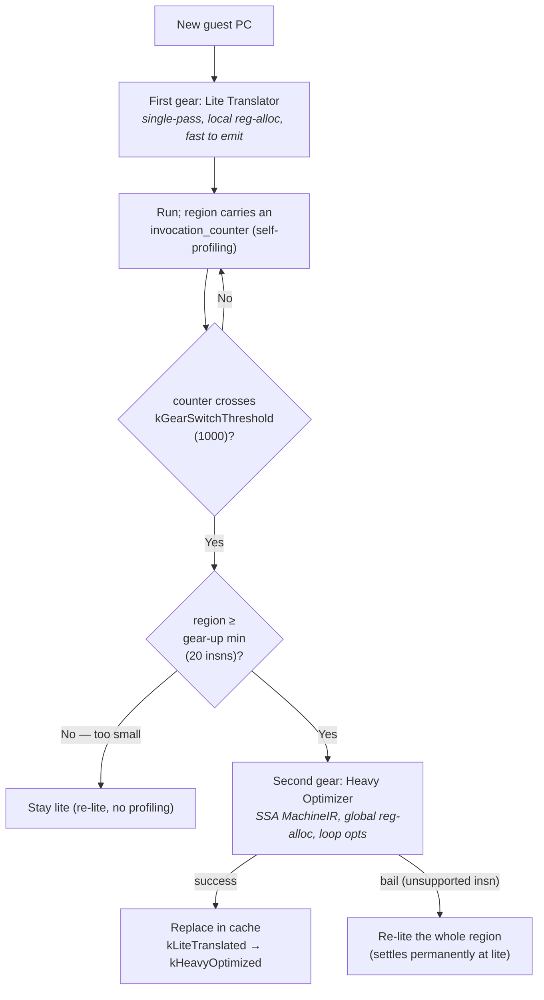

**Why two gears.** The lite translator is the **first gear**: a single-pass translator that emits working x86_64 fast, but with only *local* (per-region) register allocation. For code that runs once or twice that is exactly right — spend as little time translating as possible. Code that runs *repeatedly* — the inner loops where a program spends most of its time — justifies more translation effort, which is what the heavy optimizer invests.

**How gear-up is triggered.** When two-gear mode is active, the lite translator emits a small **self-profiling** counter at region entry (`enable_self_profiling = true`, `counter_location = &entry->invocation_counter`). Each execution increments it; when it crosses `kGearSwitchThreshold` (**1000**), the generated code calls back into `berberis_HandleLiteCounterThresholdReached`, which re-translates the region in second gear via `LockForGearUpTranslation` (the entry must still be `kLiteTranslated`). Gear-up is gated to regions of at least `kDefaultGearUpMinInsns` (**20** guest instructions, overridable via `BERBERIS_GEARUP_MIN_INSNS`) — tiny loops, where the optimization wouldn't recover its own cost, stay lite and are never regressed.

**One region, geared up.** Concretely, suppose a 34-instruction loop body sits at guest PC `0x…a400`:

```mermaid
sequenceDiagram
    participant D as Dispatch Loop
    participant C as TranslationCache
    participant L as Lite region code
    participant H as Heavy Optimizer

    Note over C: PC 0x…a400 — 34-instruction loop body
    D->>C: lookup 0x…a400 → kEntryNotTranslated
    C->>L: lite-translate (single pass, local reg-alloc)
    Note over L: region entry emits invocation_counter++
    loop iterations 1..999
        D->>L: run region; counter++
    end
    Note over L: iteration 1000 — counter hits kGearSwitchThreshold (1000)
    L->>H: berberis_HandleLiteCounterThresholdReached
    Note over H: region is 34 insns ≥ 20 (gear-up min) → proceed
    H->>C: install heavy region; kLiteTranslated → kHeavyOptimized
    D->>C: next lookup 0x…a400 → heavy code
    Note over D: all later runs execute globally-allocated x86_64
```

The first 1000 executions run the fast-to-emit lite version; the 1000th triggers a one-time re-translation into the heavy tier, and every execution after that runs the globally register-allocated version. Had the same loop been only 12 instructions (< 20), it would have stayed lite forever — the optimization couldn't recover its own translation cost — which is exactly the "never regressed" guarantee.

**The heavy pipeline — an SSA machine IR.** Where the lite translator emits x86_64 bytes directly per instruction, the heavy optimizer first lowers a whole region into an intermediate representation (IR) — a neutral, instruction-set-agnostic description of what the region computes — and then runs an optimizing backend over it. The IR is kept in **SSA form** (static single assignment: every value is written exactly once, so each use points back to a single unambiguous definition), which makes it cheap for the optimizer to see where a value comes from and when it dies. The concrete IR is `x86_64::MachineIR`:

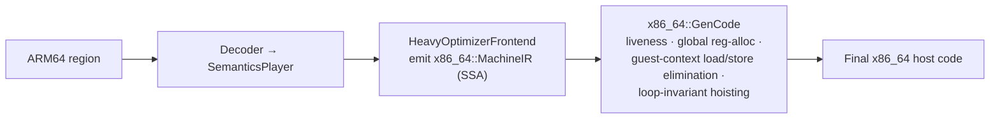

The frontend builds IR through a `Gen<Insn, kSSA>(...)` helper (which allocates fresh SSA output vregs and inserts `PseudoCopy` to preserve single-assignment form). Scalar floating-point goes through an **intrinsic layer** (`inline_intrinsic.h` / `call_intrinsic.h`): a binary op like `FADD`/`FMUL` is matched against a binding table and lowered to a single host SSE instruction when the rounding mode is host-default, or otherwise emitted as a call to a shared C++ intrinsic. Because the IR is SSA and spans the whole region, `x86_64::GenCode` can do **global** register allocation using **linear scan** — a fast algorithm that sweeps once over each value's live range (the span from its definition to its last use) and assigns host registers so that values whose live ranges don't overlap can share one register. Spanning the whole region also lets it eliminate redundant guest-context (ThreadState) loads/stores within the region and hoist loop-invariant guest-register/flag traffic out of loops — none of which the per-instruction lite translator, which only ever sees one region-local instruction at a time, can do.

**What happens on an unsupported instruction.** The heavy frontend covers integer ALU + NZCV flags, branches (including in-region loops), loads/stores (with TBI masking + fault recovery), CSEL/CCMP, scalar FP (via the intrinsic layer), a subset of NEON integer, SIMD/FP load-store, SIMD modified-immediate + DUP, load/store-exclusive, division & wide-multiply, REV/CLS/SBFIZ, ADRP, and `MRS TPIDR_EL0`. For anything else, a frontend callback calls `Undefined()` — which sets `success_ = false`, appends an exit terminator, and turns subsequent IR-emitting helpers into no-ops so nothing lands in the dead block. The runtime then simply **re-lite-translates the region**: the result is still correct, just without the second-gear speedup, and the region settles permanently at the lite tier. A heavy bail is therefore *never* an `Undefined arm64 instruction` crash — only a missed optimization.

This last point is a binding project rule: when you add a *common* instruction, cover it in **every** tier where it is reachable. A heavy bail on something like `ADRP` or `MRS TPIDR_EL0` (which appear in nearly every real-app region) silently kept the second gear from ever engaging on real workloads until those were promoted. See [unsupported-opcodes.md](unsupported-opcodes.md) for the per-tier instruction status.

**Measured result.** The heavy optimizer is neutral-or-faster than the lite translator across microbenchmarks and about **2x faster** on a register-pressure kernel where global allocation pays off most.

---

## 7. Register Allocation

Registers are the fastest storage in a CPU — accessing a register is roughly 100x faster than accessing main memory. When the JIT can keep a guest value in a real host register instead of loading and storing it from memory, the translated code runs dramatically faster. This makes register allocation one of the most performance-critical parts of the translator.

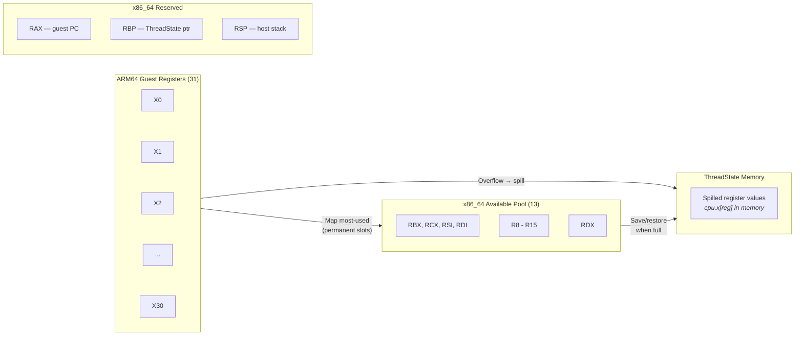

The problem: ARM64 has 31 general-purpose registers (X0-X30) plus SP. x86_64 has only 16, and several are reserved for Digitalis's own use:

| Register | Reserved For |
|----------|-------------|
| RAX | Guest program counter |
| RBP | Pointer to ThreadState struct |
| RSP | Host stack pointer |

That leaves **13 registers** available for mapping guest registers. The JIT must map the most-used ARM64 registers to these 13 host registers. When it needs more, it **spills** — saves a register's value to the `ThreadState` struct in memory, frees the slot, and reloads the value later when needed. Think of the 13 registers as a small desk with room for 13 sheets of paper: when you need a 14th, you file one back in the drawer (memory), work on the new sheet, and pull the filed one back out when you need it again. Filing and retrieving costs time, so the translator avoids it when it can. Spilling is correct but slower.

The register pool, in allocation order: **RBX, RCX, RSI, RDI, R8-R15, RDX**. The order is intentional: RCX is placed early so it gets permanent mappings (it needs save/restore around variable-shift instructions since x86_64 requires the shift count in CL). RDX is placed last so it's typically used as a temporary (easier to save/restore around DIV/MUL, which use RDX:RAX).

### Going Deeper

The `Allocator<RegType>` class manages register mappings. When `GetReg()` encounters a guest register without a mapping, it calls `GetMappedRegisterOrMap()` to allocate a host register slot, then loads the guest value from ThreadState memory: `[rbp + offset_of(cpu.x[reg])]`.

**Permanent vs temporary mappings.** Permanent mappings persist across all instructions in a region — they're used for guest registers that appear repeatedly. Temporary mappings are per-instruction scratch registers, allocated from the pool end in reverse order (so they don't collide with permanent mappings allocated from the front) and released after each instruction via `FreeTemps()`. The pool order matters: `RCX` sits early (so it tends to get a permanent mapping rather than being a scratch) but is saved/restored around variable-shift instructions that need `CL`; `RDX` sits last and is saved/restored around `DIV`/`MUL`.

**Spill-to-temp before early termination.** When a guest register needs a host slot but the permanent pool is exhausted, the JIT does *not* immediately cut the region. It first falls back to a **temp-based access**: allocate a temporary, load the guest value from `ThreadState` for the read (or write it back for a store). Only when the pool is so tight that even a temp can't be had does `IsGpRegPoolLow()` fire and the JIT end the region cleanly (rather than risk cascading spills). Spilling first keeps regions long; cutting is the last resort.

**PUSH/POP vs SUB/ADD.** When saving registers before reading condition flags (via LAHF), the JIT must use PUSH/POP or LEA for stack adjustment — never SUB RSP or ADD RSP. The reason: SUB and ADD clobber x86_64's FLAGS register, which would destroy the very flags that LAHF needs to read. PUSH/POP don't affect FLAGS.

**SIMD register allocation** uses a separate pool, mapping ARM64's V0-V31 (128-bit SIMD registers) to x86_64's XMM0-XMM15.

#### A Worked Example

Take a simple summation loop — add `n` 64-bit values from an array:

```asm
; int64_t sum(const int64_t* p, int64_t n)   X0=p, X1=n -> result in X0
        MOV  X2, #0            ; X2 = running sum
loop:
        LDR  X3, [X0], #8      ; X3 = *p ; p += 8   (post-increment)
        ADD  X2, X2, X3        ; sum += X3
        SUBS X1, X1, #1        ; n-- , set NZCV
        B.NE loop              ; backward conditional branch -> ends the region
        MOV  X0, X2
        RET
```

The loop body — from `loop:` to the backward `B.NE` — is one region (the branch
target makes `loop:` a region start). It references four distinct guest
registers. The allocator hands out host slots from the front of the pool **in
the order each guest register is first touched**, so the region needs no spill
at all:

| Guest register | Role         | Host register | Pool slot |
|----------------|--------------|---------------|-----------|
| X0             | array ptr    | RBX           | 0         |
| X3             | loaded value | RCX           | 1         |
| X2             | running sum  | RSI           | 2         |
| X1             | counter      | RDI           | 3         |

Four guest registers, four host registers, **9 of the 13 pool slots left
unused** — the common case. Every iteration runs entirely out of host
registers; nothing touches `ThreadState` memory. (`X0`, `X1`, `X2` are read
from / written back to `ThreadState` only at region entry and exit.)

Spilling only begins when a region keeps **more than 13** guest registers live
at once. The pool fills front-to-back:

```
slot:  0    1    2    3    4   5   6   7    8    9   10   11   12
reg:  RBX  RCX  RSI  RDI  R8  R9  R10 R11  R12  R13  R14  R15  RDX
       X0   X3   X2   X1  X4  X5   X6  X7   X8   X9  X10  X11  X12   <- 13 mapped
                                                                     X13 -> no slot
```

The 14th distinct guest register (`X13` above) finds the permanent pool empty.
The JIT does **not** cut the region — it falls back to a *temp-based access*:
for each use of `X13` it allocates a scratch register and loads the value from
`[rbp + offsetof(ThreadState, cpu.x[13])]` (or stores it back for a write).
Only if even a temp can't be had does the region end early. This is why keeping
hot values in the *first* few registers a function uses is what makes
translated code fast: they win the permanent slots; late-referenced registers
pay the memory round-trip.

---

**Part III — Subsystem Deep Dives**

## 8. Decoding ARM64 Instructions

Before Digitalis can translate or interpret an ARM64 instruction, it needs to figure out what that instruction *is*. This is the decoder's job.

ARM64 instructions are always 4 bytes. The decoder reads these 32 bits and extracts the operation type, register operands, immediate values, and other fields. It then passes this structured information to either the JIT compiler or the interpreter through a bridge layer called the **SemanticsPlayer**.

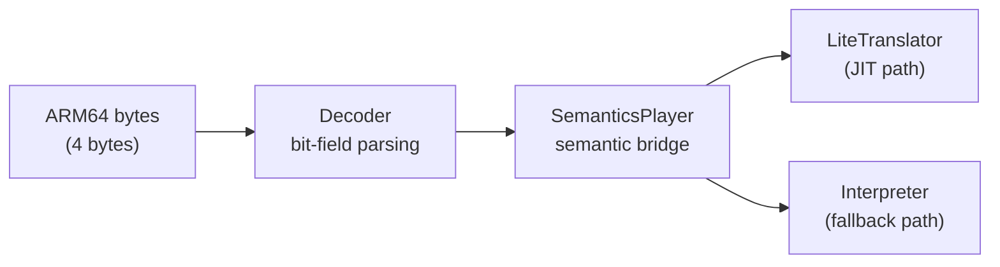

In plain terms: one decoder does the bit-parsing work, and a thin "player" layer hands the decoded result to whichever engine is running — the JIT or the interpreter. (The `Decoder<…>` notation below is C++ template syntax for wiring those two choices together at compile time; the shape of the names matters more than the syntax.)

The architecture uses C++ templates to avoid runtime dispatch overhead. `Decoder<InsnConsumer>` is parameterized by its handler type. For JIT compilation, the chain is `Decoder<SemanticsPlayer<LiteTranslator>>`. For interpretation, it's `Decoder<SemanticsPlayer<Interpreter>>`. The SemanticsPlayer translates raw decoded fields into semantic operations (like "add these two registers" or "load from this address"), handling ARM64 quirks along the way.

### Going Deeper

#### Bit-Field Dispatch

The decoder routes instructions through a hierarchy of bit checks. The top-level dispatch uses bits[28:25] (`op0`), which divides all ARM64 instructions into five groups:

| op0 pattern | Group |
|-------------|-------|
| `100x` | Data Processing — Immediate |
| `101x` | Branches, Exceptions, System |
| `x1x0` | Loads and Stores |
| `x101` | Data Processing — Register |
| `x111` | SIMD and Floating Point |

Within each group, further bits narrow down the specific instruction. For example, bit 29 distinguishes different load/store types, and bit 24 distinguishes single-structure from multi-structure SIMD operations. (For a fully worked word — `ADD X1, X2, X3` = `0x8B030041` traced bit-by-bit into its Data-Processing-Register group — see [ARM64 Encoding Anatomy](#3-arm64-and-x86_64--two-different-worlds) in Section 3.)

**Dispatch order matters.** Multiple instruction groups share encoding prefixes. Missing a distinguishing bit check routes instructions to the wrong handler *silently* — the decoder produces a valid-looking but semantically wrong result. No crash, just incorrect behavior that may not manifest until a memory boundary is hit. This has been a recurring source of bugs in Digitalis development.

#### The X31 Special Case

ARM64's register 31 is context-dependent: in some instructions it means **SP** (the stack pointer), and in others it means **ZR** (the zero register, which always reads as zero and discards writes). The SemanticsPlayer handles this with two distinct methods: `GetRegOrZero()` (returns zero for register 31) and `GetRegOrSp()` (returns the stack pointer for register 31). The caller chooses which method based on the instruction semantics, so the JIT and interpreter don't need to worry about it.

#### Instruction Categories

The decoder handles these ARM64 instruction categories:

- **Logical**: AND, ORR, EOR, BIC (with immediate and register forms)
- **Arithmetic**: ADD, SUB, ADC, SBC (with optional flag-setting variants)
- **Data processing**: UDIV, SDIV, variable shifts (LSLV, LSRV, ASRV, RORV)
- **Memory**: LDR, STR (with multiple addressing modes: immediate offset, register offset, pre/post-index)
- **Control flow**: B, BL, B.cond, RET, CBZ, CBNZ, TBZ, TBNZ
- **SIMD/FP**: vector arithmetic, permute, across-lanes, widening, narrowing
- **CRC32**: CRC32B, CRC32H, CRC32W, CRC32X and their "C" variants (Digitalis-specific addition)
- **Crypto extensions**: AES, SHA1/SHA256/SHA512, and the SM3/SM4 (Chinese national-standard) instruction groups
- **Newer-extension decode**: I8MM dot/matmul (`USDOT/SUDOT/USMMLA`), FP↔int round-to-precision (`FRINT32X/64X/32Z/64Z`), MTE tag ops (`ADDG/SUBG/LDG/STG/…`), and the RNG system registers (`RNDR/RNDRRS`), plus `BRK`

---

## 9. Translation Cache and Dispatch Loop

The translation cache and dispatch loop are the central coordination mechanism that ties everything together.

Every time Digitalis finishes running a block of code — whether JIT-compiled or interpreted — it needs to figure out what to do next. The **translation cache** is a lookup table mapping guest PC addresses to host code pointers. The **dispatch loop** (`ExecuteGuest()`) runs forever: read the current PC, look it up in the cache, jump to the code pointer there, repeat.

This is an **indirect-call dispatch**, not a switch statement. The cache stores raw code pointers, and `berberis_RunGeneratedCode()` jumps to whatever address is stored there:

```mermaid
graph TD
    A["Read PC from ThreadState"] --> B{"Pending signals?"}
    B -->|"Yes"| C["Deliver signals to guest handler<br/><i>handler may modify PC</i>"]
    C --> A
    B -->|"No"| D["cache→GetHostCodePtr PC → load code pointer"]
    D --> E{"Code pointer value?"}
    E -->|"kEntryStop"| F["Exit dispatch loop"]
    E -->|"kEntryNotTranslated"| G["Trampoline triggers JIT<br/>TranslateRegion"]
    E -->|"kEntryInterpret"| H["Trampoline invokes<br/>InterpretBatch"]
    E -->|"kEntryTranslating"| I["Another thread is<br/>translating — retry"]
    E -->|"Translated code address"| J["berberis_RunGeneratedCode<br/><i>execute native x86_64</i>"]
    G --> K["Code installed in cache"]
    K --> A
    H --> A
    I --> A
    J --> A
```

The only explicit check in the loop is for `kEntryStop`, which breaks the loop when the guest thread exits. All other routing happens through the indirect call to the code pointer.

Each guest address moves through a small life cycle in the cache. The diagram below reads left-to-right in time: an address starts *not translated*, gets compiled to native code the first time it runs, and — if it turns out to be a hot loop — is later re-compiled by the faster "heavy" optimizer.

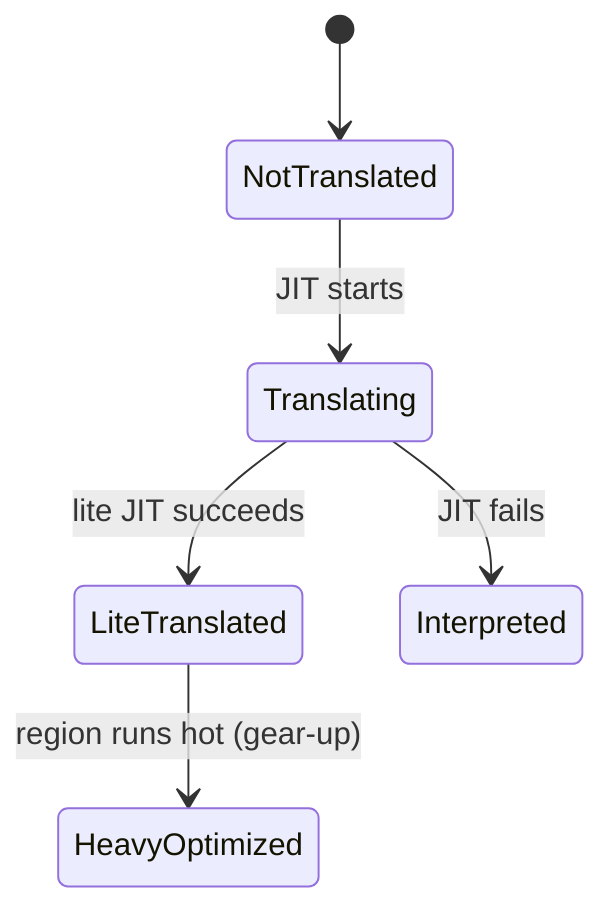

A lite-translated region that keeps executing eventually gears up: once its invocation counter crosses the threshold, the **heavy optimizer** re-translates it with global register allocation and loop optimizations and replaces the lite version in the cache (a `LiteTranslated → HeavyOptimized` transition). This is the default for ARM64 — see [Section 6](#the-third-tier-the-heavy-optimizer-two-gear-jit) and the [RISC-V/ARM64 comparison](#the-two-gear-translation-pipeline) for details.

When translated code is cached, it runs repeatedly without any translation overhead. This is why JIT compilation pays off even though it's expensive the first time: hot loops execute the cached native code thousands of times.

### Going Deeper

The `TranslationCache` class uses **lock-free reads** (atomic pointer loads) for the fast path and **mutex-protected writes** for installing new translations. This means the dispatch loop can read code pointers without any locking overhead.

**Dispatch loop detail.** The actual `ExecuteGuest()` loop (in `execute_guest.cc`) is remarkably simple:

1. Read `pc` from `ThreadState`
2. Check `ArePendingSignalsPresent()` — if signals are pending, deliver them (signal handlers may modify PC)
3. Load the code pointer: `cache->GetHostCodePtr(pc)->load()`
4. If the code pointer equals `kEntryStop`, break
5. Call `berberis_RunGeneratedCode(state, AsHostCode(code))`
6. Go to step 1

**Host-code entry point addresses** are the internal "signpost" values the cache stores instead of real code when an address isn't ready to run yet — you can skim the table; only `kEntryStop` (thread is exiting) and `kEntryNotTranslated` (needs compiling) matter for the big picture:

| Entry Point | Purpose |
|-------------|---------|
| `kEntryInterpret` | Route to interpreter |
| `kEntryNotTranslated` | Trigger JIT translation attempt |
| `kEntryTranslating` | Another thread is translating this address |
| `kEntryStop` | Exit the dispatch loop |
| `kEntryNoExec` | Non-executable address |
| `kEntryExitGeneratedCode` | Return from generated code |
| `kEntryInvalidating` | Entry being invalidated |
| `kEntryWrapping` | Entry being wrapped |

**`GuestCodeEntry::Kind`** is a separate classification for cache entries (not to be confused with the trampoline addresses above), and it is what records which *tier* produced a given region:

| Kind | Meaning |
|------|---------|
| `kInterpreted` | PC runs the interpreter (the entry points at the `kEntryInterpret` stub) |
| `kLiteTranslated` | a first-gear lite-JIT region is installed |
| `kHeavyOptimized` | a second-gear heavy-optimizer region is installed (geared up from lite) |
| `kGuestWrapped` | a guest function fronted by a host-callable adapter (`WrapGuestFunction`) |
| `kHostWrapped` | a host function re-exported to the guest (a proxy trampoline) |
| `kUnderProcessing` | locked: being translated, wrapped, or invalidated by some thread |
| `kSpecialHandler` | non-executable / unpredictable address with a dedicated handler |

Each entry also carries an `invocation_counter` — the hotness counter the two-gear mechanism reads to decide when to gear a `kLiteTranslated` region up to `kHeavyOptimized`.

**Thread safety.** When multiple threads hit the same untranslated address simultaneously, the cache's state machine prevents duplicate work: only one thread transitions the entry from `NotTranslated` to `Translating`, and the others wait.

**Eager translation.** Both ARM64 and RISC-V paths pass a threshold of 0 to `AddAndLockForTranslation`, meaning every code region is translated (with the lite translator) on first encounter. The separate `kGearSwitchThreshold` governs **gear-up** — re-optimizing a hot lite-translated region with the heavy optimizer — not the initial translation decision.

---

## 10. Signal Handling and Fault Recovery

When translated code crashes — accesses invalid memory, divides by zero, or hits an illegal instruction — the host OS delivers a **signal** — an asynchronous "something went wrong" notification from the kernel (SIGSEGV = bad memory access, SIGFPE = bad arithmetic like divide-by-zero, SIGILL = illegal instruction). But the crash happened in *guest* code, so the signal must be delivered to the *guest's* signal handler, not the host's. This is one of the trickiest parts of binary translation.

### The Problem

Consider this scenario:

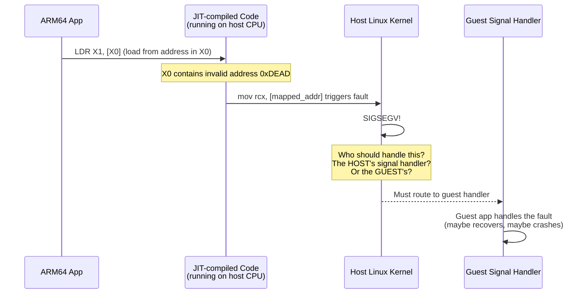

If Digitalis didn't intercept the signal, the host process would crash with a SIGSEGV, and the guest app would never get a chance to handle it. Many apps install signal handlers for legitimate reasons (crash reporting, memory-mapped I/O, custom allocators).

### How Fault Recovery Works

The **`instrument/`** directory provides crash hooks, and **`guest_os_primitives/`** manages signal delivery. Here's the flow:

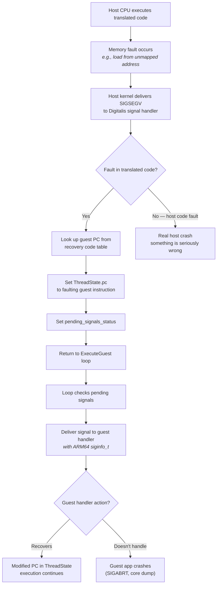

### FaultyLoad / FaultyStore

In the **interpreter**, every memory access uses `FaultyLoad` and `FaultyStore` instead of raw `memcpy`. These are implemented as inline assembly with **statically registered recovery labels** — the recovery addresses are registered once during initialization via `AddFaultyMemoryAccessRecoveryCode()`, not dynamically before each access.

When a fault occurs during a FaultyLoad/FaultyStore:
1. The host signal handler looks up the faulting instruction address in the recovery map
2. It finds the matching recovery label (registered at init time)
3. It redirects execution to the recovery code, which sets a fault flag in the return value
4. The interpreter checks the flag and routes the fault to the guest signal handler

Without these, a raw `memcpy` in the interpreter would cause a host SIGSEGV with no way to identify which guest instruction triggered it or deliver the signal to the guest handler.

### Recovery Code in JIT-compiled Regions

JIT-compiled code is trickier — there's no per-instruction interpreter state to recover from. Instead, every JIT-generated load/store instruction is paired with a **recovery code stub**:

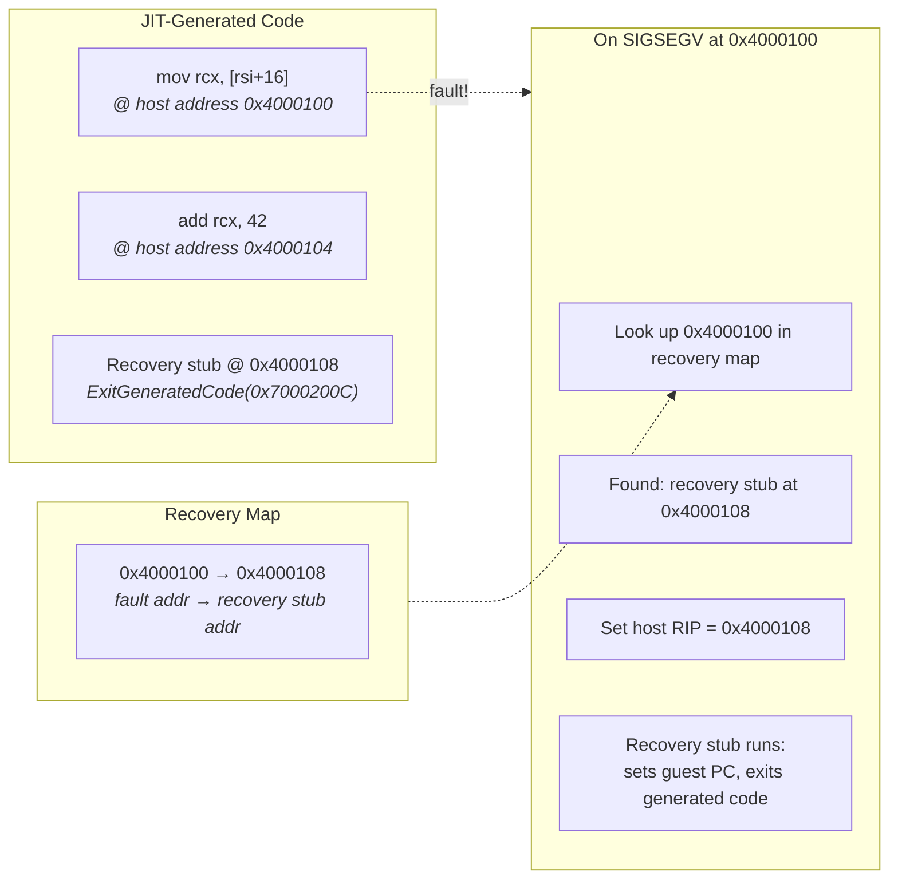

When the JIT emits a load or store, it also emits a small recovery stub that knows the corresponding guest PC. The recovery map stores `{fault_address → recovery_stub_address}`. On fault, the signal handler redirects execution to the recovery stub, which calls `ExitGeneratedCode` with the correct guest PC embedded in it.

### The Signal Delivery Chain

After the fault is caught and the guest PC is identified, the signal must be delivered to the guest app. Digitalis uses a **synchronous call** approach rather than the kernel's signal-frame mechanism:

1. **Save guest CPU state**: `GuestContext::Save` copies the current `CPUState` (registers, flags, PC) into a `Guest_ucontext` structure
2. **Convert signal info**: the host `siginfo_t` fields are copied with minor fixups (e.g., `si_addr` for SIGILL/SIGFPE)
3. **Call guest handler synchronously**: `GuestCall::RunVoid` invokes the guest's registered signal handler with the signal number, siginfo, and context as arguments — this runs as normal translated ARM64 code
4. **Restore guest CPU state**: when the handler returns, `GuestContext::Restore` restores the (possibly modified) CPU state from the context
5. **Resume execution**: the dispatch loop continues from wherever the restored PC points

#### Worked example: a guest bad-address load

Guest ARM64 runs `LDR X1, [X0]` with `X0 = 0xDEAD` (an unmapped address):

1. In the JIT region this is `mov rcx, [rsi]` (X0 mapped to RSI). RSI holds
   `0xDEAD`, so the **host** CPU raises **SIGSEGV** at that host instruction.
2. The translator's fault handler (installed for SIGSEGV/SIGBUS at startup)
   looks up the faulting host address in the recovery map, finds the recovery
   stub paired with this load, and redirects host execution to it.
3. The stub has the **guest PC of the `LDR`** baked in: it sets the guest PC in
   `ThreadState` to that instruction, queues the signal
   (`pending_signals_status`), and exits generated code.
4. Back in the dispatch loop, pending signals are processed:
   - the guest CPU state is packaged into an ARM64-layout `ucontext`
   - the host `siginfo_t` is converted to ARM64 layout with **`si_addr = 0xDEAD`**
   - the guest's registered SIGSEGV handler runs *as translated ARM64 code*,
     receiving `(signo=11, siginfo, ucontext)`
5. If the guest handler returns, the (possibly modified) CPU state is restored
   and dispatch resumes at the guest PC. If the app installed **no** handler,
   the signal is re-raised with the default action; debuggerd then dumps a
   tombstone showing the **guest** registers X0-X30 — with X0 = 0xDEAD — not
   the host registers.

### Claiming the Host Fault Signals

For any of the above to work, Digitalis must be the host-side owner of the fault signals. `ClaimHostFaultSignals()` installs Digitalis's `HandleFaultForRecovery` handler for `SIGSEGV` and `SIGBUS` at startup (with `SA_SIGINFO | SA_RESTART | SA_NODEFER`). When one of these fires, the handler looks up the faulting *host* PC in the recovery map; if a recovery entry exists it redirects host execution there and queues the signal for guest delivery, otherwise it re-raises with `SIG_DFL` to terminate. Guest-registered handlers for other signals go through a separate path (`HandleHostSignal`), and the NativeBridge `getSignalHandler()` callback hands this handler to the framework so debuggerd can cooperate.

While claiming those signals, the arm64 build also sets a **baseline `SIGALRM` disposition of `SIG_IGN`** (ignore the signal) — but *only* if `SIGALRM` is still `SIG_DFL` (the default action) at that moment. This neutralizes a specific anti-tamper trick: some integrity SDKs (Kuaishou's was the case that surfaced it) arm a handler-less `SIGALRM` "deadman" timer, expecting their integrity check to finish before it fires and counting on the timer to kill the process if the check is being slowed down or tampered with. Under translation the check legitimately runs slower, loses the race, and the kernel would deliver `SIGALRM` with no handler installed — terminating the app.

Defaulting the host disposition to *ignore* discards a handler-less fire harmlessly. The instant the guest installs its own `SIGALRM` handler via `rt_sigaction`, that real handler replaces the ignore, so legitimate timer use is unaffected — the baseline only ever swallows a fire that would otherwise have had no handler at all.

### Pending Signals

The dispatch loop checks for pending signals on every iteration:

```c
// In ExecuteGuest() — simplified:
for (;;) {
    if (ArePendingSignalsPresent(*state)) {
        thread->ProcessPendingSignals();  // deliver to guest handler
    }
    auto code = cache->GetHostCodePtr(pc)->load();
    berberis_RunGeneratedCode(state, code);
}
```

This means signals are only delivered at region boundaries — not in the middle of a translated region. This is safe because ARM64 guarantees that signals are delivered between instructions, not during them. The dispatch loop naturally provides this boundary.

---

## 11. Machine Code Generation

The JIT (Lite Translator) doesn't execute ARM64 instructions — it *generates x86_64 instructions*. Understanding how raw machine code bytes are produced and made executable is key to understanding the translator.

### The Assembler: Building x86_64 Bytes

The `assembler/` directory contains an x86_64 assembler — a class that knows how to encode every x86_64 instruction as a sequence of bytes. When the JIT calls `as_.Addq(rcx, rsi)`, the assembler produces the bytes `48 01 F1`:

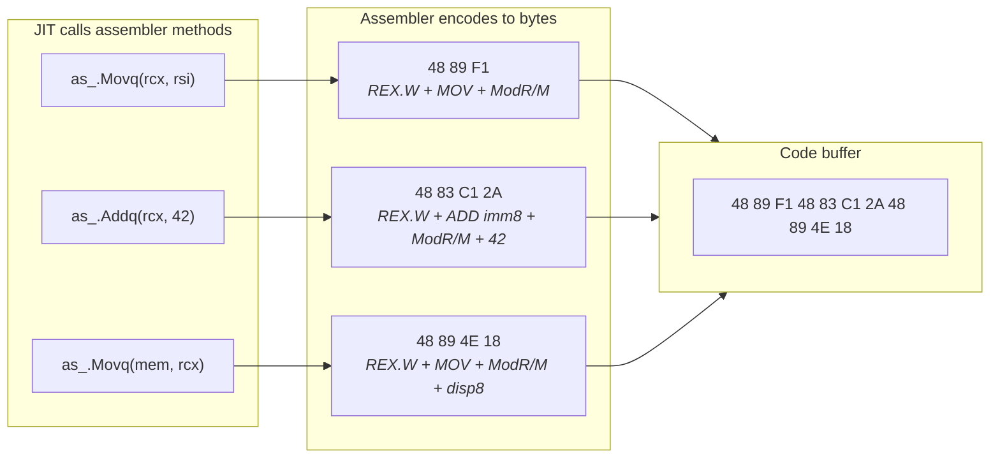

The assembler handles all the complexity of x86_64 encoding: REX prefixes for 64-bit operations, ModR/M bytes for register/memory operands, SIB bytes for complex addressing, and choosing between 8-bit, 32-bit, and 64-bit immediates.

**`MacroAssembler`** (`intrinsics/all_to_x86_64/`) sits on top of the raw assembler and provides higher-level patterns: function prologues/epilogues and common multi-instruction sequences. Label-based jumps are a feature of the base `Assembler` class itself (`assembler/common.h`), resolved to relative offsets when the code is finalized. The `code_gen_lib/` directory provides additional emission helpers like `EmitDirectDispatch` and `EmitSyscall`.

### Executable Memory: From Bytes to Runnable Code

Generated bytes aren't useful unless the CPU can execute them — but for security, modern operating systems refuse to let the same memory be *written to* and *executed at* the same time. This rule is called **W^X** ("write XOR execute"): a memory page can be writable or executable, never both at once. It blocks a classic attack where malware writes code into memory and immediately runs it — and it equally blocks a well-behaved JIT, which needs to do exactly that.

The **`exec_region/`** directory solves this with a **dual-mapping** technique: it creates a **`memfd`** — a block of memory the OS treats like a file, so it can be mapped into the process at more than one address at once — and maps it into the process **twice** at different addresses — once as read+write (for the JIT to write generated code) and once as read+execute (for the CPU to run it). Both mappings see the same underlying memory, so writes through the R+W view are immediately visible through the R+X view.

```mermaid
graph TD
    A["JIT generates x86_64 bytes<br/>into a temporary buffer"] --> B["Request region from code pool"]
    B --> C["exec_region provides two views<br/>of the same memfd"]
    C --> D["Write code through R+W mapping"]
    D --> E["Code is immediately executable<br/>through R+X mapping<br/><i>no mprotect needed</i>"]
    E --> F["Return HostCodePiece<br/><i>pointer to R+X view</i>"]
    F --> G["TranslationCache stores pointer<br/>at guest PC address"]
    G --> H["berberis_RunGeneratedCode<br/>jumps to R+X address"]
```

The **code pool** pre-allocates large `memfd`-backed regions and parcels them out to individual translated regions, avoiding per-translation system call overhead.

### Labels and Backpatching

When the JIT generates a conditional branch (like `B.EQ label`), it doesn't know the target address yet — the code for the target hasn't been emitted. The assembler uses **labels** to handle this:

```mermaid
graph TD
    A["JIT emits: jz LABEL_SKIP<br/><i>offset unknown — emit placeholder</i>"] --> B["JIT continues emitting<br/>more instructions"]
    B --> C["JIT binds LABEL_SKIP<br/><i>now we know the address</i>"]
    C --> D["Assembler backpatches:<br/>fill in the real offset<br/>in the placeholder bytes"]
```

1. When a forward jump is emitted, the assembler writes a placeholder offset (e.g., `0x00000000`)
2. The assembler records this location and the label it refers to
3. When the target label is later bound to a specific position, the assembler goes back and overwrites the placeholder with the correct relative offset

This is called **backpatching** and is standard in assemblers and compilers — the same idea as writing "see page ___" in a draft and filling in the blank once you know the final page number.

### The Code Generation Pipeline

Putting it all together, here's the complete pipeline from ARM64 instruction to executable x86_64:

```mermaid
graph TD
    subgraph Decode["1. Decode"]
        D["ARM64 bytes<br/>4 bytes at guest PC"]
    end
    subgraph Translate["2. Translate"]
        T1["SemanticsPlayer maps to<br/>LiteTranslator method"]
        T2["LiteTranslator calls<br/>Assembler methods"]
    end
    subgraph Assemble["3. Assemble"]
        A1["Assembler encodes<br/>x86_64 bytes"]
        A2["Labels recorded<br/>for forward jumps"]
    end
    subgraph Finalize["4. Finalize"]
        F1["Region complete:<br/>backpatch all labels"]
        F2["Write to R+W view<br/>(exec_region dual mapping)"]
        F3["Immediately visible via R+X view"]
    end
    subgraph Cache["5. Cache"]
        C1["InstallTranslated<br/>stores HostCodePiece in<br/>TranslationCache"]
    end
    subgraph Run["6. Execute"]
        R["berberis_RunGeneratedCode<br/>jumps to code address"]
    end

    D --> T1 --> T2 --> A1 --> A2 --> F1 --> F2 --> F3 --> C1 --> R
```

### Direct Instruction Mappings

Some ARM64 operations have direct x86_64 equivalents — the JIT emits a single host instruction instead of a multi-instruction sequence. These mappings are implemented directly in the JIT (`lite_translator.h`):

- **Bit manipulation**: ARM64's `REV` (byte reverse) maps to x86_64's `BSWAP` — a single instruction for endianness conversion
- **Count leading zeros**: ARM64's `CLZ` maps to x86_64's `BSR` (bit scan reverse) + `XOR 63` — two instructions to find the highest set bit and compute the leading zero count

Not all ARM64 instructions have hardware equivalents on x86_64. For example, the IEEE `CRC32B/H/W/X` instructions are handled entirely by the interpreter using software table-based computation: x86_64's hardware `CRC32` (SSE4.2) uses the Castagnoli polynomial, which matches ARM's `CRC32C*` (those *are* JIT-lowered) but not the IEEE polynomial of the plain `CRC32*` group. Similarly, the AES/SHA crypto instructions decode their rounds differently from x86 AES-NI/SHA-NI, so they remain interpreter-executed.

The **`intrinsics/`** directory (`arm64_to_all/`, `riscv64_to_all/`) provides architecture-specific intrinsic function implementations. For the ARM64 backend, this directory is currently minimal — most direct mappings live in the JIT itself.

### SSE and AVX Support

**In short:** ARM64's NEON vectors are 128 bits wide, and x86_64's baseline SSE2 registers are also 128 bits wide, so there's a clean size match — Digitalis emits only SSE-family instructions today and leaves the wider AVX registers unused. The rest of this subsection is reference detail; skim or skip it on a first read.

The x86_64 instruction set has several generations of SIMD extensions: SSE, SSE2, SSE3, SSSE3, SSE4.1, SSE4.2 (all using 128-bit XMM registers), AVX/AVX2 (256-bit YMM registers), and AVX-512 (512-bit ZMM registers). Digitalis uses these selectively:

```mermaid
graph LR
    subgraph Assumed["Always Assumed Available"]
        SSE2["SSE2<br/><i>baseline for x86_64<br/>no runtime check</i>"]
    end

    subgraph Used["Actively Used in ARM64 JIT"]
        direction TB
        U1["SSE: Movq, Pxor"]
        U2["SSE2: Movdqu<br/><i>128-bit NEON load/store</i>"]
        U3["SSE2: Addsd, Subsd<br/>Mulsd, Divsd<br/><i>scalar FP arithmetic</i>"]
        U4["SSE2: Ucomisd<br/><i>FP compare for FCMP</i>"]
    end

    subgraph Detected["Runtime-Detected but<br/>Not Used in ARM64 JIT"]
        direction TB
        D1["SSE3, SSSE3"]
        D2["SSE4.1, SSE4.2"]
        D3["AVX, AVX2 (256-bit YMM)"]
        D4["AES, CLMUL, FMA"]
    end

    subgraph Unsupported["Not Supported"]
        direction TB
        N1["AVX-512 (ZMM)<br/><i>no ZMM register definitions</i>"]
        N2["Hardware CRC32 (SSE4.2)<br/><i>interpreter uses software loop</i>"]
    end
```

#### Minimum Host CPU Requirement

Digitalis assumes **SSE2 is always available** — this is the x86_64 baseline (mandated by the AMD64 spec). There is no runtime check for SSE2; all x86_64 CPUs support it.

#### What the ARM64 JIT Actually Uses

The JIT emits SSE and SSE2 instructions only. Specifically:

- **NEON loads/stores** (LDR/STR on V, D, S, H, B registers) → `Movdqu` (128-bit), `Movq` (64-bit), or scalar `Mov` instructions with `Pxor` to zero upper bits
- **NEON zero init** (MOVI Vd.2D, #0) → `Pxor xmm, xmm`
- **Floating-point arithmetic** (FADD, FSUB, FMUL, FDIV) → `Addsd`, `Subsd`, `Mulsd`, `Divsd` (scalar double) or `Addss`, `Subss`, `Mulss`, `Divss` (scalar single)
- **Floating-point compare** (FCMP) → `Ucomisd` / `Ucomiss`

All SIMD operations use **128-bit XMM registers** — never YMM or ZMM.

#### ARM64 V-Register Mapping

ARM64 has 32 V registers (V0-V31, 128-bit each); x86_64 has 16 XMM registers (XMM0-XMM15). Rather than maintaining a persistent mapping, the JIT keeps V register values in the `ThreadState.cpu.v[]` array in memory and allocates temporary XMM registers for each operation. Values are loaded into XMM, operated on, then stored back. This simplifies register allocation at the cost of extra memory traffic.

#### CPU Feature Detection

The `device_arch_info/` and `runtime_primitives/platform.cc` infrastructure detects all major x86_64 SIMD features at runtime via CPUID: SSE3, SSSE3, SSE4.1, SSE4.2, AVX, AVX2, AES, CLMUL, FMA, BMI/BMI2, LZCNT, POPCNT, SHA, PDEP. The detection results are exposed as `host_platform::kHasSSE3`, `host_platform::kHasAVX`, etc.

**However, the ARM64 JIT does not currently consume this information** — it emits the same SSE/SSE2 instructions regardless of what the host CPU supports. The detection infrastructure exists for future enhancement and for the RISC-V backend (which uses some conditional AVX — e.g., `Vmovapd` for aligned double moves when `kHasAVX` is true, falling back to `Vmovaps`).

#### What's Not Used

- **AVX (256-bit YMM)**: The assembler supports AVX instructions (`Vmovapd`, `Vmovdqu`, `Vmovsd`, etc.) and defines YMM registers, but the ARM64 JIT does not emit any of them. All SIMD stays at 128-bit XMM.
- **AVX-512 (512-bit ZMM)**: Not supported at all — no ZMM register definitions in the assembler, no AVX-512 instruction emission anywhere.
- **AVX-512 `VPSRAQ`**: the only ARM64 path that *wants* AVX-512 is `.2D` signed arithmetic shift (`SSHR`/`SSRA`/`SRSHR`/`SRSRA` scalar/`.2D`); on baseline x86_64 that bails to the interpreter rather than emitting AVX-512.

#### Why SSE2 Is Enough for Now

ARM64 NEON is a 128-bit SIMD ISA, the same width as x86_64 SSE. A direct 1:1 width match means SSE2 provides adequate primitives for most NEON operations. AVX-256 could potentially accelerate certain batch operations (like pair loads `LDP Qd1, Qd2`), but the current implementation compiles these as two 128-bit `Movdqu` instructions. The performance trade-off of adding AVX code paths versus keeping the JIT simple hasn't been explored yet.

---

## 12. ELF Loading and the Guest Address Space

When Digitalis needs to run an ARM64 binary on an x86_64 host, it can't just hand the binary to the operating system — the OS would reject it as the wrong architecture. Instead, Digitalis must load the binary itself, set up memory exactly as an ARM64 OS would, and manage a parallel "guest world" inside the host process.

### What ELF Loading Is

An ELF (Executable and Linkable Format) file isn't just a blob of instructions. It's a structured container that tells the OS how to set up a program in memory:

```mermaid
graph TD
    subgraph ELF["ARM64 ELF File (libhello_digitalis.so)"]
        HDR["ELF Header<br/><i>magic: 7f 45 4c 46<br/>class: 64-bit<br/>machine: AArch64<br/>entry point address</i>"]
        PHD["Program Headers<br/><i>describe memory segments</i>"]
        SEG1["LOAD segment 1<br/><i>.text (code) + .rodata<br/>permissions: R-X (read+execute)</i>"]
        SEG2["LOAD segment 2<br/><i>.data + .bss<br/>permissions: RW- (read+write)</i>"]
        DYN["DYNAMIC segment<br/><i>symbol tables, relocation entries<br/>needed shared libraries</i>"]
        HDR --> PHD
        PHD --> SEG1
        PHD --> SEG2
        PHD --> DYN
    end
```

A normal OS loader reads the program headers, allocates memory at the specified addresses, copies each segment from the file into memory with the right permissions (read/write/execute), and resolves symbol references to shared libraries. The host Linux kernel does this for x86_64 binaries automatically — but it can't do it for ARM64 binaries.

### TinyLoader: A Minimal ELF Loader

Digitalis includes **TinyLoader** (`tiny_loader/`), a minimal ELF loader that does in userspace what the kernel normally does:

```mermaid
graph TD
    A["Read ELF header<br/><i>verify magic number, architecture</i>"] --> B["Parse program headers<br/><i>find LOAD segments</i>"]
    B --> C["For each LOAD segment:"]
    C --> D["mmap() memory region<br/><i>at specified virtual address<br/>with specified permissions</i>"]
    D --> E["Copy segment data from file<br/><i>into mapped memory</i>"]
    E --> F["Zero .bss portion<br/><i>uninitialized data after<br/>file-backed content</i>"]
    F --> G{"More segments?"}
    G -->|"Yes"| C
    G -->|"No"| H["Return entry point address"]
```

TinyLoader is deliberately simple — it loads ELF segments into memory and can look up symbols by name, but it doesn't process **relocations**. A shared library is compiled without knowing what address it will be loaded at, so it contains a list of spots ("relocations") that must be patched with real addresses once the load address is known — that patching is the job of the guest dynamic linker (`linker64`), which TinyLoader loads first.

### The Guest Address Space

Guest ARM64 code lives in the **same host address space** as everything else — there is no separate "guest memory." When TinyLoader `mmap`s a guest ELF segment, it gets a real host virtual address, and the guest code runs at that address. There's no remapping or translation of memory addresses.

A concrete snapshot of that one shared address space (addresses illustrative —
ASLR randomizes them every launch; ordering is not to scale):

```mermaid
graph TD
    subgraph Map["One x86_64 process — everything lives here together"]
        direction TB
        STK["0x7ffd_0000  Guest ARM64 stack<br/><i>per guest thread; guest SP points in here</i>"]
        VDSO["0x7fa0_0000  Guest vDSO (ARM64)<br/><i>handed to the guest linker via AT_SYSINFO_EHDR</i>"]
        JITX["0x7f40_0000  JIT translation cache — R+X view (memfd)<br/><i>host CPU executes generated x86_64 from here</i>"]
        JITW["0x7f30_0000  JIT translation cache — R+W alias (SAME memfd)<br/><i>JIT writes bytes here; W^X dual-mapping</i>"]
        PROXY["0x7f00_0000  Proxy libs — libberberis_proxy_*.so (x86_64)<br/><i>real PROT_EXEC — run natively, not translated</i>"]
        HOSTC["0x7e80_0000  libberberis_arm64.so + host libc.so (x86_64)<br/><i>the translator itself</i>"]
        APPSO["0x7a00_0000  Guest app .so (ARM64)<br/><i>PROT_EXEC stripped → PROT_READ; runs under translation</i>"]
        GLIB["0x7900_0000  Guest ARM64 system libs — libc.so, libm.so, libvulkan.so<br/><i>real ARM64 code, translated on demand</i>"]
        LINK["0x7880_0000  Guest linker64 (ARM64)<br/><i>resolves relocations, drives dlopen_ext</i>"]
        HEAP["0x5500_0000  App heap<br/><i>malloc() served by host libc via the libc proxy</i>"]
        STK --- VDSO --- JITX --- JITW --- PROXY --- HOSTC --- APPSO --- GLIB --- LINK --- HEAP
    end
    SHADOW["GuestMapShadow (translator metadata)<br/><i>1 bit per guest page: is this page executable?</i>"]
    Map -.tracks the X bit of every page.-> SHADOW
```

Two details this makes concrete: **guest code is mapped non-executable** (its
PROT_EXEC is stripped to PROT_READ) so the host CPU can never run ARM64 bytes
directly — only the translated x86_64 in the JIT cache is executable — and that
**JIT cache is one memfd mapped twice** (R+W for the compiler, R+X for the
CPU), the W^X trick from [Section 11](#11-machine-code-generation). Proxy
libraries and the translator itself are ordinary native x86_64 mappings in the
same space.

```mermaid
graph TD
    subgraph Process["x86_64 Host Process Address Space"]
        direction TB
        H1["Host code: libberberis_arm64.so, libc.so (x86_64)"]
        G1["Guest code: linker64, libc.so (ARM64), app .so<br/><i>mmap'd by TinyLoader at kernel-chosen addresses</i>"]
        G2["Guest stack, heap<br/><i>same address space as host</i>"]
        SHADOW["GuestMapShadow<br/><i>bitmap: 1 bit per guest page<br/>tracks executable (X) permission only</i>"]
        PROT["Protected mappings<br/><i>blocks guest mprotect() on libc.so</i>"]
    end
```

**`GuestAddr`** is a `typedef` for `uintptr_t` — just a regular integer. **`ToHostAddr<T>(guest_addr)`** and **`ToGuestAddr(host_ptr)`** are `reinterpret_cast` wrappers — identity conversions with no arithmetic. They exist for **type safety** in the C++ code (to prevent accidentally mixing guest addresses with host pointers), not for address translation.

### GuestMapShadow: Tracking Executable Pages

Even though guest and host addresses are the same, the translator needs extra bookkeeping that the host kernel's page tables don't provide:

**`GuestMapShadow`** (`guest_os_primitives/`) maintains a **one-bit-per-page bitmap** tracking which guest pages are **executable**. This matters because:

- Digitalis strips `PROT_EXEC` from guest memory mappings at the host level (replacing it with `PROT_READ` in `ToHostProt()`). This prevents the host CPU from directly executing untranslated ARM64 bytes.
- The JIT checks the executable bitmap to determine whether a guest address contains code that should be translated.
- When guest code calls `mprotect()` to change page permissions, the emulation layer updates the bitmap to reflect the new executable status.

**`AddProtectedMapping()`** is a separate mechanism: it prevents guest `mprotect()` calls from modifying permissions on specific host memory regions (specifically libc.so mappings, to prevent a known issue where guest code scans `/proc/self/maps` and tries to change permissions on host libraries).

### The Guest Dynamic Linker

After TinyLoader loads the basic ELF files into memory, the **guest ARM64 `linker64`** takes over. This is Android's standard ARM64 dynamic linker, running under translation — it doesn't know it's being translated. It resolves symbols, processes relocations, and loads additional shared libraries.

Digitalis drives the guest linker programmatically through `LinkerCallbacks` — function pointers to the guest linker's exported symbols (prefixed with `__loader_*`, including `dlopen_ext`, `dlsym`, `create_namespace`, and others). When the guest linker needs to load a library, Digitalis intercedes via the NativeBridge callbacks, routing to either a real ARM64 library or a proxy.

---

## 13. Talking to the Host: Proxy Libraries

When ARM64 guest code calls `vkCreateInstance()` (Vulkan) or `malloc()` (libc), that call can't go directly to the host library. The host library expects x86_64 calling conventions — arguments in RDI, RSI, RDX, RCX, R8, R9 — while the guest is using ARM64 conventions with arguments in X0 through X7.

A **calling convention** (or ABI — Application Binary Interface) is a contract between caller and callee: where arguments go, where the return value comes back, and which registers the callee may modify. ARM64 and x86_64 have completely different contracts, so every call that crosses the translation boundary needs argument conversion.

The most important thing to understand here is this: the translated app is ARM64 code, but every *library* it calls — Vulkan, libc, the graphics stack — exists on the device only as native x86_64 code. Something has to sit on the boundary and make an ARM64-style call look like an x86_64-style call. That something is a **proxy library**.

**Proxy libraries** bridge this gap. The word "proxy" here means the same thing as in everyday language: something that acts on behalf of something else. A proxy library **stands in for** a real system library. When ARM64 guest code calls `malloc()`, it doesn't call the real host `libc.so` (which is x86_64 and expects x86_64 arguments). Instead, it calls Digitalis's proxy `libberberis_proxy_libc.so`, which translates the call and forwards it to the real library. A proxy is like a travel plug adapter: the electricity (your data) is the same on both sides, but the *shape of the plug* (which register holds each argument) differs between countries (architectures). The adapter reshapes the connection so a device from one country works in another's socket, without changing the electricity itself.

For each Android system library, Digitalis provides a proxy — a host-architecture `.so` file named `libberberis_proxy_libXXX.so`. Here's how a single function call flows through the proxy:

```mermaid
graph LR
    subgraph Guest["Guest World (ARM64)"]
        CODE["ARM64 app code<br/><i>calls malloc(64)</i>"]
        STUB["Guest linker stub<br/><i>resolves to proxy</i>"]
    end

    subgraph Proxy["Proxy Library (x86_64)"]
        ENTRY["Proxy entry point<br/><i>libberberis_proxy_libc.so</i>"]
        CONVERT_IN["Convert arguments<br/><i>X0 (size=64) → RDI (size=64)</i>"]
        CONVERT_OUT["Convert return value<br/><i>RAX (pointer) → X0 (pointer)</i>"]
    end

    subgraph Host["Host World (x86_64)"]
        REAL["Real host libc.so<br/><i>malloc(64)</i>"]
    end

    CODE --> STUB --> ENTRY --> CONVERT_IN --> REAL
    REAL --> CONVERT_OUT --> CODE
```

The proxy does four things:

1. **Receives the call** from guest code — arguments arrive in ARM64 registers (X0-X7)
2. **Converts arguments** to the x86_64 ABI — moves them to the right x86_64 registers (RDI, RSI, RDX...) and converts any struct layouts
3. **Calls the real host library** — the actual `malloc()`, `vkCreateInstance()`, etc.
4. **Converts the return value** back — moves it from x86_64's RAX to ARM64's X0

#### Why Not Just Call the Host Library Directly?

You might wonder: if both ARM64 and x86_64 use the same data formats (little-endian, same sizes for int/long/pointer), why can't the translated code just call host functions directly?

Three reasons:

1. **Different argument registers.** ARM64 puts the first argument in X0; x86_64 puts it in RDI. If translated code just `call`'d into host `malloc`, the size parameter would be in the wrong register.

2. **Different stack conventions.** ARM64's stack is 16-byte aligned with different rules for what gets pushed. x86_64 expects the stack to be 16-byte aligned before `call`, with a return address pushed by `call` itself.

3. **Struct layouts may differ.** While most primitive types are the same size, some structs (like `stat`, used by file system calls) have different field ordering or padding between architectures.

The proxy handles all three, making the boundary crossing invisible to both sides.

#### How the Guest Linker Finds Proxies

When the ARM64 guest linker needs to resolve a symbol like `malloc`, Digitalis has configured the linker namespace to include `/system/lib64/arm64/` in the search path (appended after the default library paths). (A **linker namespace** is Android's mechanism for controlling which set of libraries a given piece of code is allowed to see and load — it isolates, say, app libraries from system libraries.) This directory contains the proxy libraries. So `malloc` resolves to `libberberis_proxy_libc.so`'s implementation, not a real ARM64 libc (which doesn't exist on the x86_64 host).

From the guest code's perspective, it's calling a normal ARM64 library. The proxy transparently handles the translation.

### Going Deeper

**Marshalling** means repackaging data so the other side can read it: moving arguments into the registers the target ABI uses, and — when a struct's fields are laid out differently on the two architectures — copying it field-by-field into the target layout. (For most Vulkan structs the layout is identical, so "marshalling" is just the register shuffle plus copying pointed-to data into host-visible memory.)

**Argument marshalling** uses `GuestCall` and `VirtualGuestCallFrame` to convert between ABIs. For host-to-guest callbacks (e.g., when a Vulkan debug callback needs to call back into ARM64 code), `GuestCall::RunResInt64()` enters guest execution with the converted arguments.

(**JNI**, the Java Native Interface, is how Java/Kotlin code calls into native `.so` code and back. A **`JNIEnv*`** is a per-thread handle the native code uses to call Java — it is itself a table of function pointers, which is why it can't simply be passed from guest to host unchanged: the guest's pointers point at *guest* ARM64 code.)

**JNI trampolines** are a special case. (A **trampoline** — or **thunk** — is a small piece of generated code that sits between caller and callee to reshape the call, here converting an ARM64-style call into an x86_64-style one and back.) `WrapGuestJNIFunction()` creates host-callable wrappers for guest JNI native methods. It uses **"shorty" strings** — Dalvik type abbreviation strings like `"VJI"` for `void(long, int)` — to know how many arguments to convert and what types they are (where `V`=void, `J`=long, `I`=int, `L`=object). The wrapper converts JNIEnv pointers, jobject handles, and primitive arguments between host and guest representations.

**The Vulkan path** is the primary use case for Digitalis:

```mermaid
sequenceDiagram
    participant Guest as Guest ARM64 Code
    participant Proxy as Proxy Library<br/>(libberberis_proxy_libvulkan.so)
    participant Marshal as ABI Marshalling
    participant Host as Host libvulkan
    participant GFX as GFXStream VkDecoder
    participant GPU as Host GPU

    Guest->>Proxy: vkCreateInstance(args in X0-X7)
    Proxy->>Marshal: Convert ARM64 ABI → x86_64 ABI
    Marshal->>Host: vkCreateInstance(args in RDI, RSI, ...)
    Host->>GFX: Vulkan command stream
    GFX->>GPU: Execute on hardware
    GPU-->>GFX: Result
    GFX-->>Host: Return value
    Host-->>Marshal: Convert x86_64 → ARM64 ABI
    Marshal-->>Proxy: Return value
    Proxy-->>Guest: Result in X0
```

### Covering Proxy Symbol Gaps In-Surface

The per-library trampoline tables are **auto-generated** from each library's API
description. When the generator can't confidently marshal a symbol — usually
because its signature analysis didn't resolve a type — it marks that symbol
`DoBadTrampoline`. Calling such a symbol through the bridge doesn't silently
misbehave; it aborts loudly with `LOG_ALWAYS_FATAL("Bad '<sym>' call")`. That is
a safety valve, not a dead end: it guarantees a missing marshaller is caught
immediately rather than corrupting memory.

Digitalis fills these gaps **entirely within `binary_translation/`** — the
generated tables under `native_bridge_support/` are never edited. A small,
ARM64-guarded tweak in `proxy_loader/proxy_library_builder.cc` lets a
Digitalis-registered trampoline override a primary-table `DoBadTrampoline`
entry, and per-library trampolines register themselves at load time via
`ProxyLibraryBuilder::RegisterExtraTrampolines("libXXX.so", …)` from
`android_api/digitalis_extra_proxy/digitalis_extra_libXXX_trampolines.cc`. That
static library is folded into `libberberis_arm64.so`, so the override is
guest-arch-only and leaves the upstream RISC-V build byte-identical.

Whether a given symbol can be covered comes down to its signature:

- **Plain pointer/int signatures** forward directly — `GetTrampolineFunc<…>()`
  passes pointers as `void*`, which is correct under LP64 whenever the
  pointed-to struct has an identical layout on both architectures.
- **`JNIEnv*` / `JavaVM*` arguments** must be *translated*, not passed through:
  the guest's `JNIEnv` holds guest-callable function pointers, so handing it to a
  host function would make the host call into guest code. `ToHostJNIEnv` /
  `ToHostJavaVM` convert them; the host function itself is reached through the
  symbol the proxy already `dlsym`'d, so no new link dependency is added.
- **Fixed-signature callbacks** (a guest function the host will later invoke) are
  wrapped with `WrapGuestFunction`, which builds a host-callable thunk that
  re-enters the translator through `RunGuestCall`. Because that path attaches a
  guest thread (with thread-local storage) to whatever host thread the callback
  arrives on — a binder thread, a looper thread — asynchronous callbacks are
  safe. (**Binder** is Android's inter-process communication system; the
  framework spawns pooled "binder threads" to service incoming calls. Those
  threads are created by host code, so a guest callback can arrive on a thread
  the translator has never seen — which is why the auto-attach matters.)
- **Host-side `RegisterNatives` entry points** are the subtle case. A symbol like
  `android::RegisterDrawFunctor(JNIEnv*)` (the WebView hardware-accel
  registration that Douyin's Lynx UI calls) runs `jniRegisterNativeMethods` on
  the **host** VM, so it needs a valid *host* `JNIEnv` for the current thread —
  not a translated guest one. These are called from guest-spawned worker threads
  never attached to the host VM, so `ToHostJNIEnv` would yield null and the host
  function would SIGSEGV on its first `*env`. The trampoline instead obtains a
  host env from the captured host `JavaVM` (`GetHostJavaVM()` + `GetEnv`,
  attaching the thread if detached and detaching afterwards) and forwards. This
  covered 17 of `libwebviewchromium_plat_support`'s 18 symbols and unblocked
  WebView hardware-accelerated drawing under translation.

Some symbols genuinely can't be expressed as a correct trampoline and are left
to abort cleanly rather than be covered with guesswork: variadic functions, a
function that *returns* a function pointer of unknown signature, structs packed
with many callbacks that can't be verified, and a library's internal C++
(`_ZN7android…`) symbols that NDK apps never call. (Two refinements: a *mangled*
symbol with a flat C-ABI signature that an app actually calls forwards like any
pointer/int symbol — only non-flat mangled symbols, by-value `sp<>`, C++ ABI
types are truly out; and a printf-style `fmt, ...` symbol that consumes its own
format string IS coverable by walking the guest variadic tail per AAPCS64 and
formatting host-side. A struct of fixed-signature callbacks is coverable too —
wrap each field, pin the layout with `static_assert(offsetof/sizeof)`, and
verify the per-field marshalling with a host recorder test even when the API
can't run end-to-end on the emulator.)

**Coverage inventory.** No app can hit a `Bad '<sym>' call` abort from a
remaining `DoBadTrampoline` symbol: every one is covered, contract-stubbed
(`AIBinder_toPlatformBinder` → null `sp<>`, `glGetVkProcAddrNV` → NULL,
`ANativeWindow_setPerformInterceptor` → no-op), or caught by the loud arm64-only
`DoGracefulBadTrampoline` net (greppable `BAD-TRAMPOLINE` trace + zeroed x0
instead of an abort). The claim is machine-checked:
`digitalis/scripts/enumerate-proxy-bad-symbols.py` classifies every
`DoBadTrampoline` symbol against `proxy-bad-symbol-allowlist.txt` (each
allowlist entry carries its own reasoned disposition) and fails if any
unmangled-C symbol is neither covered nor allowlisted; it regenerates
its report `proxy-bad-symbol-audit.md` locally (untracked; currently **0
uncovered**) — the enumerator's exit code, not the report, is the gate. Per-library arm64
counts: the app-facing libraries carry 65 `DoBadTrampoline` entries, 38 covered
in `digitalis_extra_proxy/` (13 libnativehelper JNI helpers incl. the varargs
`jniThrowExceptionFmt`, 17 libwebviewchromium `Register*`/`GraphicBufferImpl`
symbols, 3 libbinder_ndk, 2 libcamera2ndk callback-struct trampolines, 2
`glGetVkProcAddrNV` stubs, 1 libnativewindow stub); the 27 remaining (8 libEGL
mangled-internal, 18 libnativehelper launcher/cache internals, 1 webview
`JNI_OnLoad`) are not NDK-stable / not app-reachable and ride the net.
`libandroid_runtime`'s 1135 entries are unreachable duplicates (apps resolve
the only NDK-stable trio via `libnativehelper.so`, covered upstream). One
GetProcAddress-contract rule bears repeating: an API like `eglGetProcAddress`
must keep *advertised-implies-non-NULL* — returning NULL for a proc whose
extension the driver advertises sends string-gated callers to guest PC 0.

Three sibling mechanisms live in the same `digitalis_extra_proxy/` directory but
are *not* `DoBadTrampoline` stories. **Missing-symbol additions** supply symbols
the upstream proxy omits entirely (libc fast-path helpers like the `*64`
stat/mmap family, libm's `__*_finite` math entry points) through the same
extras-registry — they never abort, they just fill a hole. **Overrides of a
working-but-incomplete primary trampoline**
(`ProxyLibraryBuilder::RegisterExtraTrampolineOverrides`) replace an upstream
custom trampoline while keeping it callable: the override receives the
primary's resolved `{marshal, thunk}` pair as a chained callee, runs the
upstream behavior first, and only post-processes the result. The motivating
case is libEGL's `eglGetProcAddress`: the upstream trampoline NULLs the guest
return for any proc its generated wrap table can't marshal, but ANGLE — the
host GLES driver — *advertises* the matching extensions, and real engines
(Chromium's GL bindings) gate calls on the extension string rather than the
probed pointer, so an advertised-but-NULLed proc means the app jumps to guest
PC 0 and dies. The Digitalis override chains to the upstream trampoline (its
several-hundred-entry core-GL wrap table intact) and wraps the ~80
ANGLE/CHROMIUM extension procs it couldn't — which is what stopped the
Chromium GPU process from crash-looping under translation. And the **host-call
redirect** (`digitalis_host_call_redirect.cc`) handles a hardened app that
skips the normal symbol-lookup path (the linker's jump table, the PLT) and
branches *directly into a host system library's x86_64 code* — bytes the guest
CPU-under-translation was never meant to reach: the resulting non-executable-fault is caught by a `HandleNoExec`
hook that re-resolves the same symbol in the **guest** copy of the library and
redirects the guest PC there, so the call runs under translation instead of
crashing.

---

## 14. Syscall Emulation

When ARM64 code makes a system call (via the SVC instruction), it follows ARM64 Linux conventions: the syscall number goes in register X8, and arguments go in X0 through X5. The host Linux kernel, running on x86_64, expects something completely different: syscall number in RAX, arguments in RDI, RSI, RDX, R10, R8, R9.

(You don't need to memorize those register lists; the point is only that *nothing* lines up automatically, so every syscall must be re-mapped.) It gets worse. ARM64 and x86_64 don't just use different registers — they use **different syscall numbers** for the same operations. `write()` might be syscall 64 on ARM64 and syscall 1 on x86_64. And some kernel data structures, like `stat` (file information), have different field sizes and memory layouts between the two architectures.

Digitalis intercepts all guest system calls:

```mermaid
graph TD
    A["ARM64 SVC instruction<br/><i>JIT-emitted inline call</i>"] --> B["RunGuestSyscall()"]
    B --> C["Translate syscall number<br/><i>ARM64 nr → x86_64 nr</i>"]
    C --> D["Convert arguments<br/><i>X0-X5 → RDI, RSI, RDX, R10, R8, R9</i>"]
    D --> E{"Struct arguments?"}
    E -->|"Yes"| F["Convert struct layouts<br/><i>e.g. ARM64 stat → x86_64 stat</i>"]
    E -->|"No"| G["Host kernel syscall"]
    F --> G
    G --> H["Convert results back<br/><i>x86_64 return → ARM64 X0</i>"]
    H --> I{"Struct results?"}
    I -->|"Yes"| J["Convert structs back<br/><i>x86_64 layout → ARM64 layout</i>"]
    I -->|"No"| K["Update ThreadState"]
    J --> K
```

**The JIT lowers `SVC` inline.** It does *not* bail to the interpreter. `LiteTranslator::Svc()` flushes mapped guest registers back to `ThreadState` (so `RunGuestSyscall` reads them from memory), mirrors the host MXCSR into the guest FPSR, emits a direct `call RunGuestSyscall`, and direct-dispatches to `pc+4`. `RunGuestSyscall` reads the syscall number from `X8`, dispatches through the translation table, and writes the result (or `-errno`) back to `X0`. (The interpreter has its own `Svc()` that calls the same `RunGuestSyscall`, used when a region is running interpreted.)

#### Worked example: `write(1, buf, 3)`

An ARM64 app writing 3 bytes to stdout traps like this, and Digitalis routes it
register-by-register:

```
; ARM64 guest — just before the trap
mov  x0, #1        ; fd    = 1 (stdout)
adr  x1, buf       ; buf   -> a pointer into guest memory
mov  x2, #3        ; count = 3
mov  x8, #64       ; __NR_write on ARM64 (asm-generic numbering)
svc  #0
```

`RunGuestSyscall` (`kernel_api/arm64/syscall_emulation.cc`) then does:

```
guest_nr = state->cpu.x[8]  = 64                  // syscall number comes from X8
args     = state->cpu.x[0..5] = { 1, buf, 3, … }  // ARM64 args live in X0-X5

switch (guest_nr) -> case 64:  syscall(1, x[0], x[1], x[2])
                                   ^ ARM64 64 -> x86_64 __NR_write = 1

  the host syscall() places these into the x86_64 KERNEL ABI:
     RAX = 1      x86_64 __NR_write   (number value differs: 64 -> 1)
     RDI = 1      fd                  (from guest X0)
     RSI = buf    buffer pointer      (from guest X1 — passed through UNCHANGED:
                                       guest and host share one flat address
                                       space, so no pointer translation)
     RDX = 3      count               (from guest X2)

  -> host kernel runs write(), returns 3 in RAX

state->cpu.x[0] = 3           // result (or -errno on failure) written back to X0
```

Four things had to change and one deliberately did not:

| Aspect | ARM64 (guest) | x86_64 (host kernel) |
|---|---|---|
| Syscall-number register | `X8` | `RAX` |
| Syscall-number **value** | `64` | `1` |
| Argument registers | `X0, X1, X2, …` | `RDI, RSI, RDX, R10, R8, R9` |
| Return register | `X0` | `RAX` |
| The `buf` **pointer** | *(same 64-bit address — never translated)* | |

The pointer pass-through is the payoff of the shared address space from
[Section 12](#12-elf-loading-and-the-guest-address-space): because guest memory
*is* host memory, a syscall's buffer argument needs no relocation — only the
register it sits in changes.

### Going Deeper

The syscall mapping is defined in an autogenerated header, `gen_syscall_emulation_arm64_to_x86_64-inl.h`, whose single `switch (guest_nr)` maps each ARM64 syscall number to its x86_64 `syscall(...)` (e.g. ARM64 `write` 64 → x86_64 1, `futex` 98 → 202). A few numbers route to custom handlers (`close`/`close_range`/`dup3`/`fcntl`/`mmap`/`rt_sigaction`). Struct conversion is handled case-by-case: the guest `stat` struct is unpacked from ARM64 layout and repacked into x86_64 layout before passing to the host kernel, and the reverse on return. Two vDSO calls (`clock_gettime`, `gettimeofday`) are serviced inline without entering the kernel, and `uname` is masqueraded to report `aarch64` so anti-emulator SDKs see a consistent machine string.

Digitalis includes several hard-won fixes for subtle syscall issues:

(A **futex** — "fast userspace mutex" — is the Linux primitive locks and thread-waits are built on: user code checks a value in shared memory and only calls into the kernel when it actually has to wait. The kernel compares the memory word against an expected value before putting the thread to sleep.)

**Futex BSS workaround.** Android's Bionic libc uses 16-bit atomics in `.bss` sections for pthread mutexes. When a `.bss` partial page isn't properly zeroed after a file-backed mmap, the upper bytes of the futex word contain garbage. During `FUTEX_WAIT`, the kernel compares the *entire* word, not just the 16-bit atomic. Digitalis fixes this: if the lower 16 bits match the expected value but the upper bits differ, it substitutes the actual memory value for the kernel comparison.

**BSS partial-page zeroing.** In `sys_mman_emulation.cc`, when a file-backed mmap ends in the middle of a page, Digitalis explicitly zeroes the remainder of that page. This ensures `.bss` data (which follows `.data` in the same page) starts clean.

**Threading avoidance patterns.** Guest and host threading primitives can interact in problematic ways (e.g., guest code calling host libc, which uses its own mutexes). Digitalis and Berberis avoid constructs like `pthread_once` in critical paths to prevent potential deadlocks.

**Pipe-sizing fcntl passthrough.** `GuestFcntl` (in `kernel_api/fcntl_emulation.cc`) dispatches each fcntl command explicitly and returns `ENOSYS` for anything unknown. `F_SETPIPE_SZ`/`F_GETPIPE_SZ` take a plain int argument and share command values across guest and host, so they pass straight through. This matters more than it looks: bionic's `debuggerd` crash handler issues `F_SETPIPE_SZ` while streaming a crashed process's state to `tombstoned` (the daemon that writes **tombstones** — the detailed crash-dump files Android saves under `/data/tombstones/` for every fatal signal) — when it got `ENOSYS`, every *guest* crash silently produced no tombstone, hiding the very stack traces needed to debug translated apps.

**fdsan-safe fd ops.** Android's `fdsan` tags file descriptors with their owner (a `FILE*`, a `unique_fd`, etc.) and *aborts* the process on a double-close or wrong-owner close. Because guest and host share one file-descriptor table under translation, a guest `close`/`close_range`/`dup3` of an fd that the host runtime still owns would trip fdsan. The arm64 handlers (`RunGuestSyscall___NR_close` and friends) consult `android_fdsan_get_owner_tag(fd)` first: an untagged fd is closed raw; a tagged-but-still-open fd is left alone (the real host owner will close it); a tagged-but-already-closed fd has its stale tag scrubbed before the raw close. The bridge also demotes the global fdsan error level to *warn-once* at init. This neutralized launch-time fdsan aborts in Kuaishou and Baidu Maps.

---

## 15. System Libraries

An ARM64 Android app doesn't just run its own code — it calls dozens of system libraries for graphics, audio, memory allocation, threading, and more. Each of these calls crosses the ARM64-to-x86_64 boundary and needs a proxy library (as described in [Section 13](#13-talking-to-the-host-proxy-libraries)). Digitalis currently ships **21 proxy libraries**:

| Category | Libraries |
|----------|-----------|
| **Graphics** | libvulkan, libEGL, libGLESv1_CM, libGLESv2, libGLESv3 |
| **Audio** | libaaudio, libOpenSLES, libOpenMAXAL, libamidi |
| **Camera** | libcamera2ndk |
| **Media** | libmediandk |
| **Core** | libc, libm |
| **Android Framework** | libandroid, libandroid_runtime, libnativewindow, libnativehelper, libjnigraphics |
| **IPC** | libbinder_ndk |
| **ML** | libneuralnetworks |
| **Web** | libwebviewchromium_plat_support |

**Vulkan is the primary use case.** ARM64-only games and graphics apps almost always use Vulkan for rendering. The Vulkan proxy path — guest call to `libberberis_proxy_libvulkan.so` to GFXStream's VkDecoder to the host GPU — is the most exercised and most important translation path.

**OpenGL ES runs on top of Vulkan via ANGLE.** The GLES proxies (`libEGL`, `libGLESv1_CM`, `libGLESv2`, `libGLESv3`) forward the guest's EGL/GLES calls to the host's GLES driver. The Digitalis emulator selects **ANGLE** as that driver (`ro.hardware.egl=angle`, set in `device/generic/goldfish/64bitonly/product/sdk_phone64_x86_64_digitalis.mk`) instead of gfxstream's built-in GLES emulation. ANGLE implements OpenGL ES on top of Vulkan, so GLES calls are translated to Vulkan *inside the guest process* and then ride the same `libvulkan` → GFXStream VkDecoder → host GPU path as native Vulkan. Two consequences matter:

- **Full OpenGL ES 3.2.** gfxstream's GLES emulation tops out at ES 3.1; ANGLE exposes ES 3.2. Because the gfxstream *guest* Vulkan ICD does not advertise every 3.2 feature (e.g. geometry/tessellation shaders), `init.ranchu.rc` enables ANGLE's `exposeNonConformantExtensionsAndVersions` feature (defaulted via `debug.angle.feature_overrides_enabled`), and `ro.opengles.version` is set to `0x00030002`. An ES 3.2 context then creates successfully under translation (`GL_VERSION = "OpenGL ES 3.2.0 (ANGLE …)"`). This is achieved entirely through emulator/ANGLE configuration — gfxstream's GLES path is not patched.
- **Hardware multisampling.** ANGLE resolves MSAA on the host GPU through Vulkan (`GL_MAX_SAMPLES = 8`). The `hello-msaa` sample renders the same geometry at 1×/2×/4×/8× sample counts to exercise this.

**Proxy coverage determines app compatibility.** If an app calls a system library that doesn't have a proxy, the guest linker can't resolve the symbol and the app crashes. The set of proxy libraries defines the universe of apps that can run under Digitalis. The current 21 proxies cover the most commonly used Android NDK APIs, and each one is exercised by at least one module in the `sample/hellodigitalis/` integration suite — `hello-gles1` for GLES 1.x, `hello-aaudio` for AAudio, `hello-binder-ndk` for binder_ndk, `hello-nnapi` for NNAPI, and the ported android/ndk-samples for everything else.

### Going Deeper

Proxy libraries are registered in the build system via `berberis_config.mk`, which defines two related lists: `BERBERIS_PRODUCT_PACKAGES_ARM64_TO_X86_64` (the build modules installed on a Digitalis-enabled emulator) and `BERBERIS_DISTRIBUTION_ARTIFACTS_ARM64` (the explicit artifact-path allowlist used by `PRODUCT_ARTIFACT_PATH_REQUIREMENT_ALLOWED_LIST` to whitelist exactly what ships under `system/`). The guest namespace is configured so the ARM64 linker searches `/system/lib64/arm64/` for these proxies.

**Adding a new proxy** involves: creating the ABI wrapper (converting calling conventions), handling any struct layout differences between ARM64 and x86_64, registering the proxy in `berberis_config.mk`, and testing with sample apps that exercise the new API.

**The `libgui.so` stub — when a stub beats a proxy.** Not every guest library needs a forwarding proxy. Google Filament `dlopen`s `libgui.so` on its SwapChain present path and `dlsym`s `android::Surface::hook_perform` (the static implementation behind `ANativeWindow`'s `perform` hook). Under Digitalis the actual surface and buffer management is already proxied to the host GPU stack — which is why `hello-vulkan` renders without any guest `libgui` at all — so a full guest `libgui` would be both off-surface and conflicting. Digitalis instead ships a tiny **guest-only stub** (`android_api/digitalis_libgui_stub/`, installed as `/system/lib64/arm64/libgui.so`) that exports `hook_perform` as a benign no-op returning success. Without it, the `dlopen` failed, the guest then jumped to a bad address, and a `berberis_HandleNoExec` SIGSEGV killed the app; with it, `hello-filament-render` renders on screen and is a registered screenshot sample. This is a model for the general case: when the present/buffer path is host-proxied, a stub that just lets `dlopen`/`dlsym` succeed is the correct fix, and symbols are added to it as real guest code is observed to call them.

**Limitations.** Some libraries are harder to proxy than others. Complex callback patterns — where host code calls back into guest code, which calls host code again — require careful re-entrant handling. Shared-memory interfaces (where guest and host code access the same memory region concurrently) need additional synchronization.

---

**Part IV — Cross-Cutting Topics**

## 16. Android's NativeBridge Framework

Digitalis doesn't exist in isolation — it plugs into **NativeBridge**, an Android framework specifically designed to let apps compiled for one CPU architecture run on a device with a different architecture. Understanding NativeBridge is essential because it's the interface between Android and any binary translator.

### What NativeBridge Is

NativeBridge is a plugin system built into Android's runtime (ART). When ART encounters an app with native libraries for a foreign architecture (e.g., ARM64 libraries on an x86_64 device), it loads a NativeBridge implementation that can translate and run those libraries.

The framework is split across three locations in the AOSP source tree:

```mermaid
graph TD
    subgraph ART_Layer["art/libnativebridge/<br/><i>The Framework (ART side)</i>"]
        ART_SM["State machine<br/><i>kNotSetup → kOpened →<br/>kPreInitialized → kInitialized</i>"]
        ART_API["Public API<br/><i>NativeBridgeLoadLibrary()<br/>NativeBridgeGetTrampoline()<br/>NativeBridgeCreateNamespace()</i>"]
        ART_LOAD["Discovery & Loading<br/><i>dlopen the bridge library<br/>dlsym NativeBridgeItf</i>"]
    end

    subgraph Support_Layer["frameworks/libs/native_bridge_support/<br/><i>Shared Support Libraries</i>"]
        SUP_GS["guest_state/<br/><i>CPUState struct definitions<br/>per architecture</i>"]
        SUP_GSA["guest_state_accessor/<br/><i>Debug/crash reporting<br/>reads guest registers</i>"]
        SUP_API["android_api/<br/><i>21 proxy library stubs + vdso/<br/>native_bridge_trace() etc.</i>"]
    end

    subgraph Impl_Layer["frameworks/libs/binary_translation/native_bridge/<br/><i>Berberis/Digitalis Implementation</i>"]
        IMPL_CB["Exports NativeBridgeItf symbol<br/><i>v8 callback struct</i>"]
        IMPL_NB["NdktNativeBridge class<br/><i>library loading, namespaces,<br/>trampoline generation</i>"]
        IMPL_ARCH["Architecture config<br/><i>arm64/native_bridge.cc<br/>riscv64/native_bridge.cc</i>"]
    end

    ART_Layer -->|"dlopen + dlsym<br/>NativeBridgeItf"| Impl_Layer
    Impl_Layer -->|"uses headers &<br/>support libraries"| Support_Layer
    ART_Layer -->|"guest_state_accessor<br/>for debuggerd"| Support_Layer
```

### "Guest" and "Host": The Key Terminology

(These terms were introduced in the [vocabulary box in Section 2](#2-what-binary-translation-is); this is where they come from in the codebase.) Throughout the NativeBridge and Digitalis codebase, two terms appear constantly:

- **Guest** = the foreign architecture being translated. In Digitalis, the guest is **ARM64** — the architecture the app was compiled for. Guest code, guest registers, guest address space, guest loader — all refer to the ARM64 side.
- **Host** = the native architecture the device actually runs. In Digitalis, the host is **x86_64** — the real CPU executing the translated code.

Think of it like a foreign guest staying in someone's home: the guest (ARM64 app) is visiting, and the host (x86_64 emulator) is providing the environment.

This terminology appears everywhere:
- `GuestAddr` / `ToHostAddr()` — address space conversion
- `guest_loader_` — loads ARM64 binaries
- `host_libraries_` — set of libraries loaded via host `dlopen()` (not translated)
- `guest_namespace` / `host_namespace` — linker namespaces for each side
- `kGuestIsa = "arm64"` — the architecture being emulated

### How Android Discovers and Loads NativeBridge

The following diagram (from `art/libnativebridge/nb-diagram.png` in the AOSP source) shows how NativeBridge integrates with Android's system boot, app installation, app launch, and app execution:

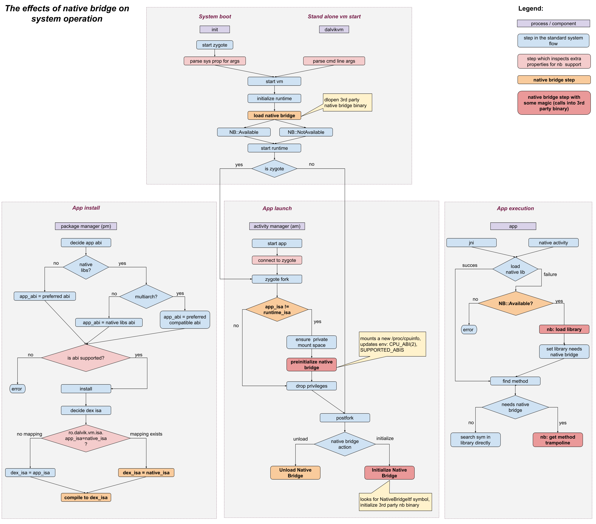
*Diagram source: `art/libnativebridge/nb-diagram.png` from AOSP*

The key flows are:

**System Boot:**
1. The `init` process starts **Zygote** — the always-running template process that Android forks to create every app process (forking is faster than starting a fresh runtime each time, and lets apps share already-loaded framework code)
2. Zygote starts the VM and calls `load native bridge` using the library name from `ro.dalvik.vm.native.bridge`
3. ART uses `dlopen()` to load the library (e.g., `libberberis_arm64.so`) and `dlsym("NativeBridgeItf")` to find the callback struct
4. If the bridge is available (NB:Available), the runtime continues; otherwise it runs without translation

**App Install:**
- Package Manager checks if the app has native libraries matching the device architecture
- If not, but NativeBridge is available, it selects the best compatible ABI via the bridge
- The app installs with translated ABI support

**App Launch:**
- Activity Manager starts the app, connects to Zygote, and forks a new process
- The forked process calls `PreInitialize Native Bridge` (with elevated privileges, before dropping to app permissions)
- Then `Initialize Native Bridge` — this is when Digitalis sets up the guest environment

**App Execution:**
- When Java code calls a native method, ART checks if the library was loaded via NativeBridge
- If yes, it calls `nb: get method trampoline` to get an x86_64 wrapper for the ARM64 function
- The trampoline handles ABI conversion and enters guest execution

### The NativeBridge State Machine

ART manages the NativeBridge lifecycle through a state machine:

```mermaid
stateDiagram-v2
    [*] --> kNotSetup
    kNotSetup --> kOpened : LoadNativeBridge()
    kOpened --> kPreInitialized : PreInitializeNativeBridge()
    kPreInitialized --> kInitialized : InitializeNativeBridge()
    kOpened --> kClosed : Error
    kPreInitialized --> kClosed : Error
    kInitialized --> kClosed : UnloadNativeBridge()
```

- **kNotSetup**: No bridge loaded yet (initial state)
- **kOpened**: Library loaded, symbol found, version verified
- **kPreInitialized**: Code cache directory created (done with elevated privileges before Zygote drops permissions)
- **kInitialized**: Bridge fully initialized for the current app process — guest environment is ready, translation can begin
- **kClosed**: Bridge closed or error occurred

### The NativeBridge Callback Interface (v8)

The NativeBridge implementation exports a single C symbol — `NativeBridgeItf` — which is a struct of function pointers. ART calls these functions to interact with the translator. The interface has evolved over 8 versions (the table below is history — the one takeaway is that Digitalis implements the newest version, v8, and stays compatible back to v2):

| Version | Key Additions |
|---------|--------------|
| **v1** | Base: `initialize`, `loadLibrary`, `getTrampoline`, `isSupported`, `getAppEnv` |
| **v2** | Signal handling (`getSignalHandler` for SIGSEGV routing) |
| **v3** | Linker namespace support (`createNamespace`, `linkNamespaces`, `loadLibraryExt`) — critical for library isolation |
| **v4** | Vendor namespace (Treble "sphal" separation) |
| **v5** | Exported namespaces (`getExportedNamespace`) |
| **v6** | Pre-Zygote fork hook (`preZygoteFork`) for app-zygote support |
| **v7** | Enhanced JNI trampolines with call type info (`getTrampolineWithJNICallType`) |
| **v8** | Function pointer detection (`isNativeBridgeFunctionPointer`) — **current Digitalis version** |

Digitalis implements version 8 and supports back to version 2. The most important callbacks are:

| Callback | What It Does |
|----------|-------------|
| `initialize()` | Called once per app process. Digitalis creates the guest loader, spawns the guest thread, and loads ARM64 linker/libc/vDSO. |
| `loadLibraryExt()` | Called when the app loads a native library. Digitalis tries the guest loader first; falls back to host `dlopen()`. |
| `getTrampolineWithJNICallType()` | Called when Java calls a native method. Digitalis creates an x86_64 wrapper that marshals arguments and enters guest execution. |
| `createNamespace()` / `linkNamespaces()` | Manages linker namespaces. Digitalis creates paired guest+host namespaces and links them, adding vDSO to the shared whitelist. |
| `getSignalHandler()` | Returns Digitalis's signal handler so host SIGSEGV can be routed to the guest signal handler (see [Section 10](#10-signal-handling-and-fault-recovery)). |

### What Is vDSO?

**vDSO** (virtual Dynamic Shared Object) is a special mechanism in the Linux kernel. Normally, when a program calls the kernel (e.g., `gettimeofday()`), it must perform a full system call — switching from user mode to kernel mode and back, which is expensive (~100ns). The vDSO is a tiny shared library that the kernel **automatically maps** into every process's address space. It contains optimized versions of frequently-called functions that can run entirely in user mode, avoiding the syscall overhead.

```mermaid
graph LR
    subgraph Without_VDSO["Without vDSO"]
        A1["App calls gettimeofday()"] --> B1["Switch to kernel mode<br/><i>~100ns overhead</i>"]
        B1 --> C1["Kernel reads clock"]
        C1 --> D1["Switch back to user mode"]
    end

    subgraph With_VDSO["With vDSO"]
        A2["App calls gettimeofday()"] --> B2["vDSO code runs<br/>in user mode<br/><i>~5ns</i>"]
        B2 --> C2["Reads shared kernel page<br/><i>mapped into process</i>"]
    end
```

The vDSO appears as `linux-vdso.so.1` in a process's memory map. Apps don't load it explicitly — the kernel maps it automatically.

### Why Digitalis Must Handle vDSO

In a translation context, the vDSO situation is tricky:

1. The **host kernel** maps an **x86_64 vDSO** into the process automatically — but guest ARM64 code can't execute x86_64 instructions
2. The **guest ARM64 linker** expects an **ARM64 vDSO** — it's part of the standard Linux process setup that the guest code depends on
3. If the guest linker doesn't find an ARM64 vDSO, it may try to load one from the filesystem, creating a **duplicate** without Digitalis's trampolines registered — leading to null function pointer crashes

Digitalis solves this in three steps:

1. **TinyLoader loads a guest vDSO** (`libnative_bridge_vdso.so`) from `/system/lib64/arm64/` during guest environment setup. This is a Berberis-provided ARM64 vDSO with special bridge functions (`native_bridge_trace`, `native_bridge_intercept_symbol`, `native_bridge_post_init`).

2. **The vDSO address is passed to the guest linker** via the auxiliary vector (`AT_SYSINFO_EHDR`), just as the kernel would pass the real vDSO to a native process.

3. **`LinkNamespaces()` adds `linux-vdso.so.1` to the shared library whitelist** so the guest linker recognizes the pre-loaded vDSO across namespace boundaries and doesn't try to load a second copy.

### Source Code Structure

```
art/libnativebridge/                              # The ART framework side
├── native_bridge.cc                              # State machine, public API, dlopen/dlsym
├── include/nativebridge/native_bridge.h          # NativeBridgeCallbacks struct (v8)
├── nb-diagram.png                                # Integration flowchart (shown above)
├── tests/                                        # 30+ test files
└── README.md

frameworks/libs/native_bridge_support/            # Shared support libraries
├── guest_state/                                  # CPUState definitions per architecture
│   └── include/.../arm64/guest_state_cpu_state.h #   ARM64: x[31], v[32], flags, SP, etc.
│   └── include/.../riscv64/...                   #   RISC-V: x[32], f[32], v[32], CSRs
├── guest_state_accessor/                         # Debug/crash reporting interface
│   ├── accessor.h                                #   LoadGuestStateRegisters() — for debuggerd
│   └── accessor_proxy.cc                         #   Dynamically loads bridge to read state
├── android_api/                                  # 21 proxy library stubs with trampolines
│   ├── libEGL/, libGLESv1_CM/, libGLESv2/...     #   Per-library trampoline implementations
│   └── vdso/                                     #   Guest vDSO support functions
│       ├── vdso.h                                #     native_bridge_trace(), etc.
│       └── vdso_arm64.S                          #     ARM64 assembly implementation
└── tools/

frameworks/libs/binary_translation/native_bridge/ # Berberis/Digitalis implementation
├── native_bridge.cc                              # NdktNativeBridge class, exports NativeBridgeItf
├── native_bridge.h                               # Local callback struct definition
├── arm64/native_bridge.cc                        # Digitalis: kGuestIsa="arm64", ABI config
└── riscv64/native_bridge.cc                      # RISC-V: kGuestIsa="riscv64"
```

The **`guest_state_accessor`** deserves a special mention: when an app crashes under translation, Android's crash reporter (`debuggerd`) needs to display the guest CPU registers (ARM64 X0-X30), not the host registers (x86_64 RAX-R15). The accessor provides a `LoadGuestStateRegisters()` function that reads the guest state from a special TLS slot (`TLS_SLOT_NATIVE_BRIDGE_GUEST_STATE`) where Berberis stores it. The guest state data starts with a signature (`0x5349'5245'4252'4542` = "BERBERIS") followed by architecture-specific register data.

---

## 17. binfmt_misc: Running Guest Binaries Directly

*This section covers a niche-but-real second way ARM64 code gets launched: not by tapping an app, but by running an ARM64 program straight from a shell or a test harness. You can skip it on a first read — it doesn't affect how apps run.*

[Section 5](#5-how-an-arm64-app-starts) covered **Path A** — the NativeBridge-driven flow used when an ARM64 APK launches from the Android framework. This section covers **Path B** — the alternate launch route for ARM64 guest code that doesn't go through an app at all: **`binfmt_misc`**, the Linux kernel mechanism that auto-invokes a registered user-space interpreter when `execve()` sees a foreign-ABI ELF.

Path B is used for:

- `adb shell ./my-arm64-binary` — running a bare ELF directly from the shell
- ARM64 gtest binaries pushed to `/data/local/tmp/` for on-device testing
- ARM64 shell utilities (`strace`, custom debug tools)
- Any subprocess that another process spawns via `execve()` of an ARM64 ELF

Berberis on the RISC-V side has had `binfmt_misc` support from the beginning. Digitalis now matches that to keep the two backends consistent.

### How binfmt_misc Dispatch Works

```mermaid
sequenceDiagram
    participant Shell as adb shell
    participant Kernel as Host Linux kernel
    participant Runner as berberis_program_runner_binfmt_misc_arm64
    participant Berberis as libberberis_arm64.so

    Shell->>Kernel: execve("./my-arm64-binary")
    Kernel->>Kernel: Read ELF header bytes
    Kernel->>Kernel: Match against /proc/sys/fs/binfmt_misc entries
    Note over Kernel: arm64_exe matches:<br/>ELFCLASS64 + ET_EXEC + EM_AARCH64 (0xb7)
    Kernel->>Runner: Rewrite exec to:<br/>runner ./my-arm64-binary
    Runner->>Berberis: InitBerberis()
    Runner->>Berberis: GuestLoader::StartExecutable()
    Berberis->>Berberis: Dispatcher loop, JIT/interpreter
    Berberis-->>Shell: process exits normally
```

The kernel intercepts the original `execve()`, recognises the ELF header, and rewrites the exec into a different one that invokes the registered interpreter with the original path as an argument. The interpreter — `berberis_program_runner_binfmt_misc_arm64` — is itself a native x86_64 binary that loads `libberberis_arm64.so` (the same library NativeBridge uses) and hands the guest binary to `GuestLoader::StartExecutable()`, which then runs it under the same dispatcher / JIT / interpreter stack covered in sections 7 and 11.

### Registration: Magic Files and the Init Block

The kernel needs two pieces of information per foreign ABI: the **magic bytes** that identify it, and the **interpreter** to invoke. Digitalis ships two magic files under `system/etc/binfmt_misc/`:

| File | Matches |
|---|---|
| `arm64_exe` | ELFCLASS64 + little-endian + `ET_EXEC` (`e_type=2`) + `EM_AARCH64` (0xb7) |
| `arm64_dyn` | Same as above but `ET_DYN` (`e_type=3`) — position-independent executables, the modern default for NDK and most Android binaries |

Each file's contents follow the Linux `binfmt_misc` registration format documented in `Documentation/admin-guide/binfmt-misc.rst`:

```
:arm64_exe:M::\x7fELF\x02\x01\x01\x00\x00\x00\x00\x00\x00\x00\x00\x00\x02\x00\xb7::/system/bin/berberis_program_runner_binfmt_misc_arm64:P
```

| Field | Value | Meaning |
|---|---|---|
| name | `arm64_exe` | Registration identifier in `/proc/sys/fs/binfmt_misc/` |
| type | `M` | Match by magic bytes |
| offset | *(empty)* | Default 0 — magic starts at byte 0 of the ELF |
| magic | `\x7fELF…\xb7` | 19 bytes covering the ELF identification + low byte of `e_machine` |
| mask | *(empty)* | Default all-1s — every magic byte must match exactly |
| interpreter | `/system/bin/berberis_program_runner_binfmt_misc_arm64` | The native x86_64 program the kernel runs |
| flags | `P` | Preserve `argv[0]` so the interpreter sees the original guest binary path |

The init script `system/etc/init/berberis.rc` registers them when the system properties are right:

```
on early-init && property:ro.enable.native.bridge.exec=1
    mount binfmt_misc binfmt_misc /proc/sys/fs/binfmt_misc

on property:ro.enable.native.bridge.exec=1 && property:ro.dalvik.vm.isa.arm64=x86_64
    copy /system/etc/binfmt_misc/arm64_exe /proc/sys/fs/binfmt_misc/register
    copy /system/etc/binfmt_misc/arm64_dyn /proc/sys/fs/binfmt_misc/register
```

Both properties are set by `enable_arm64_to_x86_64.mk` (which the Digitalis product inherits), so registration happens automatically on a Digitalis emulator with no extra opt-in required.

### Two Program Runners, Same Library

Digitalis ships two binaries under `system/bin/`:

| Binary | Purpose | Linked guest backend |
|---|---|---|
| `berberis_program_runner_arm64` | CLI runner for manual testing: `runner [-l loader] [-s vdso] guest_executable [args…]` (`program_runner/main.cc`) | `libberberis_arm64.so` |
| `berberis_program_runner_binfmt_misc_arm64` | Kernel-invoked binfmt_misc interpreter — simpler argv shape suited to the kernel's invocation convention (`program_runner/main_binfmt_misc.cc`) | `libberberis_arm64.so` |

Both share `program_runner/program_runner.cc`, which calls `InitBerberis()` and `GuestLoader::StartExecutable()` — the same functions NativeBridge ultimately reaches through a different path. So `binfmt_misc` and NativeBridge converge on the same guest loader and the same translator; only the launch wrapper differs.

### Path A vs Path B at a Glance

| Aspect | Path A — NativeBridge | Path B — binfmt_misc |
|---|---|---|
| Triggered by | Android `ActivityManager` launching an APK | Kernel seeing `execve()` of an ARM64 ELF |
| Entry point | `dlopen(libberberis_arm64.so)` + `dlsym("NativeBridgeItf")` + JNI trampolines | `execve()` of `berberis_program_runner_binfmt_misc_arm64` |
| Guest loaded by | `NdktNativeBridge::LoadLibrary()` → `GuestLoader` | program runner → `GuestLoader::StartExecutable()` |
| Typical workloads | All ARM64-only APKs in the sample suite | Shell tools, gtest binaries, debugging utilities, subprocess `execve()` |
| Required for | Every ARM64-only Android app | Tests, CI, shell scripts, system flows that exec foreign binaries |
| Shared infrastructure | `libberberis_arm64.so`, dispatcher loop, JIT + interpreter, all 21 proxy libs | Same |

The two paths are **complementary, not alternative**. Most workloads use Path A; Path B fills the smaller but real gap for non-app guest code — bringing Digitalis to parity with what Berberis RISC-V has shipped since day one.

### Files in the Distribution

Path B adds these four entries to `BERBERIS_DISTRIBUTION_ARTIFACTS_ARM64`:

```
system/bin/berberis_program_runner_binfmt_misc_arm64
system/bin/berberis_program_runner_arm64
system/etc/binfmt_misc/arm64_dyn
system/etc/binfmt_misc/arm64_exe
```

Build modules: `berberis_program_runner_binfmt_misc_arm64`, `berberis_program_runner_arm64` (cc_binary in `program_runner/Android.bp`), `arm64_dyn`, `arm64_exe` (prebuilt_etc in `prebuilt/Android.bp`). All are pulled into the system image by `BERBERIS_PRODUCT_PACKAGES_ARM64_TO_X86_64`.

---

## 18. Debugging

When an ARM64 app crashes under Digitalis, the bug is almost always in the translator — not the app. The app runs correctly on real ARM64 hardware; something in the translation pipeline is producing incorrect behavior. This section explains how to find and fix these bugs.

### Reading the Crash

Crashes show up in Android's logcat as Unix **signal** names (see [Section 10](#10-signal-handling-and-fault-recovery) for what signals are):

| Signal | Meaning | Common Translation Cause |
|--------|---------|------------------------|
| `SIGSEGV` | Memory access violation | Wrong address calculation, missing mmap emulation |
| `SIGABRT` | Assertion or abort | Incorrect API behavior from proxy library |
| `SIGILL` | Illegal instruction | Guest code jumped to non-executable memory |
| `Fatal signal` | Generic fatal | Various translation errors |

Guest crashes produce full debuggerd tombstones (`/data/tombstones/`), same as native crashes — read the tombstone before anything else. It carries the abort message (e.g. fdsan fd-ownership violations), the signal, and the backtrace through both host frames and the guest's JIT-translated frames. (This relies on the `F_SETPIPE_SZ` fcntl passthrough described in [Section 14](#14-syscall-emulation) — if tombstones ever vanish for translated processes only, suspect the syscall/fcntl path first.)

### Common Crash Categories

- **Wrong instruction decoded**: the decoder dispatched an instruction to the wrong handler because of a shared encoding prefix or missing distinguishing bit. Produces incorrect results, not immediate crashes — the crash comes later when corrupted data hits a memory boundary.
- **Missing instruction**: neither the JIT nor the interpreter implements this instruction. The app hits an undefined instruction handler.
- **Wrong register mapping or spill**: the JIT corrupted guest state by mismanaging register allocation. Manifests as wrong values in seemingly unrelated code.
- **Missing proxy library or function**: the app calls an API that Digitalis hasn't proxied. Guest linker can't resolve the symbol.
- **Syscall emulation bug**: wrong syscall number translation, wrong struct layout conversion, or missing emulation for an edge case.
- **Memory mapping issue**: BSS data not zeroed, file-backed mmap not handled correctly, or guest signal handler bypassed by raw memory access in the interpreter.

### Going Deeper: Debugging Workflow

```mermaid
graph TD
    A["App crashes"] --> B["Reproduce via test-samples.sh"]
    B --> C["Collect logs via adb logcat"]
    C --> D["Enable BERBERIS_TRACING"]
    D --> E["Identify guest PC from crash log"]
    E --> F["Disassemble guest .so<br/>with llvm-objdump"]
    F --> G{"Which component?"}
    G -->|"Decoder bug"| H["Check bit-field routing<br/>in decoder.h"]
    G -->|"JIT bug"| I["Check LiteTranslator<br/>code emission"]
    G -->|"Interpreter bug"| J["Check Interpreter<br/>handler"]
    G -->|"Missing instruction"| K["Implement in<br/>JIT or Interpreter"]
    H --> L["Write host test"]
    I --> L
    J --> L
    K --> L
    L --> M["Fix and verify:<br/>host tests + sample apps"]
```

**Step by step:**

1. **Reproduce**: run `test-samples.sh <module>` to confirm the app crashes (reports `CRASH` status)
2. **Collect logs**: `adb logcat | grep -E "berberis|SIGSEGV|Fatal"` — look for the crash address and signal type
3. **Enable tracing**: set the `BERBERIS_TRACING` environment variable to a file path to capture detailed translation logs. The conventional Digitalis path is `/data/local/tmp/digitalis-trace.log` — `setprop berberis.tracing /data/local/tmp/digitalis-trace.log` enables it system-wide, or `BERBERIS_TRACING=/data/local/tmp/digitalis-trace.log am start …` per-launch
4. **Identify the guest PC**: the crash or trace log shows which ARM64 address was being executed when things went wrong
5. **Disassemble**: use `llvm-objdump -d <guest.so>` to find the ARM64 instruction at that address
6. **Diagnose**: check whether the decoder is routing the instruction correctly, whether the JIT is generating the right x86_64 code, or whether the interpreter is executing it correctly
7. **Write a host test**: add a test to `lite_translate_region_exec_tests.cc` that exercises the specific instruction
8. **Fix and verify**: fix the translator, run host tests (`berberis_arm64_host_tests`), then run sample app tests

### Going Deeper: Tracing Infrastructure

Digitalis provides several tracing and logging mechanisms:

- **`TRACE(...)` macro**: conditional tracing controlled by the `BERBERIS_TRACING` environment variable (or the `berberis.tracing` Android system property). Output includes PID and TID for multi-threaded debugging. Written via atomic `write()` calls for thread safety.
- **`DIGITALIS_LOG(...)` macro**: Digitalis-specific debug-level Android log with tag "berberis". Defined in `native_bridge.cc` and used for NativeBridge operations (namespace creation, library loading, etc.).
- **`TRACE_AND_ALOGD()` macro**: combined trace file output + Android logcat output in a single call.
- **Inline profiling**: `g_translation_stats` tracks JIT compilation statistics, JIT break logging records when regions end early, and the dispatch watchdog detects potential infinite loops.

Tracing modes supported by `BERBERIS_TRACING`:
- **File output**: set to a path (the Digitalis convention is `/data/local/tmp/digitalis-trace.log`), or `1`/`2` for stdout/stderr
- **TCP socket**: set to `:<port>` (e.g., `:9999`) for real-time tracing over network
- **Package-specific**: set to `com.example.app=/path/to/trace` to trace only a specific app

### Going Deeper: Common Bug Patterns

**Silent mis-routing.** Instruction A is decoded as instruction B because they share encoding bits and the decoder doesn't check the right distinguishing bit. Example: CMGT decoded as SMAX, or SWP decoded as LDADD. The program runs with wrong values until a memory boundary causes a visible crash. Fix: verify opcode bits against the ARM Architecture Reference Manual.

**Infinite re-entry loops.** The JIT marks a guest PC as translated but the code at that PC needs interpreter handling. The dispatch loop keeps jumping to the JIT code, which keeps failing and retrying. Fix: use `success_ = false` to install `kInterpreted` at that PC, routing future dispatches to the interpreter.

**FLAGS clobbering.** The JIT uses SUB or ADD to adjust the stack pointer before calling LAHF to read condition flags. But SUB/ADD modify x86_64's FLAGS register — destroying the flags LAHF needs to capture. Fix: use PUSH/POP or LEA for stack adjustment, which don't affect FLAGS.

**Raw memcpy in interpreter.** The interpreter uses raw `memcpy` for a memory access instead of `FaultyLoad`/`FaultyStore`. When the guest accesses invalid memory, the host process gets a SIGSEGV that bypasses the guest signal handler entirely. Fix: always use `FaultyLoad`/`FaultyStore` for guest memory access.

---

**Part V — Worked Example**

## 19. Putting It All Together: The Vulkan Triangle

This section traces a real app — `hello-vulkan`, the original Digitalis proof of concept — through every layer of the translation system. It's an ARM64-only app that renders a colored triangle using Vulkan, running on an x86_64 emulator via Digitalis. Read it after Sections 1–18: each phase below names the earlier machinery it exercises, so this is where the separate pieces finally connect into one running app.

### What the App Does

The app is a pure C++ NativeActivity with ~550 lines of code. It initializes Vulkan, creates a graphics pipeline with embedded **SPIR-V** shaders (SPIR-V is the compiled bytecode format Vulkan uses for GPU shader programs, the way a `.class` file is compiled Java), and renders a triangle with red/green/blue vertices in a loop. The triangle's vertex positions and colors are hardcoded in the vertex shader — there's no vertex buffer, no uniform buffers, no textures. This makes it the simplest possible Vulkan app while still exercising the full translation pipeline.

### Phase 1: App Launch and NativeBridge Interception

This phase exercises the outermost layers of the big picture from [Section 4](#4-the-big-picture) — NativeBridge interception and guest-environment setup — before a single app instruction is translated. When the user taps the app icon, Android starts a new process:

```mermaid
sequenceDiagram
    participant User
    participant ART as Android Runtime
    participant NB as NativeBridge<br/>(libberberis_arm64.so)
    participant GL as GuestLoader
    participant TL as TinyLoader

    User->>ART: Tap app icon
    ART->>ART: Read APK: only lib/arm64-v8a/ found
    ART->>ART: Check ro.dalvik.vm.native.bridge
    ART->>NB: Load libberberis_arm64.so
    NB->>NB: Initialize()
    NB->>GL: Spawn guest thread
    GL->>TL: Load ARM64 app_process
    GL->>TL: Load ARM64 vDSO
    GL->>TL: Load ARM64 linker64
    TL-->>GL: Initial binaries loaded
    GL->>GL: Register proxy libraries at /system/lib64/arm64/
    Note over GL: Guest linker loads libc.so and the app .so via dlopen_ext
    GL-->>NB: Guest environment ready
    ART->>NB: Call ANativeActivity_onCreate
    NB->>NB: Create JNI trampoline<br/>(x86_64 ABI → ARM64 ABI)
    NB-->>ART: Enter guest android_main()
```

The APK contains only `lib/arm64-v8a/libhello_digitalis.so` — no x86_64 library. ART detects this, loads Digitalis through NativeBridge, and Digitalis creates the ARM64 guest environment. The ARM64 dynamic linker resolves the app's Vulkan imports (like `vkCreateInstance`) to proxy libraries at `/system/lib64/arm64/`.

### Phase 2: The Main Loop Under Translation

Once `android_main()` starts executing, every ARM64 instruction runs through the Digitalis dispatch loop from [Section 9](#9-translation-cache-and-dispatch-loop), which routes each region to one of the three execution tiers ([Section 6](#6-three-execution-tiers-lite-jit-heavy-optimizer-and-interpreter)):

```c
// This ARM64 code runs on an x86_64 CPU via translation:
void android_main(struct android_app* app) {
    app->onAppCmd = handle_cmd;
    
    while (true) {
        // Poll for events (triggers syscall emulation)
        while (ALooper_pollOnce(...) >= 0) {
            if (source) source->process(app, source);
            if (app->destroyRequested) return;
        }
        // Render a frame (triggers proxy library calls)
        vulkan_render_frame(&g_vulkan_state);
    }
}
```

Here's what happens to this code inside Digitalis:

```mermaid
graph TD
    subgraph Dispatch["ExecuteGuest() Dispatch Loop"]
        PC["Read PC from ThreadState"]
        CACHE["TranslationCache lookup"]
        RUN["Execute code"]
        PC --> CACHE --> RUN --> PC
    end

    subgraph JIT_Work["JIT Translates android_main()"]
        J1["ADD, SUB, MOV → movq, addq, subq"]
        J2["LDR, STR → mov with memory operands"]
        J3["CMP, B.EQ → testq + jcc"]
        J4["BL handle_cmd → ExitRegion"]
    end

    subgraph Syscall_Work["Event Polling"]
        S1["ALooper_pollOnce calls epoll_wait"]
        S2["ARM64 SVC #0 instruction"]
        S3["JIT-emitted inline call<br/>(LiteTranslator::Svc → EmitSyscall)"]
        S4["RunGuestSyscall: translate<br/>epoll_wait nr + args"]
        S5["Host kernel: epoll_wait()"]
        S1 --> S2 --> S3 --> S4 --> S5
    end

    subgraph Vulkan_Work["Vulkan Rendering"]
        V1["vkWaitForFences → proxy → host Vulkan"]
        V2["vkBeginCommandBuffer → proxy → host"]
        V3["vkCmdDraw 3 vertices → proxy → host"]
        V4["vkQueueSubmit → proxy → GFXStream"]
        V5["GFXStream → Host GPU → triangle on screen"]
        V1 --> V2 --> V3 --> V4 --> V5
    end

    RUN -->|"Arithmetic/branches"| JIT_Work
    RUN -->|"System call"| Syscall_Work
    RUN -->|"Vulkan API call"| Vulkan_Work
```

The main loop involves all three execution paths:
- **JIT path**: The loop control flow (comparisons, branches, pointer loads) is translated to native x86_64 and cached — this runs at near-native speed
- **Syscall path**: `ALooper_pollOnce()` eventually issues an `epoll_wait` system call. The JIT emits this inline as a direct call into `RunGuestSyscall` (it does *not* fall back to the interpreter — see [Section 14](#14-syscall-emulation)), which translates the ARM64 syscall number and arguments to the host kernel's convention
- **Proxy path**: Every `vk*` call goes through the Vulkan proxy library

### Phase 3: Vulkan Initialization — Proxy Libraries in Action

The event loop from the previous phase keeps polling until Android hands the app a drawable surface — it delivers an `APP_CMD_INIT_WINDOW` command. The first time that arrives, the app knows it finally has somewhere to draw, and runs `vulkan_init()`. Every Vulkan call below crosses the translation boundary through the proxy libraries of [Section 13](#13-talking-to-the-host-proxy-libraries) — here's the sequence and how each crossing works:

```mermaid
sequenceDiagram
    participant App as ARM64 App Code<br/>(JIT-translated)
    participant Proxy as libberberis_proxy_<br/>libvulkan.so
    participant Host as Host Vulkan
    participant GFX as GFXStream<br/>VkDecoder
    participant GPU as Host GPU

    Note over App,GPU: Vulkan Initialization

    App->>Proxy: vkCreateInstance(appInfo, extensions)
    Proxy->>Proxy: Marshal VkInstanceCreateInfo<br/>from guest memory
    Proxy->>Host: vkCreateInstance(...)
    Host-->>Proxy: VkInstance handle
    Proxy-->>App: handle in X0

    App->>Proxy: vkEnumeratePhysicalDevices(instance, ...)
    Proxy->>Host: vkEnumeratePhysicalDevices(...)
    Host-->>App: device list

    App->>Proxy: vkCreateDevice(physicalDevice, queueInfo, ...)
    Proxy->>Proxy: Marshal VkDeviceCreateInfo<br/>(includes stack pointer to priority float)
    Proxy->>Host: vkCreateDevice(...)
    Host-->>App: VkDevice handle

    App->>Proxy: vkCreateAndroidSurfaceKHR(instance, window, ...)
    Note over Proxy: ANativeWindow* is a host pointer<br/>passed through without conversion
    Proxy->>Host: vkCreateAndroidSurfaceKHR(...)
    Host-->>App: VkSurfaceKHR handle

    App->>Proxy: vkCreateSwapchainKHR(device, swapchainInfo, ...)
    Proxy->>Host: vkCreateSwapchainKHR(...)
    Host-->>App: VkSwapchainKHR handle

    App->>Proxy: vkCreateShaderModule(device, spvCode, spvSize, ...)
    Proxy->>Proxy: Copy SPIR-V bytecode<br/>from guest memory to host
    Proxy->>Host: vkCreateShaderModule(...)
    Host->>GFX: Compile shaders
    GFX->>GPU: Upload shader programs
    Host-->>App: VkShaderModule handles

    App->>Proxy: vkCreateGraphicsPipelines(device, pipelineInfo, ...)
    Proxy->>Host: vkCreateGraphicsPipelines(...)
    Host-->>App: VkPipeline handle
```

Notice the proxy's marshalling work (the same argument-conversion job described in [Section 13](#13-talking-to-the-host-proxy-libraries)):
- **Struct pointers** (like `VkInstanceCreateInfo*`): the proxy must read the struct from guest memory using `ToHostAddr()` and copy or translate it for the host
- **Stack pointers** (like `&priority` in queue creation): these point into the guest ARM64 stack, which exists in the guest address space — the proxy converts the address
- **Opaque handles** (like `ANativeWindow*`): these are host-side pointers passed through without conversion
- **Bulk data** (like SPIR-V bytecode): copied from guest memory to host memory before passing to the host Vulkan driver

### Phase 4: The Render Loop — Every Frame

Each frame, the app records Vulkan commands and submits them to the GPU, alternating between JIT-translated struct setup ([Section 6](#6-three-execution-tiers-lite-jit-heavy-optimizer-and-interpreter)) and proxy-library calls ([Section 13](#13-talking-to-the-host-proxy-libraries)):

```mermaid
sequenceDiagram
    participant App as ARM64 App
    participant JIT as JIT-translated code
    participant Proxy as Vulkan Proxy
    participant GFX as GFXStream
    participant GPU as Host GPU

    Note over App,GPU: Every frame (~16ms at 60fps)

    App->>Proxy: vkWaitForFences(fence, timeout=MAX)
    Proxy->>GFX: Wait for GPU completion
    GFX-->>Proxy: Fence signaled
    Proxy-->>App: VK_SUCCESS

    App->>Proxy: vkAcquireNextImageKHR(swapchain, ...)
    Proxy-->>App: image_index

    App->>JIT: Struct initialization (clear color, render pass begin)<br/>ADD, STR, MOV instructions → translated to x86_64
    
    App->>Proxy: vkBeginCommandBuffer(cmdBuffer)
    App->>Proxy: vkCmdBeginRenderPass(cmdBuffer, renderPassInfo)
    App->>Proxy: vkCmdBindPipeline(cmdBuffer, pipeline)
    App->>Proxy: vkCmdDraw(cmdBuffer, 3, 1, 0, 0)
    Note over Proxy: 3 vertices, 1 instance<br/>No vertex buffer needed —<br/>positions hardcoded in shader
    App->>Proxy: vkCmdEndRenderPass(cmdBuffer)
    App->>Proxy: vkEndCommandBuffer(cmdBuffer)

    App->>Proxy: vkQueueSubmit(queue, submitInfo, fence)
    Proxy->>GFX: Submit command buffer
    GFX->>GPU: Execute render pass
    GPU->>GPU: Run vertex shader (3 vertices)<br/>Run fragment shader (per pixel)<br/>Write to swapchain image
    GFX-->>Proxy: Submitted

    App->>Proxy: vkQueuePresentKHR(queue, presentInfo)
    Proxy->>GFX: Present swapchain image
    GFX->>GPU: Display frame
    Note over GPU: Triangle appears on screen
```

The key `vkCmdDraw(cmdBuffer, 3, 1, 0, 0)` call draws 3 vertices with 1 instance. The GPU runs the vertex shader three times (with `gl_VertexIndex` = 0, 1, 2), which indexes into the hardcoded position and color arrays in the shader to produce the triangle's three corners.

### Phase 5: What Gets Translated vs What Gets Proxied

Not all code in the app takes the same path through Digitalis. Three paths divide the work: the JIT tiers ([Section 6](#6-three-execution-tiers-lite-jit-heavy-optimizer-and-interpreter)), the proxy libraries ([Section 13](#13-talking-to-the-host-proxy-libraries)), and inline syscall lowering ([Section 14](#14-syscall-emulation)). Here's the breakdown:

| Code Type | Example | Digitalis Path | Speed |
|-----------|---------|---------------|-------|
| Arithmetic & logic | `if (state->initialized)` | **JIT** — translated to native x86_64 | Near-native |
| Memory access | `state->instance = instance` | **JIT** — `movq` with memory operand | Near-native |
| Control flow | `while (true)`, `if/else` | **JIT** — `testq` + `jcc` | Near-native |
| Struct initialization | `VkSubmitInfo info = {}` | **JIT** — series of `movq`/`movl` stores | Near-native |
| Vulkan API calls | `vkCmdDraw(...)` | **Proxy** — marshal args, call host | Small overhead |
| libc calls | `malloc()`, `memcpy()` | **Proxy** — forward to host libc | Small overhead |
| Logging | `__android_log_print()` | **Proxy** — forward to host logging | Small overhead |
| System calls | `epoll_wait()` (via ALooper) | **JIT inline call** — `RunGuestSyscall` translates number + args | Moderate overhead |
| Memory barriers | `DMB ISH` | **JIT** — emits nothing; x86's memory model already provides the ordering | Negligible |

The vast majority of instructions in the render loop are struct field writes and Vulkan API calls — both fast paths. System calls only happen during event polling, not during rendering.

### Tracing a Single Instruction Through the System

To make this concrete, let's trace one ARM64 instruction from the app's initialization code through the pipeline stages of Sections 8, 7, 11, and 9:

```
ARM64 source:  state->device = device;    // Store VkDevice handle
ARM64 asm:     STR X1, [X0, #16]          // Store X1 at address X0+16 (device is the 3rd field)
```

**Step 1 — Decoder** ([Section 8](#8-decoding-arm64-instructions)) reads 4 bytes at the current PC. Bits[28:25] = `x1x0` → Loads and Stores group. Further bits identify this as `STR` (store register) with immediate offset.

**Step 2 — SemanticsPlayer** calls `LiteTranslator::Store()` with: source=X1, base=X0, offset=16, size=64-bit.

**Step 3 — Allocator** ([Section 7](#7-register-allocation)) maps guest registers to host registers:
- X0 is already mapped to (say) RSI
- X1 is already mapped to (say) RDI

**Step 4 — Code emitter** ([Section 11](#11-machine-code-generation)) generates:
```
x86_64:  mov [rsi + 16], rdi       ; 48 89 7E 10
```

With fault recovery code in case the address is invalid (jumps to `ExitGeneratedCode`).

**Step 5 — InstallTranslated()** ([Section 9](#9-translation-cache-and-dispatch-loop)) stores this (along with the rest of the region) in the TranslationCache at the guest PC address.

**Step 6 — Next time** this address is reached, the cached x86_64 code runs directly — no decoding, no allocation, no emission. Just `mov [rsi + 16], rdi`.

### The Complete Journey: From Tap to Triangle

```mermaid
graph TD
    TAP["User taps app icon"] --> ART["ART detects arm64-v8a"]
    ART --> NB["NativeBridge loads Digitalis"]
    NB --> GUEST["Guest environment created<br/><i>linker64, libc, app .so loaded</i>"]
    GUEST --> MAIN["android_main() enters dispatch loop"]

    MAIN --> POLL["ALooper_pollOnce()"]
    POLL -->|"syscall path"| EPOLL["epoll_wait via syscall emulation"]
    EPOLL --> WINDOW["APP_CMD_INIT_WINDOW received"]
    WINDOW --> VINIT["vulkan_init()"]

    VINIT --> VK1["vkCreateInstance<br/><i>proxy → host Vulkan</i>"]
    VK1 --> VK2["vkCreateDevice<br/><i>proxy → host Vulkan</i>"]
    VK2 --> VK3["vkCreateSwapchain<br/><i>proxy → host Vulkan</i>"]
    VK3 --> VK4["Load shaders<br/><i>SPIR-V copied guest → host</i>"]
    VK4 --> VK5["vkCreateGraphicsPipelines<br/><i>proxy → host → GPU</i>"]

    VK5 --> LOOP["Render loop begins"]
    LOOP --> FENCE["vkWaitForFences<br/><i>proxy → wait for GPU</i>"]
    FENCE --> ACQ["vkAcquireNextImageKHR"]
    ACQ --> RECORD["Record command buffer<br/><i>struct init via JIT</i>"]
    RECORD --> DRAW["vkCmdDraw 3 vertices<br/><i>proxy → host command buffer</i>"]
    DRAW --> SUBMIT["vkQueueSubmit<br/><i>proxy → GFXStream → GPU</i>"]
    SUBMIT --> PRESENT["vkQueuePresentKHR"]
    PRESENT --> TRIANGLE["Triangle on screen"]
    TRIANGLE --> LOOP
```

This is the complete path: a tap on the screen triggers process creation, NativeBridge interception, guest environment setup, JIT compilation of the main loop, syscall emulation for event polling, proxy library calls for Vulkan initialization and rendering, and finally GFXStream forwards the draw commands to the host GPU — which renders a colored triangle on screen at 60fps.

---

**Part VI — Context and Background**

## 20. What Digitalis Adds to Berberis

Berberis is Google's binary translator in AOSP, originally built for RISC-V-to-x86_64 translation. Digitalis adds the entire ARM64-to-x86_64 backend. Here's what's Digitalis-specific versus upstream infrastructure:

**Decoder.** The complete ARM64 instruction decoder: bit-field parsing for all instruction groups (data processing, branches, loads/stores, SIMD/FP), including instructions not present in the original Berberis decoder — CRC32/CRC32C, the SM3/SM4 crypto groups, I8MM dot/matrix-multiply (`USDOT/SUDOT/USMMLA`), `FRINT32X/64X/32Z/64Z`, MTE tag ops, the RNG system registers (`RNDR/RNDRRS`), and `BRK`.

**JIT — first gear (Lite Translator).** The ARM64-to-x86_64 code generator: all translation methods in `lite_translator.h`, register allocation tuning for ARM64's 31-register architecture, register pressure monitoring (`IsGpRegPoolLow()`) for early region termination, direct dispatch / region chaining (`allow_dispatch = true`), and partial-success compilation that salvages work when translation fails mid-region. Host-feature-gated native paths fall back to the interpreter when the host CPU lacks the needed extension — e.g. `CRC32C*` uses the SSE4.2 `crc32` instruction and bails when SSE4.2 is absent.

**JIT — second gear (Heavy Optimizer).** The ARM64 heavy optimizer (`heavy_optimizer/arm64/`) re-translates hot lite-translated regions with global register allocation and loop optimizations, replacing them in the cache. It is the **default** second gear: gear-up is gated to regions of roughly 20+ guest instructions (so tiny loops aren't regressed), and the optimizer is neutral-or-faster than lite across microbenchmarks, ~2x on a register-pressure kernel. Instructions the heavy frontend doesn't yet translate cause it to bail back to the (correct) lite version rather than crash.

**Interpreter.** ARM64 instruction semantics for the full instruction set, the `InterpretBatch()` optimization (reusing Decoder/Interpreter objects across consecutive instructions for ~3x speedup), and the fallback path for instructions without a JIT translation — IEEE CRC32, the AES/SHA/SM3/SM4 crypto families, the `SUQADD/USQADD .1D/.2D` saturating accumulate, and a handful of host-feature-gated paths (e.g. FP16 without `F16C`). (The I8MM `USDOT/SUDOT/SMMLA/UMMLA/USMMLA` family was promoted to the JIT and is no longer interpreter-only.)

**Syscall Emulation.** ARM64-to-x86_64 syscall number mapping with inline `SVC` lowering in the JIT, the futex BSS workaround for Bionic's pthread_mutex implementation, BSS partial-page zeroing in `sys_mman_emulation.cc`, fdsan-safe `close`/`close_range`/`dup3`, and the `F_SETPIPE_SZ` fcntl passthrough that keeps guest tombstones working.

**Proxy coverage & anti-tamper fixes.** A Digitalis-only extras registry (`android_api/digitalis_extra_proxy/`) that covers `DoBadTrampoline` symbol gaps in-surface (libnativehelper JNI helpers, libbinder_ndk service-notification callbacks, the WebView hardware-accel `Register*`/`GraphicBufferImpl` symbols) and supplies missing libc/libm fast-path symbols, plus the host-call redirect for hardened apps. Alongside these, several real-app launch fixes: fdsan-safe fd ops, the `SIGALRM` deadman-watchdog neutralization, hidden-API exemption + pending-exception clearing, a null-`jclass` `GetStaticFieldID` tolerance, and the `IC IVAU` self-modified-code cache invalidation.

**Guest Loader.** ARM64-specific namespace path configuration (`/system/lib64/arm64/`), vDSO whitelist for cross-namespace visibility, and guest linker namespace fallback for incomplete ARM64 configs. (The libc.so mapping protection via `GuestMapShadow` is upstream Berberis infrastructure that Digitalis relies on.)

**Product Configuration.** `sdk_phone64_x86_64_digitalis.mk` — the emulator product definition that enables ARM64 translation, sets the NativeBridge system property, and includes all proxy libraries.

**Sample Apps.** 131 ARM64-only sample app modules — ports from [android/ndk-samples](https://github.com/android/ndk-samples), Digitalis-specific proxy-library smoke tests (`hello-gles1`, `hello-aaudio`, `hello-binder-ndk`, `hello-nnapi`, `hello-webview-functor`), ARM-extension probe modules, UI-engine samples (Qt 6, React Native + Hermes, Lynx + PrimJS), and third-party native-library integration samples (media, imaging, vision/ML, crypto/DB/storage, and AndroidX-native) — that serve as the integration test suite. Coverage spans Vulkan rendering, OpenGL ES 1.x / 2 / 3, JNI, C++ exceptions, audio (OpenSL ES + AAudio + Oboe), video codec, MIDI, camera (Camera2 NDK), sensors, SIMD vectorization, sanitizers, GoogleTest, NDK binder, NNAPI, and WebView hardware-accel proxy coverage, plus targeted instruction-set probes (NEON, FP16, BFloat16, FCMA, dot-product, I8MM, JSCVT, PAC, LSE/LRCPC atomics, CRC32/CRC32C, SHA/AES crypto). The original `hello-vulkan` module was written specifically for the Digitalis project.

**Distribution Artifact Allowlist.** `berberis_config.mk` defines `BERBERIS_DISTRIBUTION_ARTIFACTS_ARM64` — the explicit list of files allowed in the Digitalis system image (used by `PRODUCT_ARTIFACT_PATH_REQUIREMENT_ALLOWED_LIST` in `enable_arm64_to_x86_64.mk`). Mirroring the upstream RISC-V coverage, it enumerates 74 paths in total: the 21 `libberberis_proxy_*.so` stubs, 43 guest ARM64 system libs under `system/lib64/arm64/` (libc, libm, libvulkan, libdl, libicu, libsqlite, libssl, libcrypto, libcompiler_rt, libnative_bridge_vdso, the guest-only `libgui.so` stub, …), `libberberis_arm64.so`, `libberberis_exec_region.so`, the ARM64 `app_process64` and `linker64`, the two binfmt_misc magic files (`arm64_exe`, `arm64_dyn`), the two ARM64 program-runner binaries (`berberis_program_runner_arm64`, `berberis_program_runner_binfmt_misc_arm64`), `system/etc/init/berberis.rc`, and `system/etc/ld.config.arm64.txt`. The complete list is what makes a Digitalis build pass the AOSP artifact-allowlist check (closes [DigitalisX64/digitalis#1](https://github.com/DigitalisX64/digitalis/issues/1)).

**binfmt_misc Parity with RISC-V.** Berberis upstream has shipped kernel-level `binfmt_misc` dispatch for RISC-V guest binaries from the beginning (`binfmt_misc/riscv64_exe` + `binfmt_misc/riscv64_dyn` + `berberis_program_runner_binfmt_misc_riscv64`). Digitalis adds the matching set for ARM64 (`binfmt_misc/arm64_exe`, `binfmt_misc/arm64_dyn`, `berberis_program_runner_binfmt_misc_arm64`, `berberis_program_runner_arm64`) plus the init-script block that registers them when `ro.enable.native.bridge.exec=1` and `ro.dalvik.vm.isa.arm64=x86_64` are set — both already set by `enable_arm64_to_x86_64.mk`. This enables shell-launched ARM64 binaries, gtest executables, and any `execve()`-spawned ARM64 subprocess to run on a Digitalis emulator. See [Section 17](#17-binfmt_misc-running-guest-binaries-directly) for the full path.

**Code Markers.** All Digitalis-specific additions to upstream Berberis files are marked with `// region digitalis` / `// endregion` comments (or `# region digitalis` in makefiles). This makes it easy to find what Digitalis changed versus what was already in Berberis.

---

## Appendix A: How Berberis Translates RISC-V to x86_64

Consult this appendix when you want to understand the codebase you're modifying in terms of what came before it. Digitalis adds ARM64 support to Berberis, but Berberis was originally built to translate **RISC-V to x86_64**. Understanding the upstream RISC-V backend helps you see what Digitalis reuses, what it replaces, and where the two approaches diverge.

### RISC-V: A Quick Primer

RISC-V is an open-source instruction set architecture (ISA). Like ARM64, it's a RISC (Reduced Instruction Set Computer) design — simple instructions, many registers, load/store architecture. But there are key differences:

```mermaid
graph LR
    subgraph RISCV["RISC-V"]
        direction TB
        R_ENC["Variable-length instructions<br/><i>16-bit (compressed) + 32-bit</i>"]
        R_REG["32 GP registers<br/><i>x0-x31 (x0 = hardwired zero)</i>"]
        R_VEC["V-extension vectors<br/><i>variable-length vector registers</i>"]
        R_FP["Separate FP registers<br/><i>f0-f31, NaN-boxed storage</i>"]
    end

    subgraph ARM64["ARM64"]
        direction TB
        A_ENC["Fixed-length instructions<br/><i>always 32-bit</i>"]
        A_REG["31 GP registers<br/><i>X0-X30 (X31 = SP or ZR)</i>"]
        A_VEC["NEON SIMD<br/><i>128-bit V0-V31</i>"]
        A_FP["Shared SIMD/FP registers<br/><i>V0-V31 double as FP</i>"]
    end
```

The most significant difference for translation is **instruction encoding**: RISC-V supports the "C" (compressed) extension, where common instructions have a 16-bit form alongside the standard 32-bit form. The decoder must check the lowest 2 bits of each instruction to determine its size:

```
RISC-V instruction stream (mixed 16-bit and 32-bit):
┌────────┬──────────┬────────┬──────────┬────────┐
│ 16-bit │ 32-bit   │ 16-bit │ 16-bit   │ 32-bit │
│ c.add  │ add      │ c.li   │ c.beqz   │ lw     │
│ 2 bytes│ 4 bytes  │ 2 bytes│ 2 bytes  │ 4 bytes│
└────────┴──────────┴────────┴──────────┴────────┘
Detection: if (insn & 0b11) != 0b11 → 16-bit, else → 32-bit
```

Compare this with ARM64's uniform 4-byte instructions — the RISC-V decoder has extra complexity from handling two instruction widths.

### Shared Infrastructure

Digitalis and the RISC-V backend share a large amount of code. Understanding what's shared vs what's architecture-specific is key to navigating the codebase:

```mermaid
graph TD
    subgraph Shared["Shared Infrastructure"]
        TC["TranslationCache<br/><i>lock-free lookup, state machine</i>"]
        EG["ExecuteGuest()<br/><i>dispatch loop</i>"]
        NB_FW["NativeBridge Framework<br/><i>callback interface</i>"]
        ASM["x86_64 Assembler<br/><i>code generation backend</i>"]
        PROXY["Proxy Libraries<br/><i>libc, libm, libvulkan, etc.</i>"]
        GMS["GuestMapShadow<br/><i>address space management</i>"]
        SIG["Signal Handling<br/><i>pending signals, recovery</i>"]
        POOL["Code Pool<br/><i>translated code storage</i>"]
    end

    subgraph RISCV_Specific["RISC-V Specific"]
        R_DEC["RISC-V Decoder<br/><i>16-bit + 32-bit instructions</i>"]
        R_INT["RISC-V Interpreter"]
        R_JIT["RISC-V Lite Translator"]
        R_HEAVY["Heavy Optimizer<br/><i>two-gear system</i>"]
        R_SYS["RISC-V Syscall Emulation"]
        R_STATE["RISC-V Guest State<br/><i>x0-x31, f0-f31, v0-v31, CSRs</i>"]
    end

    subgraph ARM64_Specific["ARM64 Specific (Digitalis)"]
        A_DEC["ARM64 Decoder<br/><i>fixed 32-bit instructions</i>"]
        A_INT["ARM64 Interpreter"]
        A_JIT["ARM64 Lite Translator"]
        A_HEAVY["ARM64 Heavy Optimizer<br/><i>two-gear second gear</i>"]
        A_SYS["ARM64 Syscall Emulation"]
        A_STATE["ARM64 Guest State<br/><i>X0-X30, V0-V31, NZCV</i>"]
    end

    Shared --- RISCV_Specific
    Shared --- ARM64_Specific
```

The shared layer is substantial: the translation cache, dispatch loop, x86_64 assembler, proxy libraries, memory management, and signal handling are all reused. Each architecture provides its own decoder, interpreter, JIT, syscall emulation, and guest state definition.

### The Two-Gear Translation Pipeline

Both the RISC-V and ARM64 backends use a **two-gear** translation pipeline: a fast single-pass lite translator for first gear, and an optimizing heavy optimizer for the hot-region second gear.

```mermaid
graph TD
    subgraph RISCV_Pipeline["RISC-V: Two-Gear Pipeline"]
        R_NEW["New code region"] --> R_LITE["Gear 1: Lite Translator<br/><i>quick translation</i>"]
        R_LITE --> R_CACHE["Install in cache<br/><i>kLiteTranslated</i>"]
        R_CACHE --> R_RUN["Execute translated code"]
        R_RUN --> R_COUNT["Invocation counter++"]
        R_COUNT --> R_THRESH{"Counter >= threshold?<br/><i>kGearSwitchThreshold</i>"}
        R_THRESH -->|"No"| R_RUN
        R_THRESH -->|"Yes"| R_HEAVY_OPT["Gear 2: Heavy Optimizer<br/><i>liveness analysis, deep optimization<br/>max 200 instructions per region</i>"]
        R_HEAVY_OPT --> R_UPGRADE["Replace in cache<br/><i>kHeavyOptimized</i>"]
        R_UPGRADE --> R_RUN_OPT["Execute optimized code<br/><i>faster than lite translation</i>"]
    end

    subgraph ARM64_Pipeline["ARM64 (Digitalis): Two-Gear Pipeline"]
        A_NEW["New code region"] --> A_LITE["Gear 1: Lite Translator<br/><i>translate on first encounter</i>"]
        A_LITE --> A_CACHE["Install in cache<br/><i>kLiteTranslated</i>"]
        A_CACHE --> A_RUN["Execute translated code"]
        A_RUN --> A_DIRECT["Direct dispatch to next region<br/><i>allow_dispatch = true</i>"]
        A_DIRECT --> A_RUN
        A_RUN --> A_THRESH{"Region hot &<br/>&gt;= ~20 instructions?"}
        A_THRESH -->|"Yes"| A_HEAVY["Gear 2: Heavy Optimizer<br/><i>global register allocation,<br/>loop optimizations</i>"]
        A_HEAVY --> A_UPGRADE["Replace in cache<br/><i>kHeavyOptimized</i>"]
    end
```

**The two-gear approach (both backends):**

1. **Gear 1 — Lite Translation**: Quick single-pass translation on first encounter. Produces working but only locally-optimized x86_64 code.
2. **Invocation counting**: Each translated region has a counter. Every time the region executes, the counter increments.
3. **Gear 2 — Heavy Optimization**: When the counter crosses `kGearSwitchThreshold`, the heavy optimizer kicks in. It performs deep analysis — liveness analysis, global register allocation across the region, and loop optimizations — to produce faster x86_64 code. The result replaces the lite-translated version in the cache.

The RISC-V heavy optimizer caps regions at 200 instructions to control memory consumption of its analysis data structures (particularly the `LivenessAnalyzer`).

**ARM64 specifics:**

The two-gear pipeline is the **default** for the ARM64 backend. Gear-up is gated to regions of roughly **20 or more guest instructions** so that tiny loops — where the heavy optimizer's extra translation cost wouldn't pay off — stay on the lite translator rather than being regressed. Measured against the lite translator, the heavy optimizer is neutral-or-faster across microbenchmarks and about **2x faster** on a register-pressure kernel (where global register allocation helps most). ARM64 also uses **direct dispatch** — translated regions jump directly to each other through the translation cache, skipping the `ExecuteGuest()` loop overhead — independently of which gear produced a given region.

A region whose hot path contains an instruction the ARM64 heavy optimizer doesn't yet translate simply stays in lite (the heavy frontend bails, the lite version keeps running) — correct, just without the second-gear speedup. See [unsupported-opcodes.md](unsupported-opcodes.md) for the per-tier instruction status.

### RISC-V Translation Modes

The RISC-V backend supports five different translation modes, selectable at runtime (via `BERBERIS_MODE` environment variable or `berberis.mode` system property):

| Mode | Description |
|------|-------------|
| `kInterpretOnly` | No JIT — interpret everything |
| `kLiteTranslateOrFallbackToInterpret` | Single-gear lite translation |
| `kHeavyOptimizeOrFallbackToInterpret` | Skip lite, go straight to heavy optimizer |
| `kHeavyOptimizeOrFallbackToLiteTranslator` | Try heavy first, fall back to lite |
| `kLiteTranslateThenHeavyOptimize` | **Default (two-gear)** — lite first, then heavy |

ARM64 likewise defaults to the two-gear `kLiteTranslateThenHeavyOptimize` mode (lite translation first, with heavy optimization of hot regions and interpreter fallback for unsupported instructions).

### Guest State Comparison

Both architectures maintain a `CPUState` struct representing the guest processor state, but the contents differ:

```mermaid
graph LR
    subgraph RISCV_State["RISC-V CPUState"]
        direction TB
        RX["x[32] — GP registers<br/><i>x0 hardwired to zero</i>"]
        RF["f[32] — FP registers<br/><i>NaN-boxed 64-bit storage</i>"]
        RV["v[32] — Vector registers<br/><i>128-bit each</i>"]
        R_EXTRA["vtype, vstart, vl, vcsr<br/><i>V-extension control state</i>"]
        R_RES["reservation_address/value<br/><i>for LR/SC atomics</i>"]
    end

    subgraph ARM64_State["ARM64 CPUState"]
        direction TB
        AX["x[31] — GP registers<br/><i>SP handled separately</i>"]
        AV["v[32] — SIMD/FP registers<br/><i>128-bit, shared SIMD and FP</i>"]
        AF["flags — NZCV<br/><i>16-bit packed condition flags</i>"]
        A_FPC["cached_fpcr / emulated_fpsr<br/><i>FP control and status</i>"]
    end
```

Key differences:
- RISC-V has **32 GP registers** (x0 hardwired to zero); ARM64 has **31** (X31 is either SP or ZR depending on context)
- RISC-V has **separate FP registers** (f0-f31) using NaN-boxing — a 32-bit float is stored in a 64-bit slot with the upper 32 bits set to all ones. ARM64 **shares** its SIMD registers (V0-V31) for both FP and NEON operations.
- RISC-V has **full V-extension state** (vtype, vl, vstart, vcsr) for its vector unit, which supports variable-length vectors. ARM64's NEON uses fixed 128-bit vectors with no extra control state.
- RISC-V uses **LR/SC** (Load-Reserved / Store-Conditional) for atomics with a 64-bit reservation value. ARM64 uses **LDXP/STXP** (Load/Store Exclusive Pair) supporting 128-bit reservations.

### Decoder Comparison

| Feature | RISC-V Decoder | ARM64 Decoder |
|---------|---------------|---------------|
| File size | a few thousand lines | somewhat larger (SIMD/FP encodings dominate) |
| Instruction sizes | 16-bit + 32-bit | 32-bit only |
| Size detection | Check lowest 2 bits | Always 4 bytes |
| Top-level dispatch | Opcode field (bits[6:0]) | op0 field (bits[28:25]) |
| Compressed support | Yes (C extension) | No |
| Extension support | M, A, F, D, C, V, Zb* | Base + SIMD/FP + CRC32 |

The RISC-V decoder is shorter in lines but more complex logically due to the dual-width instruction handling. The ARM64 decoder is longer because ARM64's encoding has more instruction groups and more complex bit-field patterns (especially for SIMD/FP), but each instruction is simpler to locate since the width is always 4 bytes.

### Calling Convention Comparison

Both architectures use a similar register-based calling convention, but with different register assignments:

| Role | RISC-V | ARM64 | x86_64 (target) |
|------|--------|-------|------------------|
| Integer args (1-8) | a0-a7 (x10-x17) | X0-X7 | RDI, RSI, RDX, RCX, R8, R9 (+stack) |
| Integer return | a0-a1 (x10-x11) | X0-X1 | RAX, RDX |
| FP args (1-8) | fa0-fa7 (f10-f17) | V0-V7 | XMM0-XMM7 |
| FP return | fa0-fa1 (f10-f11) | V0-V1 | XMM0-XMM1 |
| Syscall number | a7 (x17) | X8 | RAX |
| Link register | ra (x1) | X30 | *(pushed to stack)* |

Both source architectures pass up to 8 integer and 8 floating-point arguments in registers before spilling to the stack. The proxy libraries must convert from either source convention to x86_64's convention (which uses only 6 integer register arguments).

### What This Means for Digitalis

Digitalis benefits enormously from the shared infrastructure that was built for RISC-V translation. The translation cache, dispatch loop, proxy libraries, assembler, and NativeBridge integration all work unchanged. What Digitalis adds is:

1. **ARM64 decoder** — simpler than RISC-V's (no variable-length instructions) but with more encoding complexity (SIMD/FP)
2. **ARM64 lite translator** — a code generator several times larger than the RISC-V one, due to ARM64's wider instruction set, especially SIMD
3. **ARM64 interpreter** — full instruction semantics including NEON SIMD that the JIT doesn't cover
4. **ARM64 heavy optimizer** — the second-gear optimizing backend (`heavy_optimizer/arm64/`) that re-translates hot regions with global register allocation and loop optimizations
5. **ARM64 syscall emulation** — different syscall numbers and ABI from both RISC-V and x86_64

The two-gear pipeline is the default for ARM64: hot regions automatically gear up from the lite translator to the heavy optimizer (gated to regions of ~20+ instructions so tiny loops aren't regressed), while direct dispatch keeps inter-region overhead low for code that stays in first gear.

---

## Appendix B: ARM64 to x86_64 Instruction Mapping

This appendix shows how ARM64 instructions map to x86_64 instructions in the Digitalis JIT. Instructions marked **JIT** are translated to native x86_64 code. Instructions marked **Interpreter** fall back to per-instruction simulation. Reach for it when you need to see exactly how one instruction is lowered, or which tier handles it; the tables are grouped by instruction category, ending with a coverage summary.

### Arithmetic

| ARM64 | x86_64 Translation | Path | Notes |
|-------|-------------------|------|-------|
| `ADD Xd, Xn, #imm` | `movq` + `addq` | JIT | `movl`+`addl` for 32-bit (W regs) |
| `SUB Xd, Xn, #imm` | `movq` + `subq` | JIT | |
| `ADDS/SUBS` (set flags) | same + `LAHF`+`SETO`+`AND`+`MOVW` | JIT | NZCV stored to ThreadState |
| `ADD Xd, Xn, Xm, LSL #s` | shift src2 via `shlq`, then `addq` | JIT | Supports LSL/LSR/ASR/ROR |
| `ADD Xd, Xn, Xm, UXTB #s` | `movzxbl` (extend) + shift + `addq` | JIT | 8 extension types supported |
| `ADC Xd, Xn, Xm` | uses NZCV `C`, `addq` + flag pack | JIT | Add with carry; `AddSubWithCarry()` in `lite_translator.h` |
| `SBC Xd, Xn, Xm` | uses NZCV `C`, `sbbq` + flag pack | JIT | Subtract with carry |
| `NEG Xd, Xm` | alias for `SUB Xd, XZR, Xm` | JIT | |

### Logic

| ARM64 | x86_64 Translation | Path | Notes |
|-------|-------------------|------|-------|
| `AND Xd, Xn, #imm` | load imm to temp + `andq` | JIT | |
| `ORR Xd, Xn, #imm` | load imm to temp + `orq` | JIT | |
| `EOR Xd, Xn, #imm` | load imm to temp + `xorq` | JIT | |
| `ANDS` (set flags) | same + NZCV emission | JIT | TST is an alias for ANDS |
| `AND Xd, Xn, Xm, LSL #s` | shift src2, then `andq` | JIT | |
| `BIC Xd, Xn, Xm` | shift + `notq` + `andq` | JIT | Bit clear = AND NOT |
| `ORN Xd, Xn, Xm` | shift + `notq` + `orq` | JIT | OR NOT |
| `EON Xd, Xn, Xm` | shift + `notq` + `xorq` | JIT | XOR NOT |

### Move & Immediate

| ARM64 | x86_64 Translation | Path | Notes |
|-------|-------------------|------|-------|
| `MOVZ Xd, #imm16, LSL #s` | `movq dst, (imm16 << shift)` | JIT | Zero other bits |
| `MOVN Xd, #imm16, LSL #s` | `movq dst, ~(imm16 << shift)` | JIT | Inverted |
| `MOVK Xd, #imm16, LSL #s` | mask out 16-bit window + `orq` | JIT | Keep other bits |
| `ADR Xd, label` | `movq dst, (PC + offset)` | JIT | PC-relative |
| `ADRP Xd, label` | `movq dst, (PC_page + offset)` | JIT | Page-aligned |

### Bitfield

| ARM64 | x86_64 Translation | Path | Notes |
|-------|-------------------|------|-------|
| `LSR Xd, Xn, #imm` | `shrq` / `shrl` | JIT | UBFM alias |
| `LSL Xd, Xn, #imm` | `shlq` / `shll` | JIT | UBFM alias |
| `ASR Xd, Xn, #imm` | `sarq` / `sarl` | JIT | SBFM alias |
| `UXTB Xd, Wn` | `movzxbl` | JIT | Zero-extend byte |
| `UXTH Xd, Wn` | `movzxwl` | JIT | Zero-extend halfword |
| `SXTB Xd, Wn` | `movsxbq` / `movsxbl` | JIT | Sign-extend byte |
| `SXTH Xd, Wn` | `movsxwq` / `movsxwl` | JIT | Sign-extend halfword |
| `SXTW Xd, Wn` | `movsxlq` | JIT | Sign-extend word |
| `BFM` (general) | — | Interpreter | Complex bitfield insert/extract |
| `EXTR Xd, Xn, Xm, #lsb` | `shrdq` | JIT | Double-precision shift; ROR when Xn=Xm |

### Shifts (Register)

| ARM64 | x86_64 Translation | Path | Notes |
|-------|-------------------|------|-------|
| `LSLV Xd, Xn, Xm` | save RCX + `movq rcx, Xm` + `shlq Xn, cl` + restore RCX | JIT | x86_64 requires shift count in CL |
| `LSRV Xd, Xn, Xm` | same pattern with `shrq` | JIT | |
| `ASRV Xd, Xn, Xm` | same pattern with `sarq` | JIT | |
| `RORV Xd, Xn, Xm` | same pattern with `rorq` | JIT | |

### Multiply & Divide

| ARM64 | x86_64 Translation | Path | Notes |
|-------|-------------------|------|-------|
| `MUL Xd, Xn, Xm` | `imulq` | JIT | MADD alias with XZR accumulator |
| `MADD Xd, Xn, Xm, Xa` | `imulq` + `addq Xa` | JIT | Xd = Xa + Xn*Xm |
| `MSUB Xd, Xn, Xm, Xa` | `imulq` + `subq` from Xa | JIT | Xd = Xa - Xn*Xm |
| `SMADDL Xd, Wn, Wm, Xa` | sign-extend both + `imulq` + `addq` | JIT | 32x32→64 signed |
| `UMADDL Xd, Wn, Wm, Xa` | `movl` (zero-ext) + `imulq` + `addq` | JIT | 32x32→64 unsigned |
| `SMULH Xd, Xn, Xm` | `movq rax, Xn` + `imulq Xm` → RDX | JIT | High 64 bits of 128-bit product |
| `UMULH Xd, Xn, Xm` | `movq rax, Xn` + `mulq Xm` → RDX | JIT | Unsigned high multiply |
| `UDIV Xd, Xn, Xm` | test zero + `divq` | JIT | Xd=0 if Xm=0 (ARM64 doesn't fault) |
| `SDIV Xd, Xn, Xm` | test zero + overflow check + `cqo` + `idivq` | JIT | Handle INT_MIN/-1 (no fault on ARM64) |

### Branches

| ARM64 | x86_64 Translation | Path | Notes |
|-------|-------------------|------|-------|
| `B #offset` | `ExitRegion(target)` | JIT | Ends current region |
| `BL #offset` | store return addr in X30 + `ExitRegion` | JIT | |
| `BR Xn` | `ExitRegionIndirect(Xn)` | JIT | Indirect branch |
| `BLR Xn` | store X30 + `ExitRegionIndirect(Xn)` | JIT | Indirect call |
| `RET` | `ExitRegionIndirect(X30)` | JIT | Return to link register |
| `B.cond label` | load NZCV + `bt` + `jcc` + `ExitRegion` | JIT | 16 condition codes |
| `CBZ Xn, label` | `testq Xn, Xn` + `jz`/`jnz` | JIT | Terminates region on backward branch |
| `CBNZ Xn, label` | `testq Xn, Xn` + `jnz`/`jz` | JIT | |
| `TBZ Xn, #bit, label` | `bt Xn, bit` + `jnc`/`jc` | JIT | Test single bit |
| `TBNZ Xn, #bit, label` | `bt Xn, bit` + `jc`/`jnc` | JIT | |

### Conditional Operations

| ARM64 | x86_64 Translation | Path | Notes |
|-------|-------------------|------|-------|
| `CSEL Xd, Xn, Xm, cond` | load Xm + eval cond + `jcc` skip + load Xn | JIT | Branchless select |
| `CSINC Xd, Xn, Xm, cond` | load Xm + `incq` + eval cond + `jcc` | JIT | False path: Xm+1 |
| `CSINV Xd, Xn, Xm, cond` | load Xm + `notq` + eval cond + `jcc` | JIT | False path: ~Xm |
| `CSNEG Xd, Xn, Xm, cond` | load Xm + `negq` + eval cond + `jcc` | JIT | False path: -Xm |
| `CCMP Xn, Xm, #nzcv, cond` | eval cond + branch + `cmpq` / set imm flags | JIT | Conditional compare |
| `CCMN Xn, Xm, #nzcv, cond` | eval cond + branch + `addq` (sets flags) / set imm | JIT | Conditional compare negative |

### Memory Access

| ARM64 | x86_64 Translation | Path | Notes |
|-------|-------------------|------|-------|
| `LDR Xd, [Xn, #off]` | `movq dst, [base+off]` | JIT | With fault recovery |
| `LDR Wd, [Xn, #off]` | `movl dst, [base+off]` | JIT | Zero-extends to 64-bit |
| `LDRH Wd, [Xn, #off]` | `movzxwl dst, [base+off]` | JIT | 16-bit unsigned |
| `LDRB Wd, [Xn, #off]` | `movzxbl dst, [base+off]` | JIT | 8-bit unsigned |
| `LDRSW Xd, [Xn, #off]` | `movsxlq dst, [base+off]` | JIT | 32-bit sign-extend |
| `LDRSH Xd, [Xn, #off]` | `movsxwq dst, [base+off]` | JIT | 16-bit sign-extend |
| `LDRSB Xd, [Xn, #off]` | `movsxbq dst, [base+off]` | JIT | 8-bit sign-extend |
| `STR Xd, [Xn, #off]` | `movq [base+off], src` | JIT | |
| `STR Wd, [Xn, #off]` | `movl [base+off], src` | JIT | |
| `STRH Wd, [Xn, #off]` | `movw [base+off], src` | JIT | |
| `STRB Wd, [Xn, #off]` | `movb [base+off], src` | JIT | |
| `LDP Xd1, Xd2, [Xn, #off]` | two `movq` loads | JIT | Pair load |
| `STP Xd1, Xd2, [Xn, #off]` | two `movq` stores | JIT | Pair store |
| `LDR Xd, [Xn, Xm]` | compute addr + `movq` | JIT | Register index |
| `LDAR Xd, [Xn]` | plain `movq` | JIT | x86 TSO provides acquire for free |
| `STLR Xd, [Xn]` | plain `movq` | JIT | x86 TSO provides release for free |
| `CAS Xs, Xt, [Xn]` | `lock cmpxchg [mem], desired` | JIT | Compare-and-swap |
| `LDADD Ws, Wt, [Xn]` | `lock xadd [mem], src` | JIT | Atomic fetch-add (the LDADD / LDSET / LDEOR / LDCLR / LDSMAX / LDSMIN / LDUMAX / LDUMIN family) |
| `SWP Ws, Wt, [Xn]` | `lock xchg [mem], src` | JIT | Atomic swap |
| `LDXR Xd, [Xn]` | load + store reservation in ThreadState | JIT | Exclusive load |
| `STXR Wd, Xs, [Xn]` | CAS loop using reservation | JIT | Exclusive store |
| Pre/post-index addressing | compute addr + load/store + writeback | JIT | `[Xn, #off]!` and `[Xn], #off` |

### Data Processing (Single Source)

| ARM64 | x86_64 Translation | Path | Notes |
|-------|-------------------|------|-------|
| `REV Xd, Xn` | `bswapq` | JIT | Byte-reverse 64-bit |
| `REV32 Wd, Wn` | `bswapl` | JIT | Byte-reverse 32-bit |
| `REV16 Xd, Xn` | — | Interpreter | Reverse 16-bit halfwords (scalar form bails) |
| `CLZ Xd, Xn` | test + `bsrq` + `xor 63` | JIT | Count leading zeros |
| `CLS Xd, Xn` | seq | JIT | Count leading sign bits |
| `RBIT Xd, Xn` | bit-reversal sequence | JIT | Reverse bits |

### Floating Point

| ARM64 | x86_64 Translation | Path | Notes |
|-------|-------------------|------|-------|
| `FMOV Dd, Dn` | copy 8 bytes via ThreadState | JIT | FP register-to-register |
| `FMOV Sd, Sn` | copy 4 bytes via ThreadState | JIT | Single precision |
| `FADD Dd, Dn, Dm` | `addsd` | JIT | Double add |
| `FADD Sd, Sn, Sm` | `addss` | JIT | Single add |
| `FSUB Dd, Dn, Dm` | `subsd` | JIT | |
| `FMUL Dd, Dn, Dm` | `mulsd` | JIT | |
| `FDIV Dd, Dn, Dm` | `divsd` | JIT | |
| `FCMP Dn, Dm` | `ucomisd` + NZCV mapping | JIT | Unordered compare (NaN-aware) |
| `FCMP Dn, #0.0` | `xorpd` (zero) + `ucomisd` | JIT | Compare with zero |
| `FMOV Dd/Sd, #imm` | load immediate to SIMD reg | JIT | Single, double, and half-precision (FP16 via host F16C) |
| `FCVT Sd, Dd` | — | Interpreter | Conversion *between* FP precisions (single↔double↔half) — JIT bails |
| `FCVTZS Xd, Dn` | `cvttsd2si` (+ saturation fix-up) | JIT | Float → signed int |
| `FCVTZU Xd, Dn` | conversion sequence | JIT | Float → unsigned int |
| `SCVTF Dd, Xn` | `cvtsi2sd` | JIT | Signed int → float |
| `UCVTF Dd, Xn` | conversion sequence | JIT | Unsigned int → float |
| `FCVTNS/FCVTMS/FCVTPS/FCVTAS/...` | round-mode + convert | JIT | Float → int, all rounding modes |
| `FJCVTZS Wd, Dn` | convert + flag set | JIT | JavaScript FP→int (ARMv8.3 JSCVT) |
| `FMADD Dd, Dn, Dm, Da` | `vfmadd*sd` | JIT | Fused multiply-add (requires host FMA; else interpreter) |
| `FABS Dd, Dn` | `andpd` mask | JIT | Absolute value |
| `FNEG Dd, Dn` | `xorpd` mask | JIT | Negate |
| `FSQRT Dd, Dn` | `sqrtsd` | JIT | Square root |
| `FCSEL Dd, Dn, Dm, cond` | flag test + `movsd` | JIT | FP conditional select |
| `FRINTN/M/P/Z/A/X/I` | `roundsd` (imm mode) | JIT | FP rounding, all modes |
| `FCADD/FCMLA` | complex-mul sequence | JIT | FP complex MAC (ARMv8.3 FCMA) |

### System

| ARM64 | x86_64 Translation | Path | Notes |
|-------|-------------------|------|-------|
| `SVC #0` | inline `call RunGuestSyscall` | JIT | `LiteTranslator::Svc()` → `EmitSyscall()`, then direct-dispatch to `pc+4` (no interpreter round-trip) |
| `IC IVAU, Xt` | translation-cache invalidation | Interpreter | Self-modified-code flush; `InvalidateGuestRange()` on the line at `Xt` (not a NOP) |
| `MRS Xd, TPIDR_EL0` | `movq dst, [ThreadState.tls]` | JIT | Thread-local storage pointer |
| `MRS Xd, NZCV` | load + shift from ThreadState flags | JIT | Read condition flags |
| `MRS Xd, CTR_EL0` | `movq dst, 0x8444c004` | JIT | Cache type (constant) |
| `MRS Xd, DCZID_EL0` | `movq dst, 0x10` | JIT | Data cache zero ID (constant) |
| `MRS Xd, MIDR_EL1` | `movq dst, <constant>` | JIT | Main ID register (constant) |
| `MSR NZCV, Xn` | remap bits + store to ThreadState | JIT | Write condition flags |
| `MSR TPIDR_EL0, Xn` | `movq [ThreadState.tls], src` | JIT | Write TLS pointer |
| `MRS/MSR` (other regs) | — | Interpreter | |
| `DMB / DSB / ISB` | *no x86 emitted* | JIT (no-op) | Decoder routes to `Nop()`; x86 TSO already provides the orderings the guest needs |
| `BRK #imm` / `HLT` / `DCPS1-3` | — | *Unsupported* | Decoder rejects with `Undefined()` (only `SVC` is decoded in the exception-generation group). Sanitizer / debug builds that emit `BRK` will fault on Digitalis. See [`unsupported-opcodes.md`](unsupported-opcodes.md#1-rejections-inside-the-supported-encoding-space). |
| `MRS Xd, RNDR/RNDRRS` | sysreg read path | JIT/Interp | Decoded as a system-register read; does not return real entropy |

### SIMD / NEON

| ARM64 | x86_64 Translation | Path | Notes |
|-------|-------------------|------|-------|
| `MOVI Vd.2D, #0` | `pxor xmm, xmm` | JIT | Zero a 128-bit register (special case only) |
| `LDR Qd, [Xn, #off]` | `movdqu` | JIT | 128-bit SIMD load |
| `LDR Dd, [Xn, #off]` | `movq` + zero upper 64 bits | JIT | 64-bit SIMD load |
| `LDR Sd, [Xn, #off]` | load 4 bytes via temp GP reg | JIT | 32-bit SIMD load |
| `LDR Hd/Bd, [Xn, #off]` | `movzxwl`/`movzxbl` via temp | JIT | 16/8-bit SIMD load |
| `STR Qd, [Xn, #off]` | `movdqu` | JIT | 128-bit SIMD store |
| `STR Dd/Sd/Hd/Bd` | store via temp | JIT | Smaller SIMD stores |
| `LDP Qd1, Qd2, [Xn]` | two `movdqu` | JIT | 128-bit pair load only |
| `STP Qd1, Qd2, [Xn]` | two `movdqu` | JIT | 128-bit pair store only |
| `ADD/SUB/MUL/MLA/MLS` (vector) | `padd*`/`psub*`/`pmull*`+seq | JIT | Element-wise integer arithmetic |
| `AND/ORR/EOR/BIC/ORN/NOT/BSL` (vector) | `pand`/`por`/`pxor`/`pandn`+seq | JIT | Element-wise logical |
| `CMEQ/CMGT/CMGE/CMHI/CMHS/CMTST` (vector) | `pcmp*`+seq | JIT | Vector compare |
| `SMAX/SMIN/UMAX/UMIN` + pairwise | `pmaxs*`/`pmins*`+seq | JIT | Vector min/max |
| `SHADD/UHADD/SRHADD/URHADD/SHSUB/UHSUB` | seq | JIT | Halving / rounding add-sub |
| `SABD/UABD/SABA/UABA`, `PMUL` | seq | JIT | Abs-diff (accumulate), polynomial mul |
| `SQADD/UQADD/SQSUB/UQSUB` | `padds*`/`psubs*` | JIT | Saturating arithmetic |
| `SQDMULH/SQRDMULH/SQRDMLAH/SQRDMLSH` | seq | JIT | Saturating doubling mul-high (+RDM) |
| `SSHL/USHL/SRSHL/URSHL/SQSHL/UQSHL/SQRSHL/UQRSHL` | seq | JIT | Vector shift by register (+rounding/saturating) |
| `SSHR/USHR/SSRA/USRA/SHL/SLI/SRI/SQSHRN/...` | `psr*`/`psl*`+seq | JIT | Vector shift by immediate (+narrowing) |
| `SMULL/UMULL/SMLAL/UMLAL/SMLSL/UMLSL` | `pmull*`+widen | JIT | Widening multiply (+by-element) |
| `SADDL/UADDL/SSUBL/USUBL/SADDW/.../SABDL/SABAL` | widen+seq | JIT | Widening add/sub/abs-diff |
| `ABS/NEG/CNT/CLS/CLZ/REV16/REV32/REV64` (vector) | seq | JIT | Single-source |
| `ADDP/ADDV/SADDLV/UADDLV/SMAXV/SMINV/UMAXV/UMINV` | seq | JIT | Pairwise / across-lanes reduction |
| `SADDLP/UADDLP/SADALP/UADALP` | seq | JIT | Pairwise widening (accumulate) |
| `FADD/FSUB/FMUL/FDIV/FMLA/FMLS/FMULX` (vector) | `*ps`/`*pd`+FMA | JIT | Vector FP arithmetic / MAC |
| `FMAX/FMIN/FMAXNM/FMINNM` (vector) | `maxp*`/`minp*`+seq | JIT | Vector FP min/max |
| `FCMEQ/FCMGE/FCMGT/FACGE/FACGT/FABD` (vector) | `cmpp*`+seq | JIT | Vector FP compare / abs-diff |
| `FRECPS/FRSQRTS/FRECPE/FRSQRTE` (vector) | seq | JIT | FP reciprocal / rsqrt step & estimate |
| `FCVTZS/FCVTZU/SCVTF/UCVTF` (vector), `FRINT*` (vector) | `cvt*`/`roundp*` | JIT | Vector FP↔int convert / round |
| `SQABS/SQNEG`, `FCVTXN` (scalar + vector) | seq | JIT | Saturating abs/neg; round-to-odd narrow (per-lane MXCSR RTZ + LSB-OR) |
| `DUP Vd, Vn.S[i]` / `DUP Vd, Wn` | `pshuf*`/broadcast | JIT | Duplicate element / general reg |
| `INS Vd.S[i], Xn` / `INS Vd.S[i], Vn.S[j]` | `pinsr*`/`pextr*` | JIT | Insert element |
| `UMOV/SMOV Xd, Vn.S[i]` | `pextr*` (+sign-ext) | JIT | Extract element |
| `EXT Vd.16B, Vn, Vm, #idx` | `palignr`/shift | JIT | Extract / concatenate |
| `TRN1/TRN2`, `ZIP1/ZIP2`, `UZP1/UZP2` | `punpck*`/`shuf` | JIT | Transpose / interleave / de-interleave |
| `TBL/TBX` | `pshufb`+seq | JIT | Table lookup |
| `FCADD/FCMLA` (vector + indexed) | complex-mul seq | JIT | FP complex MAC (ARMv8.3 FCMA) |
| `SDOT/UDOT`, `BFDOT/BFMMLA/BFMLALB/BFMLALT` | seq | JIT | Dot-product (v8.4) / BFloat16 (v8.6) |
| `MOVI/MVNI/FMOV` (vector modified-immediate) | const-load / `pxor` | JIT | Full family — immediate expanded at translation time (`MOVI Vd.2D,#0` → `pxor`) |
| `XTN/SQXTN/UQXTN/SQXTUN` (all widths) | `packs*`/`packus*` / clamp+`pshufd` | JIT | Integer vector narrowing; `.2D→.2S` 64→32 via per-lane clamp (SSE4.2) |
| `FCVTN/FCVTL` (FP16↔FP32↔FP64) | `cvt*` / F16C | JIT | FP narrow/widen; FP16 via `VCVTPH2PS`/`VCVTPS2PH` (F16C gate) |
| `URECPE/URSQRTE` | table lookup | JIT | Unsigned integer reciprocal / rsqrt estimate (per-lane table) |
| `USDOT/SUDOT` (vec + idx), `SMMLA/UMMLA/USMMLA` | `pmaddwd`+`phaddd` | JIT | I8MM mixed-sign dot-product / matrix-multiply (v8.6) |
| `ADDHN/SUBHN/RADDHN/RSUBHN` (all widths) | add/sub + shift-high + pack/`pshufd` | JIT | Narrowing add/sub returning the high half |
| `REV32 Xd` (scalar) | `bswapq`+`rorq` | JIT | Byte-reverse each 32-bit word |
| `SHLL/SHLL2` | `pmovzx*`+`psll*` | JIT | Shift-left-long (zero-extend then shift by element size) |
| `SQDMULL/SQDMLAL/SQDMLSL` (all forms) | `pmull*`/`pmuldq`+sat seq | JIT | Doubling widening multiply — `.4H→.4S`, `.2S→.2D`, and by-element; 64-bit saturating accumulate via `pcmpgtq` sign masks |
| `RBIT` (vector), `SUQADD/USQADD` (`.8B`–`.4S`) | seq | JIT | Bit-reverse; signed↔unsigned saturating accumulate (8/16/32-bit lanes) |
| `LD1-4` / `ST1-4` (contiguous + de-interleaving) | `movdqu`/`punpck*`+seq | JIT | Single- and multi-structure load/store |
| `SUQADD/USQADD` (`.1D`/`.2D`) | — | Interpreter | 64-bit-element saturating accumulate (65-bit saturation; rare) |
| `CRC32CB/CH/CW/CX` | `crc32` (SSE4.2) | JIT | Castagnoli poly == host `crc32`; bails to interpreter if SSE4.2 absent |
| `CRC32B/H/W/X` | — | Interpreter | IEEE 802.3 poly (0x04C11DB7) — no direct host instruction |
| `AESE/AESD/AESMC/AESIMC`, `SHA1*/SHA256*/SHA512*`, `SM3*/SM4*` | — | Interpreter | Crypto (decoded; interpreter-executed; non-isomorphic to x86 AES-NI/SHA-NI) |
| `PMULL/PMULL2` (`.1Q`/`.8H`) | `pclmulqdq` / widen+seq | JIT | Polynomial multiply long (`.1Q` via `PCLMULQDQ`) |

### Summary

```mermaid
pie title Instruction Translation Coverage
    "JIT (native x86_64)" : 98
    "Interpreter (fallback)" : 2
```

The JIT covers all **arithmetic, logic, shifts, moves, branches, conditionals, loads/stores (single- and multi-structure, including de-interleaving `LD2-4`/`ST2-4`), atomics, scalar FP (including conversions, fused multiply-add, `FCSEL`, and FP16), the full vector modified-immediate family (`MOVI/MVNI/FMOV`), and the bulk of NEON SIMD compute** — element-wise arithmetic/logical/compare, min/max, widening multiply-accumulate, shifts (by immediate and register), integer narrowing (`XTN/SQXTN`), pairwise and across-lanes reductions, permute/copy/extract/table, vector FP, and the FCMA/DotProd/BFloat16 families. Together these make up ~98% of executed code in typical apps. The interpreter now handles only a small tail: **syscalls, most system-register access, IEEE CRC32, the AES/SHA/SM3/SM4 crypto families, the 64-bit-element `SUQADD/USQADD .1D/.2D` forms, MTE tag ops, and host-feature-gated paths** (FP16 without F16C, FMA without host FMA, CRC32C without SSE4.2). Recent JIT promotions moved vector `FCVTN/FCVTL` (incl. FP16), the `.2D→.2S` saturating extracts, `URECPE/URSQRTE`, the full I8MM dot/matmul family (`USDOT/SUDOT/SMMLA/UMMLA/USMMLA`), `.2S<-.2D` `ADDHN`–`RSUBHN`, `.2S/.4S` `SUQADD/USQADD`, and scalar `REV32` onto the native path; the `ORR/BIC #imm` vector forms were corrected to read-modify-write. See [`unsupported-opcodes.md`](unsupported-opcodes.md) for the precise current split.

---

## Appendix C: Source Directory Guide

All Berberis source code lives under `frameworks/libs/binary_translation/`. This appendix explains what each directory contains and how they connect — consult it when you know *what* you want to change but not yet *where* the code lives; the final "Where to Start for Common Tasks" table maps typical jobs to their entry-point files.

```mermaid
graph TD
    subgraph Core["Core Translation Pipeline"]
        DEC["decoder/"]
        INT["interpreter/"]
        LT["lite_translator/"]
        HO["heavy_optimizer/"]
        RT["runtime/"]
        RTP["runtime_primitives/"]
    end

    subgraph Frontend["Guest Frontend"]
        GS["guest_state/"]
        GA["guest_abi/"]
        GLO["guest_loader/"]
        GOP["guest_os_primitives/"]
        TLO["tiny_loader/"]
    end

    subgraph Backend["Host Backend"]
        ASM["assembler/"]
        BE["backend/"]
        CGL["code_gen_lib/"]
        CC["calling_conventions/"]
        ER["exec_region/"]
    end

    subgraph Bridge["Android Integration"]
        NB_DIR["native_bridge/"]
        AA["android_api/"]
        JNI_DIR["jni/"]
        NA["native_activity/"]
        PL["proxy_loader/"]
    end

    subgraph System["System Emulation"]
        KA["kernel_api/"]
        INR["intrinsics/"]
        INS["instrument/"]
    end

    subgraph Support["Support & Testing"]
        BASE["base/"]
        TU["test_utils/"]
        TESTS["tests/"]
        TOOLS["tools/"]
        DAI["device_arch_info/"]
        PR["program_runner/"]
        PB["prebuilt/"]
        DOCS["docs/"]
    end

    DEC --> INT
    DEC --> LT
    LT --> ASM
    HO --> ASM
    RT --> RTP
    GLO --> TLO
    NB_DIR --> GLO
    AA --> PL
```

### Core Translation Pipeline

| Directory | What It Does | Key Files |
|-----------|-------------|-----------|
| `decoder/` | Parses raw instruction bytes into structured operations. Contains architecture-specific decoders (`arm64/`, `riscv64/`) and the `SemanticsPlayer` bridge that connects the decoder to either the JIT or interpreter. | `decoder/include/berberis/decoder/arm64/decoder.h`, `semantics_player.h` |
| `interpreter/` | Per-instruction simulation fallback. Implements the full instruction set for each architecture by directly updating `ThreadState`. Used for instructions the JIT can't handle. | `interpreter/arm64/interpreter.h` |
| `lite_translator/` | The JIT compiler. Translates guest instruction regions into native x86_64 machine code. Contains the register allocator, code emitter, and region management for each architecture. | `lite_translator/arm64_to_x86_64/lite_translator.h`, `allocator.h`, `lite_translate_region.cc` |
| `heavy_optimizer/` | Second-gear optimizing JIT for both backends. Performs deeper analysis (liveness, global register allocation, loop optimizations) on hot code regions and replaces their lite translations in the cache. The default second gear for ARM64. | `heavy_optimizer/arm64/frontend.h`, `heavy_optimizer/riscv64/frontend.h` |
| `runtime/` | Execution control for each architecture. Contains `ExecuteGuest()` (the dispatch loop), `TranslateRegion()` (JIT entry point), and architecture-specific translation configuration. | `runtime/execute_guest.cc`, `runtime/arm64/translator_x86_64.cc` |
| `runtime_primitives/` | Shared infrastructure used by the runtime: `TranslationCache` (the code lookup table), `HostCodePiece` (translated code representation), code pool management, the W^X dual-mapped exec regions, and entry point constants. | `runtime_primitives/include/berberis/runtime_primitives/translation_cache.h`, `runtime_library.h` |

### Guest Frontend

These directories handle the guest (translated) architecture — loading its code, managing its state, and understanding its ABI.

| Directory | What It Does | Key Files |
|-----------|-------------|-----------|
| `guest_state/` | Defines per-arch state structures. The `CPUState` struct itself (registers, flags, SIMD file) lives in `frameworks/libs/native_bridge_support/guest_state/`; the per-arch wrappers here pull it in via `guest_state_arch.h`. `ThreadState` adds thread metadata, signal status, and TLS. | `guest_state/arm64/include/berberis/guest_state/guest_state_arch.h` |
| `guest_abi/` | Guest calling convention implementation. `GuestCall` and `GuestArgumentBuffer` marshal arguments between guest and host ABIs for function calls in both directions. | `guest_abi/arm64/include/berberis/guest_abi/guest_call_arch.h` |
| `guest_loader/` | Loads ARM64 ELF files into the guest address space. `GuestLoader` manages the guest runtime, drives the guest linker, and holds `LinkerCallbacks` for programmatic linker control. | `guest_loader/guest_loader.cc` |
| `guest_os_primitives/` | Low-level guest OS emulation: memory mapping shadow (`GuestMapShadow`), signal delivery, guest thread management, and address space tracking. | `guest_os_primitives/guest_map_shadow.cc`, `guest_os_primitives/include/berberis/guest_os_primitives/guest_map_shadow.h` |
| `tiny_loader/` | A minimal ELF loader that reads ELF headers and loads segments into memory. Used by `GuestLoader` to load `linker64`, `libc.so`, and app libraries without relying on the host's dynamic linker. | `tiny_loader/tiny_loader.cc` |

### Host Backend

These directories handle the host (target) architecture — generating x86_64 machine code.

| Directory | What It Does | Key Files |
|-----------|-------------|-----------|
| `assembler/` | x86_64 machine code assembler. Provides `Assembler` class with methods like `Addq()`, `Movq()`, `Jcc()` that emit the correct variable-length x86_64 byte sequences. Used by both the lite translator and heavy optimizer. | `assembler/include/berberis/assembler/x86_64.h` |
| `backend/` | Abstraction layer between the optimizer's intermediate representation and the final x86_64 code emission. Used by the heavy optimizer (both backends). | `backend/x86_64/` |
| `code_gen_lib/` | Shared code generation utilities: `MacroAssembler` (higher-level assembler with common patterns), label management, and code patching. | `code_gen_lib/include/berberis/code_gen_lib/code_gen_lib.h` |
| `calling_conventions/` | Defines the host x86_64 calling convention: which registers are caller-saved vs callee-saved, argument passing rules, and stack frame layout. | `calling_conventions/include/berberis/calling_conventions/calling_conventions_x86_64.h` |
| `exec_region/` | Manages executable memory regions. The actual W^X dual-mapping for the translation cache lives in `runtime_primitives/exec_region_anonymous.cc` and `exec_region_elf_backed.cc` (one R+X view for the CPU, one R+W alias for the JIT writes). | `exec_region/exec_region.cc`, `runtime_primitives/exec_region_anonymous.cc` |

### Android Integration

These directories connect Berberis to Android's frameworks.

| Directory | What It Does | Key Files |
|-----------|-------------|-----------|
| `native_bridge/` | Implements Android's NativeBridge callback interface (v8). The `NdktNativeBridge` class handles `Initialize()`, `LoadLibrary()`, JNI trampoline creation, and namespace management. This is the entry point where Android first calls into Digitalis. | `native_bridge/native_bridge.cc` |
| `android_api/` | **Proxy libraries** — one subdirectory per Android system library (21 total). Each proxy (`libberberis_proxy_libXXX.so`) wraps a host library, converting arguments between ARM64 and x86_64 ABIs. See [Section 13](#13-talking-to-the-host-proxy-libraries). | `android_api/libvulkan/`, `android_api/libc/`, etc. |
| `jni/` | JNI-specific bridging. `WrapGuestJNIFunction()` creates trampolines for ARM64 JNI methods that Java can call through x86_64 conventions. Handles "shorty" string parsing for argument type conversion. | `jni/jni_trampolines.cc` |
| `native_activity/` | Wraps Android's `NativeActivity` entry points for guest code. When an ARM64 NativeActivity app launches, this module creates the necessary wrappers so `ANativeActivity_onCreate()` is called with the correct ABI. | `native_activity/native_activity_wrapper.cc` |
| `proxy_loader/` | Loads proxy libraries at runtime. Resolves symbols in proxy libraries and registers them in the guest linker's namespace so the guest ARM64 linker can find them. | `proxy_loader/proxy_loader.cc` |

### System Emulation

| Directory | What It Does | Key Files |
|-----------|-------------|-----------|
| `kernel_api/` | System call emulation. Translates guest syscall numbers and arguments to host equivalents. Contains architecture-specific emulation (`arm64/`, `riscv64/`) plus shared handlers for mmap, futex, and other complex syscalls. | `kernel_api/arm64/syscall_emulation.cc`, `kernel_api/sys_mman_emulation.cc` |
| `intrinsics/` | Instruction-level intrinsic functions — operations that map to specific host CPU instructions (like CRC32, AES, or SIMD operations) rather than being emulated in software. Organized by source→target architecture combination. | `intrinsics/arm64_to_all/` |
| `instrument/` | Instrumentation and crash handling hooks. Provides `OnCrash()` callback for signal handling (SIGSEGV, SIGABRT, SIGILL) and optional profiling entry points. | `instrument/instrument.cc` |

### Support & Testing

| Directory | What It Does |
|-----------|-------------|
| `base/` | Foundation utilities: logging (`ALOGE`, `ALOGD`), tracing (`TRACE` macro, `BERBERIS_TRACING`), configuration (`config_globals`), memory utilities, and bit manipulation helpers. |
| `test_utils/` | Shared test infrastructure for host unit tests and emulator integration tests. |
| `tests/` | Test suites — host tests, NDK program tests, inline assembly tests. ARM64 host tests: `berberis_arm64_host_tests`. |
| `tools/` | Build-time tools for code generation and analysis. |
| `device_arch_info/` | Architecture feature detection for the host CPU (AVX, SSE, etc.) — determines which host instructions the JIT can use. |
| `program_runner/` | Standalone execution of guest binaries. Allows running guest ELF executables outside Android — for both RISC-V and ARM64. Digitalis builds `berberis_program_runner_arm64` (a CLI runner) and `berberis_program_runner_binfmt_misc_arm64` (the kernel-invoked `binfmt_misc` interpreter); see [Section 17](#17-binfmt_misc-running-guest-binaries-directly). |
| `prebuilt/` | Prebuilt configuration files, including `prebuilt/system/etc/ld.config.arm64.txt` (the source for the installed `system/etc/ld.config.arm64.txt`) which defines the guest linker namespace search paths for proxy libraries. |
| `docs/` | Upstream Berberis documentation (separate from this Digitalis docs directory). |

### Where to Start for Common Tasks

| Task | Start Here |
|------|-----------|
| Fix a wrong-instruction bug | `decoder/include/berberis/decoder/arm64/decoder.h` — check bit-field dispatch |
| Add a new JIT-compiled instruction | `lite_translator/arm64_to_x86_64/lite_translator.h` — add translation method |
| Add an interpreter-only instruction | `interpreter/arm64/interpreter.h` — add execution handler |
| Fix a syscall emulation bug | `kernel_api/arm64/syscall_emulation.cc` |
| Add a new proxy library | `android_api/` — create new subdirectory with ABI wrappers |
| Debug a crash | `base/include/berberis/base/tracing.h` — enable `BERBERIS_TRACING` |
| Write a host test | `lite_translator/arm64_to_x86_64/lite_translate_region_exec_tests.cc` |
| Understand the dispatch loop | `runtime/execute_guest.cc` |
| Understand register allocation | `lite_translator/arm64_to_x86_64/allocator.h` |

---

## Appendix D: Architecture Walkthrough (Diagrams + Worked Examples)

Diagram-first companion to sections 4–11 and Appendices B–C. Consult it when you want the pipeline as pictures plus concrete before/after code rather than prose. An interactive version of this material with hover tooltips and tabbed worked examples is hosted at <https://digitalisx64.github.io/architecture.html>.

### D.1 End-to-End Pipeline

What happens between `am start` and the first executed x86_64 instruction.

```mermaid
flowchart TD
    APK["ARM64 APK<br/>(arm64-v8a only)"]
    AF["Android Framework<br/>(x86_64 host)"]
    NB["NativeBridge<br/>libberberis_arm64.so"]
    GL["Guest Loader<br/>TinyLoader → linker64"]
    APP["ARM64 App Code + Libs<br/>app .so · libc · libm · libvulkan"]
    TR["Translator<br/>JIT | Interpreter"]
    PX["Proxy Libraries<br/>libberberis_proxy_*.so"]
    HOST["Host x86_64 APIs<br/>libvulkan + GFXStream VkDecoder"]
    PIX[Pixels on screen]

    APK --> AF --> NB --> GL --> APP --> TR --> PX --> HOST --> PIX
```

See [section 4](#4-the-big-picture) for the prose walkthrough; the diagram above is the index.

### D.2 Dual Dispatch — JIT and Interpreter

| Engine | Coverage | Handles |
|---|---|---|
| Lite Translator (JIT) | ~98% of executed instructions | integer, branch, load/store, system, scalar FP (incl. conversions, FMA, FCSEL, FP16), and most NEON SIMD (arithmetic, logical, compare, shifts, widening MAC, reductions, permute, vector FP, FCMA/DotProd/BF16) |
| Interpreter | fallback | syscalls, most system-register access, IEEE `CRC32`, crypto (AES/SHA/SM3/SM4), the 64-bit-element `SUQADD/USQADD .1D/.2D` forms, MTE tag ops, and host-feature-gated paths (FP16 without F16C, FMA without host FMA, CRC32C without SSE4.2) |

A `kInterpreted` marker is installed at any guest PC the JIT can't handle, so subsequent dispatcher entries route directly to the interpreter instead of re-attempting compilation. See [section 6](#6-three-execution-tiers-lite-jit-heavy-optimizer-and-interpreter) and [section 9](#9-translation-cache-and-dispatch-loop).

### D.3 Worked Examples — ARM64 → x86_64

Ten representative cases showing what the lite translator actually emits. The full mapping is in [Appendix B](#appendix-b-arm64-to-x86_64-instruction-mapping); these examples zoom in on the most pedagogically interesting backend details.

#### ADD X0, X1, X2 — add two registers

```
; ARM64 (0x8b020020)
ADD X0, X1, X2

; x86_64 (worst case: both sources spilled)
mov  rax, [rbp + x1_off]
add  rax, [rbp + x2_off]
mov  [rbp + x0_off], rax
```

Three host ops; no flag emission. If a source is pinned to a host register the loads collapse away.

#### ADDS X0, X1, X2 — flag-setting variant

```
; ARM64 (0xab020020)
ADDS X0, X1, X2

; x86_64
mov   rax, [rbp + x1_off]
add   rax, [rbp + x2_off]   ; sets RFLAGS
mov   [rbp + x0_off], rax
lahf                        ; SF/ZF/CF → AH
seto  al                    ; OF → AL
and   ax, 0xc101            ; isolate N, Z, C, V
mov   [rbp + nzcv_off], ax  ; pack into ThreadState NZCV
```

This four-instruction flag-capture tail (LAHF + SETO + AND + MOVW) is the canonical NZCV emission pattern. Any spill between `add` and `lahf` must use PUSH/POP — not SUB RSP — to preserve RFLAGS. See [§ D.7](#d7-nzcv-flag-emission).

#### MUL X0, X1, X2 — multiply (the RDX dance)

```
; ARM64 (0x9b027c20)
MUL X0, X1, X2

; x86_64
push rdx                    ; preserve any guest reg pinned to rdx
mov  rax, [rbp + x1_off]
mov  rcx, [rbp + x2_off]
mul  rcx                    ; RDX:RAX = RAX * rcx (unsigned MUL)
mov  [rbp + x0_off], rax
pop  rdx
```

x86 `mul` clobbers both RDX and RAX. RDX stays in the allocator's GP pool but must be saved/restored around MUL and DIV; PUSH/POP preserves flags.

#### UDIV X0, X1, X2 — unsigned divide

```
; ARM64 (0x9ac20820)
UDIV X0, X1, X2

; x86_64
push rdx
mov  rcx, [rbp + x2_off]
test rcx, rcx               ; divide-by-zero?
jz   L_zero                 ; ARM returns 0; x86 would trap (#DE)
xor  edx, edx
mov  rax, [rbp + x1_off]
div  rcx                    ; RAX = RDX:RAX / rcx
mov  [rbp + x0_off], rax
jmp  L_done
L_zero: mov qword [rbp + x0_off], 0
L_done: pop rdx
```

The explicit zero check preserves ARM's "divide-by-zero returns 0" semantics. SDIV additionally guards `INT_MIN / -1` overflow.

#### STP X29, X30, [SP, #-16]! — function prologue

```
; ARM64 (0xa9bf7bfd)
STP X29, X30, [SP, #-16]!

; x86_64
mov  rax, [rbp + sp_off]
sub  rax, 16                ; pre-decrement guest SP
mov  rcx, [rbp + x29_off]
mov  [rax],     rcx         ; store X29
mov  rcx, [rbp + x30_off]
mov  [rax + 8], rcx         ; store X30 (LR)
mov  [rbp + sp_off], rax    ; write SP back
```

The most common ARM64 function-prologue opcode. Pre-index `!` means SP is updated before the store; post-index (no `!`) updates after.

#### CSEL X0, X1, X2, EQ — branchless select

```
; ARM64 (0x9a820020)
CSEL X0, X1, X2, EQ

; x86_64 (branch-style, what Berberis actually emits)
mov   rax, [rbp + x2_off]   ; load else value first
movzx ecx, word [rbp + nzcv_off]
bt    ecx, 14               ; test Z bit
jnc   L_done                ; Z==0 -> keep else value
mov   rax, [rbp + x1_off]   ; Z==1 -> overwrite with then value
L_done:
mov   [rbp + x0_off], rax
```

The lite translator uses a load-else-then-branch pattern (rather than `cmovcc`) so the same emitter handles CSINC / CSINV / CSNEG by applying `INC` / `NOT` / `NEG` to the loaded else value before the conditional overwrite.

#### BL and RET — call and return

```
; BL foo (0x94000000 + imm26<<2)
mov  qword [rbp + x30_off], <next_guest_pc>  ; LR ← PC+4
mov  rax, <callee_pc>                        ; new guest PC
ret                                          ; exit to dispatcher

; RET (0xd65f03c0) — alias for RET X30
mov  rax, [rbp + x30_off]                    ; new guest PC = LR
ret                                          ; exit to dispatcher
```

Both terminate the JIT region. The dispatcher looks up the new guest PC in the translation cache and resumes there. Host return-address prediction helps because the host `ret` here is paired with the host `call` that entered the dispatcher.

#### FMOV X0, D0 — cross-bank register move (the bug case)

```
; ARM64 (0x9e660000)
FMOV X0, D0

; x86_64
; If D0/V0 is pinned to xmm10, the allocator must flush xmm10 to
; [rbp + v0_off] FIRST. The historical bug (fixed in commit
; 23f12f72) was skipping that flush and reading a stale slot.
movq rax, qword [rbp + v0_off]
mov  [rbp + x0_off], rax
```

Cross-bank moves go through memory because the GP and FP register files have independent host-pin mappings.

#### CAS W0, W1, [X2] — atomic compare-and-swap

```
; ARM64 (0x88a07c41)
CAS W0, W1, [X2]

; x86_64
mov  rcx, [rbp + x2_off]    ; guest pointer (use rcx — rax is needed for EAX)
mov  eax, [rbp + x0_off]    ; expected → EAX
mov  edx, [rbp + x1_off]    ; new value  → EDX
lock cmpxchg [rcx], edx     ; atomic CAS
mov  [rbp + x0_off], rax    ; old value → W0 (zero-extends X0)
```

Maps almost 1-to-1 onto x86 `lock cmpxchg`. CAS, SWP, and LDADD share encoding prefixes — getting the decoder dispatch order wrong silently routes them to each other (see [section 8](#8-decoding-arm64-instructions)).

#### STLR W0, [X1] — store-release

```
; ARM64 (0x889ffc20)
STLR W0, [X1]

; x86_64
mov  rax, [rbp + x1_off]
mov  ecx, [rbp + x0_off]
mov  [rax], ecx             ; x86 TSO gives release for free
```

x86's memory model provides release semantics for ordinary stores; no fence needed. The historical issue was in the decoder routing STLR to a sibling handler (fixed in commit `f5876fad`).

### D.4 Register Mapping at a Glance

ARM64 exposes 31 GP registers (X0–X30) + SP + PC. x86_64 has 16. After reservations the JIT has **13 GP slots** for guest registers.

| Pool slot | Notes |
|---|---|
| RBX, RSI, RDI, R8, R9, R10, R11, R12, R13, R14, R15 | Allocatable; no special handling |
| RDX | In pool; saved/restored around MUL and DIV |
| RCX | In pool; saved/restored around variable shifts |
| **RAX** | Reserved — holds the current guest PC |
| **RBP** | Reserved — points at ThreadState |
| **RSP** | Reserved — host stack pointer |

When all 13 GP slots are full and another guest register is needed, the allocator spills to a temp loaded from / stored to ThreadState memory rather than terminating the region. The FP/SIMD register file (V0–V31) has its own allocator that pins guest V-regs to the 16 host XMM registers (xmm0–xmm15); cross-bank moves like `FMOV X,D` must flush an XMM-pinned V-reg back to ThreadState before the GP side can read it. SP and NZCV always live in ThreadState memory. See [section 7](#7-register-allocation).

### D.5 Translation Lifecycle

```mermaid
flowchart LR
    PC[Guest PC] --> CACHE{Translation<br/>Cache?}
    CACHE -- hit --> EXEC[Execute<br/>cached x86_64]
    CACHE -- miss --> DEC[Decoder<br/>classify opcode]
    DEC --> JITQ{JIT-able?}
    JITQ -- yes --> JIT[Lite Translator<br/>emit + install]
    JITQ -- no --> INT[Interpreter<br/>install kInterpreted]
    JIT --> EXEC
    INT --> EXEC
    EXEC -.region exit.-> PC
```

A region exits and returns to the dispatcher on: an out-of-region branch, a syscall, a call/return, register pressure, or any JIT-unsupported opcode. See [section 9](#9-translation-cache-and-dispatch-loop).

### D.6 Translation Cache Anatomy

```mermaid
flowchart LR
    subgraph HASH["Hash map · guest PC → entry"]
        H1["0x7f00_4400 → entry A"]
        H2["0x7f00_4420 → entry B"]
        H3["0x7f00_4480 → kInterpreted"]
        H4["0x7f00_4500 → entry C"]
    end
    subgraph BLOB["Translation cache · R+W+X memory"]
        A["entry A: prolog | x86_64 body | epilog"]
        B["entry B: alternate entry into region A"]
        I["interpreter trampoline"]
        C["entry C: prolog | x86_64 body | epilog"]
    end
    H1 --> A
    H2 --> B
    H3 --> I
    H4 --> C
```

The cache is per-process and keyed by guest PC. To respect W^X, the underlying memory is mapped twice from the same memfd: an `R+X` view the host CPU executes from, and an `R+W` alias the JIT writes new code into (see `runtime_primitives/exec_region_anonymous.cc` and `exec_region_elf_backed.cc`). A region's prolog loads any pinned guest regs from ThreadState; the body is the translated x86_64; the epilog spills back and `ret`s to the dispatcher. Hot direct branches between regions can be patched to jump straight through.

### D.7 NZCV Flag Emission

ARM64 packs four condition bits — N, Z, C, V — into a register, while x86 keeps them spread across RFLAGS in a different layout. After every flag-setting op, the JIT pulls the bits out of RFLAGS and packs them into the layout the ARM cc-evaluators expect:

```
; after the flag-setting op (ADDS/SUBS/ANDS/CMP/TST/...)
lahf                  ; SF, ZF, AF, PF, CF → AH
seto  al              ; OF → AL
and   ax, 0xc101      ; isolate N, Z, C, V
mov   [rbp + nzcv_off], ax
```

| ARM bit | x86 source | Why |
|---|---|---|
| N | SF (bit 15 of AX after LAHF) | Sign bit |
| Z | ZF (bit 14) | Result was zero |
| C | CF (bit 8), inverted for SUB | ARM `C = NOT borrow` on subtraction |
| V | OF (bit 0 of AL after SETO) | Signed overflow |

`PUSH`/`POP` and `LEA` do not affect RFLAGS, but `SUB RSP, imm` and `ADD RSP, imm` do — so any allocator spills between the flag-setting op and `LAHF` must use PUSH/POP, never SUB RSP, or the captured flags reflect the spill instead of the guest op. See [section 11](#11-machine-code-generation).

### D.8 Syscall Emulation Path

The JIT lowers `SVC` **inline** — `LiteTranslator::Svc()` flushes mapped registers, mirrors MXCSR→FPSR, emits a direct `call RunGuestSyscall`, and direct-dispatches to `pc+4`. The crossing into the kernel still happens in `RunGuestSyscall` (a C++ runtime call), but the dispatch never round-trips through the interpreter.

```mermaid
flowchart TD
    SVC["SVC #0<br/>X8 = syscall_nr, X0..X5 = args"] --> TRX["Syscall number<br/>ARM64 → x86_64 table lookup"]
    TRX --> SPEC{Special case?}
    SPEC -- yes --> FIX["Per-syscall fixup<br/>futex BSS / mmap / errno / structs"]
    SPEC -- no --> HOST[Host syscall instruction]
    FIX --> HOST
    HOST --> RET["Translate result<br/>RAX → guest X0"]
    RET --> RES[Resume guest at PC+4]
```

Concrete fixups (`kernel_api/arm64/syscall_emulation.cc` and `sys_mman_emulation.cc`):

| Syscall | Fixup |
|---|---|
| `futex` | Pointer-arg translation; some value-bag handling differs by bit-width |
| `mmap` (file-backed) | BSS partial-page zeroing required by NDK 28+ APK lib loads |
| Struct-layout args | A handful of syscalls take structs whose ABIs differ; those are recopied with the right field offsets |

See [section 14](#14-syscall-emulation).

### D.9 Proxy Library Forwarding

System-library calls (Vulkan, libc, libm, AAudio, etc.) don't get translated instruction by instruction — they're redirected to native x86_64 host implementations through proxy stubs.

```mermaid
sequenceDiagram
    participant G as Guest ARM64
    participant P as Proxy (ARM64 stub)
    participant H as Host x86_64
    G->>P: app calls vkCreateInstance(…)
    Note over P: ld.config.arm64.txt<br/>redirects dlsym to proxy
    P->>H: marshal args, AAPCS64 → System V
    H-->>P: VkResult (in x86_64 regs)
    P-->>G: repack result for guest (AAPCS64)
```

21 proxy libraries cover libc, libm, libvulkan, libEGL, libGLESv1_CM/v2/v3, libOpenSLES, libaaudio, libamidi, libandroid, libcamera2ndk, libmediandk, libbinder_ndk, libneuralnetworks, libjnigraphics, libnativewindow, libnativehelper, libandroid_runtime, libOpenMAXAL, and libwebviewchromium_plat_support. Redirects are declared in `system/etc/ld.config.arm64.txt`. See [section 13](#13-talking-to-the-host-proxy-libraries).

### D.10 Module Map

See [Appendix C](#appendix-c-source-directory-guide) for the full directory-by-directory guide to where each piece of the translator lives.
